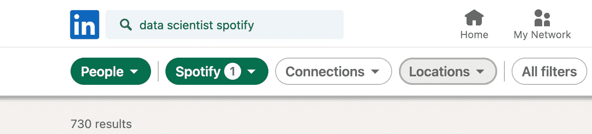
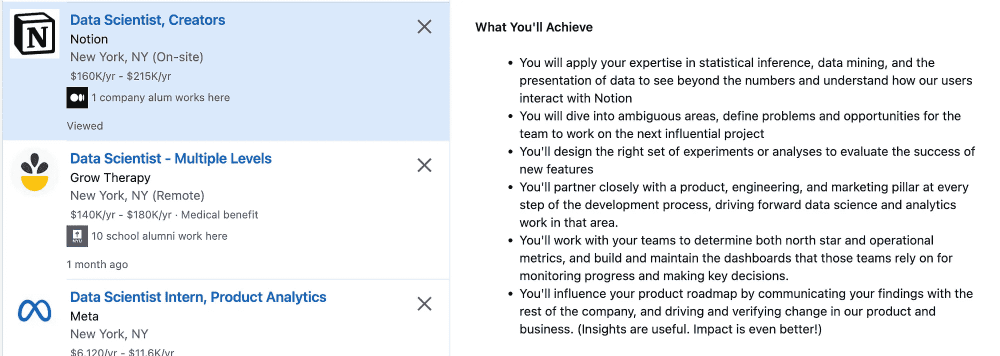

# 为什么接受“任何数据工作”是一个糟糕的职业决定，你应该做什么

> 原文：[`towardsdatascience.com/why-accepting-any-data-job-is-a-terrible-career-move-and-what-you-should-do-instead-68f5354cacd8`](https://towardsdatascience.com/why-accepting-any-data-job-is-a-terrible-career-move-and-what-you-should-do-instead-68f5354cacd8)

## 来自 Spotify 数据科学家的内部建议，以便在今天这个困难的就业市场中为你的职业做出明智的决策

 [Khouloud El Alami](https://medium.com/@elalamik?source=post_page-----68f5354cacd8--------------------------------)

·发表于[Towards Data Science](https://towardsdatascience.com/?source=post_page-----68f5354cacd8--------------------------------) ·14 分钟阅读·2023 年 11 月 26 日

--

困难的就业市场让你觉得自己是在《饥饿游戏》中为生存而战，而不是为了得到一份工作吗？

如果你已经到了考虑放弃并接受任何数据工作的阶段，请稍等。你即将犯一个大错。

我在 COVID-19 大流行期间开始了我的数据科学职业生涯，那是一个疯狂的时期，类似于现在公司大规模裁员，几乎不招聘任何人*(不过情况更糟糕)*。

那时，我还是一个学生，感到完全是个冒名顶替者，还有着 5 万美元的债务在逼迫我。在绝望的时刻，我做了我们大多数人都会做的事。我把自己的标准扔进了垃圾桶，开始疯狂申请任何能找到的数据工作。

我向我甚至不知道的公司发送了数百份申请，因为我非常绝望——（作者提供的图片）

但随后，一位数据科学家告诉我一件改变一切的事：*在这个领域正确起步至关重要。*

> *为什么在数据科学领域这一点如此关键？因为在这个领域，并非所有职位都是平等的。领域的多样性意味着在一个行业中被重视的技能和经验在另一个行业中可能并不那么相关——这可能是公司是否雇用你与刷到下一个候选人之间的区别。*

现在，作为 Spotify 的数据科学家，我可以自信地说，等待合适的工作而不是绝望地接受任何数据角色是最明智的决定。

妥协只会让我走上错误的职业道路，或延迟实现梦想工作的旅程。有一点是确定的；我现在不会在这里。

如果你需要一些灵感，这是一张不满足于现状的人的面孔 — （图像作者）

这个故事是帮助你做出明智职业决策的指南，即使在求职市场让你感到窒息时。我将展示给你：

1.  如何屈从于接受一个不符合你期望的工作的压力是一个糟糕的举动，可能会破坏你的职业生涯。

1.  我用来避免这个陷阱的具体策略。它们最终让我在 Spotify 获得了理想的职位。

你准备好了解如何在不妥协职业目标的情况下导航职场吗？很好，让我们深入探讨。

# 今日菜单

> · 为什么妥协接受任何数据职位是一个糟糕的职业选择
> 
> · 步骤 #1 — 退一步再前进
> 
> · 步骤 #2 — 缩小差距
> 
> · 步骤 #3.a. 提升技能路径
> 
> · 步骤 #3.b. 实践路径
> 
> · 并非每个雇主都适合你
> 
> · 免责声明 — 最终的重要提示

# 为什么妥协接受任何数据职位是一个糟糕的职业选择

## 让你对雇主有吸引力的关键因素之一

> ***在数据科学中，并非所有角色都等同。*** *该领域的多样性意味着在一个行业中被重视的技能和经验在另一个行业中可能并不具有同等的价值。*

理解数据科学应用的这种多样性是 *至关重要的*。

如果你瞄准的是科技公司（或其他行业），了解你在那个环境中所需的具体技能至关重要。

> 一个公司是否觉得你的数据技能有吸引力的关键因素之一是你如何在过去的经验中应用这些技能。

我曾遇到一位在顶级市场研究公司有超过 10 年经验的高级数据科学家。你可能会认为他可以获得任何他想要的数据科学职位。只可惜……

尽管他有技能，但他甚至没能获得 Spotify 的面试机会。为什么？很可能是因为他掌握的技能和应用与职位要求不相关。他掌握了基础知识 — Python、SQL、沟通技巧 — 但在科技领域，这仅仅是起点。

同样，我的一位拥有金融背景的熟人发现她的数据科学技能在转向科技公司时并没有完全转移。她也面临了困难。

## 我知道你可能在想

“嘿，我可以接受咨询公司的数据职位，然后在我积累了更多经验后申请理想公司。”但如果你在那里做零售预测，你的理想公司可能对这些技能并不感兴趣。

或者说你在 JP Morgan 找到了一份工作。确实很令人印象深刻。你可能认为这对你的简历来说是一个很好的名字，申请 Google 时不应该有问题，对吧？错了，你在信用风险分析方面的经验实际上并不是 Google 想要的（除非你申请 Google Pay）。他们更倾向于选择那些在较不知名公司进行 A/B 测试和建立指标的候选人。

> ***那么，这里主要的收获是什么？*** *在一个领域热门的东西，在另一个领域可能连第二眼都不会看。*
> 
> *如果你有特定的职业期望或目标，这一点至关重要。因此，尽早确定你的梦想行业或公司，并将你的*技能发展和工作选择*与之*对接，以* *满足它们的具体需求。*

*注意 — 请记住，虽然这些建议在我个人成功中起到了重要作用，我分享它们是基于这个原因，但成功是多方面的。诸如技能、时机，甚至运气等因素，这些往往超出我们的控制范围，发挥着重要作用。所以将这些建议视为优化自己旅程中可控部分的指南或踏脚石。*

# 步骤 #1 — 退后一步以前进

图片由 [carolyn christine](https://unsplash.com/@carolynchristine?utm_source=medium&utm_medium=referral) 提供，来源于 [Unsplash](https://unsplash.com/?utm_source=medium&utm_medium=referral)

## 记住非常重要的是：

你的工作是你大部分时间的去处。无论你现在对自己的情况有多么绝望，明智地选择下一份工作至关重要。

当你做自己讨厌的事情时，感到痛苦是很容易的。最终，这只是将一个问题换成另一个问题。一个明智且聪明的工作选择不仅仅是关于角色本身，更是关于与你的职业抱负和个人梦想的一致性。

最终，这关乎你整体的幸福和生活满意度。当你达到低谷时，很容易丧失对这一点的把握。

> ***所以，花点时间暂停和反思，尤其是当你从教育到就业一路不停时。*** *许多人从学习直接跳入职业生涯，而没有花时间 1）评估他们的经历和反思他们迄今的旅程，以及 2）为未来制定战略。*

这个反思不仅仅是一个休息，它是一个*关键*的过程，可以重新定义你的职业轨迹。专注于理解你真正希望从职业中获得什么。

**确定你的职业抱负和梦想工作。** 这种清晰度将指导你做出一个不仅仅是权宜之计的职业选择，而是一个通往充实未来的踏脚石。

## ***自我提问：***

*1\. 你对什么充满热情？

2\. 是什么让你跳入数据科学领域？

3\. 哪些公司在你热爱的领域运营？

4\. 你长期的职业目标是什么？如果没有，你希望在职业生涯中实现什么？*

[在数据科学领域工作的最佳之处在于你总能找到与自己兴趣相关的行业中的工作](https://medium.com/towards-data-science/8-reasons-why-i-didnt-give-up-on-my-dream-to-be-a-data-scientist-why-neither-should-you-4f32b73f2473) — 视频游戏、电影、太空、小狗，等等。

对我来说，是在音乐行业工作。我梦寐以求的 Spotify，因为我是小提琴演奏者，我想站在我热爱的行业的数据科学前沿。

## 我能给你的一个大建议是：

找一个导师，找一个更有经验的人，与他讨论你的职业旅程，并从不同的角度了解工作真正的样子。

我明白确定你的职业期望可能是具有挑战性的，特别是在早期阶段。你的目标可能会随着时间而发展，但有一个方向总比毫无目的地漂流要好。导师在这方面可以提供很大帮助！

# 步骤 #2 — 弥合差距

你缺乏哪些技能？弥合差距 — 照片由 [Alex Radelich](https://unsplash.com/@alexradelich?utm_source=medium&utm_medium=referral) 提供，在 [Unsplash](https://unsplash.com/?utm_source=medium&utm_medium=referral) 上

当我开始申请工作时，我的数据科学技能还处于初期阶段，我仍然是一个初级数据科学家 — 更像是一个胎儿。因此，我知道在数据科学就业市场中，想要被认真对待，我还有很长的路要走*（尤其是在科技领域）。*

当你是数据科学的新人（尤其是如果你开始时没有编码或基础数学和机器学习的经验，就像我一样），即使是像 NYU 这样的顶级大学的一年密集课程也可能不足以进入科技行业。

所以我需要提升技能 — 这就是这些科技数据科学工作竞争激烈的方式。问题是：

## 我需要什么技能才能进入我梦想的公司？

对你也是一样。在定义你的职业目标，并识别出与你的职业抱负和热情交集的公司或行业后，下一步就是找出你技能上的差距。

+   在 LinkedIn 上搜索你目标公司/行业中的工作人员。尝试通过共享连接、城市或母校进行筛选，以最大限度地提高获得回复的机会。例如 — Spotify

你已经拥有 700 多名在 Spotify（我们当前的例子）工作过的有经验的人 — （作者提供的图片）

+   查看他们具备的技能，他们从事的项目类型，以及他们在数据科学领域所做的应用。

这是一个非懒散的人在经验部分列出的技能的示例（与我的空白简历形成对比） — （作者提供的图片）

+   评估你当前的技能，并找出你缺乏这些技能和需要改进的领域。你可以做的一件事是更新你在 LinkedIn 上的技能部分。每当你对平台上的某个角色感兴趣时，LinkedIn 会直接显示你缺乏哪些技能，以及你已经具备哪些技能！

充分利用它 — （作者提供的图片）

**这些是你想要提升或获得的技能。** 这就是你职业战略的跳板。

下一个需要问自己的问题是：

## 他们是否需要适当的培训或实践经验来获得？

A/B 测试等技能通常仅通过培训很难获得，最好在公司环境中学习。但如果你的技能差距主要集中在机器学习领域，那么适当的培训是你所需要的。

对我来说，我意识到我需要提升技能，但我在心理上还没准备好再学习 1 到 2 年，所以我选择了简单的方式→我将努力重心转向了欧洲，但即使如此也失败了。

一旦你开始找工作，你会迅速意识到在所有最佳职位都被最优秀的候选人占据后，你只能获得一些零散的职位。我不想以我讨厌的工作开始职业生涯。所以我推迟了贷款还款，并开始寻找美国以外的其他更实惠的数据科学学位。

> ***关键点是什么？*** *找出你需要弥补的技能差距，以及是否需要培训或实践经验来弥补这个差距。*

根据是否需要提升技能或获得实践经验，你需要选择以下路线之一——或混合使用。

# 第#3.a. 技能提升路线

我第二个数据科学学位第一年的预览——（图片作者提供）

经过大量的眼泪、辛勤工作和一点运气，我成功获得了全球第三最佳数据科学学位，并获得了额外的奖学金。

但我知道这并不适用于每个人——这里的目标是找出你技能上的不足，并跟随任何能弥补这一差距的相关培训。

无论是报名参加另一个数据科学学位、参加培训营、注册在线课程、请求你的仙女教母，还是卖掉你的灵魂，做你必须做的事*（好吧，也许最后一个不算）*。

[最终，你需要能够在简历上展示你拥有这些技能](https://medium.com/towards-data-science/dissecting-the-resume-that-got-me-my-data-scientist-job-in-tech-db4b4d943228)，通过你在作品集中展示的项目或证书/文凭。

## 你可以做的事情包括：

像[Coursera](https://www.coursera.org/search?query=data+science&myLearningTab=IN_PROGRESS)、edX 和 Udacity 这样的平台提供了广泛的数据科学课程，你可以根据需要的具体技能进行学习。

如果你还在读书，寻求你热爱的领域或行业的实习机会，*无论公司规模大小*。即使是小公司也能提供宝贵的学习机会。最重要的是获得技能。

根据你的职业目标，你可能需要通过专业化超越数据科学的基础知识。无论是计算机视觉、自然语言处理、语言模型还是其他领域，确保你在这个子领域获得经验——通过培训或项目——然后再申请这些职位。

对于技术行业，我制作了终极指南，介绍了你在申请前需要掌握的 6 项数据科学技能。 一定要查看一下！

# 步骤 #3.b. 实践路线

> *记住，目标是避免在描述中只包含“数据”一词的工作陷阱。*

现在你已经明确了需要的技能，可以开始寻找能提供学习这些具体技能的平台的工作。

## **你应该这样做：**

+   寻找与你技能发展目标一致的工作。浏览职位描述以了解要求。避免那些无法促进你技能发展的职位——无论公司有多么吸引人。

如果你想成为 FAANG 公司的数据科学家，这非常合适。它涵盖了你需要的所有顶级技能（实验、数据可视化、统计、跨职能协作、业务参与），这是你想要瞄准的公司类型，无论其规模或声誉如何 — （图片来源：作者）

+   如果不清楚，可以尝试在 LinkedIn 上联系该公司的员工，询问他们学习了哪些技能以及如何在工作中应用这些技能。

我发送了数十封这样的邮件，但从未收到回复，但它们仍然值得发送。随着时间的推移，我通过联系最有可能回复我的人获得了回复（因为消息是法语的，所以不共享这些）— （图片来源：作者）

+   通过与在你所期望行业或领域工作的人建立联系来构建专业网络。参加会议、网络研讨会或本地聚会，以扩大你的联系。

我曾经花了 1000 美元，从纽约市飞往亚利桑那州的凤凰城，参加一个 STEM 会议，许多大科技公司在这里与学生见面、面试并招聘他们。尽管那时我还处于数据科学训练的早期阶段，工作表现平平，但我尽全力发挥了人际网络的作用。我甚至结识了一位谷歌员工，后来通过 LinkedIn 与他建立了联系，并获得了对我其中一个谷歌申请的推荐信。这个故事的教训是什么？你永远不知道下一个帮助你的人是谁。这位先生给了我宝贵的建议，这本身就是一种胜利！— （图片来源：作者）

+   当你收到工作邀请时，要仔细评估它们。考虑诸如技能增长机会、指导和整体与职业目标的契合度等因素。如何做？在面试期间提问，你也在面试他们。否则，可以联系那里的现有员工。

+   不要妥协。

# 并非所有雇主都适合你

想象一下——在加入 Spotify 的五个月前，我还在盯着电脑屏幕，认为我的努力不会有回报。即使进入了顶尖学校，我仍然被刚起步的创业公司拒绝了。

我曾以为自己不够好，但其实只是我不适合*他们*，这完全没问题。

记住，并不是每个雇主都会觉得你有吸引力，目标是找到那个会觉得你有吸引力的人。不要让拒绝影响你的自我认知，也不要让冒名顶替综合症渗入。每次拒绝都会让你觉得自己永远不会足够好。

保持韧性——我知道这听起来有些老套，但这是真实的。这是*最终*一步。你必须继续为梦想奋斗，即使感觉努力没有成果。否则，一切都将付诸东流。

哭泣是可以的，只要确保在按下你辛苦准备的申请表时一起流泪。

挫折是你旅程中的自然部分，这正是它们美丽的地方。把它们当作推动你前进的燃料，而不是拖住你的锚。

# 免责声明——最后的一个重要提示

## 你是刚刚开始职业生涯吗？（如果不是，请跳到下一条）

我不久前还处于那个状态，因此我深刻理解你现在可能感受到的兴奋与焦虑。

当你刚起步时，通常会觉得应该抓住任何出现的工作机会。你可能觉得连挑剔工作的奢侈都没有，应该对找到一份工作感到足够感激。

再想一想！如果你在权衡一个大牌公司提供的少量相关技能发展和一个较不知名但实际能提升你技能的公司，我的建议是？选择那个还没人听说过的。我曾经这样做过一次。

在获得 Spotify 实习机会之前，我有两个公司的邀请：以《刺客信条》闻名的 Ubisoft 和巴黎的小型咨询公司 Polynom。出乎意料的是，我选择了 Polynom，因为它更符合我当时的技能发展目标。

记住，你正在规划通往理想工作的路线。重要的是要始终关注那个目标。这通常是实现你为自己设定的重大职业目标的最快途径。

一旦你磨练了技能并获得了必要的经验，你将处于更有利的位置，能够瞄准更大的公司甚至是你的梦想公司。

## 还是你已经在这个领域有了大量的经验？

那也是完全没问题的，不用担心。如果你在寻求职业上的改变或提升，现在还不算晚。

在 Spotify，我遇到了许多数据科学家，他们在转行之前甚至没有在这个领域待过几年。他们花时间，专注于培养正确的技能，然后在准备好时才去 Spotify。

记住，找到理想的工作可能需要几个月甚至几年。这正是为什么我如此强调聪明和策略性地行事——为了给你额外的推动力并加快进程。

遵循我在这篇文章中分享的策略，应该能帮助你顺利迈向梦想工作！

## 面对安于现状的诱惑时，请记住：

> 实现梦想工作的道路可能充满挑战，但回报是无尽的。现在选择简单的路线可能会导致未来长期的遗憾。
> 
> 争取你想要的。

对我来说，每一次我不想要的工作的拒绝都是一种隐藏的祝福。它迫使我重新评估最佳选项，并重新校准策略以实现我想要的未来。

而且它有效，没理由它对你不起作用。如果你实施这些策略，你将弥补技能差距，迈向你的梦想工作。

保持韧性；不要满足于现状，继续争取你想要的。你的梦想工作不是遥不可及的梦想，它是一个触手可及的目标。

## 你想知道为什么现在很难找到数据科学的工作以及你可以做些什么吗？

这里有一个完整的指南来应对当前的数据职位市场 + 4 种经过验证的策略来战胜所有困难。

 ## 如何应对当前的数据科学职位市场指南

### 为什么现在很难找到数据科学的工作以及你可以做些什么

towardsdatascience.com

# 我为你准备了礼物🎁！

注册我的[**newsletter**](https://levelupwithk.substack.com/) **K’s DataLadder**，你将自动获得我的**终极 SQL 备忘单**，其中包含我在大型科技公司工作中每天使用的所有查询 + 另一个秘密礼物！

我每周分享作为科技行业数据科学家的经历，以及实用的技巧、技能和故事，旨在帮助你提升水平——因为没有人真正知道，直到他们亲身体验！

## 如果你还没有这样做

+   订阅我的[**YouTube**](https://rebrand.ly/tdf62uv)频道。新视频即将上线！

+   在[**Instagram**](https://www.instagram.com/elalamikhouloud/)、[**LinkedIn**](https://www.linkedin.com/in/elalamik/)、[**X**](https://twitter.com/elalamik)上关注我，随你喜欢。

很快见！
