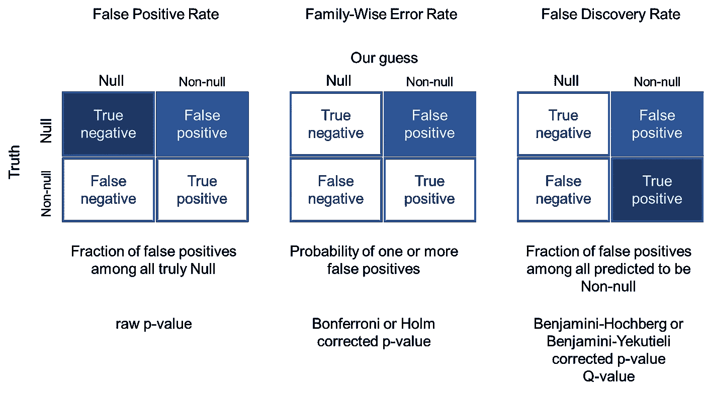
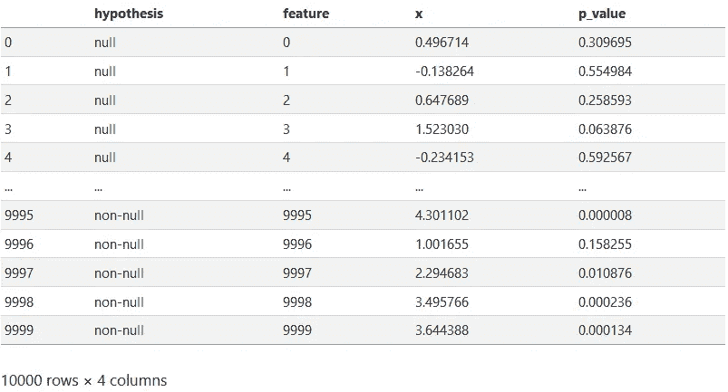
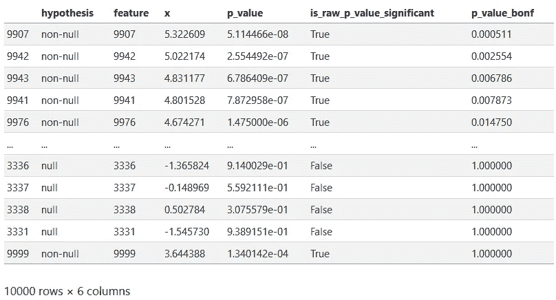
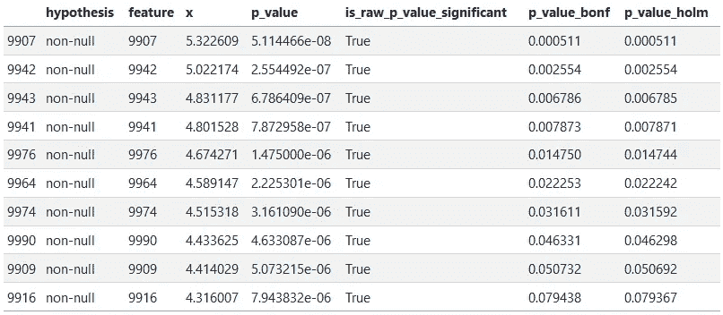
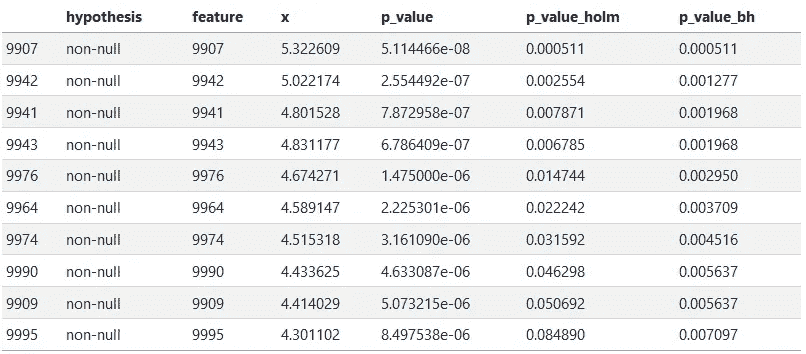

# 为什么以及如何在多重假设检验中调整 P 值

> 原文：[`towardsdatascience.com/why-and-how-to-adjust-p-values-in-multiple-hypothesis-testing-2ccf174cdbf8?source=collection_archive---------0-----------------------#2023-05-05`](https://towardsdatascience.com/why-and-how-to-adjust-p-values-in-multiple-hypothesis-testing-2ccf174cdbf8?source=collection_archive---------0-----------------------#2023-05-05)

## 在选择相关特征时，通常会使用低于某个阈值的 P 值作为一种方法。以下建议说明了如何正确使用它们。

[](https://medium.com/@igor-s?source=post_page-----2ccf174cdbf8--------------------------------)[](https://towardsdatascience.com/?source=post_page-----2ccf174cdbf8--------------------------------) [Igor Šegota](https://medium.com/@igor-s?source=post_page-----2ccf174cdbf8--------------------------------)

·

[关注](https://medium.com/m/signin?actionUrl=https%3A%2F%2Fmedium.com%2F_%2Fsubscribe%2Fuser%2Fe5f8ebca4ad8&operation=register&redirect=https%3A%2F%2Ftowardsdatascience.com%2Fwhy-and-how-to-adjust-p-values-in-multiple-hypothesis-testing-2ccf174cdbf8&user=Igor+%C5%A0egota&userId=e5f8ebca4ad8&source=post_page-e5f8ebca4ad8----2ccf174cdbf8---------------------post_header-----------) 发表在 [数据科学前沿](https://towardsdatascience.com/?source=post_page-----2ccf174cdbf8--------------------------------) · 9 分钟阅读 · 2023 年 5 月 5 日[](https://medium.com/m/signin?actionUrl=https%3A%2F%2Fmedium.com%2F_%2Fvote%2Ftowards-data-science%2F2ccf174cdbf8&operation=register&redirect=https%3A%2F%2Ftowardsdatascience.com%2Fwhy-and-how-to-adjust-p-values-in-multiple-hypothesis-testing-2ccf174cdbf8&user=Igor+%C5%A0egota&userId=e5f8ebca4ad8&source=-----2ccf174cdbf8---------------------clap_footer-----------)

--

[](https://medium.com/m/signin?actionUrl=https%3A%2F%2Fmedium.com%2F_%2Fbookmark%2Fp%2F2ccf174cdbf8&operation=register&redirect=https%3A%2F%2Ftowardsdatascience.com%2Fwhy-and-how-to-adjust-p-values-in-multiple-hypothesis-testing-2ccf174cdbf8&source=-----2ccf174cdbf8---------------------bookmark_footer-----------)

图片由作者提供。拍摄于加州拉荷亚的 Westfield UTC 购物中心。

多重假设检验发生在我们在多个特征上重复测试模型时，因为随着测试数量的增加，获得一个或多个假发现的概率也会增加。例如，在基因组学领域，科学家们经常想要测试成千上万的基因中是否有任何基因在某个结果中表现出显著不同的活性。或者[糖果是否会导致痤疮](https://xkcd.com/882/)。

在这篇博客文章中，我们将介绍几种常用的方法，通过调整模型 p 值来考虑多重假设检验：

1.  假阳性率（FPR）

1.  家庭错误率（FWER）

1.  假阳性率（FDR）

并解释何时使用这些方法是有意义的。

这份文档可以总结为以下图像：



图片由作者提供。

# 创建测试数据

我们将创建一个模拟示例，以更好地理解如何通过各种 p 值操作得出不同的结论。要运行此代码，我们需要安装`pandas`、`numpy`、`scipy`和`statsmodels`库的 Python 环境。

为了这个示例，我们从创建一个包含 1000 个特征的 Pandas DataFrame 开始。其中 990 个特征（99%）的值将从均值为 0 的正态分布中生成，这称为空模型。（在下面使用的函数`norm.rvs()`中，均值是通过`loc`参数设置的。）其余的 1%的特征将从均值为 3 的正态分布中生成，这称为非空模型。我们将用这些特征来表示我们希望发现的有趣特征。

```py
import pandas as pd
import numpy as np
from scipy.stats import norm
from statsmodels.stats.multitest import multipletests

np.random.seed(42)

n_null = 9900
n_nonnull = 100

df = pd.DataFrame({
    'hypothesis': np.concatenate((
        ['null'] * n_null,
        ['non-null'] * n_nonnull,
    )),
    'feature': range(n_null + n_nonnull),
    'x': np.concatenate((
        norm.rvs(loc=0, scale=1, size=n_null),
        norm.rvs(loc=3, scale=1, size=n_nonnull),
    ))
})
```

对于每个 1000 个特征中的特征，p 值是观察到的值至少如此之大（假设它是从空分布生成的）的概率。

p 值可以通过累积分布（`norm.cdf()`来自`scipy.stats`）计算，累积分布表示获得一个值等于或**小于**观察到的值的概率。然后为了计算 p 值，我们计算`1 - norm.cdf()`来找到**大于**观察到的值的概率：

```py
df['p_value'] = 1 - norm.cdf(df['x'], loc = 0, scale = 1)
df
```



# 假阳性率

第一个概念称为假阳性率，定义为我们标记为“显著”的空假设的比例（也称为第一类错误）。我们之前计算的 p 值可以按其定义解释为假阳性率：它们是从空分布中获取一个值至少与指定值一样大的概率。

为了说明，我们将应用一个常见的（神奇的🧙）p 值阈值 0.05，但可以使用任何阈值：

```py
df['is_raw_p_value_significant'] = df['p_value'] <= 0.05
df.groupby(['hypothesis', 'is_raw_p_value_significant']).size()
```

```py
hypothesis  is_raw_p_value_significant
non-null    False                            8
            True                            92
null        False                         9407
            True                           493
dtype: int64
```

注意，在我们的 9900 个零假设中，493 个被标记为“显著”。因此，假阳性率为：FPR = 493 / (493 + 9407) = 0.053。

FPR 的主要问题是，在实际情况中，我们不知道哪些假设是空的，哪些不是。因此，仅凭原始 p 值（假阳性率）用途有限。在我们的案例中，当非空特征的比例非常小，大多数标记为显著的特征将是空的，因为它们的数量更多。具体来说，在 92 + 493 = 585 个标记为真正（“正”）的特征中，只有 92 个来自我们的非空分布。这意味着大多数或约 84%（493 / 585）的报告显著特征是假阳性！

那么，我们可以对此做些什么？有两种常见的方法来解决这个问题：我们可以计算家庭-wise 错误率（FWER）或虚假发现率（FDR），而不是虚假正率。这些方法都以原始未调整的 p 值集合作为输入，产生一组新的“调整后 p 值”作为输出。这些“调整后 p 值”代表了 *FWER* 和 *FDR* 的 *上界* 估计值。它们可以通过 `multipletests()` 函数获得，该函数是 `statsmodels` Python 库的一部分：

```py
def adjust_pvalues(p_values, method):
   return multipletests(p_values, method = method)[1]
```

# 家庭-wise 错误率

家庭-wise 错误率是错误拒绝一个或多个零假设的概率，换句话说，就是将真实的零假设标记为非零假设的概率，或看到一个或多个虚假正例的概率。

当仅测试一个假设时，这等于原始 p 值（虚假正率）。然而，测试的假设越多，我们获得一个或多个虚假正例的可能性就越大。估计 FWER 有两种流行的方法：博尼费罗尼和霍尔姆程序。虽然博尼费罗尼和霍尔姆程序都没有对测试在单个特征上运行的依赖性做出任何假设，但它们会过于保守。例如，在所有特征完全相同（相同的模型重复了 10,000 次）的极端情况下，不需要校正。而在其他极端情况下，如果没有特征相关，则需要某种类型的校正。

## 博尼费罗尼程序

修正多重假设检验的最流行方法之一是博尼费罗尼程序。之所以这种方法流行，是因为它非常容易计算，即使是手动计算也很简单。该程序将每个 p 值乘以所进行的测试总数，或者如果这种乘法会使 p 值超过 1，则将其设置为 1。

```py
df['p_value_bonf'] = adjust_pvalues(df['p_value'], 'bonferroni')
df.sort_values('p_value_bonf')
```



## 霍尔姆程序

霍尔姆的程序提供了一种比博尼费罗尼程序更强大的校正方法。唯一的区别在于，p 值并不是全部乘以测试总数（这里是 10000）。而是，每个排序后的 p 值依次乘以递减序列 10000、9999、9998、9997、……、3、2、1。

```py
df['p_value_holm'] = adjust_pvalues(df['p_value'], 'holm')
df.sort_values('p_value_holm').head(10)
```



我们可以自己验证这一点：输出中的第十个 p 值被乘以 9991：7.943832e-06 * 9991 = 0.079367。霍尔姆的校正也是 R 语言中 `p.adjust()` 函数调整 p 值的默认方法。

如果我们再次应用 p 值阈值 0.05，我们来看看这些调整后的 p 值如何影响我们的预测：

```py
df['is_p_value_holm_significant'] = df['p_value_holm'] <= 0.05
df.groupby(['hypothesis', 'is_p_value_holm_significant']).size()
```

```py
hypothesis  is_p_value_holm_significant
non-null    False                            92
            True                              8
null        False                          9900
dtype: int64
```

这些结果与我们将相同阈值应用于原始 p 值时大相径庭！现在，只有 8 个特征被标记为“显著”，而这 8 个特征都是正确的——它们来自于我们的非零分布。这是因为即使有一个特征被错误标记的概率也只有 0.05（5%）。

然而，这种方法有一个缺点：它未能将其他 92 个非零特征标记为显著。尽管它非常严格，以确保没有零特征被漏入，但它只能找到 8%（100 个中的 8 个）非零特征。这可以被视为比虚假正例率方法采取了不同的极端。

是否有一种更中间的方案？答案是“有”，这种中间方案就是虚假发现率。

# 虚假发现率

如果我们可以接受一些虚假正例，但希望捕获更多的真正正例，而不仅仅是个位数的百分比呢？也许我们可以接受*一些*虚假正例，只要这些虚假正例不会淹没我们标记为显著的所有特征——就像在 FPR 示例中那样。

这可以通过在指定的阈值水平（例如 0.05）下控制虚假发现率（而不是 FWER 或 FPR）来完成。虚假发现率定义为所有被标记为正面的特征中虚假正例的比例：FDR = FP / (FP + TP)，其中 FP 是虚假正例的数量，TP 是真正正例的数量。通过将 FDR 阈值设置为 0.05，我们表示我们接受在所有被标记为正面的特征中有 5%（平均）虚假正例。

控制 FDR 有几种方法，我们将在这里描述如何使用两种流行的方法：Benjamini-Hochberg 和 Benjamini-Yekutieli 程序。这两种程序虽然比 FWER 程序更复杂，但仍然类似。它们仍然依赖于对 p 值进行排序、乘以一个特定的数字，然后使用截断标准。

## Benjamini-Hochberg 程序

Benjamini-Hochberg (BH) 程序假设每个测试都是*独立的*。依赖的测试会发生，例如，当被测试的特征之间存在相关性时。让我们计算 BH 调整后的 p 值，并将其与我们之前使用 Holm 校正的 FWER 结果进行比较：

```py
df['p_value_bh'] = adjust_pvalues(df['p_value'], 'fdr_bh')
df[['hypothesis', 'feature', 'x', 'p_value', 'p_value_holm', 'p_value_bh']] \
    .sort_values('p_value_bh') \
    .head(10)
```



```py
df['is_p_value_holm_significant'] = df['p_value_holm'] <= 0.05
df.groupby(['hypothesis', 'is_p_value_holm_significant']).size()
```

```py
hypothesis  is_p_value_holm_significant
non-null    False                            92
            True                              8
null        False                          9900
dtype: int64
```

```py
df['is_p_value_bh_significant'] = df['p_value_bh'] <= 0.05
df.groupby(['hypothesis', 'is_p_value_bh_significant']).size()
```

```py
hypothesis  is_p_value_bh_significant
non-null    False                          67
            True                           33
null        False                        9898
            True                            2
dtype: int64
```

BH 程序现在正确地将 100 个非零特征中的 33 个标记为显著——相比于 Holm 校正的 8 个，这是一种改进。然而，它也将 2 个零特征标记为显著。因此，在 35 个标记为显著的特征中，不正确特征的比例是：2 / 33 = 0.06，即 6%。

请注意，在这种情况下，我们的 FDR 率为 6%，尽管我们旨在将其控制在 5%。FDR 将以 5% 的速率*平均*控制：有时它可能更低，有时可能更高。

## Benjamini-Yekutieli 程序

Benjamini-Yekutieli (BY) 程序在测试是否独立的情况下都能控制 FDR。再次值得注意的是，所有这些程序都试图建立 FDR（或 FWER）的*上限*，因此它们可能更保守或更宽松。让我们将 BY 程序与上述 BH 和 Holm 程序进行比较：

```py
df['p_value_by'] = adjust_pvalues(df['p_value'], 'fdr_by')
df[['hypothesis', 'feature', 'x', 'p_value', 'p_value_holm', 'p_value_bh', 'p_value_by']] \
    .sort_values('p_value_by') \
    .head(10)
```


```py
df['is_p_value_by_significant'] = df['p_value_by'] <= 0.05
df.groupby(['hypothesis', 'is_p_value_by_significant']).size()
```

```py
hypothesis  is_p_value_by_significant
non-null    False                          93
            True                            7
null        False                        9900
dtype: int64
```

BY 程序在控制 FDR 方面更严格；在这种情况下，甚至比用于控制 FWER 的 Holm 方法更严格，仅标记了 7 个非空特征为显著！使用它的主要优势是当我们知道数据可能包含大量相关特征时。然而，在这种情况下，我们可能还希望考虑过滤相关特征，以便不需要测试所有这些特征。

# 总结

最后，程序的选择留给用户，取决于分析试图做什么。引用本雅明、霍奇伯格（Royal Stat. Soc. 1995）：

> 通常不太需要控制 FWER。在多个单独推断的结论可能出错时，控制 FWER 是重要的。
> 
> 例如，在几种新治疗方法与标准进行竞争时，可能会出现这种情况，并且从被声明显著优于标准的治疗方法集合中选择单一治疗方法。

在其他情况下，当我们可以接受一些假阳性时，FDR 方法如 BH 校正提供了不那么严格的 p 值调整，并且如果我们主要想增加通过某个 p 值阈值的真阳性数量，则可能更可取。

还有其他未在此提及的调整方法，尤其是一个[q-value](https://en.wikipedia.org/wiki/Q-value_(statistics))，也用于 FDR 控制，在撰写时仅存在作为 R 包。
