# 为什么所有地图都不准确？

> 原文：[`towardsdatascience.com/why-are-all-maps-inaccurate-e566f08d91fe`](https://towardsdatascience.com/why-are-all-maps-inaccurate-e566f08d91fe)

## 理解地图投影及其为何被用于一些最受欢迎的地图

[](https://medium.com/@teosiyang?source=post_page-----e566f08d91fe--------------------------------)[](https://towardsdatascience.com/?source=post_page-----e566f08d91fe--------------------------------) [Jake Teo](https://medium.com/@teosiyang?source=post_page-----e566f08d91fe--------------------------------)

·发布在 [Towards Data Science](https://towardsdatascience.com/?source=post_page-----e566f08d91fe--------------------------------) ·阅读时间 7 分钟·2023 年 12 月 31 日

--


照片由 [Kyle Glenn](https://unsplash.com/@kylejglenn?utm_source=medium&utm_medium=referral) 提供，发布在 [Unsplash](https://unsplash.com/?utm_source=medium&utm_medium=referral) 上

我们大多数人知道地球是球形的，或者更准确地说是椭球形的。由于我们必须将一个弯曲的三维表面表示成一个二维的平面或屏幕，这意味着涉及到一些失真。将地球表面“投影”到二维图像上的方法被称为**地图投影**。

地图投影有数百种，每种投影在**形状、距离、面积和方向**上都有不同程度的**失真**。然而，没有任何地图投影能够完全消除这些失真，因此了解每种投影的优缺点对于确定适合你项目的投影是至关重要的。

# 目录

正射投影

墨卡托投影

横轴墨卡托投影

兰伯特等距圆锥投影

罗宾逊投影

总结

# 源代码

要可视化各种投影，我们可以使用 Python 库 `matplotlib` 和 `cartopy`。

```py
pip install matplotlib cartopy
```

本文中创建的大多数世界地图的代码源如下所示。

```py
import matplotlib.pyplot as plt
import cartopy.crs as ccrs
import cartopy.feature as feature

# fix maplotlib params
plt.rcParams[‘figure.dpi’] = 175

# projections & borders
CRSs = [ccrs.Orthographic(),
        ccrs.Orthographic(central_longitude=0, central_latitude=-90),
        ccrs.Mercator(),
        ccrs.UTM(zone=29),
        ccrs.Robinson(),
        ccrs.LambertConformal()]

borders = [(0, 1, 1, 0.05),
            (0, 1, 1, 0.05),
            (0, 1, 1, 0.05),
            (0, 1, 1, 0.05),
            (0.05, 1, 1, 0),
            (0, 1, 1, 0)]

names = ["ortho", "ortho_southpole", "merca", 
         "utm", "robin", "lambertc"]

dir = "/Users/jake/Desktop/gis"

for crs, br, name in zip(CRSs, borders, names):
    fig, ax = plt.subplots(subplot_kw={‘projection’: crs})
    projection_name = str(crs).split(" ")[0]

    # Draw countries and coastlines
    ax.coastlines(linewidth=0.5)
    ax.add_feature(feature.BORDERS, linestyle=’:’, linewidth=1)

    # Draw parallels and meridians
    gridlines = ax.gridlines(draw_labels=True, linewidth=0.25, color=’gray’, linestyle=’--’)
    gridlines.top_labels = False
    gridlines.right_labels = False
    gridlines.xlabel_style = {‘size’: 7}
    gridlines.ylabel_style = {‘size’: 7}

    # spacing
    plt.subplots_adjust(left=br[0], right=br[1], top=br[2], bottom=br[3])

    # border
    for spine in ax.spines.values():
        spine.set_linewidth(0.5)

    # save the map
    plt.savefig(f"{dir}/{name}.png")
```

# 正射投影

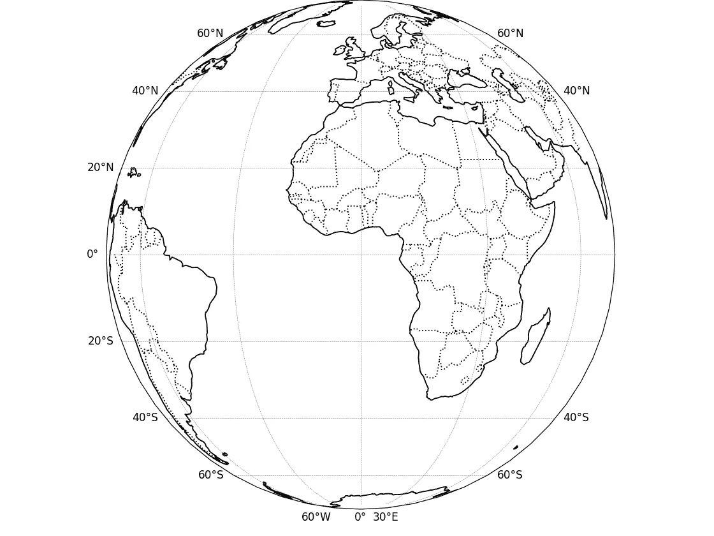

正射投影。（由作者创建）

正射投影是从太空中看地球时最准确的表现。这种投影类型被称为**平面投影**，其中地球表面被投影到一个平面上的虚拟平面上。

然而，我们只能在这个平面上查看一个半球，且当我们从地图中心移动时，所有形式的失真都会发生，特别是在边缘部位尤为明显。我们很少看到这种投影被使用，除非是为了美学目的或在我们希望为地图注入一些真实感的情况下。

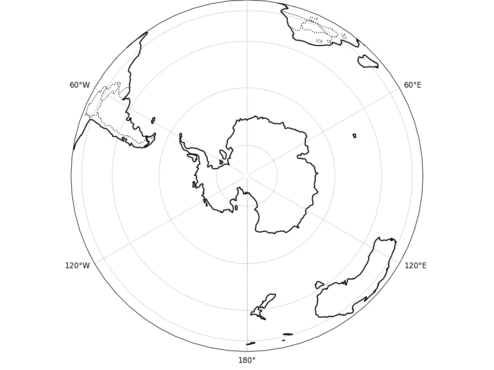

以南极点为中心的正投影。（作者创作）

话虽如此，当我们将焦点转向南极点时，与之后的其他地图相比，南极洲的形状更加准确。用于极地区域制图的另一种更准确的平面投影是**立体投影**。

# 墨卡托投影

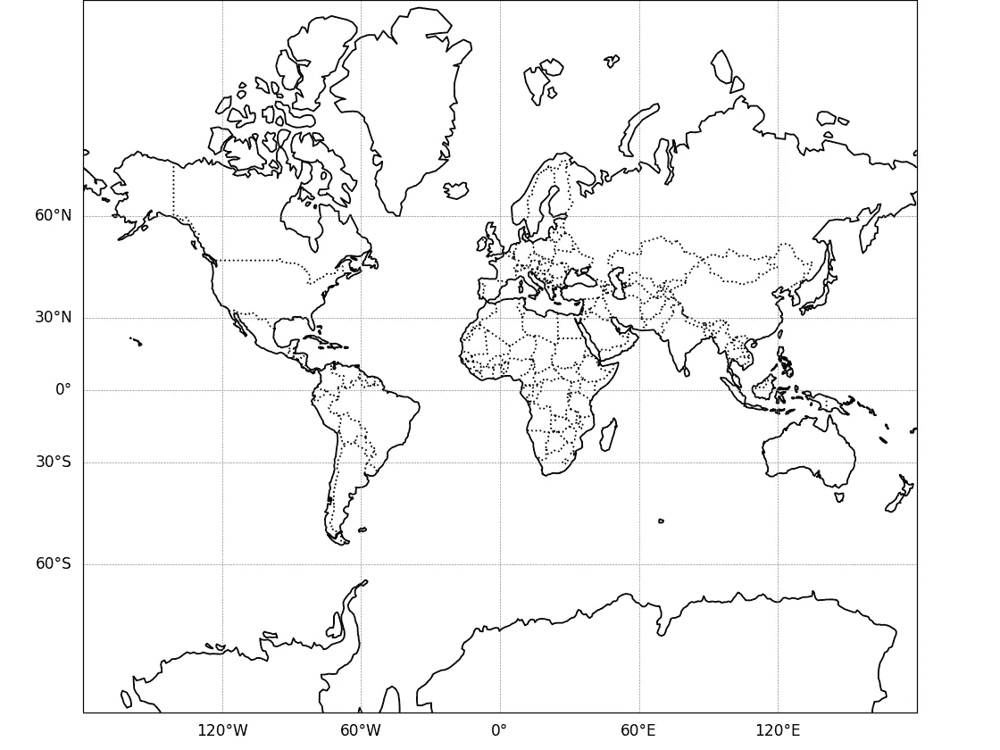

墨卡托投影。（作者创作）

墨卡托投影由杰拉尔德斯·墨卡托于 1569 年创作，无疑是所有投影中最具识别性的。谷歌地图使用了这种投影的一个变体，称为**伪墨卡托**或**Web 墨卡托**。

它受欢迎的原因在于它很好地保留了形状和角度，这对于过去船只的导航以及我们当前使用数字地图应用查看领土边界的形状并进行放大时保持形状完整是至关重要的。

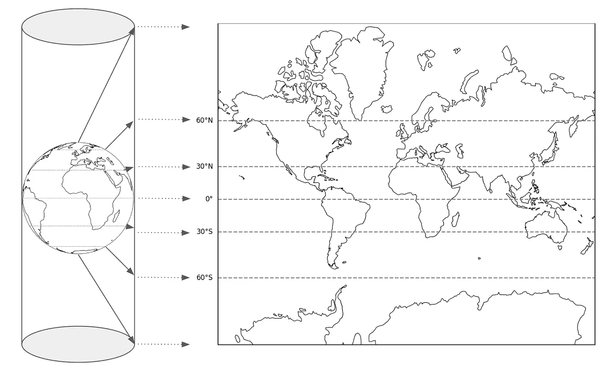

地球的表面投影到一个假想的圆柱体的内部，赤道与圆柱体接触。然后将圆柱体展开以显示为世界地图。CSS 请注意这种墨卡托投影中纬度从赤道越远，扩展越大。（作者创作）

墨卡托投影是一种**圆柱投影**，赤道接触圆柱体，因此只有赤道沿线的条带在面积上没有失真。距离极点越远，失真就越明显和夸张。

一个很好的例子是，在上面的墨卡托投影世界地图中，你可以看到格林兰的大小与非洲大陆大致相同。但实际上，格林兰的面积只有非洲的 14 分之一，或者仅为非洲面积的 7%！

# 横轴墨卡托投影

从早期的墨卡托投影中得到的主要结论是，赤道处的失真最小，因为它接触了假想圆柱体。这一知识用于制作另一种非常流行的投影，称为横轴墨卡托。

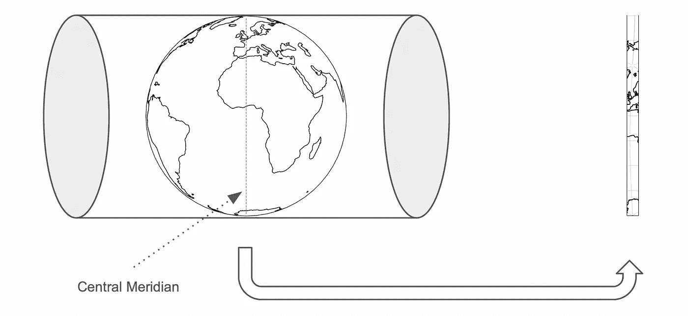

在横轴墨卡托投影中，只有沿经线接触圆柱体的条带被投影和使用。（作者创作）

与其让圆柱体竖立并接触赤道，不如将其“横切”，以便特定经度长度触及圆柱体。只有这条狭窄的条纹被使用，因为它的失真最小。横切墨卡托投影有许多变体，但投影逻辑类似。区别在于**中央子午线**（触及圆柱体的经线）的位置和条纹的宽度。

这种独特的狭窄投影区域广泛用于具有南北延展的土地测量，因为其精度高。出于同样的原因，使用米（或在美国使用英尺）作为坐标单位，而不是纬度和经度。

## 通用横切墨卡托

通常被称为**UTM**的通用横切墨卡托是横切墨卡托投影中最知名和使用最广泛的。它沿每条经度条纹投影，因此将地球平均分为 60 条经度条纹或区域，每个区域宽度为**6 度纬度**。

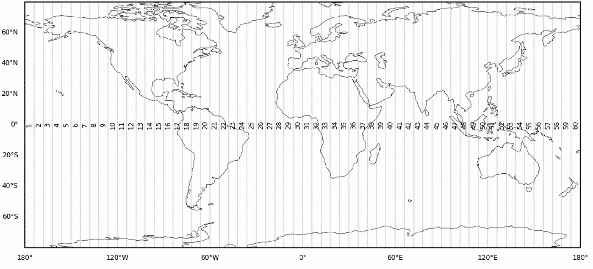

在 Plate Carrée 投影中显示世界上的 UTM 区 1 至 60。（作者制作）

由于每个区域都是独特的投影，我们不能将它们一起显示在世界地图上，而必须使用另一种投影来显示如上所示。如你所见，由于条纹的狭窄，许多国家和州的领土区域会重叠多个 UTM 区。

## 新加坡横切墨卡托

一些国家使用横切墨卡托的变体。例如，新加坡有其国家投影，称为 SVY21（新加坡垂直基准 2021）。这有意义，因为新加坡是一个微小的国家。虽然它位于 48 号 UTM 区内，但由于不在该区域的中央子午线上，它仍会出现失真。

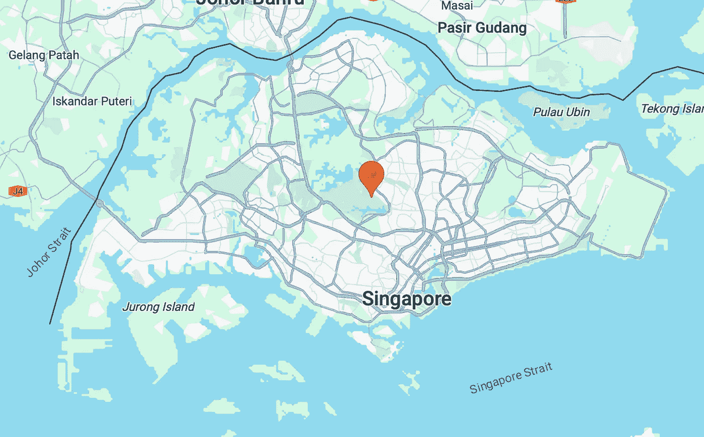

SVY21 投影的中心参考点，官方称为 BASE7（位于皮尔斯水库第 7 号柱）。（来自 Google Maps 的截图）

对于 SVY21，中央子午线位于新加坡中心，提供了最高的准确性。

# 兰伯特等距圆锥投影

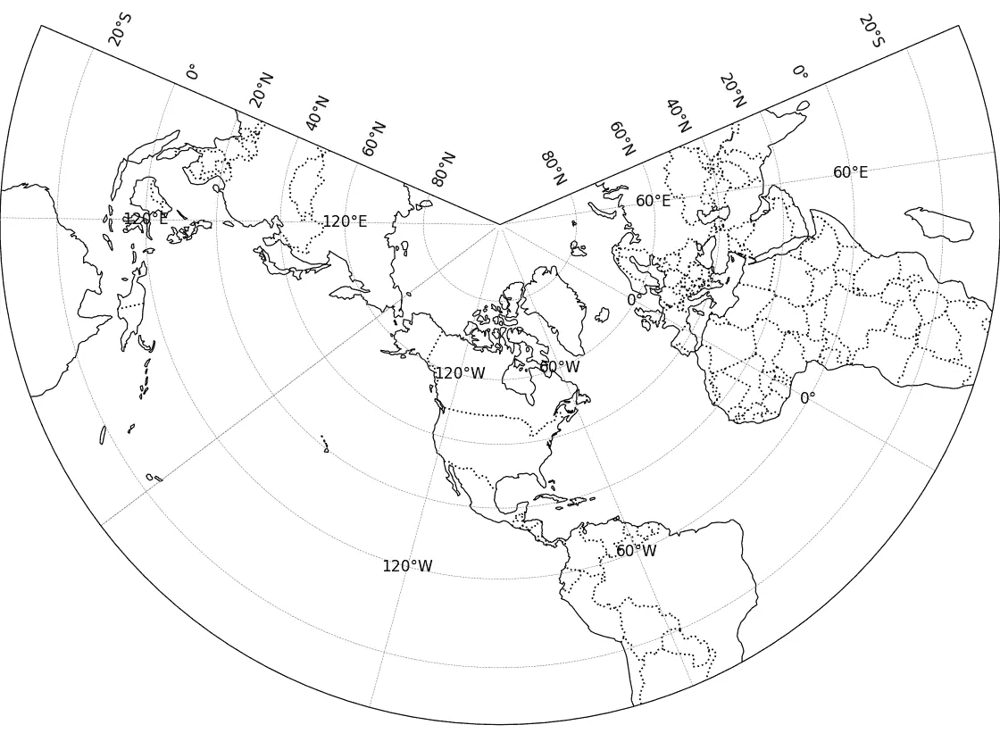

使用兰伯特等距圆锥投影的世界地图。（作者制作）

使用兰伯特等距圆锥投影的世界地图视图看起来很独特，好像投影在一个 3/4 圆上。

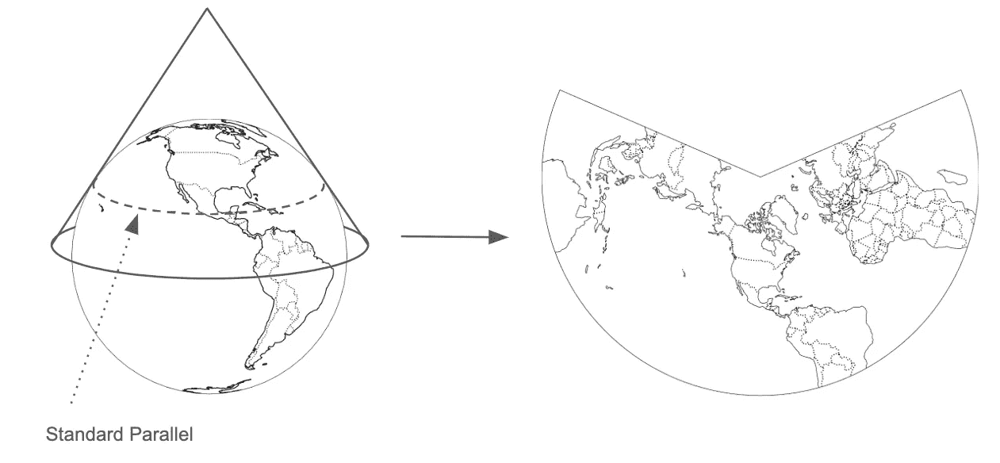

圆锥投影类型。（作者制作）

这是因为它是一种**圆锥投影**类型，其中圆锥像派对帽一样放置在地球顶部，表面被投影到内部，然后展开。

你可以想象一个圆锥的周长将触及地球的某一点。这条线被称为**标准平行线**，是投影区域失真最小的线。

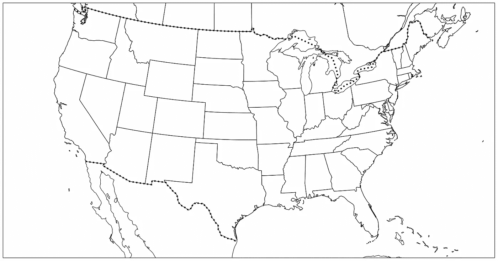

普遍使用的美国州地图是使用兰伯特等距圆锥投影创建的。（作者创建）

锥形投影的优势在于我们想要投影位于**中纬度**的国家，并且这些国家具有**东西向**的质量分布，而标准纬线正好放置于此。之前提到的平面和圆柱形投影无法准确实现这一点。

此外，兰伯特等距圆锥投影可以在标准纬线上保持角度、形状和方向，因此它被广泛用于为美国、澳大利亚和中国制作地图。

# 罗宾逊投影

所有前述的投影在减少一种或两种类型的扭曲方面表现优秀，或者仅在有限的范围内表现出色。罗宾逊投影在一定程度上可以减少世界上的所有扭曲。因此，它通常被认为是不同类型扭曲之间的折中方案。

这个投影是由亚瑟·H·罗宾逊于 1963 年创建的，并且曾被国家地理在十年间用作他们的世界地图。

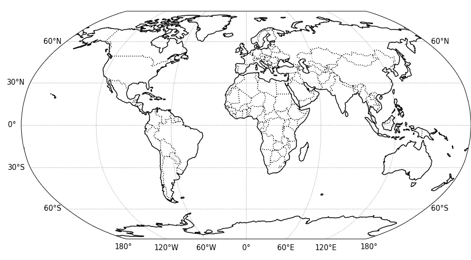

罗宾逊投影。（作者创建）

这也被称为**伪圆柱形**投影，因为经线被弯曲以减少扭曲。另一种类似的投影是**温克尔三重投影**，联合国在撰写本文时使用了其[世界地图](https://www.un.org/geospatial/content/map-world)。

# 总结

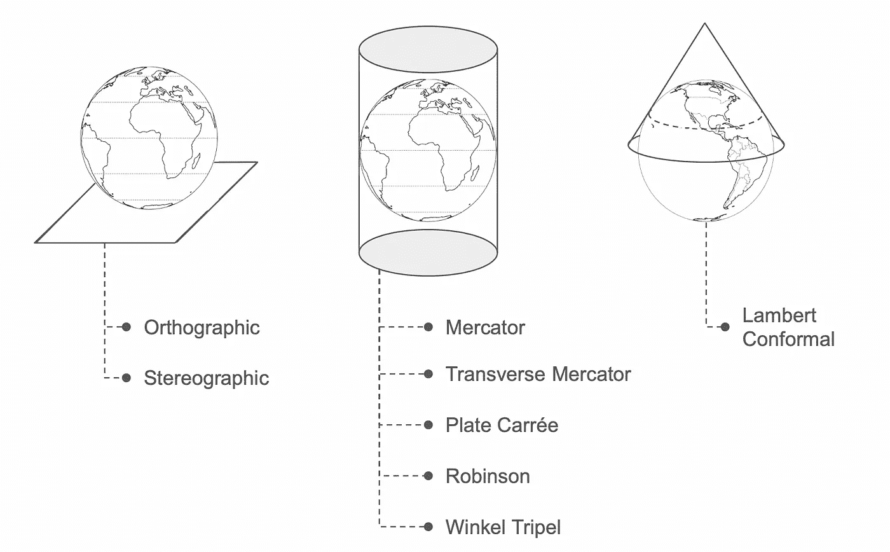

本文提到的具体投影可以分为三大类投影表面：平面、圆柱形和锥形。（作者创建）

我展示了一些当今地图中使用的流行投影。它们可以大致分为三大类投影表面，希望你现在能清楚这些投影为何被使用。当然，如果我们更深入地探讨，这将是一个更复杂的话题，但这里展示的基本原理应该足够你自己进一步探索。

# **进一步阅读**

[](https://docs.qgis.org/3.28/en/docs/gentle_gis_introduction/coordinate_reference_systems.html?source=post_page-----e566f08d91fe--------------------------------#:~:text=A%20Coordinate%20reference%20system%20%28CRS%29%20defines,%20with%20the%20help,Systems%20and%20Projected%20Coordinate%20Systems.) [## 8\. 坐标参考系统 - QGIS 文档]

### QGIS 3.28 文档：8\. 坐标参考系统

[docs.qgis.org](https://docs.qgis.org/3.28/en/docs/gentle_gis_introduction/coordinate_reference_systems.html?source=post_page-----e566f08d91fe--------------------------------#:~:text=A%20Coordinate%20reference%20system%20%28CRS%29%20defines,%20with%20the%20help,Systems%20and%20Projected%20Coordinate%20Systems.) [](https://desktop.arcgis.com/en/arcmap/latest/map/projections/projection-types.htm?source=post_page-----e566f08d91fe--------------------------------) [## 投影类型 - ArcMap | 文档]

### 许多常见的地图投影根据所使用的投影表面分类：圆锥形、圆柱形或平面形。

[桌面 ArcGIS 投影类型](https://desktop.arcgis.com/en/arcmap/latest/map/projections/projection-types.htm?source=post_page-----e566f08d91fe--------------------------------)
