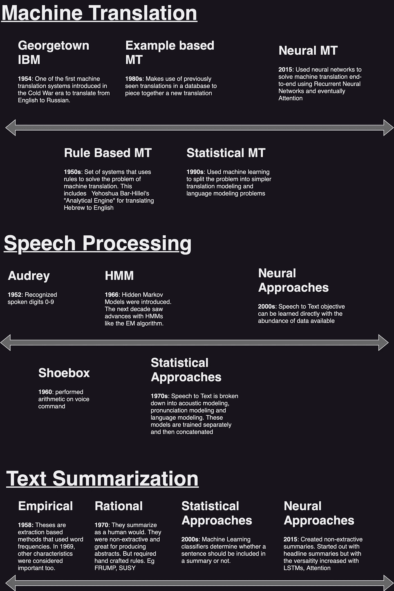

# 为什么语言模型无处不在？

> 原文：[`towardsdatascience.com/why-are-language-models-everywhere-36d9961dd9e1`](https://towardsdatascience.com/why-are-language-models-everywhere-36d9961dd9e1)

## 答案在于 75 年的 NLP 历史

 [Ajay Halthor](https://medium.com/@dataemporium?source=post_page-----36d9961dd9e1--------------------------------)

·发表于 [Towards Data Science](https://towardsdatascience.com/?source=post_page-----36d9961dd9e1--------------------------------) ·6 分钟阅读·2023 年 5 月 26 日

--

图片由 [Romain Vignes](https://unsplash.com/@rvignes?utm_source=medium&utm_medium=referral) 提供，来自 [Unsplash](https://unsplash.com/?utm_source=medium&utm_medium=referral)

你是否想过我们是如何走到今天的 [ChatGPT](https://youtu.be/NpmnWgQgcsA) 和大型语言模型的？答案在于自然语言处理（NLP）本身的发展。所以让我们来谈谈吧。别担心；历史比你想象的更有趣！第一部分将描述 AI 和 NLP 的诞生。第二部分将讨论该领域的主要支柱。第三到第五部分将详细介绍过去 75 年的时间线。最后第六部分，我们将描述这些领域如何汇聚到*语言建模*中，今天已经变得如此流行！

# 1 起源

起初，有艾伦·图灵 1950 年的出版物 [*计算机及智能*](https://phil415.pbworks.com/f/TuringComputing.pdf)，他提出了“机器能思考吗？”的问题。该论文常被誉为人工智能的起源。虽然它没有明确讨论自然语言，但为未来的 NLP 研究奠定了基础。这也是为什么 NLP 的最早工作出现在 1950 年代。

# NLP 的两个支柱

1.  **机器翻译**：这是当 AI 接收一种语言的句子并输出另一种语言的句子。例如，谷歌翻译。

1.  **语音处理**：AI 接收音频作为输入，并生成相应的文本作为输出。

1.  **文本摘要**：AI 接收一个故事作为输入，并生成一个摘要作为输出。

1.  **语言建模**：AI 接收到一系列单词后，将确定下一个单词。

这些只是其中的一部分。随着时间的推移，各个领域的支柱逐渐趋向于使用语言模型来完成其任务。在接下来的部分，我们将深入探讨每个时间线。

图 1：NLP 主要支柱的时间线（图像由作者提供）

# 3 机器翻译

***基于规则的系统***：1954 年出现了[乔治城 IBM 实验](https://aclanthology.org/www.mt-archive.info/Garvin-1967.pdf)，用于冷战时期的俄语到英语翻译。这个想法是将翻译任务分解为一组规则，以便将一种语言转换为另一种语言，即基于规则的系统。另一个早期的基于规则的系统是耶霍舒亚·巴尔-希勒尔的“分析引擎”，用于将希伯来语翻译为英语。

***统计方法***：规则基础系统的问题在于它们做了大量假设。问题越复杂，这些假设就越成问题。翻译是复杂的。从 1980 年代起，随着我们获取了更多的双语数据和统计方法的逐步完善，我们开始将这些统计模型应用于语言翻译。一种被称为统计机器翻译（SMT）的范式变得流行。SMT 范式将问题分解为两个子问题：翻译问题和语言建模问题。

***神经方法***：自 2015 年起，SMT 已被[神经机器翻译](https://arxiv.org/pdf/1409.0473.pdf)取代。这些方法利用神经网络直接学习翻译任务。它们包括递归神经网络的发展，最终发展为 Transformer 模型。随着像 GPT 这样的模型的引入，基线预训练模型变成了语言建模，并通过翻译进行微调。

# 4 语音处理

***基于规则的系统***：语音处理的起点也可以追溯到 1950 年代和 60 年代，那时能够识别单个数字和单词。例如，贝尔实验室的 Audrey 识别数字，而 IBM 的[Shoebox](https://www.ibm.com/ibm/history/exhibits/specialprod1/specialprod1_7.html)则执行语音命令下的算术运算。

***统计方法***：然而，将语音转换为文本是一个复杂的问题；存在不同的方言、口音、音量。因此，将这个复杂问题分解为子问题是一个解决方法。大约在 70 年代，隐马尔可夫模型被引入后，语音到文本的复杂问题可以被分解为三个更简单的问题：

+   **语言建模**：我们可以确定单词和句子的顺序。这些是[n-gram 模型](https://youtu.be/cUsqFx4Sij8)。

+   **发音建模**：这是为了将单词与音素关联起来。这些本质上是简单模型或甚至是表格。

+   **声学建模**：我们理解语音与音素之间的关系。这些是带有高斯混合模型的隐马尔可夫模型。

这三部分被单独训练，然后一起使用。但这也带来了自身的复杂性。

***神经网络方法***：在 2000 年代初，我们看到这些技术被神经网络所取代。随着大规模文本语料库的出现，神经网络开始超越其他所有方法。它们实现了端到端的语音转文本。因此，我们可以直接优化从输入语音生成文本的目标；这带来了更好的性能。随着领域的发展，我们进入了递归网络、卷积神经网络，并最终细化了预训练语言模型。

# 5 文本摘要

***基于规则的系统***：研究始于 Luhn 在 1958 年发表的[*The automatic creation of literature abstracts*](https://courses.ischool.berkeley.edu/i256/f06/papers/luhn58.pdf)，该研究通过词频来排名句子的的重要性。这种方法从原文中选择句子来构建总结；相应的总结被称为“基于提取的总结”。该领域的下一个重大突破出现在 1969 年，Edmonson 的论文[*New methods of automatic extractive*](https://www.semanticscholar.org/paper/New-Methods-in-Automatic-Extracting-Edmundson/3c493143e49ef3304e85222c16c1cfde2b058dd9)中。他声称句子的重要性不仅取决于词频，还取决于其他因素，如句子在段落中的位置；句子是否包含某些提示词；或者句子是否包含标题中的词。在 1980 年代，我们尝试不使用原始句子来总结文本。这些是“抽象总结”。FRUMP（快速阅读和理解记忆程序）和 SUSY 是早期的这种系统的实现。然而，它们也依赖于手工制作的规则，且总结质量不高。

***统计方法***：在 90 年代和 2000 年代，我们使用统计方法构建分类器，以确定一个句子是否应该被包含在总结中。这些分类器可以是逻辑回归、决策树、SVM 或任何其他统计模型。

***神经网络方法***：自 2015 年起，神经网络随着[A neural attention model for abstractive sentence summarization.](https://arxiv.org/abs/1509.00685)的引入产生了影响。这种方法生成的抽象总结通常是非常简短的标题。然而，LSTM 单元的加入以及[sequence-to-sequence 架构](https://arxiv.org/abs/1804.05685)使得处理更长输入序列和生成合适总结成为可能。从那时起，该领域采取了与机器翻译相同的方法，并使用了我们今天看到的预训练和微调架构。

# 6 将一切整合起来

前面讨论的多个支柱的历史展示了一些共同的模式。

规则基础系统在 1950 年代和 60 年代的早期 AI 中占据主导地位。到 70 年代，我们看到了统计模型的引入以解决这些问题。然而，由于语言的复杂性，这些统计模型会将复杂任务拆解为子任务来解决这些问题。随着 2000 年代更多数据和更好硬件的出现，神经网络方法逐渐兴起。

神经网络可以端到端地学习复杂的语言任务，因此比统计方法表现更好。[Transformer 神经网络](https://youtu.be/TQQlZhbC5ps) 于 2017 年推出，能够有效地学习解决语言任务。但由于它们需要大量的数据来有效地训练模型，[BERT](https://youtu.be/xI0HHN5XKDo) 和 [GPT](https://youtu.be/3IweGfgytgY) 被引入并使用了*迁移学习*的概念来学习语言任务。这里的想法是，对于那些对语言本身有一定基础理解的系统，语言任务并不需要大量数据。例如，GPT 通过首先理解[语言建模](https://youtu.be/cUsqFx4Sij8)，然后在特定语言任务上进行微调，从而获得这种“语言理解”。这就是为什么现代 NLP 核心都趋向于使用语言模型的原因。

希望你现在明白为什么像 ChatGPT 这样的**大型语言模型**如此重要，以及为什么我们到处都能看到语言建模。到达这一点花费了近一个世纪的时间。有关 NLP 和语言建模的更多详细信息，查看[这个视频播放列表](https://www.youtube.com/playlist?list=PLTl9hO2Oobd_bzXUpzKMKA3liq2kj6LfE)，它*深入探讨*了该领域的不同概念。祝你学习愉快！
