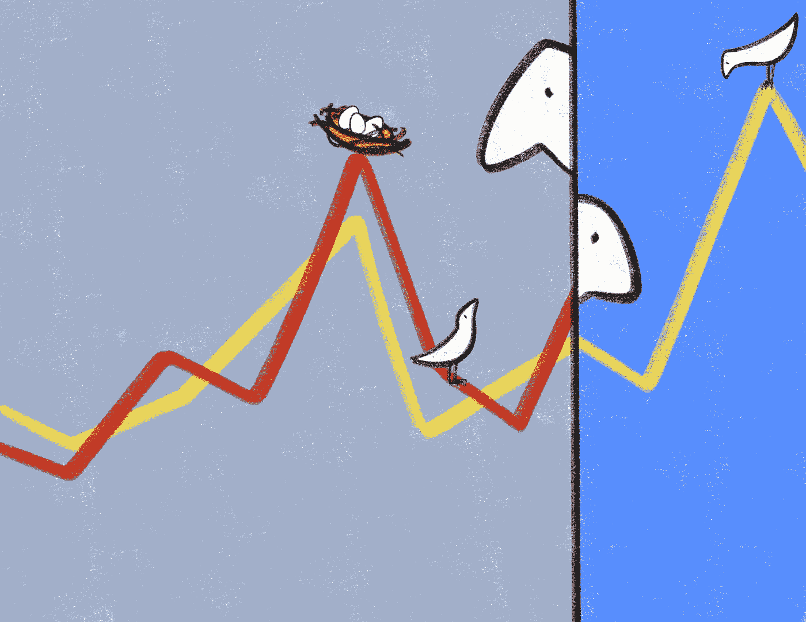
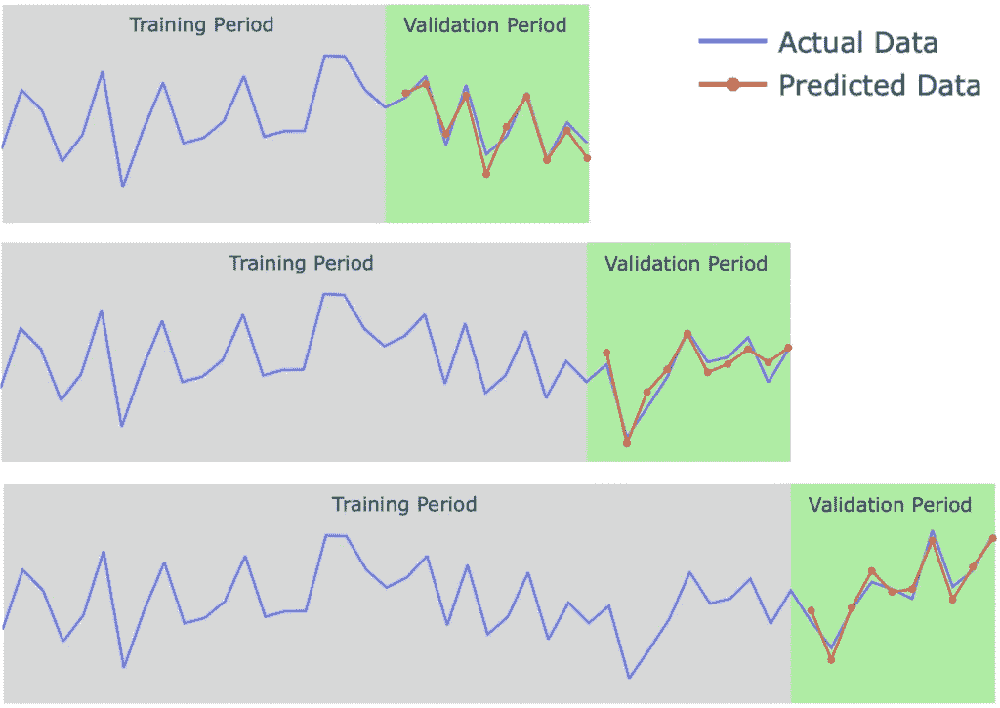
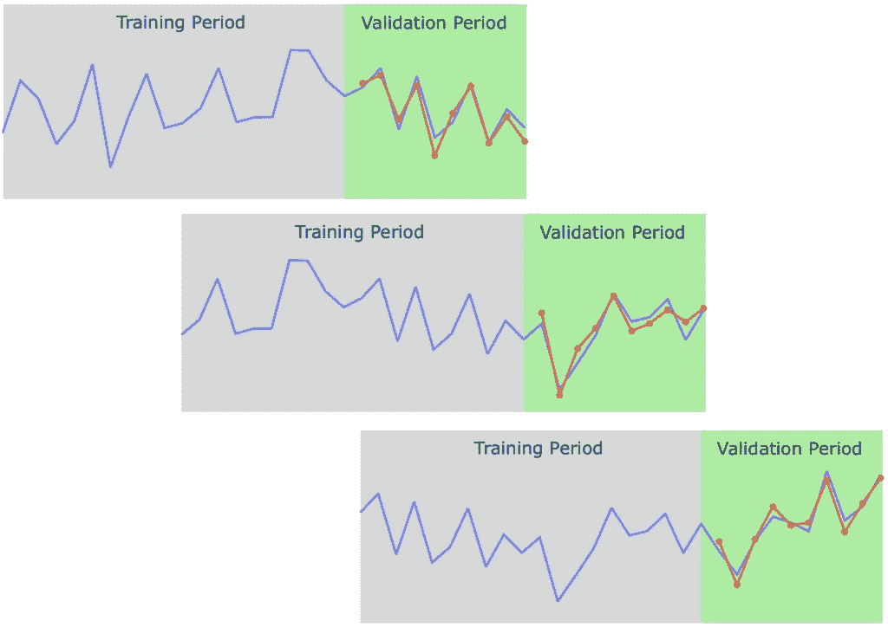
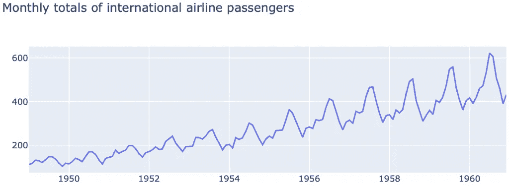
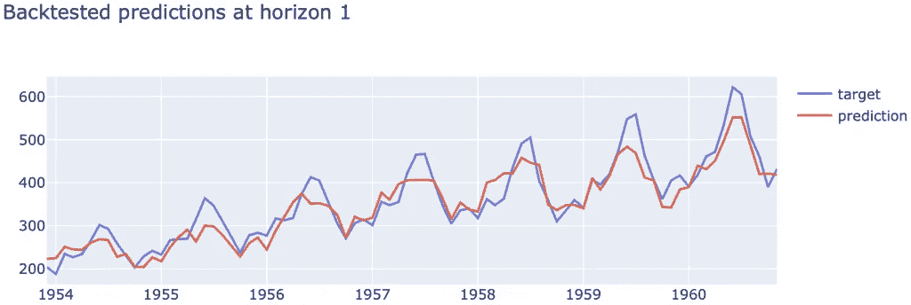

# 为什么回测重要以及如何正确进行

> 原文：[`towardsdatascience.com/why-backtesting-matters-and-how-to-do-it-right-731fb9624a`](https://towardsdatascience.com/why-backtesting-matters-and-how-to-do-it-right-731fb9624a)

## 我们如何知道我们的预测模型是否准确可靠，并评估其在未见数据上的表现？这就是回测的作用所在。

[](https://medium.com/@davide.burba?source=post_page-----731fb9624a--------------------------------)[](https://towardsdatascience.com/?source=post_page-----731fb9624a--------------------------------) [Davide Burba](https://medium.com/@davide.burba?source=post_page-----731fb9624a--------------------------------)

·发表于[Towards Data Science](https://towardsdatascience.com/?source=post_page-----731fb9624a--------------------------------) ·阅读时间 7 分钟·2023 年 7 月 18 日

--



“回测”，由[Giulia Roggia](https://www.instagram.com/giulia_roggia__/)。经许可使用。

+   什么是回测？

+   Python 示例：航空乘客

+   结论

# 什么是回测？

为了评估预测模型的表现，我们使用一种称为回测的程序（也称为**时间序列交叉验证**）。回测本质上是测试模型在过去使用时的表现。

***它是如何工作的？***

要对时间序列预测模型进行回测，我们首先将数据分为两部分：训练集和验证集（有时也称为测试集，但我们将在接下来的部分澄清其差异）。训练集用于训练模型，而测试集用于评估模型在未见数据上的表现。模型训练完成后，可以用它对测试集进行预测。然后可以将这些预测与实际值进行比较，以查看模型的表现。

***我们如何衡量模型的表现？***

有多种指标可以用来评估时间序列预测模型的表现，如平均绝对误差（MAE）或均方根误差（RMSE）。这些指标衡量预测值与实际值的接近程度。

该程序通常会重复多次，允许我们：

+   对模型表现有一个良好的估计

+   视觉化模型表现随时间的演变

下面我们展示了回测过程的图形表示，使用了 3 个分割：



使用扩展窗口的回测。图像由作者提供。

在上图中，我们只展示了 3 个不重叠的验证时期。然而，没有什么阻止我们使用更多部分重叠的窗口，可能每个时间步一个。

## 为什么回测很重要？

如果模型在测试集上表现良好，你可以对其在未来做出准确预测的能力更有信心。通过回测时间序列预测模型，你可以了解它在历史数据上的表现，并对如何在未来使用它做出更明智的决策。

***如何利用回测来改进我们的模型？***

回测还可以用于改进我们的模型，例如通过调整超参数或特征选择。在这种情况下，由于我们通常会选择表现最佳的组合，我们的度量估计可能会过于乐观。如果我们想获得一个不偏倚的性能估计，我们应该在两个不同的连续时期进行两次回测：

1.  第一次回测用于调整超参数，选择最佳特征，通常做出构建我们“最终”模型所需的所有选择。用于评估这个时期内预测的分割称为**验证集**。

1.  第二次回测用于对最终选择的模型进行性能估计。它应该在用于验证之后的时期进行。用于评估这个时期内预测的分割称为**测试集**。

## 回测变体

***扩展或固定训练窗口？***

在前面的图中，我们可以看到训练窗口的大小在扩大。另一种选择是使用固定大小的时间窗口作为训练集，如下图所示。



使用固定窗口的回测。图像来源于作者。

使用固定窗口的缺点是模型使用的数据较少进行训练，但如果数据非常动态，最新数据可能比旧数据更具信息量，这种做法可能更为便利。一般来说，窗口大小可以看作是一个超参数，可以通过回测进行调整。

***训练截止与特征截止***

需要记住的一点是，用于训练模型的数据和用于构建输入特征的数据是两个不同的概念。

原则上，我们可以有与数据中的时间步数一样多的分割。然而，为每个时间步重新训练模型可能会耗时且计算密集。在实践中，通常使用的替代方法是较少频繁地训练模型，例如每隔*N*时间步训练一次，并在每个时间步用最新的模型进行预测。数字*N*也可以通过回测进行调整。

最后，请注意，在本文中，我们为了简便考虑了单一时间序列。然而，相同的概念可以应用于对多个时间序列进行预测的模型（如果您对这个话题感兴趣，可以查看[这篇文章](https://medium.com/towards-data-science/local-vs-global-forecasting-what-you-need-to-know-1cc29e66cae0)）。

# 示例：航空乘客


*图片由* [*Lars Nissen*](https://pixabay.com/users/ln_photoart-2780243/?utm_source=link-attribution&utm_medium=referral&utm_campaign=image&utm_content=3702676) *来自* [*Pixabay*](https://pixabay.com//?utm_source=link-attribution&utm_medium=referral&utm_campaign=image&utm_content=3702676)

在本节中，我们展示了一个简单的 Python 回测实现，使用了[航空乘客数据集](https://stat.ethz.ch/R-manual/R-devel/library/datasets/html/AirPassengers.html)，该数据集在[Darts](https://github.com/unit8co/darts/tree/master)上提供，采用 Apache 2.0 许可证。

让我们首先导入必要的库。

```py
import pandas as pd
import plotly.graph_objects as go
from lightgbm import LGBMRegressor
```

## 数据准备

数据集包含了从 1949 年到 1960 年的国际航空乘客月度总数。让我们加载并准备数据。

```py
# Load data.
data = pd.read_csv('https://raw.githubusercontent.com/unit8co/darts/master/datasets/AirPassengers.csv')
# Rename columns.
data = data.rename(columns = {"Month": "time", "#Passengers": "passengers"})
# Set time to datetime.
data.time = pd.to_datetime(data.time)
# Set time as index.
data = data.set_index("time")
```

让我们快速查看一下数据：

```py
# Let's visualize the data.
def show_data(data,title=""):
    trace = [go.Scatter(x=data.index,y=data[c],name=c) for c in data.columns]
    go.Figure(trace,layout=dict(title=title)).show()

show_data(data,"Monthly totals of international airline passengers")
```



图片由作者提供。

我们可以看到数据展示了强烈的上升趋势和年度季节性。

## 数据工程

基于以下内容，让我们预测下个月的值：

+   一些滞后值：前 3 个月，加上 6/12/24 个月前的值

+   当前月份（作为分类特征，以帮助处理季节性）

```py
def build_target_features(data, lags, horizon=1):
    # Build lagged features.
    feat = pd.concat(
        [
            data[["passengers"]].shift(lag).rename(
                columns={"passengers": f"lag_{lag}"}
            )
            for lag in lags
        ],
        axis=1,
    )

    # Build month feature.
    feat["month"] = [f"M{m}" for m in data.index.month]
    feat["month"] = feat["month"].astype("category")
    # Build target at horizon.
    targ = data["passengers"].shift(-horizon).rename(f"horizon_{horizon}")
    # Drop missing values generated by lags/horizon.
    idx = ~(feat.isnull().any(axis=1) | targ.isnull())
    feat = feat.loc[idx]
    targ = targ.loc[idx]
    return targ, feat

# Build targets and features.
target, features = build_target_features(
    data,
    lags=[0,1,2,5,11,23],
    horizon=1,
)
```

## 回测实现

让我们实现一个简单而通用的回测函数。该函数接受模型和数据作为输入，以及用于开始训练窗口和重新训练的频率的两个参数。我们使用扩展的训练窗口，并在开始窗口之后的每一个时间步做出预测。

```py
def run_backtest(
    model,
    target,
    features,
    start_window = 10,
    retrain_frequency = 6,
):
    """Simple backtesting implementation.

    Args:
        model: A model with fit and predict methods.
        targets: Series with the target in chronological order.
        features: Dataframe with the features in chronological order.
        start_window: The initial window to train a model.
        retrain_frequency: How often to retrain the model.

    Return:
        A dataframe with the validation target and prediction.
    """

    # Sanity check on shape
    assert features.shape[0] == target.shape[0]

    all_preds = []
    all_targets = []
    last_timestep = start_window

    while last_timestep < len(target):
        # Split train/valid
        targ_train = target.iloc[:last_timestep]
        feat_train = features.iloc[:last_timestep]
        targ_valid = target.iloc[last_timestep:last_timestep+1]    
        feat_valid = features.iloc[last_timestep:last_timestep+1]

        # Train the model
        if last_timestep==start_window or last_timestep % retrain_frequency == 0:
            model.fit(feat_train,targ_train)
        # Predict on valid set
        pred_valid = model.predict(feat_valid)
        # Save the output
        all_preds.append(pred_valid[0])
        all_targets.append(targ_valid)

        # Process next timestep
        last_timestep += 1

    # Format output
    output = pd.concat(all_targets).rename("target").to_frame()
    output["prediction"] = all_preds
    return output
```

上述代码可以通过多种方式扩展。例如，您可以允许使用固定的训练窗口，或通过使用矢量化和/或并行化来提高效率。然而，我们建议从简单开始，仅在必要时增加复杂性。

现在我们可以将回测函数应用到我们的数据上，并检查回测性能。

```py
# Apply run_backtest to our data.
output_backtest = run_backtest(
    LGBMRegressor(min_child_samples=1, objective="mae"),
    target,
    features,
    start_window = 36,
    retrain_frequency = 6,
)
# First, let's visualize the data.
show_data(output_backtest,"Backtested predictions at horizon 1")
# Then, let's compute the MAE.
MAE = abs(output_backtest.prediction - output_backtest.target).mean()
print(f"MAE: {MAE:.1f}")
```

这给出了 25.6 的 MAE 以及下图。



图片由作者提供。

*此示例中使用的完整代码可在* [*这里*](https://github.com/davide-burba/code-collection/)*获取。*

# 结论

回测是时间序列预测中的一个关键步骤，它允许您评估模型在未见数据上的准确性和可靠性。通过遵循一些最佳实践并使用适当的回测方法，您可以提高模型的性能，避免常见的陷阱。

*喜欢这篇文章吗？* [*看看我的其他文章*](https://medium.com/@davide.burba) *并关注我以获取更多内容！* [*点击这里*](https://medium.com/@davide.burba/membership) *阅读无限制的文章，并在没有额外费用的情况下支持我*❤️
