# 为什么卷积？理解卷积和深度网络中的特征提取

> 原文：[`towardsdatascience.com/why-convolve-understanding-convolution-and-feature-extraction-in-deep-networks-ee45d1fdd17c`](https://towardsdatascience.com/why-convolve-understanding-convolution-and-feature-extraction-in-deep-networks-ee45d1fdd17c)

## **1D/2D 卷积的解释、它在特征学习中的作用及一个可视化工具**

 [J. Rafid Siddiqui, PhD](https://azad-wolf.medium.com/?source=post_page-----ee45d1fdd17c--------------------------------)

·发表于 [Towards Data Science](https://towardsdatascience.com/?source=post_page-----ee45d1fdd17c--------------------------------) ·9 分钟阅读·2023 年 2 月 5 日

--

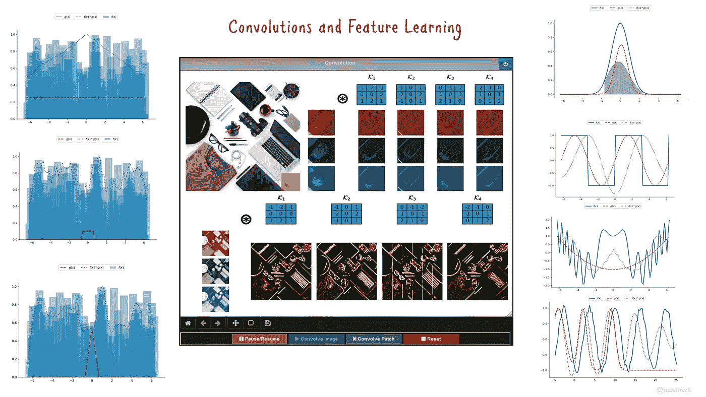

图 1: 1D/2D 卷积及交互式可视化工具（来源：作者）

如今，构建深度神经网络时常常会用到一组卷积层。然而，早期的神经网络和其他机器学习框架并没有使用卷积。特征提取和学习曾经是两个独立的研究领域，直到最近。这就是为什么理解卷积的工作原理及其在深度学习架构中占据重要位置的原因。在这篇文章中，我们将深入探讨卷积，你将能够通过一个交互式工具更深入地理解这个概念。

**引言**

卷积是通过应用另一个函数来改变一个函数的形状的过程。这是一种对两个函数进行的操作，就像其他算术操作一样，然而它作用于函数而不是函数值。因此，它产生一个第三个函数作为结果。更正式地说，卷积 ***C=f(x)*g(x)*** 是函数 ***f*** 和函数 ***g*** 之间的一种操作，由卷积算符 ***** 表示。在数学公式中，卷积是函数 ***f*** 与函数 ***g*** 的乘积的积分，其中函数 ***g*** 在 x 轴上被镜像并按时间步 ***t*** 进行平移。

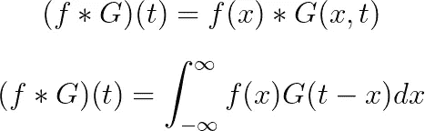

注意，输出函数是***t***的函数，而输入函数***f***是***x***的函数。执行了一定数量的时间步长 —— 通常等于***f***函数值的样本数。在每个时间步长上，卷积函数通过将***G***的函数值作为权重来计算函数***f***曲线下的面积。***t***的符号决定了移动的方向。对于***t***的正值，移动方向是朝向 + ∞，而对于负值，移动方向是朝向 — ∞。直观地说，卷积函数提供了***f***函数值的加权移动平均。

卷积算子也可以被看作是一种积分变换。在微积分中，积分变换是一种将输入函数***f***与内核函数***K***结合应用的函数变换***T***。

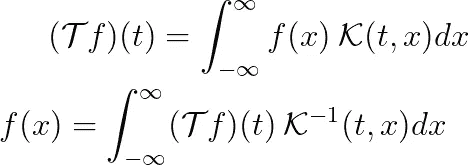

**数据样本的卷积**

内核函数的设计决定了变换的输出。最常使用的是对称内核函数，这使得方程中的乘积具有交换性。内核函数的大小决定了卷积的扩展范围。较大的内核大小包含更多的邻近点，并且输出受大量邻居的影响。

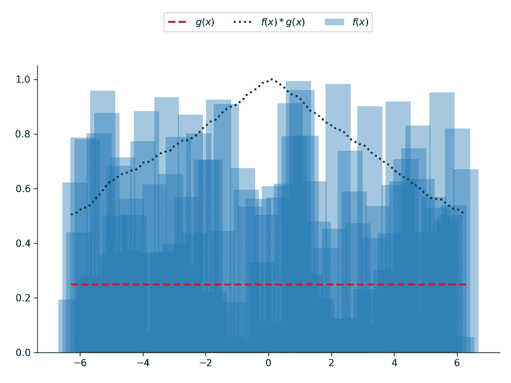

图 2：卷积算子对表示统计数据的随机点的示例效果（来源：作者）

如果我们以图 2 中的数据集为例，并应用一个常数值为*0.25*的卷积内核，则会得到一个如图 2 所示的正态分布曲线。这表明，具有常数值输出的卷积函数会产生数据的标准化曲线。现在，如果我们扩展这个概念，并创建一个大小为 10、仅填充 0.1 值的内核函数，并将其应用于相同的数据，那么我们会看到图 3 中的结果。如图所示，结果是一个平滑的曲线。这是因为我们创建了一个具有 10 个邻近点的移动平均内核。内核函数中的每个值为计算给定点的加权平均提供了一个概率权重。

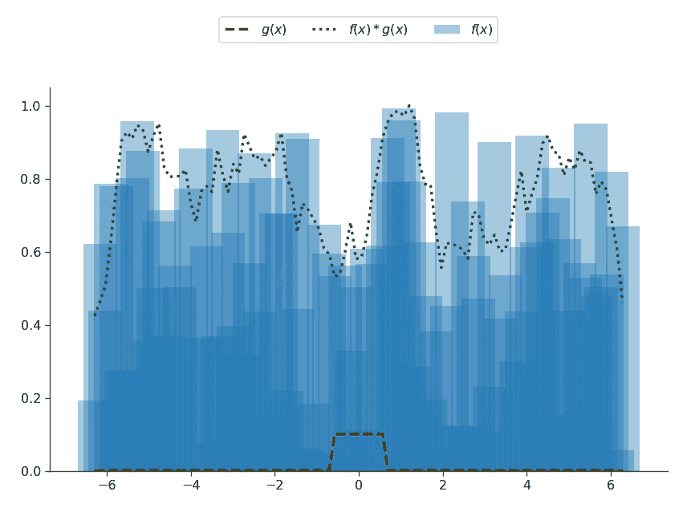

图 3：使用常数内核的数据显示（来源：作者）

我们提供的这些权重在内核函数中不必全部相同。实际上，大多数时候它们并不是常数值。因此，我们可以构造一个内核函数，该函数的值从 0 逐渐增加到 0.5，直到内核的中间，然后逐渐减少回零。这种内核会产生图 4 中的结果。结果显示，它在平滑数据曲线方面做得更好。这是因为我们近似了一个最常见的平滑内核——*高斯内核*。

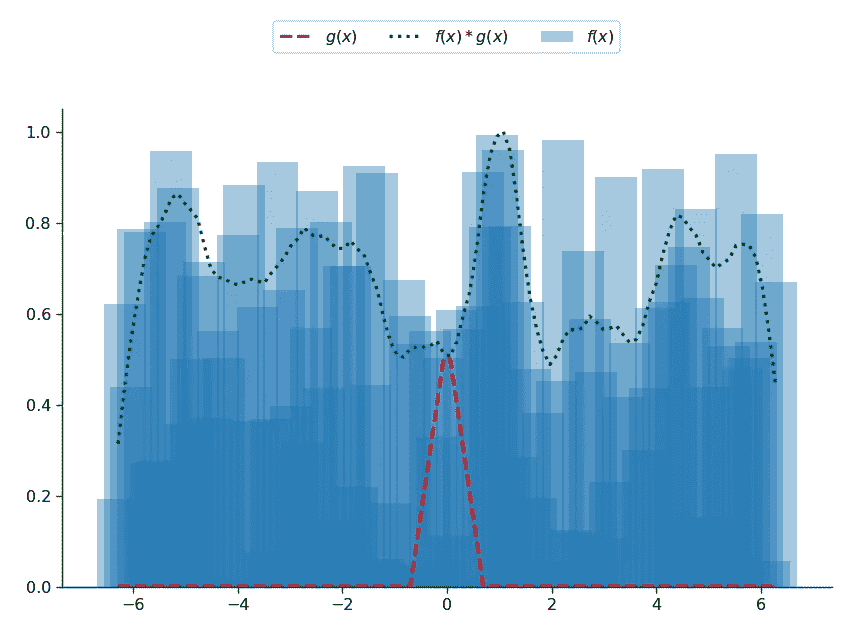

图 4：高斯卷积核对数据点的影响（来源：作者）

到目前为止，你已经看到卷积作为平滑操作的效果，然而，正如你将在后续章节中看到的，卷积操作的应用不仅限于平滑。卷积是一个通用操作符，可以被修改来执行对函数值进行多种不同形式的计算。通过卷积操作可以创建的效果完全取决于卷积核函数的构造。

**一维卷积**

在前一节中，我们讨论了卷积及其对数据的影响。我们使用的示例是 1D 数据。在本节中，我们将扩展并展示卷积在各种 1D 信号中的表现。卷积在 1D 信号上的应用是最明显的应用，实际上这就是概念的起源。1D 信号是独立变量（例如时间）的函数，通过采样获得一组离散的依赖变量值作为输出。离散采样范围通常用于观察函数。采样范围提供了一个视窗，显示该范围内函数的形状。两个信号之间的卷积操作是第二个信号改变第一个信号形状的过程。正如你在图 5 中看到的那样，一条曲线如何影响另一条曲线并产生结合两者的第三条曲线（粗略地说类似于平均）。

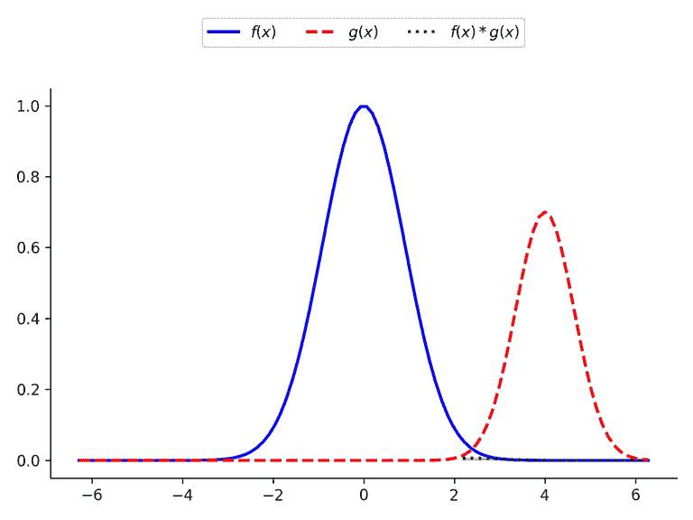

图 5：卷积操作的描述（来源：作者）

在这种情况下，卷积发生在两个相似的函数之间。卷积函数仅在幅度上有所不同，其相位已被移动。然而，通常情况可能并非如此。卷积函数可以采取各种不同的形式，并产生不同的结果。图 6 中展示了一些卷积核函数及其对不同函数的影响。你可以看到，当方波与正弦波或直流核卷积时，‘平均效果’。在两个相位相反的情况下，波并不会像两波的破坏性干涉那样相互抵消，而是得到两个相位的平均输出。当应用于由多个简单的正弦、余弦波和噪声组件组成的复杂信号时，卷积信号会变得平滑，有助于减少噪声。平滑是卷积操作最常见的效果；然而，卷积核函数也可以用来突出、区分或抑制函数的不同部分。我们将在后续章节中看到这些如何发挥作用。

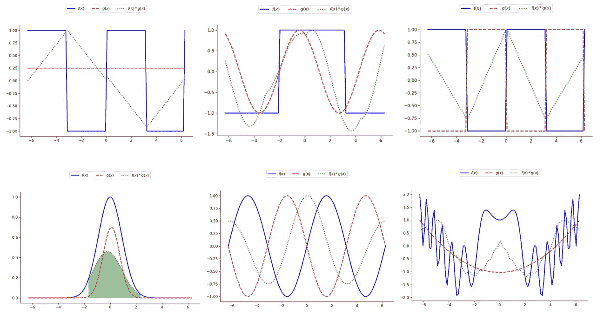

图 6：一维卷积的结果，第一行：对方波信号的影响，第二行：各种正弦波相互作用的影响（来源：作者）

**二维卷积**

2D 卷积只是 1D 卷积的扩展，增加了一个维度。操作不仅在一个维度上进行，而是在两个方向上进行。图像是 2D 函数的一个例子，其值（即 R、G、B）表示经过量化得到的函数离散样本。这些样本排列在一组 2D 矩阵中，每个矩阵代表一个颜色通道。这样的数据结构的内核函数也是一个 2D 矩阵，一组内核矩阵称为*滤波器*。卷积操作通过在所有颜色通道上移动滑动窗口迭代执行，并应用相应的内核。

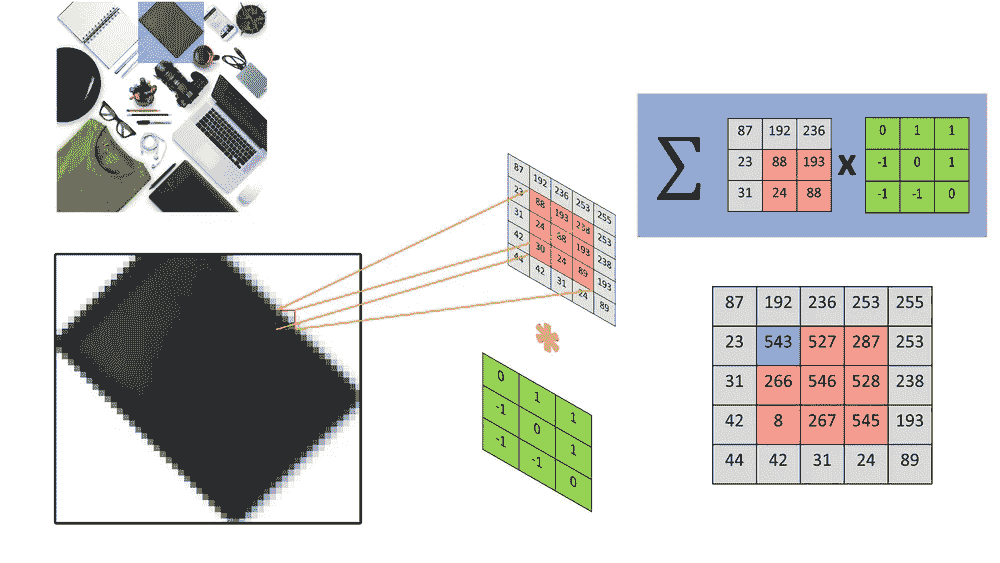

图 7：2D 卷积过程的描述（来源：作者）

在图 7 中，你可以看到 2D 卷积应用于图像的过程。对于每个像素，提取一个与内核大小相同的邻域窗口。若像素在图像边界上，则插入一组零填充像素。邻域窗口和内核矩阵的点积给出新卷积图像中相应位置的像素值。从图中可以看到，卷积图像在视窗对角线上具有更高的值。这就是这种类型的内核对图像所做的。它是一个边缘检测器的示例，能够找到图像中的对角边缘。对图像中的每个像素重复相同的过程，通过在图像上滑动内核并获得相同大小的新卷积图像。注意我们没有翻转内核矩阵；这是因为该内核是对称的。如果内核构造为非对称，则在计算点积之前需要翻转/镜像。

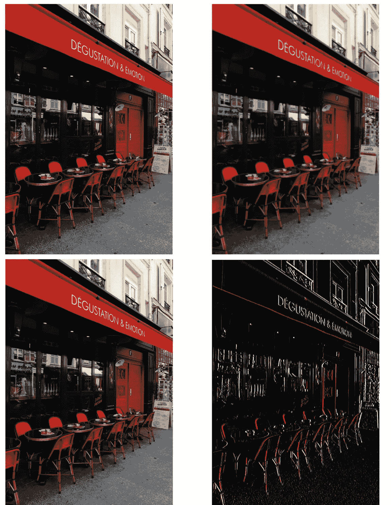

图 8：卷积操作的示例应用，第一行：图像模糊，第二行：边缘检测（来源：作者）

如前所述，卷积过程不仅限于某一特定操作，它可以用于执行各种不同类型的操作。在图 8 中，我们展示了卷积操作的两个示例应用。当图像与高斯内核卷积时，会产生模糊效果。然而，当应用边缘检测内核（例如我们之前展示的那种）时，会生成一个仅突出图像边缘的输出图像。内核系数决定了图像的输出。这些系数可以是手工制作的，也可以通过学习框架学习得到。

**2D 卷积的特征学习**

在上一节中，我们看到 2D 卷积如何应用于图像。在这一节中，我们将探讨如何利用卷积提取特征。图像处理中的特征是描述物体的像素不变模式。可以从物体图像中提取的一组特征可以用来唯一地识别该物体。卷积核提供了一种稳健的特征构建方式，因为它们是批量操作的机器。否则需要的特征提取操作（例如，一组边缘）只需一次矩阵乘法和一个加法操作。这降低了计算成本，并提供了一个通用的特征提取框架，通过构建和应用各种特征核。在图 9 中，显示了四个边缘检测核，每个核专门用于检测某种边缘方向。

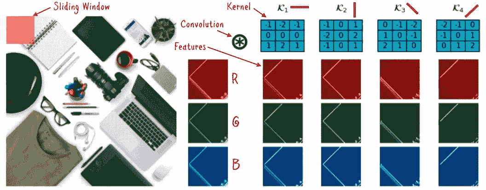

图 9：2D 彩色图像上的特征提取过程示例（来源：作者）

显示的滑动窗口决定了特征的大小。根据滑动窗口的步幅，可以从图像中提取出多个特征。一个具有单位像素步幅的小窗口提供一组局部特征，而少量较大的窗口构建全局特征空间。

在深度神经网络（例如 CNN）中，它通过指定每层学习到的特征数量来控制。此外，深度网络将卷积核的参数学习作为整体参数学习的一部分。因此，无需手动构建特征，然而，从概念上讲，学习到的特征与之前描述的特征是相同的。例如，代替为垂直边缘构造粗糙的手工制作的核（这些在现实世界的图像中通常不那么频繁），它可以学习一个非线性核，这可以找到物体的曲率。在卷积层学习到的特征为深度神经网络后续部分的一组全连接分类层提供了基础。

**最终说明**

在本文中，我们探讨了卷积的概念、其各种类型，并讨论了如何利用卷积从图像中提取特征。卷积是一种通用计算机制。由于与 GPU 架构的兼容性，它可以利用 GPU 处理的强大能力。计算可以被拆分成批次并独立执行。利用卷积进行特征学习可以提供对图像中特征的稳健和自动化提取，这正是深度神经网络所采用的。实际上，特征学习可能是物体分类深度卷积神经网络中最关键的部分。学习到的核更好地捕捉复杂的模式，并且学习到的特征更加多样。

你可以通过下面链接找到的可视化工具来进一步提高对概念的理解和实践。

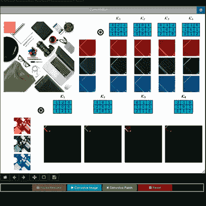

图 10：2D 卷积的可视化工具（来源：作者）

**代码：**

[`www.github.com/azad-academy/DL-Convolutions`](https://www.github.com/azad-academy/DL-Convolutions)

**成为 Patreon 支持者：**

[`www.patreon.com/azadacademy`](https://www.patreon.com/azadacademy)

**在 Substack 上找到我：**

[`azadwolf.substack.com`](https://azadwolf.substack.com)

**关注 Twitter 获取更新：**

[`twitter.com/azaditech`](https://twitter.com/azaditech)

**获取书籍：**

[`www.amazon.com/dp/B0BT4YBZQC`](https://www.amazon.com/dp/B0BT4YBZQC)
