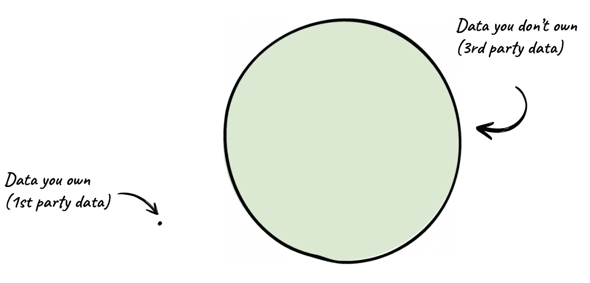
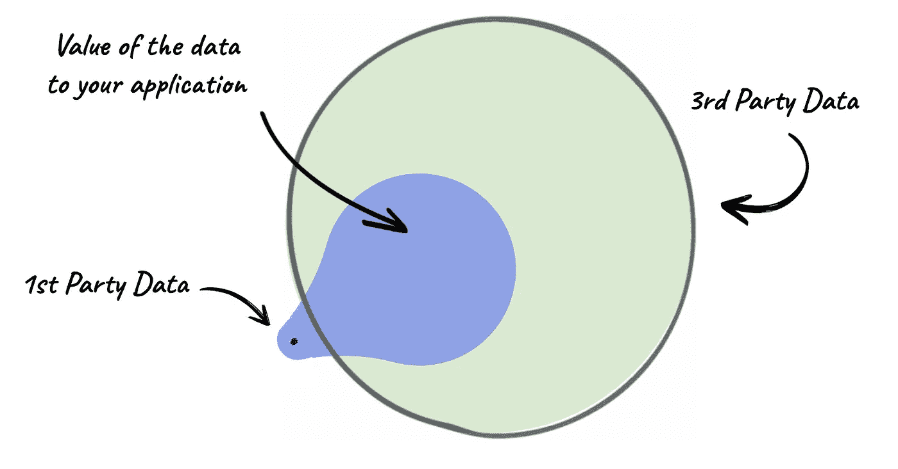
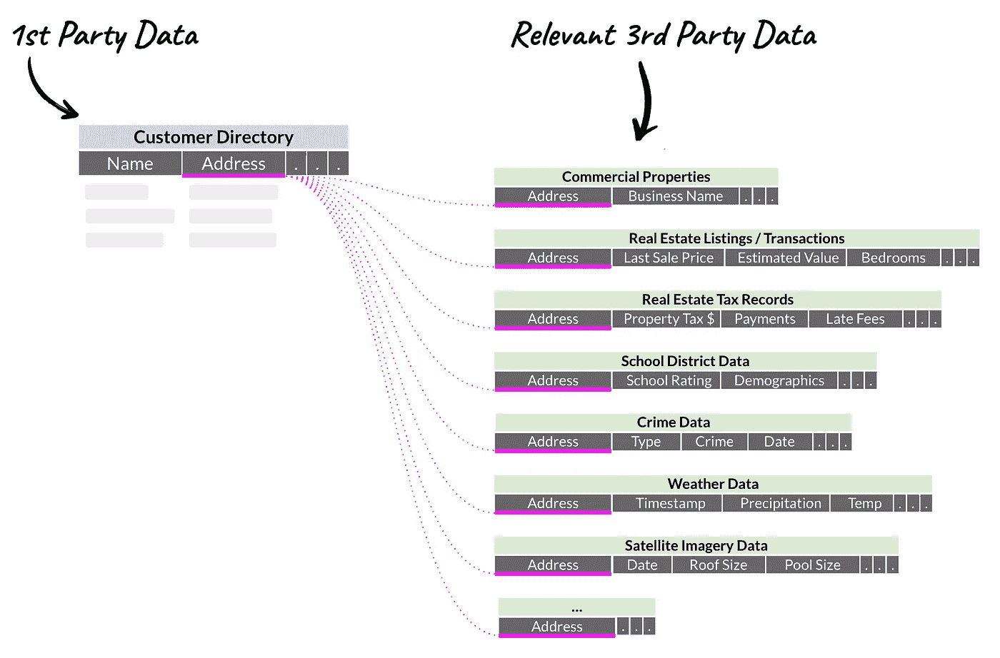
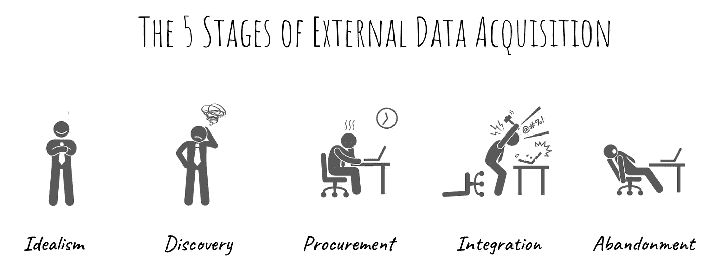
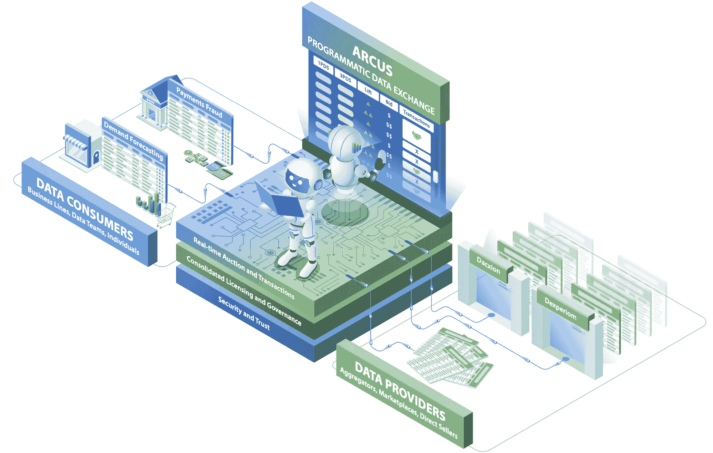

# 为什么数据*不是*新石油以及数据市场为何让我们失望

> 原文：[`towardsdatascience.com/why-data-is-not-the-new-oil-and-data-marketplaces-have-failed-us-b42dd87a0ba0?source=collection_archive---------1-----------------------#2023-07-13`](https://towardsdatascience.com/why-data-is-not-the-new-oil-and-data-marketplaces-have-failed-us-b42dd87a0ba0?source=collection_archive---------1-----------------------#2023-07-13)

## 实时程序化数据交换将如何改变一切

 [克莱门斯·梅瓦尔德](https://medium.com/@clemensm?source=post_page-----b42dd87a0ba0--------------------------------)

·

[关注](https://medium.com/m/signin?actionUrl=https%3A%2F%2Fmedium.com%2F_%2Fsubscribe%2Fuser%2F3214e56806b6&operation=register&redirect=https%3A%2F%2Ftowardsdatascience.com%2Fwhy-data-is-not-the-new-oil-and-data-marketplaces-have-failed-us-b42dd87a0ba0&user=Clemens+Mewald&userId=3214e56806b6&source=post_page-3214e56806b6----b42dd87a0ba0---------------------post_header-----------) 发表在 [Towards Data Science](https://towardsdatascience.com/?source=post_page-----b42dd87a0ba0--------------------------------) ·13 分钟阅读·2023 年 7 月 13 日

--

“*数据是新石油*”这一说法由[克莱夫·汉比于 2006 年提出](https://en.wikipedia.org/wiki/Clive_Humby)，并且自那时以来被广泛引用。然而，这一类比在只有少数几个方面才具有合理性（例如，两者的价值通常随着精炼而增加），而且数据对经济的广泛影响在除少数科技和金融公司之外并不显著。但石油和数据之间的实际差异是根本性的。

最显著的是，石油是一种商品。其质量标准化且可测量，使得来自不同来源的石油在经济学上是“同质商品”。它广泛存在并有一个固定价格。最重要的是，如果你有一桶石油，你不能简单地复制一桶——石油是一种有限资源，必须从地下开采。

数据，另一方面，是一种异质商品。它种类繁多，每次出现的价值无法客观衡量。当两个参与方交换商品时，卖方需要定价，买方需要确定他们愿意支付的价格。这受到数据的两个特性影响：

**向另一位买家出售相同数据的边际成本为零**。生产数据的成本高度可变（测序基因组的成本高于测量体温），但一旦数据存在，这个[成本已沉没](https://www.investopedia.com/terms/s/sunkcost.asp)。将数据出售给另一买家的过程实际上就是复制它，实践中几乎没有成本。

**在“消费”数据之前很难确定其价值**。销售线索数据库只有在产生实际销售时才有价值。更糟糕的是，相同数据集的价值高度依赖于买方（或其预期用途）。在这方面，数据实际上更接近“体验商品”，如书籍或度假。

在这篇文章中，我将论证数据是最未被充分利用和因此被低估的商品之一。我概述了一个实时程序化数据交换，它是我正在顾问的新公司[Arcus](https://www.arcus.co/)的核心，并可能对数据经济产生深远的影响。

> “数据是最未被充分利用和因此被低估的商品之一。”

# 为什么我们应该关注数据的经济学？

## 区分 1st 和 3rd 方数据

我认识的没有人对数据的重要性提出异议。但即便*“数据是资产”*的叙述已经相当普遍，数据可能仍然是最未被充分利用和因此被低估的商品之一。

当大多数企业考虑数据时，他们考虑的是他们**拥有**的数据。这些 1st 方数据（1PD）通常来自网站、CRM/ERP 系统、与客户的通信等。一些 1st 方数据集比其他的数据集更有价值：谷歌的大量搜索和点击历史是他们 1PD 语料库的一部分。

作者提供的图片

显而易见的是，存在的第三方数据（3PD），即你不直接拥有的数据，数量比你的 1PD 大几个数量级。我将要提出的观点是，大多数人没有意识到 3PD 对他们业务的价值。让我们用一个例子来说明这一点。

## 检测电子邮件垃圾邮件（以及为什么你的 1PD 可能没有你想的那么有价值）

你认为检测电子邮件垃圾邮件的最具预测性信号是什么？最常见的答案包括：*错别字、语法* 或提到诸如 *v1agra* 这样的特定关键词。一个稍微更好的答案是 *“发件人是否在你的联系人中”* — 这并不是因为它是真实的（在你的联系人中有更多有效的非垃圾邮件发件人），而是因为它考虑了电子邮件本身以外的数据来源：你的联系人。

即使仅仅为了这个轶事，我们可以说，检测电子邮件垃圾邮件最重要的信号实际上是***发件人域名的年龄***。一旦陈述出来，这似乎是直观的：垃圾邮件发送者经常注册新的域名，这些域名在短时间内会被电子邮件提供商屏蔽。

为什么大多数人没有想到这个答案？因为发件人的域名年龄不在你的“第一方数据集”之内，这个数据集仅包含诸如发件人和收件人的电子邮件、主题和邮件正文等信息。但任何对域名有所了解的人都会告诉你，这些信息不仅很容易获取，而且是免费的。获取域名，去到域名注册商处，你可以查到它的注册时间（例如，gmail.com 于 1995 年 8 月 13 日注册）。

事实证明，如果你的数据（1PD）与*其他人拥有的数据（3PD）*结合使用，它可能对你更有价值。

图片由作者提供

## 从电子邮件垃圾邮件到量化交易（甚至更远？）

从这样一个想法出发，即通过增加发件人域名的年龄来更好地检测电子邮件垃圾邮件，你可以想象有无限种方法可以应用同样的原则。以下是一个简单的例子，展示了你可以从一个地址中找到的数据（至少在美国是如此）。

图片由作者提供

当然，这不是一个新想法。对冲基金已经使用“[替代数据](https://www.investopedia.com/what-is-alternative-data-6889002)”几十年了。*[RenTech](https://en.wikipedia.org/wiki/Renaissance_Technologies)* 是最早利用替代数据的公司之一，如卫星图像、网页抓取和其他创意来源的数据集，帮助他们在交易中获得优势。UBS 使用[卫星图像来监控大型零售商的停车场](https://www.cnbc.com/id/38722872)并将车流量与季度收入关联，从而在盈利公布之前更准确地预测盈利。

你可以大概猜到这将如何发展。在仅美国就有[超过 30 万个数据提供者](https://www.statista.com/statistics/1135041/number-of-data-suppliers-in-usa)，以及可能数十亿的数据集。许多数据集可以为你提供预测或分析中的竞争优势。唯一的限制就是你的创造力。

## 使用外部数据的（主观）价值

尽管外部数据对量化交易公司的价值是即时而显著的，但其他行业的高管却迟迟没有意识到这一点。一个思维实验可以帮助理解：考虑一下你业务中最重要的预测任务。对于亚马逊，这可能是一个给定客户最有可能下一次购买的产品。对于一家石油勘探公司，这可能是发现下一个石油储层的地点。对于一家连锁超市，这可能是任何特定时间点对特定产品的需求。

接下来，想象一下你有一个神奇的旋钮，你可以旋转它来改善预测任务的表现以及对你业务的价值。连锁超市损失了[大约 10%的食品因变质](https://www.mckinsey.com/industries/consumer-packaged-goods/our-insights/reducing-food-loss-what-grocery-retailers-and-manufacturers-can-do)。如果它们能够更好地预测需求，就可以改善供应链并减少变质。在[约 20%的毛利率](https://csimarket.com/Industry/industry_Profitability_Ratios.php?ind=1305)下，每降低一个百分点的变质将使毛利率提高 0.8 个百分点。因此，对于像 Albertsons 这样的公司，每提高一个百分点的需求预测可能价值约 6.4 亿美元。替代数据可能会有所帮助。

同样的数据可能为一家连锁超市节省数亿美元，但对商业房地产开发商而言可能更有价值。然而，数据市场尚未能够提取这种价值（通过[价格歧视](https://en.wikipedia.org/wiki/Price_discrimination)），因为它们离实际的业务应用太远。它们不得不对库存设定一个通用价格，而不考虑最终用途。

尽管如此，外部数据已经成为一个估计达 50 亿美元的市场，[增长](https://www.grandviewresearch.com/industry-analysis/alternative-data-market)率每年达 50%，而交易这些数据的市场代表了[另外一个 10 亿美元的市场](https://www.grandviewresearch.com/industry-analysis/data-marketplace-market-report)。这仅仅是潜在市场规模的一小部分，原因至少有两个：（1）尽管每家公司都应该能够从 3PD 中受益，[只有最具分析成熟度的公司](https://sloanreview.mit.edu/projects/using-analytics-to-improve-customer-engagement/)知道如何利用 3PD 来获得优势。（2）那些敢于尝试的人被发现和购买 3PD 的过时流程所拖慢了。让我们简单探讨一下广告购买流程，以说明这一点。

# 程序化广告可以教会我们如何改善数据经济

## 广告购买流程的演变

不久前，在 2014 年，程序化广告购买的比例[不到数字广告支出的半数](https://www.insiderintelligence.com/public_media/docs/Programmatic_Advertising_2015-Executive_Summary-10082015.pdf)。那时人们是如何购买广告的？他们告诉代理商他们想要接触的受众类型。然后，代理商查看他们合作的出版商及其“库存”（杂志页面、广告牌、电视广告位等），并制定一个广告投放计划以满足这些要求。经过一些谈判，公司和代理商最终签署了合同。广告创意将被开发、审查和批准。插入订单将被提交，广告活动最终会开始。几个月后，公司会收到代理商关于广告活动效果的报告（基于一个小的样本数据集）。

随后，谷歌（以及其他一些公司）普及了所谓的程序化广告购买。谷歌创建了自己的广告交换平台（AdX），将来自多个出版商的库存与不同的广告网络连接起来。当用户进行搜索或访问网站时，它会进行实时拍卖（是的，在加载网页的时间内），将所有广告主进行竞争，选出最高出价者（实际上是[第二高出价者](https://blogs.cornell.edu/info2040/2012/10/27/google-adwords-auction-a-second-price-sealed-bid-auction/)）来展示他们的广告。

就这样，广告购买从一个需要大量人工参与且透明度极低的漫长过程，变成了一个实时交易过程，这个过程不仅通过拍卖设置价格**并且**提供了即时的展示效果测量（有时甚至是转化效果）。这种速度、流动性和透明度的提升导致了在线广告市场的爆炸性增长，而程序化广告购买现在占据了[接近 90%的数字广告预算](https://www.statista.com/forecasts/1316147/programmatic-share-digital-ad-spend-worldwide)。

## 过时的数据购买过程

事实证明，如今购买数据比 20 年前购买广告更加痛苦。

作者提供的图片

**发现：** 首先，你需要意识到第三方数据（3PD）对你可能极为宝贵。还记得电子邮件垃圾邮件的例子吗？接下来，你需要具备创造力，考虑所有可能的第三方数据来补充你的第一方数据（1PD）。你会考虑使用停车场的卫星图像来预测零售商的收入吗？然后，你必须前往所有的数据提供商，寻找你认为需要的数据。你会发现大多数“数据市场”基本上只是对描述的自由文本搜索。接下来，你需要查看数据的模式，以确保它包含你需要的信息，具有所需的粒度（例如，有时你需要逐分钟的客流量而不仅仅是每小时一次），并且覆盖范围正确（例如，适用于正确的日期范围或地理区域）。

**采购：** 一旦你找到你认为需要的数据，你必须弄清楚如何采购这些数据。你会惊讶地发现这并不总是一个简单的“点击购买”的过程。你必须与数据提供者交谈，了解数据许可证（你是否可以将这些数据用于预期的目的？），谈判条款并签署合同。你需要对来自不同提供者的多个 3PD 重复这一过程，这些提供者都有不同的合同、条款和许可证。你等待在邮箱里收到数据（开个玩笑）。

**整合：** 最终，你获得了你想要的数据。你等待了几周，期间你的数据工程团队将其与 1PD 进行整合，结果你发现它实际上并不像你期望的那样有用。你花费的时间和金钱都白费了，你也再没有尝试过。或者，更让人痛苦的是，你发现 3PD 确实带来了有意义的改善，你继续将你的预测模型投入生产，却发现你需要每小时获取新数据，而你使用的数据源之一仅每周更新一次。如果你再尝试一次，你现在知道，除了基于模式检查粒度外，你还需要考虑刷新率。

这个过程可能需要[几个月到一年以上](https://www.neudata.co/blogs/external-data)。为了构建更快的马匹，一些[咨询公司建议](https://www.mckinsey.com/capabilities/mckinsey-digital/our-insights/harnessing-the-power-of-external-data)的解决方案是雇用整个“数据采购团队”并与数据聚合商建立关系。

# 数据经济需要一个实时编程的数据交换平台

我引用程序化广告购买的例子是因为我坚信数据经济可以以相同的方式发展，从而产生类似深远的经济影响。

**发现与采购：** 想象一个数据交换平台，它将所有数据提供者（即“库存”）汇聚在一起，并合理化许可证，以便能够以编程方式促进交易。数据消费者会提供任何 1PD，并表达他们感兴趣的任务（例如预测需求）以及他们对每单位改善的价值（记住，在需求预测中每 1pp 的改善对 Albertsons 来说价值 640 百万美元？）。数据交换平台会自动识别哪个 3PD 能为该任务提供可衡量的改善，基于数据消费者的预算进行实时拍卖，并优化选择符合要求的 3PD 子集。这种接近实际任务（及其相关价值）的方式将解决现有数据市场必须将数据视为商品而非经验产品的问题。

**持续集成和改进：** 由于大多数有价值的预测任务本质上是持续性的（例如，你需要定期预测需求，而不仅仅是一次），数据交换将成为重复交易的中心，随着新的数据提供者和消费者进入生态系统，提供越来越多的价值。每次进行预测任务时进行拍卖（而不仅仅是在决定购买哪些数据时进行一次）将确保新的数据提供者立即实现分发，数据消费者也能从最新的数据库存和价格发现中受益。正如广告购买从离线和手动演变到实时一样，数据交易将变得实时、程序化，并且最重要的是可度量。

图片由作者提供

这种“实时程序化数据交换”将为市场中的所有参与者提供经济激励：

+   数据提供者和消费者都将从改进的发现性中受益。数据市场存在长尾问题：数据量和种类繁多，使用现有方法几乎不可能发现任何给定任务/应用最相关的数据。

+   标准化条款和许可证，以便交易能够程序化进行，将提升数据经济的速度和流动性，消除购买过程中的摩擦，并使其面向更广泛的受众。因此，整体市场将显著扩大。

+   通过在拍卖中根据每个数据消费者的主观价值设定价格，如果有多个数据提供者提供可比的数据，消费者可以获得更好的交易，而提供者则可以在不同的消费者之间进行价格歧视。

+   在一个平台上汇聚数据消费者的需求将为数据提供者提供宝贵的见解。例如，基于需求方的所有任务和支付意愿，数据交换可以准确推断出提供方缺少哪些数据，从而帮助优先考虑数据的获取和创建。请注意，合成数据提供者！

# 需要解决的难题

除了像 Google 对广告所做的那样解决数据的发现性和定价问题外，这种程序化数据交换还需要处理许可和交付问题，这与 Spotify 对音乐的处理方式类似。但如果没有一些难题需要解决，它就不会如此有趣和有意义。

**商业**

+   **数据许可仍然相对较新。** 根据我的观察，数据许可的标准化程度不高。每个数据提供者都有自己独特的许可证类型，这些许可证往往不兼容。为了促进交换，许可需要被简化。

+   **数据市场可能担心去中介化。** 数据生态系统很复杂。对于数据提供者来说，这将是一个全新的分销渠道。他们深知发现性问题的痛苦，而这个交换平台可能会将市场开放给数以百万计的潜在新消费者，他们原本不会考虑替代数据。而数据市场和聚合商则像唱片公司一样，可能希望阻止数据提供者直接访问程序化数据交换。

+   **向“传统”行业引入新的定价模型是困难的。** 程序化交易的流动性机制将显著扩展需求和供应两方面，而定价机制将优化价值捕捉。总体而言，程序化数据交换将对数据提供者带来好处。

**技术**

+   **语义类型检测停留在过去。** 为了自动识别哪些数据集可以进行合并，你首先需要理解数据的语义类型。例如，某些数据只是一个数字、一个邮政编码还是一种货币？大多数语义类型检测是基于启发式的，但也有更现代的方法。

+   **你不能通过蛮力来发现数据。** 事实证明，有**很多**数据。寻找哪种 3PD 对你的任务最有益的简单方法就是“尝试”所有数据，以确定哪个提供的价值最大。值得庆幸的是，现代信息理论和数据总结领域的突破使得这个问题变得可处理。

+   **数据整合很困难。** 一旦你了解了语义类型，并且有机制来识别哪些第三方数据（3PD）会提供有意义的好处，你就必须以有趣的方式将第一方数据（1PD）和 3PD 进行整合。天气数据可能附带的气象站的经度和纬度与您想要预测航班延误的机场不匹配。或者，脚步流量数据可能是按小时提供的，你需要确定是否使用平均值、最大值或第 n 百分位数来进行每日汇总。

+   **数据安全。** 数据提供者不愿意轻易地分享他们的数据（因为数据很容易被复制）。然而，有一些技术（如 [联邦学习](https://en.wikipedia.org/wiki/Federated_learning)）可以在保持数据访问和隐私的同时，增强预测能力。

我相信，实时程序化数据交换的影响将是深远的，值得庆幸的是，AI 的最新进展为上述挑战提供了解决方案。我个人期待着未来的数据能够成为一种体验性商品，而不是简单的商品。

*本帖中的观点仅代表我个人，并不代表我的雇主的观点。*
