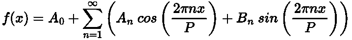

# 为什么我们还需要神经网络？

> 原文：[`towardsdatascience.com/why-do-we-even-have-neural-networks-72410cb9348e`](https://towardsdatascience.com/why-do-we-even-have-neural-networks-72410cb9348e)

## 神经网络的替代方案：泰勒级数与傅里叶级数

[](https://medium.com/@egorhowell?source=post_page-----72410cb9348e--------------------------------)[](https://towardsdatascience.com/?source=post_page-----72410cb9348e--------------------------------) [Egor Howell](https://medium.com/@egorhowell?source=post_page-----72410cb9348e--------------------------------)

·发表于 [Towards Data Science](https://towardsdatascience.com/?source=post_page-----72410cb9348e--------------------------------) ·阅读时间 7 分钟·2023 年 12 月 16 日

--


”[`www.flaticon.com/free-icons/neural-network`](https://www.flaticon.com/free-icons/neural-network)。" 标题=”神经网络图标” 神经网络图标由 imaginationlol 创建 — Flaticon。

我最近一直在撰写一系列文章，解释现代神经网络背后的关键概念：


[Egor Howell](https://medium.com/@egorhowell?source=post_page-----72410cb9348e--------------------------------)

## 神经网络

[查看列表](https://medium.com/@egorhowell/list/neural-networks-616db722dbbb?source=post_page-----72410cb9348e--------------------------------) 9 个故事

神经网络如此强大和受欢迎的一个原因是它们展示了 [***通用逼近定理***](https://en.wikipedia.org/wiki/Universal_approximation_theorem)***。*** 这意味着神经网络可以“学习”任何函数，无论其复杂程度如何。

> [***“函数描述世界。”***](https://www.youtube.com/watch?v=PAZTIAfaNr8)

一个函数，***f(x)***，接收一些输入，***x***，并给出输出 ***y***：


数学函数如何工作。图示作者提供。

这个函数定义了输入与输出之间的关系。在大多数情况下，我们拥有输入和相应的输出，神经网络的目标是学习或逼近将它们之间映射的函数。

神经网络在 1950 年代和 1960 年代左右被发明。然而，当时还有其他已知的通用逼近器。那么，为什么我们还需要神经网络呢……

# 泰勒级数

[***泰勒级数***](https://en.wikipedia.org/wiki/Taylor_series) 将一个函数表示为从其在单点的导数值计算出的无限项之和。换句话说，它是一个无限多项式的和，用于近似一个函数。


泰勒级数。方程由作者在 LaTeX 中给出。

上述表达式将一个函数 ***f*(*x*)** 表示为一个无限和，其中 ***f^n*** 是在点 ***a*** 处的 ***n-th*** 导数或阶数，***n*!** 表示 ***n*** 的阶乘。

> 如果你有兴趣了解我们为什么使用泰勒级数，请见 [这里](https://math.stackexchange.com/questions/218421/what-are-the-practical-applications-of-the-taylor-series)。简而言之，它们用于将复杂的函数变得易于处理！

存在一种泰勒级数的简化形式，称为 [***麦克劳林级数***](https://brilliant.org/wiki/maclaurin-series/)，其中 ***a = 0***。


麦克劳林级数。方程由作者在 LaTeX 中给出。

在这种情况下，***a_0***、***a_1*** 等是对应多项式的系数。泰勒级数和麦克劳林级数的目标是找到最优系数值，以近似给定的目标函数。

*听起来很熟悉？*

我们甚至可以用矩阵表示麦克劳林级数。


麦克劳林级数的矩阵表示。方程由作者在 LaTeX 中给出。

这几乎是一个单层神经网络！ ***a_0*** 是偏置项，***a_1*** 到 ***a_n*** 是权重，***x*** 到 ***x^n*** 是我们的特征。

> 我喜欢把泰勒级数视为（宽松地）[**多项式回归**](https://medium.com/analytics-vidhya/understanding-polynomial-regression-5ac25b970e18#:~:text=Polynomial%20Regression%20is%20a%20form,the%20method%20of%20least%20squares.)**！**

在机器学习问题中，我们实际上没有整个函数，而只是数据点的样本。这时，我们会将 ***x^n*** 特征作为泰勒特征传入神经网络，通过反向传播来学习系数。

> 另一个有趣的特性是将泰勒级数与机器学习相关联，即梯度下降。一般梯度下降公式来自将泰勒级数应用于损失函数。有关这一概念的证明，请见 [这里](https://www.reddit.com/r/MachineLearning/comments/o01ox7/d_unfair_comparison_neural_networks_vs_taylor/)。

# 傅里叶级数

[**傅里叶级数**](https://www.youtube.com/watch?v=Zgcry0SPUY8) 与泰勒级数非常相似，但使用的是正弦和余弦波，而不是多项式。它定义为：

> 任何周期函数都可以分解为正弦波和余弦波的和。

这是一条非常简单的声明，但其含义却非常深远。

关于傅里叶级数的补充视频。

例如，下面显示了***sin(2x)***和***cos(3x)***的函数及其对应的求和：

```py
import plotly.graph_objs as go
import numpy as np

x = np.linspace(0, 3 * np.pi, 500)

y1 = np.sin(2 * x)
y2 = np.cos(3 * x)
y_sum = y1 + y2

trace1 = go.Scatter(x=x, y=y1, mode='lines',name='sine(2x)', line=dict(color='blue'))
trace2 = go.Scatter(x=x, y=y2, mode='lines', name='cos(3x)', line=dict(color='green'))
trace3 = go.Scatter(x=x, y=y_sum, mode='lines', name='sum', line=dict(color='red'))

layout = go.Layout(
    title='Example Sum of Sinusoidal Waves',
    xaxis=dict(title='X'),
    yaxis=dict(title='Y')
)

data = [trace1, trace2, trace3]

fig = go.Figure(data=data, layout=layout)

fig.show()
```


示例正弦波及其和。图表由作者在 Python 中生成。

***sin(2x)***和***cos(3x)***函数是简单函数，但它们的和（红线）会导致更复杂的模式。这是傅里叶级数的主要思想，即使用多个简单函数来构建复杂的函数。

傅里叶级数的一个有趣结果是通过对不同*奇数*（阶数）频率和振幅的无限正弦函数（[***谐波***](https://electronics.stackexchange.com/questions/32310/what-exactly-are-harmonics-and-how-do-they-appear)）进行求和来构造[***方波***](https://en.wikipedia.org/wiki/Square_wave)：


奇数正弦波的求和。公式由作者在 LaTeX 中编写。

```py
import plotly.graph_objs as go
import numpy as np

x = np.linspace(0, 3 * np.pi, 1000)
y = np.array([np.sin((2*k + 1) * x) / (2*k + 1) for k in range(100)]).sum(axis=0) * (4 / np.pi)

trace = go.Scatter(x=x, y=y, mode='lines', name='Square Wave', line=dict(color='blue'))

layout = go.Layout(
    title='Square Wave',
    xaxis=dict(title='X'),
    yaxis=dict(title='Y', range=[-1.5, 1.5])
)

data = [trace]

fig = go.Figure(data=data, layout=layout)

fig.show()
```


使用正弦波创建方波。图表由作者在 Python 中生成。

这个结果令人惊讶，因为我们从光滑的正弦函数生成了一个尖锐的直线图。这展示了傅里叶级数构造任何周期函数的真正能力。

> 傅里叶级数通常应用于时间序列，以建模复杂的**季节性**模式。这被称为[**谐波回归**](https://medium.com/towards-data-science/take-your-forecasting-to-the-next-level-with-harmonic-regression-5a8515f63295?sk=8c5a869f9825ce001f337cf5f478338f)。

如前所述，傅里叶级数声明任何周期函数都可以分解为正弦和余弦波的总和。数学上，这可以写作：



傅里叶级数。公式由作者在 LaTeX 中编写。

其中：

+   ***A_0:*** *给定周期函数的平均值*

+   ***A_n:*** *余弦分量的系数*

+   ***B_n:*** *正弦分量的系数*

+   ***n:*** *“*频率的顺序，称为‘*[***谐波***](https://electronics.stackexchange.com/questions/32310/what-exactly-are-harmonics-and-how-do-they-appear)*’”*

+   ***P:*** *函数的周期*

同样地，使用泰勒级数，我们的目标是通过傅里叶级数找到***A_n***和***B_n***系数，这些系数对应于正弦和余弦函数。

# 那么为什么使用神经网络呢？

泰勒级数和傅里叶级数可以被视为通用函数逼近器，并且它们早于神经网络。那么，为什么我们还需要神经网络呢？

答案并不简单，因为这三种方法之间存在许多复杂性。我在描述泰勒和傅里叶级数的工作原理时较为宽松，否则这篇文章将非常繁琐。

让我们分解一些泰勒级数或傅里叶级数无法替代神经网络的原因。

## 泰勒级数

泰勒级数的主要问题是它们围绕一个点进行近似。它们是在一个值及其局部区域上估计一个函数。我们想知道整个函数在大范围内是什么样的。这意味着泰勒级数（多项式）在训练集之外无法泛化。

## 傅里叶级数

傅里叶级数的一个问题是它需要*看到*要近似的函数。例如，在时间序列中，它用于寻找数据中的复杂季节性模式。但它知道数据是什么样的。神经网络的目标是*学习*这个函数。

然而，主要的问题在于傅里叶级数的复杂性。系数的数量随着我们尝试估计的函数中的变量数量呈指数增长。然而，对于神经网络来说，情况不一定如此。

假设我们有一个函数***f(x)***，我们可以用 100 个系数很好地近似它。现在假设我们想要近似***f(x,y)***。我们现在有 100² = 10,000 个系数。对于***f(x,y,z)***，我们有 100³。这个过程持续下去，指数增长。

我在这里描述的是[***维度诅咒***](https://en.wikipedia.org/wiki/Curse_of_dimensionality)***。***

另一方面，神经网络可以准确建模（一些）这些高维函数，而不需要过多增加输入维度。

# 无免费午餐定理

重要的是要提到，神经网络并不总是比泰勒级数和傅里叶级数更好。机器学习的美在于它是数学的科学。你需要在拟合模型时进行尝试，以找到最佳模型。添加泰勒或傅里叶特征可能会改善它，但也可能会使其变得更差。目标是找到最佳模型，但这对于每个数据集都不同。

# 另一个事情！

我有一个免费的通讯，[**Dishing the Data**](https://dishingthedata.substack.com/)，每周分享成为更好的数据科学家的技巧。没有“空洞的”或“点击诱饵”，只有来自实践数据科学家的纯粹可操作的见解。

[](https://newsletter.egorhowell.com/?source=post_page-----72410cb9348e--------------------------------) [## Dishing The Data | Egor Howell | Substack

### 如何成为更好的数据科学家。点击阅读 Dishing The Data，由 Egor Howell 编写，是一个 Substack 出版物，包含……

newsletter.egorhowell.com](https://newsletter.egorhowell.com/?source=post_page-----72410cb9348e--------------------------------)

# 与我联系！

+   [**YouTube**](https://www.youtube.com/@egorhowell)

+   [**LinkedIn**](https://www.linkedin.com/in/egor-howell-092a721b3/)

+   [**Twitter**](https://twitter.com/EgorHowell)

+   [**GitHub**](https://github.com/egorhowell)

# 参考文献和进一步阅读

+   *预测：原则与实践：* [`otexts.com/fpp2/`](https://otexts.com/fpp3/arima.html)

+   [*解释类似概念的优秀视频*](https://www.youtube.com/watch?v=TkwXa7Cvfr8&t=923s)

+   [*关于神经网络与泰勒级数与傅里叶级数的精彩讨论*](https://www.reddit.com/r/MachineLearning/comments/o01ox7/d_unfair_comparison_neural_networks_vs_taylor/)
