# 为什么我们拥有庞大的语言模型而视觉变换器却很小？

> 原文：[`towardsdatascience.com/why-do-we-have-huge-language-models-and-small-vision-transformers-5d59ac36c1d6`](https://towardsdatascience.com/why-do-we-have-huge-language-models-and-small-vision-transformers-5d59ac36c1d6)

## 人工智能 | 计算机视觉 | 视觉变换器

## Google ViT-22 为新的大型变换器铺平了道路，并彻底改变了计算机视觉领域

 [Salvatore Raieli](https://salvatore-raieli.medium.com/?source=post_page-----5d59ac36c1d6--------------------------------)

·发表于 [Towards Data Science](https://towardsdatascience.com/?source=post_page-----5d59ac36c1d6--------------------------------) ·阅读时间 9 分钟·2023 年 2 月 17 日

--

图片由 [Joshua Earle](https://unsplash.com/@joshuaearle) 提供，来源于 unsplash.com

最近几年，我们看到变换器参数数量的增长。然而仔细观察，这些主要是语言模型（LMs），其参数量高达令人惊叹的 [540B](https://ai.googleblog.com/2022/04/pathways-language-model-palm-scaling-to.html)。**那么视觉模型为什么没有类似增长呢？**

对于文本模型来说，数据集规模的增加、可扩展的架构以及新的训练方法使得参数数量得以增长。这不仅提高了特定任务（分类等）的性能，**而且随着参数数量的增加，我们看到了新兴的能力。**

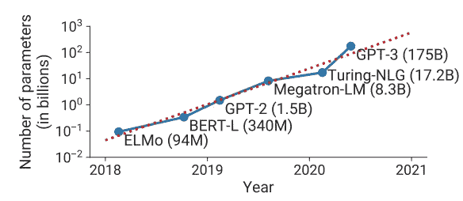

“最先进的自然语言处理（NLP）模型的规模随时间的变化趋势。这些模型的训练所需的浮点运算数量以指数级速度增长。” 来源：[这里](https://arxiv.org/abs/2104.04473)

此外，大型模型可以作为 [迁移学习](https://en.wikipedia.org/wiki/Transfer_learning) 和微调的基础，因此对开发性能越来越高的模型充满兴趣。尽管 LMs 在许多任务中取得了成功，但仍有许多其他任务需要能够进行图像分析的模型。

截至 2016 年，[transformer](https://en.wikipedia.org/wiki/Transformer_(machine_learning_model))是首选架构，而[自注意力](https://en.wikipedia.org/wiki/Attention_(machine_learning))的使用显示了明显的优势。因此，多个团队训练了能够处理图像的变换器模型（视觉变换器，ViT）。**到目前为止，最宽的 ViT 只有 15 B 参数。为什么？**

在一项新研究中，谷歌成功训练了一个 22 B 参数的模型，并理解了为何在扩展 ViTs 时存在困难。

**总结：**

+   他们解释了为何传统的 ViTs 训练方法在扩展时会产生不稳定性。

+   如何修改架构以进行扩展，以及模型如何达到最新水平。

+   如何在扩展模型时提高公平性

# **什么是视觉变换器？**

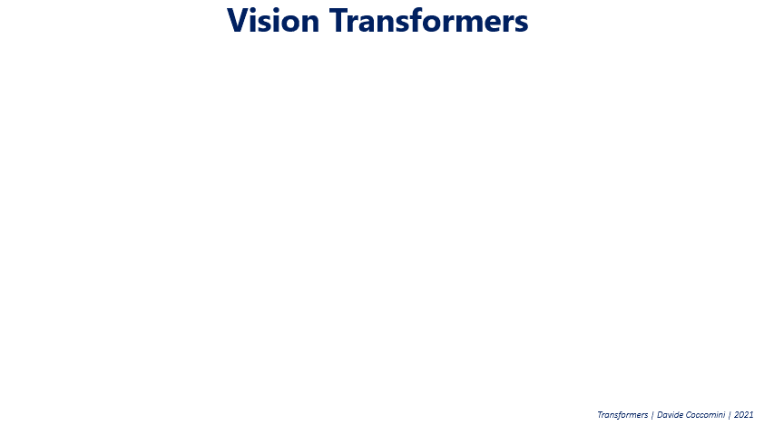

图片来自维基百科 ([source](https://en.wikipedia.org/wiki/Vision_transformer))

变换器当然是排列不变的，但它们不能处理网格结构的数据（只能处理序列）。因此，为了将变换器与图像一起使用，我们必须找到将它们转换为序列的方法。**怎么做？**

第一步是将图像转换为一系列的图块（图像被分成一系列称为图块的碎片）。这些图块基本上是我们的令牌（就像经典变换器中的单词）。这些图像随后被展平并转换为低维嵌入（这保留了信息但减少了维度）。此外，和原始变换器一样，我们使用位置编码，以便模型知道图块在图像中的位置。

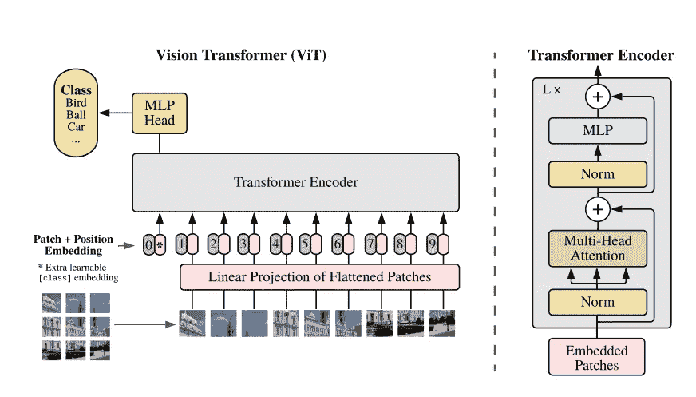

描述 ViT 的原始文章 ([arXiv prepint](https://arxiv.org/pdf/2010.11929.pdf))

模型随后在监督学习中进行训练（我们有图像标签的大型数据集），然后可以用于下游任务。

 [## 视觉变换器的视觉旅程

### 一些最大模型如何看待世界

[pub.towardsai.net](https://pub.towardsai.net/a-visual-journey-in-what-vision-transformers-see-9db9c8ba62d4?source=post_page-----5d59ac36c1d6--------------------------------)

# 为什么难以扩展它们以及如何解决？

在 ViTs 之前，卷积网络是计算机视觉任务的标准。在“[2020 年代的 ConvNet](https://arxiv.org/abs/2201.03545)”中，作者指出这个问题仍然存在且很重要。

另一方面，我们还未能扩展 ViTs。由于在变换器中，模型的扩展也会导致无法预先想象的行为的出现，这是一个严重的问题。

**作者指出，超过 80 亿参数时**，不稳定性表现为几千步后出现发散的训练损失。这是由于“注意力 logits 中的极大值导致几乎是 one-hot 的注意力权重，且熵接近零。” **为解决此问题，作者在点积前为 Queries 和 Keys 添加了层归一化。**

图中展示了这种措施如何改善训练。

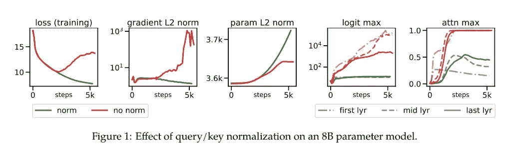

(来源: [这里](https://arxiv.org/pdf/2302.05442.pdf))

**第二种措施是修改架构。** 在经典的 transformer 中，自注意力输出后跟随一个[多层感知机](https://en.wikipedia.org/wiki/Multilayer_perceptron)（MLP）。而在这里，自注意力块与 MLP 并行。这种操作不会降低性能，同时将训练速度提高了 15%（如 PaLM 这类其他大型谷歌模型所示，该操作基本上是将矩阵乘法合并为单个操作）。

此外，注意力投影中移除了偏置项（这也减少了训练时间而不降低性能）。

图中展示了这些措施之后的新块：

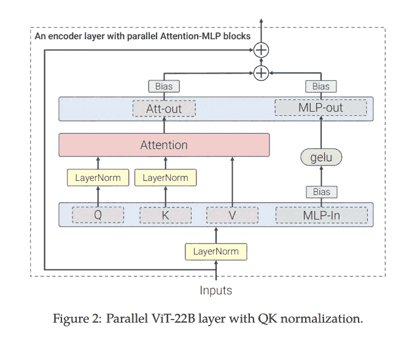

(来源: [这里](https://arxiv.org/pdf/2302.05442.pdf))

表格比较了谷歌的模型（ViT-22）与之前报告的最大 ViT 模型，ViT-G 和 ViT-e。

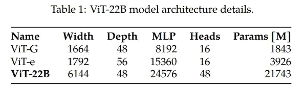

(来源: [这里](https://arxiv.org/pdf/2302.05442.pdf))

训练也已得到优化。谷歌使用了 JAX（谷歌在某段时间内[更加专注于 JAX](https://www.businessinsider.com/facebook-pytorch-beat-google-tensorflow-jax-meta-ai-2022-6)而非 TensorFlow）。他们还使用了一些技巧（异步并行线性操作、参数分片）以确保模型优化适用于[TPU](https://en.wikipedia.org/wiki/Tensor_Processing_Unit)。

作者使用了大约 40 亿张图像的数据集，这些图像半自动标注了 30,000 个类别。温馨提示，在 ViT 中，图像被划分为若干部分（称为补丁），然后与位置编码一起转化为序列。每张图像（224 x 224）被划分为 14 x 14 个补丁。因此，一张图像最终由 256 个标记表示。

# 扩展 ViT 是否值得？

模型训练完成后，他们在[ImageNet](https://www.image-net.org/)（100 万图像和 1000 类）上进行了测试，以检验其分类能力。作者表明，冻结模型（即无需微调）的性能与其他模型相当。

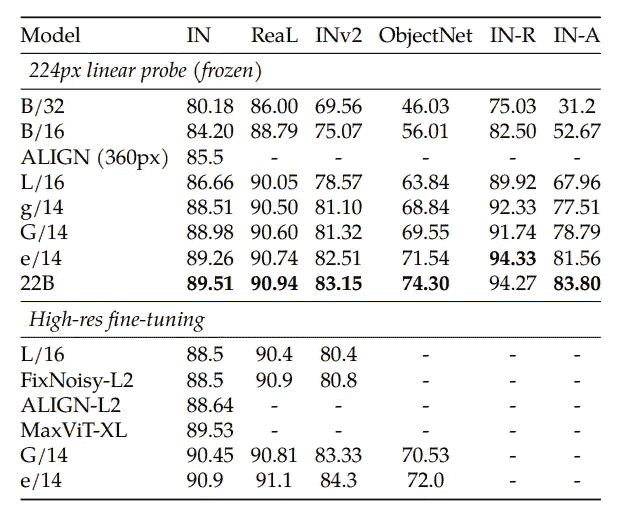

(来源: [这里](https://arxiv.org/pdf/2302.05442.pdf))

此外，该模型已在不同图像分辨率的另一数据集上进行了测试。**ViT-22B 在输入尺寸较小时，显著提高了准确性。**

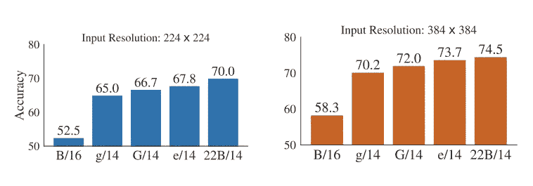

（来源：[这里](https://arxiv.org/pdf/2302.05442.pdf)）

另一方面，大型模型的一个最常见的用途是迁移学习。毕竟，人们通常使用小数据集，并利用大型模型进行微调，用于与训练任务不同的任务。正如作者所说：

> 对于密集预测，迁移学习至关重要，特别是因为获得像素级标签可能很昂贵。在本节中，我们研究了 ViT-22B 模型（使用图像级分类目标进行训练）在语义分割和单目深度估计任务中捕捉的几何和空间信息的质量。 （来源：[这里](https://arxiv.org/pdf/2302.05442.pdf)）

作者使用了三个语义分割基准数据集（ADEK20k、Pascal Context、Pascal VOC）对模型进行了测试。不仅如此，他们还使用了有限的数据量进行迁移测试。

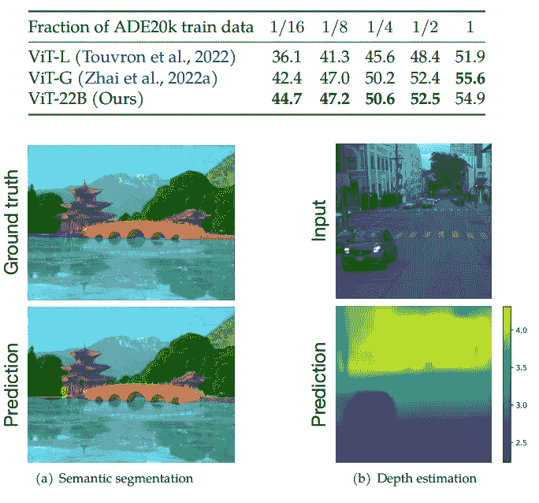

“在 ADE20k 上进行少样本语义分割，仅使用了训练集的一部分。我们报告了验证集上的语义分割平均 IoU” （来源：[这里](https://arxiv.org/pdf/2302.05442.pdf)）

当数据较少时，ViT-22 表现最佳，这非常有用，因为获取图像及其分割掩码通常很昂贵，因此比其他模型需要的样本更少。

此外，该模型在 Waymo Open 数据集上显示出了卓越的单目深度估计能力。

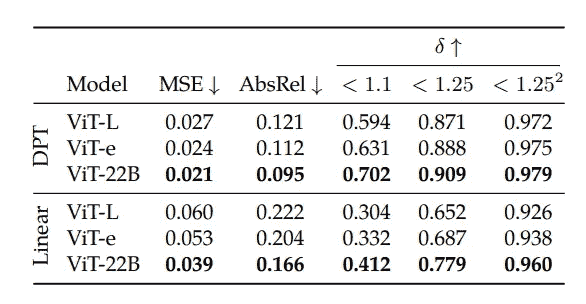

使用不同解码器对 Waymo Open 数据集中的冻结 ViT 特征进行单目深度估计。 （来源：[这里](https://arxiv.org/pdf/2302.05442.pdf)）

此外，通过重新利用模型（但保留预训练的 ViT-22 作为组件），可以将其用于视频分类。**这展示了模型在各种可能任务中的灵活性。**

此外，作者展示了微调能够提升性能：

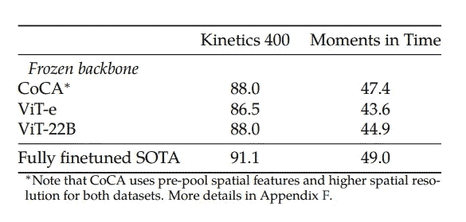

视频分类结果。我们通过冻结骨干网络来评估 ViT-22B 的表示，并训练一个小型变换器来汇聚冻结的逐帧表示。ViT-22B 的表现超越了包含 40 亿参数的最大前视图骨干网络 ViT-e。 （来源：[这里](https://arxiv.org/pdf/2302.05442.pdf)）

# 这个模型的公平性如何？

人工智能模型容易受到意外偏见的影响。这些偏见许多存在于训练数据集中，模型可以放大这些偏见，学习虚假的关联和错误的差异。**由于预训练模型随后被用于后续任务，错误会被带到新的任务中。**

作者认为，扩大模型规模可以帮助缓解这些偏见，并决定通过使用人口统计平等（DP）作为公平性的衡量标准来进行测试。

作者解释了他们的方法：

> 我们使用 CelebA（Liu 等，2015）中的二元性别作为敏感属性，而目标是“吸引人”或“微笑”。我们强调，这种实验仅用于验证技术声明，绝不应被解释为对这种视觉相关任务的支持。我们选择后者属性，因为它们如图 15 所示展现了与性别相关的偏差。（来源：[here](https://arxiv.org/pdf/2302.05442.pdf)）

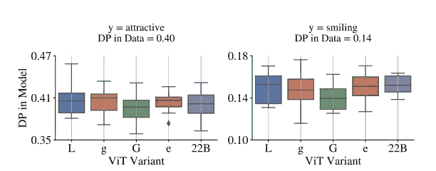

“模型中的 DP 通常反映了数据中的 DP，除非采取偏见缓解措施。在此图中，二元性别是敏感属性，线性头被训练用于预测 CelebA 中的其他属性，使用预训练特征。”（来源：[here](https://arxiv.org/pdf/2302.05442.pdf)）

如文献所述，扩展模型提供了更有利的权衡（“性能随着规模的增加而改善，前提是任何规定的偏见约束水平”）。其次，所有子组都受益于这种改善，并且扩展减少了子组之间的性能差距。

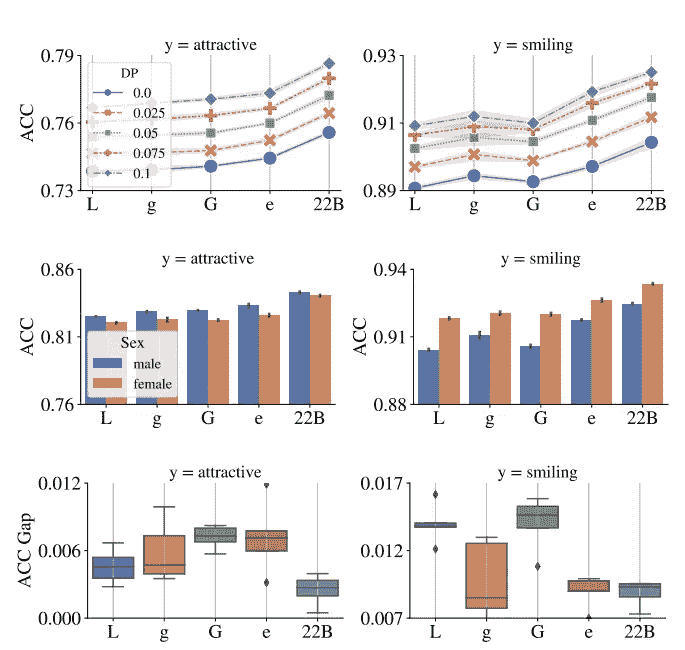

“上图：在每个 DP 水平上，ViT 变体去偏倚后的准确率（ACC）。中图：去偏倚前 CelebA 中每个子组的准确率。下图：y 轴是两个子组（女性和男性）之间的性能绝对差异。与较小的 ViT 架构相比，ViT-22B 提供了更公平的性能。”（来源：[here](https://arxiv.org/pdf/2302.05442.pdf)）

# 模型看到什么？

如前所述，计算机视觉模型主要关注纹理，而人类则更多依赖于形状。

> 人类的形状偏差为 96% / 纹理偏差为 4%，而 ViT-22B-384 实现了前所未见的 87%形状偏差 / 13%纹理偏差。（来源：[here](https://arxiv.org/pdf/2302.05442.pdf)）

这个结果非常有趣，因为大多数模型的形状偏差为 20-30% 和纹理偏差为 70-80%（卷积网络也如此）。这种偏差也是为什么通过改变图像的纹理，即使形状可识别，模型也可能被欺骗，错误解读和标记图像的原因之一。

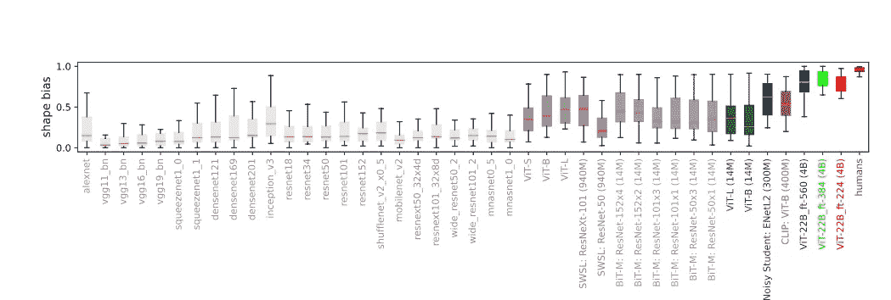

“形状偏差：许多视觉模型具有低形状/高纹理偏差，而在 ImageNet 上微调的 ViT-22B（如模型名称后的括号所示，红色、绿色、蓝色训练于 40 亿张图像，除非仅在 ImageNet 上训练）拥有迄今为止记录的最高形状偏差，使其更接近于人类的形状偏差。”（来源：[here](https://arxiv.org/pdf/2302.05442.pdf)）

此外，理解模型所见的另一种方法是获取显著性图（基于梯度的特征归因方法）。

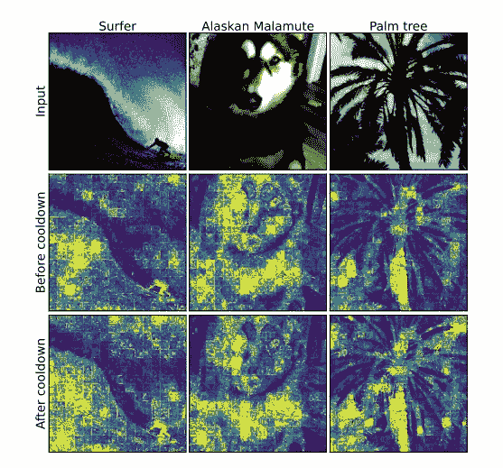

模型冷却前后的显著性（来源：[here](https://arxiv.org/pdf/2302.05442.pdf)）

# 结论

Google 推出了一款比之前的 ViT 模型大 5 倍以上的模型。

> 我们展示了 ViT-22B，这是一种当前最大规模的视觉变换器模型，具有 220 亿个参数。我们展示了通过对原始架构进行小但关键的修改，我们可以实现优秀的硬件利用率和训练稳定性，从而获得一个在多个基准测试中推动 SOTA 的模型。（来源：[这里](https://arxiv.org/pdf/2302.05442.pdf)）

除了模型的规模和基准测试结果之外，这一模型也是更大模型的起点。事实上，在此之前，成功地扩展 ViT 模型很困难，因为训练期间的不稳定性。作者们展示了通过修改架构可以解决这些问题。

大模型可以用作不同任务的预训练支架（计算机视觉模型可以用于许多现实世界的任务）。此外，[意外行为出现](https://arxiv.org/pdf/2206.07682.pdf)（这些行为在小模型中不存在，且无法通过缩放法则预测）。而且，正如所示，这些模型随后可以整合到多模态模型中（并且[可能影响其中的突现行为](https://twitter.com/YiTayML/status/1625205983239880704?s=20&t=_W_AqpJHeJgJ_Af32Av5Jw)）。

此外，ViT-22B 显示了在公平性方面的改进。这一模型也更加稳健，更符合人类视觉（不那么依赖纹理，更依赖形状）。

**我们很可能很快会看到更大的 ViTs（单独使用或作为多模态模型的组成部分）。你对此有何看法？**

# 如果你觉得这很有趣：

你可以查看我的其他文章，也可以[**订阅**](https://salvatore-raieli.medium.com/subscribe)以便在我发布文章时获得通知，你还可以通过[**LinkedIn**](https://www.linkedin.com/in/salvatore-raieli/)**与我联系**。

这是我 GitHub 存储库的链接，我计划在这里收集与机器学习、人工智能以及更多相关的代码和资源。

 [## GitHub - SalvatoreRa/tutorial: 机器学习、人工智能、数据科学的教程…

### 关于机器学习、人工智能、数据科学的教程，包含数学解释和可重用的代码（使用 Python…）

github.com](https://github.com/SalvatoreRa/tutorial?source=post_page-----5d59ac36c1d6--------------------------------)

或者你可能对我最近的一篇文章感兴趣：

 [## 微软 BioGPT：迈向生命科学的 ChatGPT？

### BioGPT 在不同的生物医学 NLP 任务中达到了 SOTA。

[SparseGPT：参数更少更好？](https://levelup.gitconnected.com/sparsegpt-fewer-parameters-is-better-7b47ad60ac00?source=post_page-----5d59ac36c1d6--------------------------------)

### 如何摆脱 1000 亿参数，并在一个 GPU 上愉快地进行推理

[关于 ChatGPT 你需要知道的一切](https://medium.com/data-driven-fiction/everything-but-everything-you-need-to-know-about-chatgpt-546af7153ee2?source=post_page-----5d59ac36c1d6--------------------------------)

### 已知的内容、最新消息、影响和变化，都在一篇文章中

[RazzAIe 奖 2022：年度最差 AI 是哪些？](https://medium.datadriveninvestor.com/razzaie-awards-2022-what-are-the-worst-ai-of-the-year-a2596c566218?source=post_page-----5d59ac36c1d6--------------------------------)

### 年度最差模型是什么？出了什么问题？

[年度最差模型有哪些？出了什么问题？](https://medium.datadriveninvestor.com/razzaie-awards-2022-what-are-the-worst-ai-of-the-year-a2596c566218?source=post_page-----5d59ac36c1d6--------------------------------)
