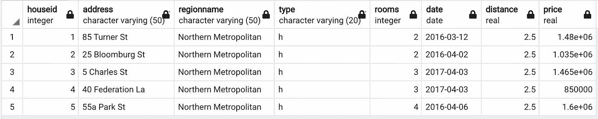

# 为什么你需要使用 SQL 分组集来汇总数据？

> 原文：[`towardsdatascience.com/why-do-you-need-to-use-sql-grouping-sets-for-aggregating-data-3d172ff5c088?source=collection_archive---------6-----------------------#2023-04-20`](https://towardsdatascience.com/why-do-you-need-to-use-sql-grouping-sets-for-aggregating-data-3d172ff5c088?source=collection_archive---------6-----------------------#2023-04-20)

## 效率、可读性和可扩展性

 [Soner Yıldırım](https://sonery.medium.com/?source=post_page-----3d172ff5c088--------------------------------)

·

[关注](https://medium.com/m/signin?actionUrl=https%3A%2F%2Fmedium.com%2F_%2Fsubscribe%2Fuser%2F2cf6b549448&operation=register&redirect=https%3A%2F%2Ftowardsdatascience.com%2Fwhy-do-you-need-to-use-sql-grouping-sets-for-aggregating-data-3d172ff5c088&user=Soner+Y%C4%B1ld%C4%B1r%C4%B1m&userId=2cf6b549448&source=post_page-2cf6b549448----3d172ff5c088---------------------post_header-----------) 发表于 [Towards Data Science](https://towardsdatascience.com/?source=post_page-----3d172ff5c088--------------------------------) ·4 分钟阅读·2023 年 4 月 20 日

--

图片由 [Helena Lopes](https://unsplash.com/@wildlittlethingsphoto?utm_source=unsplash&utm_medium=referral&utm_content=creditCopyText) 提供，来自 [Unsplash](https://unsplash.com/photos/PGnqT0rXWLs?utm_source=unsplash&utm_medium=referral&utm_content=creditCopyText)

尽管它被称为查询语言，但 SQL 不仅能查询数据库，还能进行高效的数据分析和操作。SQL 能够被数据科学社区接受也就不足为奇了。

在本文中，我们将学习一个非常实用的 SQL 功能，它可以使查询更清晰、更高效。这个我真希望早知道的功能是`GROUPING SETS`，可以被视为`GROUP BY`函数的扩展。

我们将学习它们之间的区别以及使用`GROUPING SETS`相对于`GROUP BY`函数的优势，但首先，我们需要一个数据集来进行操作。

我创建了一个来自[Kaggle 上的墨尔本住房数据集](https://www.kaggle.com/datasets/mithesh/melbournehousingdataset)的 SQL 表，该数据集拥有公共领域许可证。表的前 5 行如下所示：

（图片由作者提供）

## `GROUP BY`函数

我们可以使用这个函数来计算每组的汇总值或某一列或多列中的不同值。例如，以下查询返回平均值…
