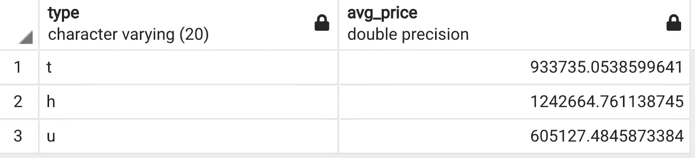
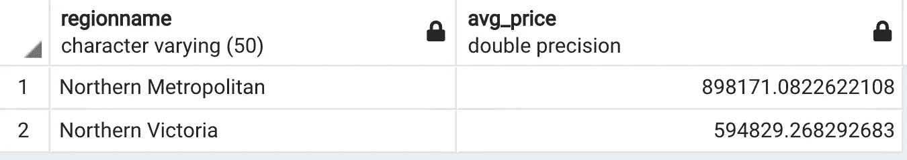
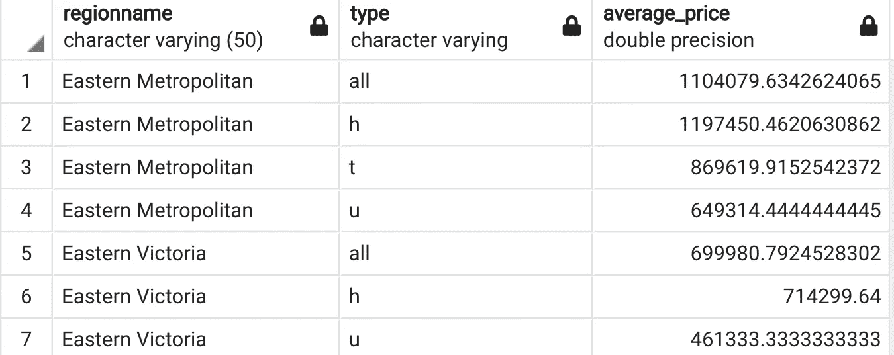
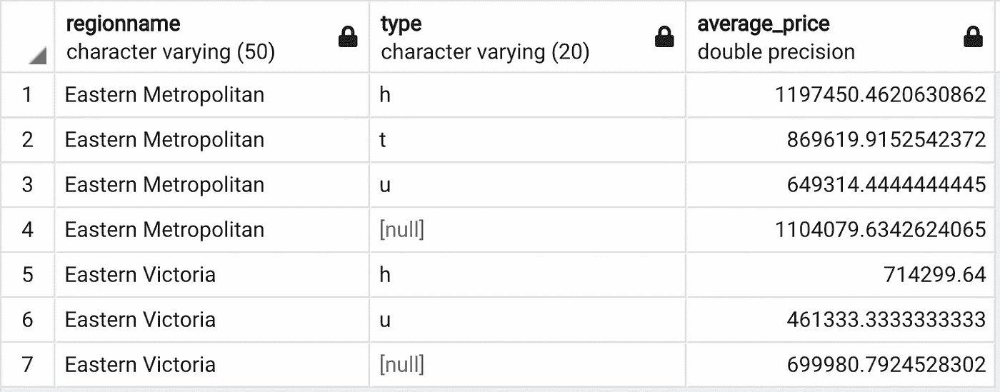

# 为什么你需要使用 SQL 分组集来汇总数据？

> 原文：[`towardsdatascience.com/why-do-you-need-to-use-sql-grouping-sets-for-aggregating-data-3d172ff5c088`](https://towardsdatascience.com/why-do-you-need-to-use-sql-grouping-sets-for-aggregating-data-3d172ff5c088)

## 效率、可读性和可扩展性

[](https://sonery.medium.com/?source=post_page-----3d172ff5c088--------------------------------)[](https://towardsdatascience.com/?source=post_page-----3d172ff5c088--------------------------------) [Soner Yıldırım](https://sonery.medium.com/?source=post_page-----3d172ff5c088--------------------------------)

·发表于 [Towards Data Science](https://towardsdatascience.com/?source=post_page-----3d172ff5c088--------------------------------) ·阅读时间 4 分钟·2023 年 4 月 20 日

--


由 [Helena Lopes](https://unsplash.com/@wildlittlethingsphoto?utm_source=unsplash&utm_medium=referral&utm_content=creditCopyText) 提供的照片，来源于 [Unsplash](https://unsplash.com/photos/PGnqT0rXWLs?utm_source=unsplash&utm_medium=referral&utm_content=creditCopyText)

尽管 SQL 被称为查询语言，但它不仅可以查询数据库，还能进行高效的数据分析和处理。SQL 被数据科学界广泛接受也就不足为奇了。

在本文中，我们将了解一个非常实用的 SQL 特性，它允许我们编写更简洁、更高效的查询。这个希望早点知道的特性就是 `GROUPING SETS`，它可以看作是 `GROUP BY` 函数的扩展。

我们将学习它们之间的区别以及使用 `GROUPING SETS` 相比于 `GROUP BY` 函数的优势，但首先我们需要一个数据集来进行操作。

我从 Kaggle 上提供的 [墨尔本住房数据集](https://www.kaggle.com/datasets/mithesh/melbournehousingdataset) 创建了一个 SQL 表，该数据集拥有公共领域许可证。表的前 5 行如下所示：


(image by author)

## `GROUP BY` 函数

我们可以使用该函数来计算每组的聚合值或列中、多个列中的不同值。例如，以下查询返回每种列表类型的平均价格。

```py
SELECT 
   type,
   AVG(price) AS avg_price
FROM melb
GROUP BY type
```

这个查询的输出是：



(image by author)

## 多重分组

假设你想查看北部地区每个区域的平均价格，这可以通过使用 `GROUP BY` 函数实现：

```py
SELECT 
   regionname,
   AVG(price) AS avg_price
FROM melb
WHERE regionname LIKE 'Northern%'
GROUP BY regionname
```

输出：



(image by author)

考虑一个情况，你想在同一表格中查看这两个地区不同房屋类型的平均价格。你可以通过编写两个分组查询并使用`UNION ALL`来结合结果来实现这一点。

```py
SELECT 
   regionname,
   'all' AS type,
   AVG(price) AS average_price
FROM melb
WHERE regionname LIKE 'Eastern%'
GROUP BY regionname
UNION ALL
SELECT 
   regionname,
   type,
   AVG(price) AS average_price
FROM melb
WHERE regionname LIKE 'Eastern%'
GROUP BY regionname, type
ORDER BY regionname, type
```

查询的作用是先计算每个地区的平均价格。然后，在一个单独的查询中，它按地区名称和类型对行进行分组，并计算每个组的平均价格。联合操作将这两个查询的结果结合起来。

由于第一个查询没有类型列，我们手动创建了一个值为“all”的类型列。最后，结合结果按地区名称和类型排序。

这个查询的输出：



（作者提供的图片）

每个地区的第一行显示该地区的平均值，接下来的行显示不同房屋类型的平均价格。

我们不得不写两个独立的查询，因为在`GROUP BY`语句中不能有不同的查询，除非我们使用`GROUPING SETS`。

## GROUPING SETS

让我们用`GROUPING SETS`重写之前的查询。

```py
SELECT 
   regionname,
   type,
   AVG(price) as average_price
FROM melb
WHERE regionname LIKE 'Eastern%'
GROUP BY 
   GROUPING SETS (
     (regionname),
     (regionname, type)
   )
ORDER BY regionname, type
```

输出：



（作者提供的图片）

输出结果相同，只是类型列中的空值可以很容易地替换为“all”。

使用`GROUPING SETS`有两个主要优点：

+   它更简洁、更直观，使代码更容易调试和管理。

+   它比写独立查询并结合结果更高效，因为 SQL 会扫描每个查询的表。

## 最后的想法

我们常常忽视查询的可读性和效率。只要查询返回了所需的数据，我们就会感到满意。

效率是我们始终需要牢记的。写出不良查询的影响可能在查询小型数据库时可以容忍。然而，当数据量变大时，不良查询可能会导致严重的性能问题。为了使 ETL 过程可扩展且易于管理，我们需要采用最佳实践。`GROUPING SETS`就是这些最佳实践之一。

*你可以成为一个* [*Medium 会员*](https://sonery.medium.com/membership) *以解锁我所有的写作内容，以及 Medium 的其他内容。如果你已经是会员，请不要忘记* [*订阅*](https://sonery.medium.com/subscribe) *以便在我发布新文章时收到邮件通知。*

感谢阅读。如果你有任何反馈，请告知我。
