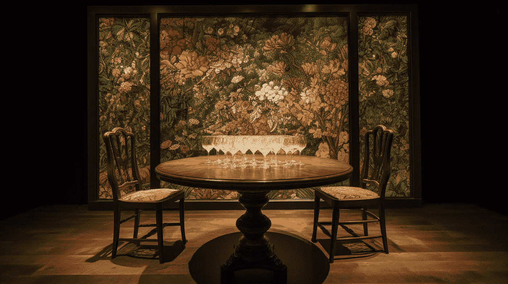
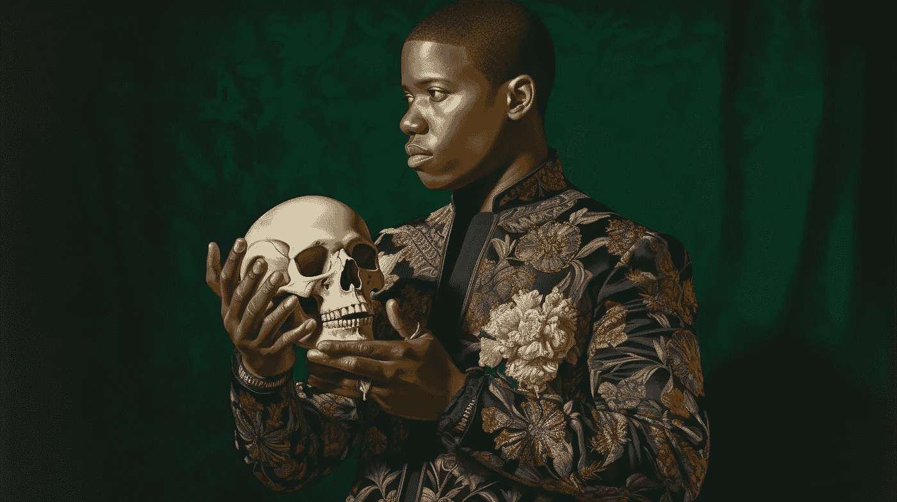

# 为什么假设检验应该从《哈姆雷特》中汲取灵感

> 原文：[`towardsdatascience.com/why-hypothesis-testing-should-take-a-cue-from-hamlet-1e714733cec3`](https://towardsdatascience.com/why-hypothesis-testing-should-take-a-cue-from-hamlet-1e714733cec3)

## 统计思维

## 模拟还是不模拟，这是个问题

 [Cassie Kozyrkov](https://kozyrkov.medium.com/?source=post_page-----1e714733cec3--------------------------------)

·发表于[Towards Data Science](https://towardsdatascience.com/?source=post_page-----1e714733cec3--------------------------------) ·5 分钟阅读·2023 年 6 月 26 日

--

如果你是一个[科学家](http://bit.ly/quaesita_scientists)或[数据专业人士](http://bit.ly/quaesita_universe)，很可能你的[假设检验程序](http://bit.ly/quaesita_donttrust)缺少一个至关重要的步骤，这在你的常规课程中悲剧般——还是悲喜剧般？——被遗漏了。不要担心，在这篇博客文章中，我会向你展示缺失的部分，以及为什么你会在演员的剧本中找到解决方案。

《哈姆雷特》由 Kehinde Wiley 风格生成，由作者使用[Midjourney](http://bit.ly/quaesita_countries)创建。

*(注意：本文中的链接会带你到同一作者的解释文章。)*

# 第一幕，第一场

场景开始于你得意洋洋地获得预算以[去收集实际数据](http://bit.ly/quaesita_srstrees2)。也许一切都是数字化的；你正准备告诉你的工程团队应该记录哪些[变量](http://bit.ly/quaesita_gistlist)或运行哪些在线[实验](http://bit.ly/quaesita_ab)。或者你可能要走向现实世界，设置一些传感器、准备一些移液管，或者做其他任何获取数据的工作。（对从现实世界中获取测量的实际操作感到好奇？查看我关于[取样树木](http://bit.ly/quaesita_srstrees1)的文章。）

不要急！如果你不知道自己在做什么怎么办？搞砸数据收集过程的实际部分是非常尴尬的，更不用说这是对你团队宝贵时间的巨大浪费了。即使一切都是数字化的，你也确实不希望带着尾巴回到你的工程团队那里请求重做。

但你怎么能确保你以正确的方式记录了正确的内容呢？有没有技巧？幸运的是，有！而这个技巧在事后看来是如此明显……这也许就是为什么你的教授忘记教给你的原因。

技巧是借鉴戏剧演员的经验！

戏剧舞台上的酒杯，风格类似于 Kehinde Wiley，由作者使用 Midjourney 生成。

如果演员在首演前对表现不佳感到紧张，他们会做什么？（不是喝酒。）

他们会排练！

好吧，你也可以进行排练。在收集任何数据之前，设立一个除观众之外的彩排。嗯，观众？我是说，*除了真实世界的数据*。

# 彩排

在[数据科学](http://bit.ly/quaesita_datasci)中，彩排涉及制作一个虚假的但可信的数据集。我们称之为***模拟***。

如果你不熟悉模拟虚假的但可信的数据的概念，可以查看[这篇博客文章](http://bit.ly/quaesita_sims)，我会切换到演示模式而不是讲解模式。你将在那里看到基于代码和电子表格的示例。形成了模拟的心理图像后，可以继续阅读这里的内容。

当你模拟你的彩排数据时，确保设计一个你可以控制的清晰故事。尝试设置模拟参数，建立一个你希望采取某种行动的小玩具世界，然后生成这些数据并尝试分析它。确保在分析结束时你能恢复正确的决策。如果不能，那对你的统计计划来说是一个很糟糕的信号！

如果你知道正确的结论是什么（在一个*你*创建的规则的世界里你总是知道），而你的方法没有给出这个结论，你可能使用了一个不好的方法，或者数据不足。尽早获取这些警告信号总是更好。

也许更重要的是，你经常会发现你希望自己在[最初](http://bit.ly/quaesita_gigo)就设置好数据。分析假数据时，你会想，*“要是我有这一额外的列，一切都会更好……”*

好吧，***现在***是弄清楚这一点并扼杀[GIGO](http://bit.ly/quaesita_gigo)的最佳时机，而不是在你收集了真实数据之后。太昂贵且耗时！

# 不要浪费你的机会

即使你的数据集是完美的，你提出的方法可能也不是最合适的。不幸的是，除非你在做一些相当复杂的事情，否则你应该知道，你只能使用真实的测试数据集一次。所以只有一次机会——你不能像[训练机器学习模型](http://bit.ly/mfml_054)那样尝试不同的方法。统计推断是一项残酷的认识论事业，它对你的感受毫不在意：只有一次机会。不允许数据重复使用。

重用测试数据是你能犯的[最大罪恶之一](http://bit.ly/quaesita_sydd)，而你的知识不足的同行经常犯这种错误，[这并不意味着它是无害的](http://bit.ly/mfml_076)。

不要在你珍贵的最终数据集中胡乱选择方法。你只有一次机会，不要浪费。

如果你想尝试不同的方法以查看它们是否适合你的测试数据，你需要一个具有相同结构的单独数据集。如果你已经有了大量数据，你可以[将其拆分](http://bit.ly/quaesita_sydd)。如果你还没有数据，你需要模拟一些虚假的数据以便规划你的方法论。不要在你珍贵的最终数据集中胡乱选择方法。你只有一次机会，不要浪费。

这就是为什么在开始获取数据之前使用模拟是一个如此有用的技巧，完全抄袭自彩排概念。

> 是否进行模拟，这就是问题所在：
> 
> 是否在心中忍受更高尚
> 
> 骄人的命运的弹弓和箭矢，
> 
> 还是抵抗一片麻烦的海洋
> 
> 通过对抗来结束它们。

感谢所有的手指，Midjourney。❤

# 感谢阅读！

如果你想表示感谢，我很感激分享和[转发](https://twitter.com/quaesita/status/1258809215038246912)。如果你想阅读更多我的写作，文章中的大多数链接会带你到我的其他随笔。

# 怎么样，来一门课程？

如果你在这里玩得开心，并且正在寻找一个有趣的、以领导力为导向的课程，旨在让 AI 初学者和专家都感到愉快，[这是我为你准备的小礼物](https://bit.ly/funaicourse)：

课程链接：[`bit.ly/funaicourse`](https://bit.ly/funaicourse)

更愿意磨练你的决策技能，而不是建立你的 AI 实力？你可以通过这个[链接学习我的免费课程：](https://bit.ly/decisioncourse)

 [## 你生活的方向盘——决策智能视频教程 | LinkedIn Learning…

### 决策能力是你可以学习的最宝贵的技能。你的人生归结为两件事：你的生活质量和你的…

bit.ly](https://bit.ly/decisioncourse?source=post_page-----1e714733cec3--------------------------------)

*附言：你曾经尝试过在 Medium 上多次点击鼓掌按钮，看看会发生什么吗？* ❤️

# 喜欢作者吗？与 Cassie Kozyrkov 联系

成为朋友吧！你可以在 [Twitter](https://twitter.com/quaesita)、[YouTube](https://www.youtube.com/channel/UCbOX--VOebPe-MMRkatFRxw)、[Substack](http://decision.substack.com) 和 [LinkedIn](https://www.linkedin.com/in/kozyrkov/) 找到我。想让我在你的活动中发言？请使用 [这个表单](http://bit.ly/makecassietalk) 与我联系。

 [## 加入 Medium

### 阅读 Cassie Kozyrkov 的每一篇故事（以及 Medium 上成千上万其他作者的作品）。你的会员费直接支持…

kozyrkov.medium.com](https://kozyrkov.medium.com/membership?source=post_page-----1e714733cec3--------------------------------)
