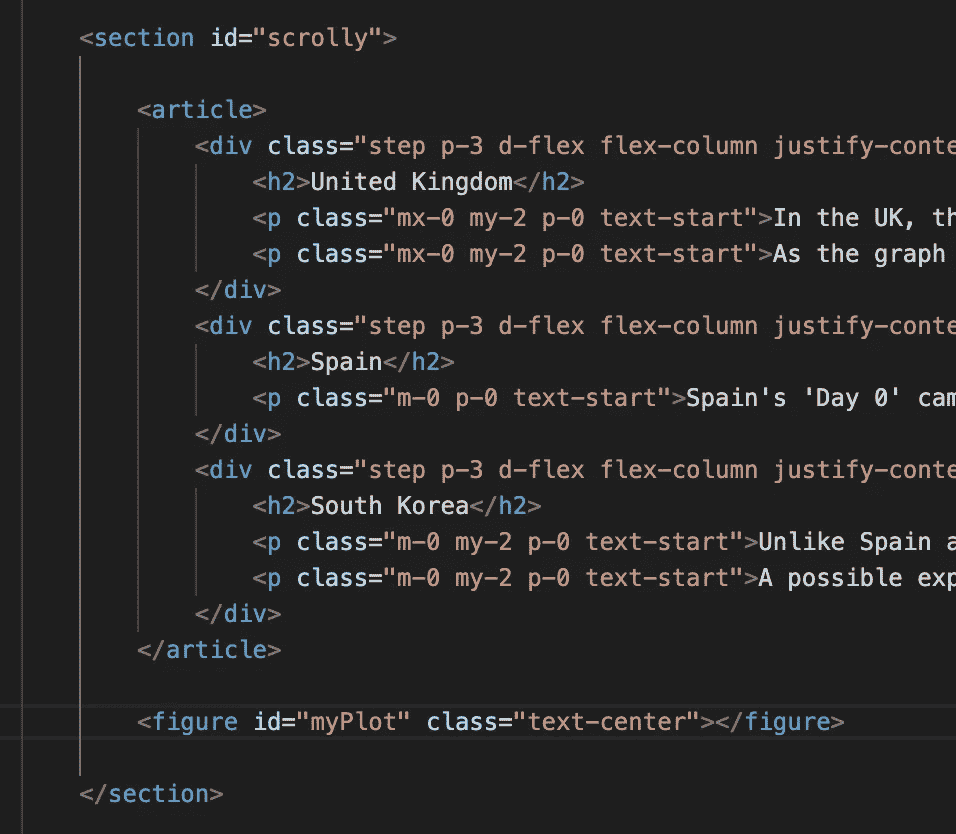

# 为什么我作为数据科学家要学习 JavaScript

> 原文：[`towardsdatascience.com/why-im-learning-javascript-as-a-data-scientist-e2b87bcdac03`](https://towardsdatascience.com/why-im-learning-javascript-as-a-data-scientist-e2b87bcdac03)

## 以及为什么感觉我在转向黑暗面

 [Matt Chapman](https://medium.com/@mattchapmanmsc?source=post_page-----e2b87bcdac03--------------------------------)

·发布于 [Towards Data Science](https://towardsdatascience.com/?source=post_page-----e2b87bcdac03--------------------------------) ·6 分钟阅读·2023 年 11 月 4 日

--

这有点像我的 JavaScript 代码。图片由 [Towfiqu barbhuiya](https://unsplash.com/@towfiqu999999) 在 [Unsplash](https://unsplash.com/photos/a-pile-of-plastic-letters-and-numbers-on-a-pink-and-blue-background-5u6bz2tYhX8) 提供

现在是 2023 年，Python 的公众热度无法再高了。

我们已经有 Python 脚本 [在火星上运行](https://discuss.python.org/t/python-is-running-on-mars/8312)，以及 pandas DataFrames 随意帮助 [解决 NHS 危机](https://digital.nhs.uk/services/secure-data-environment-service/log-in/user-guides/using-databricks-in-sde)。

但如果我告诉你 Python 并不是数据科学中唯一有用的语言呢？

（我也不是在说 R 或 Julia）。

在 Python 原教旨主义者拿起火把和叉子之前，请听我说。

在过去几个月里，我一直在探索 JavaScript 的魔力，在这篇文章中，我将给出两个理由，说明我为什么要投资 JavaScript，以及为什么我觉得自己在使用它时像是在与黑暗面调情。

# 原因 #1: 我想用 D3.js 构建酷炫的可视化

你听说过 D3.js 吗？

这是一种用于构建定制数据可视化的 JavaScript 库。当我说“定制”时，我指的是 *花里胡哨的，我可能会开始翩翩起舞* 的可视化。

我最喜欢的使用场景是 **scrollytelling**。

> Scrollytelling，一个将“滚动”和“讲故事”结合起来的术语，是一种动态讲述多媒体故事的方式，这些故事随着你的滚动而展开—— [G2](https://learn.g2.com/scrollytelling)

使用像 D3.js 和 Scrollama.js 这样的库，你可以在用户滚动网页时让数据/图表动起来。

这是一个我使用 Google 的 [Covid-19 社区流动报告](https://www.google.com/covid19/mobility/index.html?hl=en) 公共数据构建的例子：

在视觉上，我认为滚动条是一种了不起的叙事媒介。我喜欢能够将读者的注意力集中在可视化的特定部分，并将他们沉浸在我讲述的故事中的想法。这肯定比我那令人厌烦的橙色和绿色 `matplotlib` 条形图要好得多。

D3.js 的附加好处是你可以构建可以直接部署到网站上的可视化。如果你使用像 matplotlib/ggplot2 这样的包或像 Power BI/Tableau 这样的软件来构建可视化，你就依赖于使用其他工具将你的可视化放到线上。这并不是坏事（D3.js 的学习曲线比这些工具陡峭得多），但它确实限制了你对可视化的操作。

D3 可视化没有这个问题；它们是完全可定制的，可以以你喜欢的方式嵌入网页。例如，我上面的滚动条中的图表是通过一个简单的 `figure` HTML 标签 (`id="myPlot"`) 调用并嵌入到常规网页中的。

图片由作者提供

如果你有兴趣学习如何构建像这样的滚动叙事作品，我建议你查看 freeCodeCamp.org 的免费 D3.js [课程](https://www.freecodecamp.org/learn/data-visualization/) 和 Russell Goldenberg 的 Scrollama.js [仓库](https://github.com/russellsamora/scrollama)。为了获得灵感，我还强烈推荐查看 [这个](https://benjerry.heshlindsdataviz.com) 由 Heshan Eissa 和 Lindsey Poulter 制作的不可思议的 Ben 和 Jerry 的主题滚动条。

# 理由 #2：我想成为一名“全栈数据科学家”

图片由作者提供

在数据科学领域工作的一件奇怪的事情是，你经常是机器中的一个小齿轮。你在组织中扮演着重要的角色，但这是一个高度专业化的角色，你非常依赖其他团队来使你的工作变得“可操作”。

我什么意思呢？你可能需要：

1\. 数据工程师为你获取原始数据，

2\. ML 工程师将你的模型投入生产，并

3\. 软件工程师将这些模型的输出嵌入到面向客户的产品中。

这些依赖关系并没有错，但它们可能会创建令人烦恼的瓶颈，因此，许多公司已经开始招聘“全栈数据科学家”。

你问那是什么？这是 [Shopify](https://shopify.engineering/what-is-a-full-stack-data-scientist) 工程团队的观点：

> […] 全栈数据科学家的范围涵盖从头到尾的数据科学项目，包括：
> 
> - 发现和分析：你如何从多个不同来源收集、研究和解释数据。这个阶段包括识别业务问题。
> 
> - 获取：将数据从各种来源移动到你的数据仓库中。
> 
> - 数据建模：使用批处理、流处理和机器学习工具转换数据的过程。

我喜欢这种思维方式，但我会批评这个定义还不够深入。根据我的经验，这听起来只是一个普通的数据科学家角色！这让我想知道，如果全栈数据科学家应该这样做，那么非全栈的数据科学家应该做什么。

不过，抛开具体定义，我喜欢作为数据科学家发展更广泛技能的精神（超越数据分析和机器学习等基本技能）。而且，或许有争议的是，我认为学习 JavaScript 是实现这一目标的绝佳方式。

为什么？因为（1）学习任何新的编程语言都会让你成为更好的程序员，（2）特别是学习 JavaScript 使你能够接触到一些作为数据科学家通常不会看到的技术栈部分。我说的是用户界面、网站、与某些 API 的交互，以及所有这些内容。通过学习 JavaScript，我积极投资于数据科学工作流上下游的技术栈部分。拥有这些知识对于理解我的工作如何融入更大的图景以及允许我构建自己的全栈项目（如[theSQLgym](https://the-sql-gym.com)）是无价的。

# 我是不是要走向黑暗面了？

作者提供的图像

当我第一次告诉一个数据科学家朋友我在学习 JavaScript 时，他们无法理解。

完全不。

他们问：“为什么要学习 JavaScript，而不是把时间花在学习更*直接*与数据科学相关的技能上，比如 Cypher 或计算机视觉？”“或者为什么不花时间提高普通的 Python 技能呢？”

说实话，我实际上不知道这个问题的完整答案。

我想学习这些东西，但我也想推动自己学习新事物，并在技术领域成为一个更全面的“万事通”。从长远来看，我认为这会让我成为一个更出色的数据科学家，但如果我说这是唯一的动机，那我就是在说谎。

我也受到智力好奇心和建立酷炫东西的愿望驱动。建造者就是要建造，对吧？

学习 JavaScript 缺乏与数据科学的即时相关性，使其感觉有点像是转向黑暗面/脱离数据科学的经典范畴。但目前，我仍抱有希望。我觉得学习 JavaScript 会有非常宝贵的收获，值得去追求。

你怎么看？

# 还有一件事—

我创建了一个免费的通讯，叫做[AI in Five](https://aiinfive.substack.com/)，每周分享关于最新 AI 新闻、编码技巧和数据科学家/分析师的职业故事的 5 个要点。没有炒作，没有“**数据是新的石油**”的废话，也没有来自 Elon 的推文（或者我现在应该说‘x-es’？）——只有实用的技巧和见解，帮助你在职业生涯中发展。

[点击这里订阅](https://aiinfive.substack.com/)，如果这对你有吸引力！谢谢阅读。

 [## 五分钟了解 AI | Matt Chapman | Substack

### 最新的新闻、职业故事和来自数据科学与人工智能领域的编程技巧，概述为 5 个要点……

aiinfive.substack.com](https://aiinfive.substack.com/?source=post_page-----e2b87bcdac03--------------------------------)
