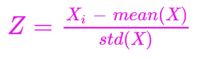
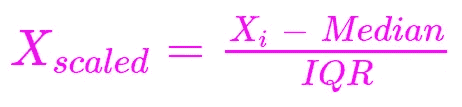

# 为什么特征缩放在机器学习中很重要？讨论 6 种特征缩放技术

> 原文：[`towardsdatascience.com/why-is-feature-scaling-important-in-machine-learning-discussing-6-feature-scaling-techniques-2773bda5be30`](https://towardsdatascience.com/why-is-feature-scaling-important-in-machine-learning-discussing-6-feature-scaling-techniques-2773bda5be30)

## 标准化、归一化、鲁棒缩放、均值归一化、最大绝对缩放和向量单位长度缩放

[](https://rukshanpramoditha.medium.com/?source=post_page-----2773bda5be30--------------------------------)[](https://towardsdatascience.com/?source=post_page-----2773bda5be30--------------------------------) [Rukshan Pramoditha](https://rukshanpramoditha.medium.com/?source=post_page-----2773bda5be30--------------------------------)

·发表于 [Towards Data Science](https://towardsdatascience.com/?source=post_page-----2773bda5be30--------------------------------) ·13 分钟阅读·2023 年 8 月 15 日

--


照片由 [Mediamodifier](https://unsplash.com/@mediamodifier?utm_source=unsplash&utm_medium=referral&utm_content=creditCopyText) 提供，来自 [Unsplash](https://unsplash.com/photos/TuZAl7v4TCM?utm_source=unsplash&utm_medium=referral&utm_content=creditCopyText)

许多机器学习算法需要特征在相同的尺度上。

我们可以在不同场景中选择不同类型的特征缩放方法。它们有不同的（技术）名称。术语***特征缩放***仅指这些方法中的任何一种。

```py
**Topics
------**
**1\. Feature scaling in different scenarios**

   a. Feature scaling in PCA
   b. Feature scaling in k-means
   c. Feature scaling in KNN and SVM
   d. Feature scaling in linear models
   e. Feature scaling in neural networks
   f. Feature scaling in the convergence
   g. Feature scaling in tree-based algorithms
   h. Feature scaling in LDA

**2\. Feature scaling methods**

   a. Standardization
   b. Min-Max Scaling (Normalization)
   c. Robust Scaling
   d. Mean Normalization
   e. Maximum Absolute Scaling
   f. Vector Unit-Length Scaling

**3\. Feature scaling and distribution of data

4\. Data leakage when feature scaling

5\. Summary of feature scaling methods**
```

# 不同场景下的特征缩放

+   **主成分分析中的特征缩放：** 在主成分分析中，如果原始特征的相对范围不同，PCA 组件对这些范围非常敏感。PCA 尝试选择能最大化数据方差的组件。如果由于某些特征的范围较大而导致方差最大化，这些特征可能会主导 PCA 过程。在这种情况下，组件可能无法捕捉真实的方差。为避免这种情况，我们通常在 PCA 之前进行特征缩放。然而，有两个例外。如果特征之间的尺度差异不显著，例如一个特征范围在 0 和 1 之间，另一个特征范围在 0 和 1.2 之间，虽然进行特征缩放不会有害，但我们不需要执行特征缩放！如果你通过分解相关矩阵而不是协方差矩阵来进行 PCA，即使特征不是在相同的尺度上测量的，也不需要进行特征缩放。

+   **k-means 聚类中的特征缩放：** k-means 聚类的主要假设之一是所有特征都在相同的尺度上进行测量。如果不是，我们应该进行特征缩放。k-means 算法计算数据点之间的距离。范围较高的特征可能主导计算，这些计算可能不准确。为避免这种情况，我们需要在 k-means 之前进行特征缩放。缩放特征还会提高 k-means 模型的训练速度。

+   **KNN 和 SVM 算法中的特征缩放：** 通常，计算数据点之间距离的算法大多受到特征相对范围的影响。KNN 和 SVM 也不例外。范围较高的特征可能会由于其范围较高而贡献更多，但并不是因为其重要性。我们不希望算法在这种方式上产生偏差。因此，我们需要缩放特征，以便它们在距离计算中贡献均等。

+   **线性模型中的特征缩放：** 线性模型如线性回归的参数值高度依赖于输入特征的尺度。因此，最好使用在相同尺度上测量的特征。这也会提高线性模型的训练速度。

+   **神经网络中的特征缩放：** 我们通常将特征缩放方法应用于输入数据。然而，也可以将特征缩放应用于神经网络中隐藏层的激活值！经过缩放的输出值随后成为下一层的输入。这被称为*批量归一化*，它能有效消除梯度消失问题和协变量偏移问题，并提高网络在训练过程中的稳定性。它还加快了神经网络模型的训练速度。

+   **算法收敛中的特征缩放：** 学习率是决定深度学习和机器学习算法收敛速度的主要因素。特征缩放也对这一点有影响！当特征在相同的尺度上进行测量时，计算可以更快地执行，算法也会更快地收敛！

+   **基于树的算法中的特征缩放：** 对于基于树的算法，不需要特征缩放，因为它们对特征的相对尺度不太敏感。流行的基于树的算法包括：决策树、随机森林、AdaBoost、梯度提升、XGBoost、LightGBM 和 CatBoost。

+   **LDA 中的特征缩放：** 线性判别分析（LDA）是一种线性降维技术，通过最大化分类数据集的类别可分离性来进行降维，而不是通过最大化数据的方差。因此，LDA 对特征的相对范围不敏感，因此不需要对 LDA 进行特征缩放。

# 特征缩放方法

## 1\. 标准化

标准化是最流行的特征缩放方法，其中我们将值居中于 0 并使标准差为 1。结果是 z-score，因此这种缩放方法也称为 z-score 标准化或归一化。应用标准化到特征后，数据的分布具有均值 0 和标准差 1。这样的分布称为标准正态分布。

要对变量应用标准化，首先，我们需要计算该变量的均值和标准差。然后，从每个值中减去均值，并将结果除以标准差。对于一组特征，这些计算是同时在特征级别上进行的。



**标准化公式**（图片由作者提供）

z-score 或标准化的输出实际上表示一个值偏离均值多少个标准差！

z-score 值不受限于某个特定范围。标准化过程不会受到数据中异常值的影响。

标准化在数据遵循高斯分布或正态分布，或分布未知时特别有用。

在 Scikit-learn 中，可以使用**StandardScaler()**函数进行标准化。

```py
from sklearn.preprocessing import StandardScaler

sc = StandardScaler()
sc.fit(data)
scaled_data = sc.transform(data)
```

调用 fit()方法时，会计算每个变量的均值和标准差。如果我们需要对数据应用缩放过程，也应调用 transform()方法。

## 2\. 最小-最大缩放（归一化）

最小-最大缩放或归一化是将数据缩放到您选择的特定范围的过程。最常用的范围是（0, 1）。

要对变量应用最小-最大缩放，首先，我们需要找到该变量的最小值和最大值。然后，我们从每个数据值中减去最小值，并将结果除以范围（最大值与最小值的差）。对于一组特征，这些计算是同时在特征级别上进行的。


**最小-最大缩放公式**（图片由作者提供）

最小-最大缩放在数据分布未知或不遵循正态分布时特别有用。

最小-最大缩放过程对数据中的异常值非常敏感。

在 Scikit-learn 中，可以使用**MinMaxScaler()**函数进行最小-最大缩放。

```py
from sklearn.preprocessing import MinMaxScaler

sc = MinMaxScaler(feature_range=(0,1))
sc.fit(data)
scaled_data = sc.transform(data)
```

调用 fit()方法时，会找到每个变量的最小值和最大值。如果我们需要对数据应用缩放过程，也应调用 transform()方法。

**MinMaxScaler()**函数还提供了更改您选择的范围的选项。默认设置为（0, 1）。

## 3\. 鲁棒缩放

鲁棒缩放也称为**分位数缩放**，其中我们根据第 1、第 2 和第 3 分位数缩放数据。第 2 分位数是中位数，如您所知。

要对变量应用鲁棒缩放，首先需要找到该变量的分位数。然后，我们从每个数据值中减去中位数（第 2 个分位数或 Q2），并将结果除以 IQR（第 3 个分位数与第 1 个分位数之间的差异）。对于一组特征，这些计算会同时在特征层面进行。


**鲁棒缩放公式**（图片由作者提供）



**鲁棒缩放替代公式**（图片由作者提供）

当数据中存在异常值时，鲁棒缩放尤其有用。这是因为分位数对异常值具有鲁棒性（因此命名为*鲁棒缩放*）。

在 Scikit-learn 中，可以使用**RobustScaler()**函数执行鲁棒缩放。

```py
from sklearn.preprocessing import RobustScaler

sc = RobustScaler()
sc.fit(data)
scaled_data = sc.transform(data)
```

调用 fit()方法时，找到每个变量的分位数值。如果我们需要对数据应用缩放过程，还应调用 transform()方法。

## 4\. 均值归一化

均值归一化是另一种流行的特征缩放技术，我们从每个数据值中减去均值，并将结果除以范围（最大值与最小值之间的差异）。

这个公式与最小-最大缩放公式非常相似，只是我们从每个数据值中减去了均值，而不是从每个数据值中减去最小值。


**均值归一化公式**（图片由作者提供）

均值归一化无法直接在 Scikit-learn 中实现，因为没有专门的函数来执行这一操作。但我们可以通过将**StandardScaler()**和**RobustScaler()**转换器结合创建一个 Scikit-learn 流水线来执行均值归一化。流水线*顺序地*将多个转换器应用于数据。

```py
from sklearn.pipeline import Pipeline
from sklearn.preprocessing import StandardScaler
from sklearn.preprocessing import RobustScaler

ss = StandardScaler(with_mean=True, with_std=False)
rs = RobustScaler(with_centering=False, quantile_range=(0, 100))

mean_normalizer = Pipeline([('Std_Scaler', ss),
                            ('Rob_Scaler', rs)
])

mean_normalizer.fit(data)
scaled_data = mean_normalizer.transform(data)
```

在上面的代码示例中，我通过更改默认超参数值自定义了**StandardScaler()**和**RobustScaler()**转换器！

```py
ss = StandardScaler(with_mean=True, with_std=False)
```

这行代码并没有执行典型的标准化。相反，它从每个值中减去均值，并将结果除以 1，因为**with_std=False**。这将成为下一转换器的输入。

```py
rs = RobustScaler(with_centering=False, quantile_range=(0, 100))
```

通过设置**with_centering=False**，不会从输入值中减去中位数。此外，它还通过**quantile_range=(0, 100)**将输入值除以范围（最大值与最小值之间的差异）。0 表示最小值，100 表示最大值。

流水线将上述自定义的转换器顺序地应用于数据。当数据经过上述流水线时，将执行均值归一化！

## 5\. 最大绝对缩放

最大绝对缩放可以通过将每个数据值除以特征的最大值来执行。与之前的方法相比，它的公式非常简单。


**最大绝对缩放公式**（图片由作者提供）

之前的方法通过从每个数据值中减去均值、最小值或中位数来中心化数据。但最大绝对值缩放不会以这种方式中心化数据。因此，该方法适用于 ***稀疏数据***，其中大多数值为零。

在 Scikit-learn 中，可以使用 **MaxAbsScaler()** 函数执行最大绝对值缩放。

```py
from sklearn.preprocessing import MaxAbsScaler

sc = MaxAbsScaler()
sc.fit(data)
scaled_data = sc.transform(data)
```

调用 fit() 方法时，会找到每个变量的最大值。如果我们需要对数据应用缩放过程，也应该调用 transform() 方法。

## 6\. 向量单位长度缩放

单位向量的大小为 1。要将非零向量转换为单位向量，需要将该向量除以其长度，该长度可以通过使用曼哈顿距离（L1 范数）或欧几里得距离（L2 范数）来计算。

现在，考虑以下非零向量。


**向量**（图片来源：作者）

该向量的长度（大小）可以通过曼哈顿距离（L1 范数）来计算。


**向量的曼哈顿距离（L1 范数）**（图片来源：作者）

向量的长度（大小）也可以通过使用最常用的方法，即欧几里得距离（L2 范数）来计算。


**向量的欧几里得距离（L2 范数）**（图片来源：作者）

要将 ***x*** 转换为单位向量，我们需要将其除以长度，如上所示。这称为 *归一化向量*。归一化后，向量变成一个大小（长度）为 1 的单位向量，并且具有与 ***x*** 相同的方向。


**单位向量公式**（图片来源：作者）

之前的特征缩放方法是按特征进行计算，即考虑所有观测值中的每个特征。然而，在单位长度缩放中，计算是按观测值进行的，即考虑所有特征中的每个观测值。

为了说明这一点，请考虑以下表格数据。


（图片来源：作者）

数据中有三个观测向量。例如，第一个观测可以由以下向量表示，

**Ob1 = (2, 3, 5)**

```py
Ob1 = (2, 3, 5)

Length of Ob1 = Sqrt(2² + 3² + 5²) = Sqrt(38) --> Euclidean distance (L2 norm)

Unit Vector = [2/Sqrt(38), 3/Sqrt(38), 5/Sqrt(38)]

Length of Unit Vector = 1
```

所有其他观测值可以用类似的格式表示。

单位长度缩放以这种方式应用于观测向量。

在 Scikit-learn 中，单位长度缩放是通过 **Normalizer()** 函数进行的。

```py
from sklearn.preprocessing import Normalizer

sc = Normalizer(norm='l2')
sc.fit(data)
scaled_data = sc.transform(data)
```

调用 fit() 方法时，这次没有任何变化。它仅验证模型的参数。在之前的情况下，参数是通过学习获得的。调用 transform() 方法将除以每个观测向量的长度，即执行单位长度缩放。

**Normalizer()** 函数还提供了更改距离类型的选项，曼哈顿（‘l1’ 范数）或欧几里得（‘l2’ 范数）。默认情况下使用‘l2’。

# 特征缩放与数据分布

以上讨论的任何特征缩放方法都不会改变数据的基础分布。在应用特征缩放前后，变量的分布保持不变！只有值的范围会发生变化！

为了说明这一点，我将创建同一特征的两个直方图，一个是在应用 z-score 标准化之前，另一个是在应用之后。

```py
# Load iris data
from sklearn.datasets import load_iris

iris_data = load_iris().data
p = iris_data[:, 0] # Select the first feature

# Apply feature standardization
from sklearn.preprocessing import StandardScaler
p_scaled = StandardScaler().fit_transform(iris_data)[:, 0]
```

```py
import matplotlib.pyplot as plt
plt.style.use('ggplot')

fig = plt.figure(figsize=(5.5, 4))
plt.hist(p, bins=20)
plt.title("Before scaling")
plt.show()
```


**未缩放变量的直方图**（图像作者提供）

```py
fig = plt.figure(figsize=(5.5, 4))
plt.hist(p_scaled, bins=20, color='green')
plt.title("After scaling")
plt.show()
```


**缩放变量的直方图**（图像作者提供）

变量的分布保持不变！但是，值的范围会发生变化！

```py
import numpy as np

np.min(p), np.max(p) # Before scaling
```


**缩放前的范围**（图像作者提供）

```py
np.min(p_scaled), np.max(p_scaled) # After scaling
```


**缩放后的范围**（图像作者提供）

# 特征缩放时的数据泄漏

在数据预处理过程中，当训练集中的某些信息泄漏到测试集中时，就会发生数据泄漏。

训练模型时，用于训练的数据不应用于测试。这就是为什么我们将数据集划分为训练集和测试集的原因。训练集和测试集应该是独立的，不应混合使用。

在特征缩放中，数据泄漏主要有两种方式。

+   **在将数据划分为训练集和测试集之前进行特征缩放**

```py
from sklearn.datasets import load_iris
X = load_iris().data
y = load_iris().target

from sklearn.preprocessing import StandardScaler
sc = StandardScaler()
X_scaled = sc.fit_transform(X)

from sklearn.model_selection import train_test_split
X_train, X_test, y_train, y_test = train_test_split(X_scaled, y, 
                                                    test_size=0.20,
                                                    random_state=42)
```

当调用缩放器 (sc) 的 fit() 方法时，参数（每个变量的均值和标准差）是从***整个***数据集中学习得到的。由于在数据缩放后再进行划分，训练集和测试集中的一些信息可能会混淆。

为避免这种情况，应该在划分数据后进行特征缩放。

```py
from sklearn.datasets import load_iris
X = load_iris().data
y = load_iris().target

from sklearn.model_selection import train_test_split
X_train, X_test, y_train, y_test = train_test_split(X, y, 
                                                    test_size=0.20,
                                                    random_state=42)

from sklearn.preprocessing import StandardScaler
sc = StandardScaler()
sc.fit(X_train)
X_train_scaled = sc.transform(X_train)
X_test_scaled = sc.transform(X_test)
```

+   **在对训练集和测试集分别调用缩放器 (sc) 的 fit() 方法两次时**

```py
from sklearn.preprocessing import StandardScaler

sc = StandardScaler()
X_train_scaled = sc.fit_transform(X_train)
X_test_scaled = sc.fit_transform(X_test)
```

当对训练集和测试集分别调用 fit() 方法两次时，参数会被学习两次。参数应该只在训练集上学习，而不是在测试集上学习。训练集上学习到的参数也可以应用于转换测试集。换句话说，你只需要在训练集上调用一次 fit() 方法。这样，我们可以避免将数据从训练集泄漏到测试集。

```py
from sklearn.preprocessing import StandardScaler
sc = StandardScaler()
X_train_scaled = sc.fit_transform(X_train)
X_test_scaled = sc.transform(X_test)

# Or

from sklearn.preprocessing import StandardScaler
sc = StandardScaler()
sc.fit(X_train)
X_train_scaled = sc.transform(X_train)
X_test_scaled = sc.transform(X_test)
```

# 特征缩放方法总结

1.  **标准化：** *StandardScaler()*，用法 — 当数据遵循高斯或正态分布或分布未知时 | 对数据中的异常值不太敏感

1.  **最小-最大缩放（归一化）：** *MinMaxScaler()*，用法 — 当数据分布未知或不遵循正态分布时 | 对数据中的异常值高度敏感

1.  **鲁棒缩放：** *RobustScaler()*，用法 — 对数据中的异常值鲁棒

1.  **均值归一化：** *StandardScaler()* 和 *RobustScaler()*，用法 — 对数据中的异常值敏感

1.  **最大绝对值缩放：** *MaxAbsScaler()*，用法 — 与其他方法不同，不会对数据进行中心化 | 与稀疏数据效果良好

1.  **向量单位长度缩放：** *Normalizer()*，使用方法——逐观测进行计算，即考虑所有特征下的每个观测值（所有其他方法按特征进行计算，即考虑所有观测下的每个特征）

今天的文章到此结束。

**如果您有任何问题或反馈，请告诉我。**

## AI 课程怎么样？

+   [**神经网络与深度学习课程**](https://rukshanpramoditha.medium.com/list/neural-networks-and-deep-learning-course-a2779b9c3f75)

## 加入我的私人邮件列表

*再也不会错过我的精彩故事。通过*[***订阅我的邮件列表***](https://rukshanpramoditha.medium.com/subscribe)*，您将直接在我发布新故事时立即收到。*

非常感谢您的持续支持！我们在下一篇文章中见。祝大家学习愉快！

## 参考文献

特别感谢以下书籍的作者，我通过阅读该书获得了有关特征缩放方法的一些知识。

+   *Python 特征工程实用手册（第 2 版 2022）作者：索莱达德·加利*

## Iris 数据集信息

+   **来源：** 您可以[在这里](https://archive.ics.uci.edu/dataset/53/iris)下载原始的 Iris 数据集。

+   **创作者：** R. A. Fisher

+   **引用：** Fisher, R. A.. (1988). Iris. UCI 机器学习库。[`doi.org/10.24432/C56C76`](https://doi.org/10.24432/C56C76)

+   **许可证：** 本数据集采用[知识共享署名 4.0 国际](https://creativecommons.org/licenses/by/4.0/)（CC BY 4.0）许可证。

本文最初由我在[Substack](https://datasciencemasterclass.substack.com/p/why-is-feature-scaling-important-in-ml)上发布。

**设计与撰写：** [**Rukshan Pramoditha**](https://medium.com/u/f90a3bb1d400?source=post_page-----2773bda5be30--------------------------------)

**2023–08–15**
