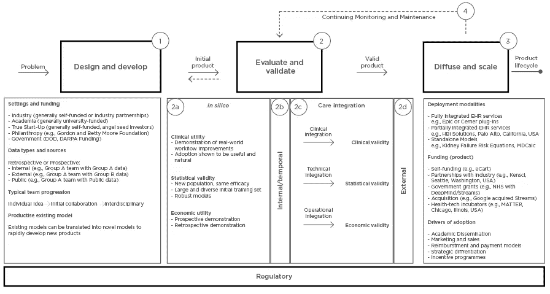
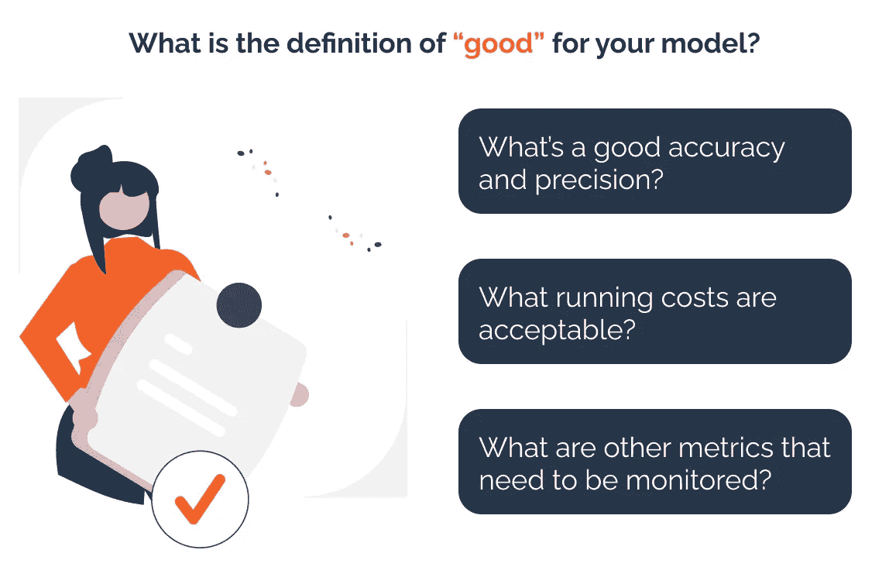
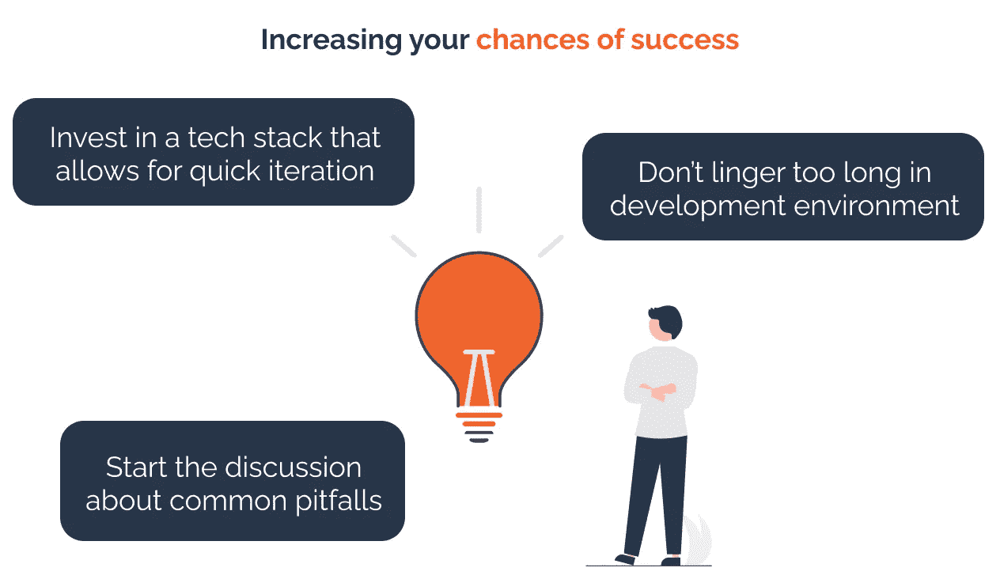

# 为什么将人工智能技术成功应用于临床护理如此困难？

> 原文：[`towardsdatascience.com/why-is-it-so-difficult-to-successfully-get-ai-technologies-adopted-into-clinical-care-4fa549d2c36?source=collection_archive---------7-----------------------#2023-03-30`](https://towardsdatascience.com/why-is-it-so-difficult-to-successfully-get-ai-technologies-adopted-into-clinical-care-4fa549d2c36?source=collection_archive---------7-----------------------#2023-03-30)

图片由 [国家癌症研究所](https://unsplash.com/@nci?utm_source=medium&utm_medium=referral) 提供，发布在 [Unsplash](https://unsplash.com/?utm_source=medium&utm_medium=referral)

## 探讨了一篇科学综述论文，该论文提出了这个问题并找到了答案

 [Anouk Dutrée](https://medium.com/@aadutree?source=post_page-----4fa549d2c36--------------------------------)

·

[点击这里](https://medium.com/m/signin?actionUrl=https%3A%2F%2Fmedium.com%2F_%2Fsubscribe%2Fuser%2Fd153542b2be5&operation=register&redirect=https%3A%2F%2Ftowardsdatascience.com%2Fwhy-is-it-so-difficult-to-successfully-get-ai-technologies-adopted-into-clinical-care-4fa549d2c36&user=Anouk+Dutr%C3%A9e&userId=d153542b2be5&source=post_page-d153542b2be5----4fa549d2c36---------------------post_header-----------) 发表在 [数据科学前沿](https://towardsdatascience.com/?source=post_page-----4fa549d2c36--------------------------------) · 9 分钟阅读 · 2023 年 3 月 30 日

-- 

人工智能（AI）在我们日常生活中变得越来越普遍。从几乎每个网络商店中的推荐系统，到自动翻译你访问的网站上的外语。然而，对于某些行业而言，这一过渡似乎比其他行业更加顺利。医疗领域似乎特别难以进入，但为什么呢？虽然有如此多的学术活动专注于医疗领域的人工智能，但是什么让这些技术突破在医疗保健中无法产生切实影响？Sendak 等人在他们的综述论文[《机器学习产品在医疗服务中的转化路径》](https://emj.emg-health.com/wp-content/uploads/sites/2/2020/01/A-Path-for-Translation-of-Machine-Learning.....pdf)（2020 年）中尝试寻找这个问题的答案。他们的发现与我在[UbiOps](https://ubiops.com/) 与[MedTech 初创公司合作](https://ubiops.com/medical-breakthrough-from-ellogon-ai-runs-on-ubiops-platform/)的经验非常契合，因此在本文中，我将带您逐步了解他们的论文。

# 机器学习在医疗保健中的现状

在我们深入探讨论文本身之前，让我们快速了解一下医疗领域中机器学习的现状。对机器学习在医疗领域的潜力的热情和兴奋程度非常高，导致了大量相关文献的出现。你几乎每隔一周就能看到有关利用机器学习进行癌症检测的新研究，而利用机器学习进行药物发现似乎也是一个热门话题。许多会议、组织和学术期刊已经建立，以传播围绕机器学习在医疗保健中的知识。

尽管研究正在快速增长，但切实的临床影响证据仍然稀少。你可能会想：“哦，但新技术通常需要一段时间才能成熟到能够应用于实践中”，但与此同时，我们也看到，利用机器学习提高用户留存率的新发现被 TikTok、Instagram 和 LinkedIn 等迅速采纳。Panch 等人巧妙地描述了这一[医疗保健中机器学习的‘不便之处’](https://www.nature.com/articles/s41746-019-0155-4)。

> *“目前，研究文献中突出的算法实际上在临床实践的前线大多无法执行。”*

幸运的是，有一些医疗公司成功地将人工智能/机器学习整合到了他们的产品中。例如，[Ellogon](https://ellogon.ai/) 这样帮助医生选择合适的癌症免疫疗法患者的公司，证明了从概念验证过渡到可以轻松完全融入现有医疗协议的成熟产品是可能的。

**是什么使成功融入医疗保健的机器学习产品与那些停留在概念验证阶段的产品有所不同？** 让我们看看 Mark Sendak 等人的研究，找出答案。

# Sendak 等人的研究

Mark Sendak 及其同事开始进行叙述性综述，以帮助理解如何将机器学习转化为医疗保健。他们结合了自己在构建机器学习产品方面的第一手经验，并与 21 个成功进入临床护理的机器学习模型案例研究相结合。这正是我对他们的研究感兴趣的原因，因为他们尝试从那些*真正*进入生产阶段的人身上学习。

根据他们对这 21 个案例研究的分析，**作者确定了在医疗保健世界中将产品推向成熟阶段的核心阶段和挑战。**

# “转化路径”

作者成功地将 21 个成功案例映射回他们所称的“转化路径”（见图）。他们指出，在从概念验证到正式产品的过程中，有四个关键阶段。这些阶段是：

1.  **设计与开发：** 这是识别正确问题并设计和开发能够提供*可操作见解*的机器学习工具的过程。

1.  **评估与验证：** 评估产品是否真的能改善临床护理和患者结果，是否准确可靠，以及是否有商业案例。

1.  **扩展与推广：** 这一步描述了将概念验证真正扩展为集成产品的过程。它需要扩展模型的部署并将其推广给早期采用者。

1.  **持续监控和维护：** 重要的是要注意，没有一个机器学习产品是最终完成的。模型需要持续监控和更新，以避免出现故障行为。特别是在医疗保健领域，这一点可能会带来严重的后果。

这些阶段不一定是顺序进行的，团队可能会在这些阶段之间反复迭代。有关转化路径的更多细节，请参见下图。

*图片由 Sendak 等人提供，摘自《机器学习产品转化为医疗保健服务的路径》。图片描述了转化路径的各个阶段。*

# 主要障碍

综述很好地描述了在医疗保健中创建机器学习驱动产品时面临的各种挑战和挫折点，从技术基础设施挑战到伦理风险。我不会逐一列举所有问题，但我想突出几个我认同的点。

## 领域知识与产品化知识

在开发医疗技术工具时，总会存在领域知识与生产化知识之间的紧张关系。你团队中的人员数量有限，同时你需要确保有足够的医学专家参与，还要有能实际构建和部署解决方案的合适人员。关注点的选择高度依赖，但 Sendak 等人很好地强调了如果你想成功，团队中需要在某种程度上具备这两种能力。

当然，并非每种技能都需要团队中实际有人具备！某些任务也可以外包，或引入可以处理标准任务的工具，以便专家可以专注于你解决方案中的独特之处。我看到许多公司因开源工具的免费而忙于构建自己的平台。但别忘了，团队中需要投入时间和精力来设置这些技术的成本！当他们忙于使部署工具工作时，你正浪费可以用于实际改进模型和创造价值的时间…

## 什么时候一个模型是“好”的？

好模型和坏模型的区别往往不清晰，也不明确你在特定情况下应追求什么样的性能。如果不讨论这一点，可能会导致期望与现实的不匹配。这里需要注意的是，这不仅仅关乎模型的准确性，还涉及到可用性和潜在的经济性能。一个准确性很高但运行需 10 小时的模型，可能不会很有用，也不实惠。每个案例都不同，因此在早期进行讨论以识别和达成相关模型性能指标的共识至关重要。

作者提供的图片

## 在孤立的背景下证明产品的有效性是不够的

仅仅因为产品在受控测试环境和测试数据集上表现良好，并不意味着该产品在实际环境中也会表现良好。重要的是要让真实数据通过产品，并用它来评估产品性能。在 UbiOps，我们专注于部署和服务，我们多次看到模型在引入实际生产数据后，性能可能会发生巨大的变化！即使只是作为影子部署，尽早进入这一阶段也很重要。

## 集成到生产环境中是困难的

作者指出，实际生产环境和开发/数据存储环境之间通常存在巨大差异。在他们调查的所有示例案例中，他们发现通常需要大量的努力和投资才能将产品集成到现有系统中。[一项研究](https://pubmed.ncbi.nlm.nih.gov/28837212/)估计，在一个地点验证和集成肾衰竭风险方程到临床工作流程的成本接近$220,000。这只是一个地点！

## 数据分布在云和本地环境中

这篇评论突显了一个重要问题，即数据分布在各种云解决方案和本地数据中心。通常这在扩展阶段开始时会引发问题。设计产品和架构时意识到这一点，可以大大有利于从概念验证过渡到正式推出的产品。

## 不断变化的监管框架

另一个主要挑战与合规性、数据安全以及医疗设备和软件所需的大量法规和认证相关。更不用说规则不断变化。很难跟上所有内容并确保你的产品每个部分都完全合规。数据安全尤其是一个障碍，因为数据非常敏感。

## 接下来呢？

我已经向你介绍了翻译路径及其主要障碍，那么接下来呢？我认为，当你开始创建一个新型的医疗保健领域的 ML 驱动产品时，一切都始于**意识和开放讨论**。了解前人遇到的挑战，你如何从他们的错误中学习？

作者提供的图片

在我看来，最重要的是不要害怕实际进入那个模糊和扩展的步骤。**从开发环境中走出来并在生产中运行事物**是绝对关键的，尽管是在阴影模式下。只有在迈出这一步后，你才能开始朝着真正具有影响力和价值的产品前进。

那么，你如何确保实际在生产环境中运行这些东西？**确保你投资于一个可以帮助你快速迭代的基础设施**，并且让你专注于你擅长的事情：为医疗用例构建模型。投资于可以帮助你快速部署和监控的 MLOps 工具，确实有助于确保你能专注于实际挑战，而不是标准的基础设施挑战。我看到许多公司因为开源工具免费而投入大量精力构建自己的平台。但别忘了，团队成员投入时间和精力去设置这些技术的成本！当他们忙于让部署工具运作时，你却浪费了可以用来真正改进模型和创造价值的时间……

在数据安全方面，确保你使用的工具已获得正确的认证（如 ISO 认证）是有帮助的。特别是在欧洲，选择一些较小的云服务提供商而非三大巨头也可能更合适。与专注于医疗数据的云服务提供商合作，你将大大减少在证明你符合所有规定时的麻烦。

# 简而言之

在将 AI 纳入日常临床护理时，有许多因素需要考虑。从法规、架构问题，到吸引合适的人参与。Sendak 等人成功地在他们的“转化路径”中简洁地捕捉了所有阶段和障碍。了解这一转化路径的四个不同阶段以及可能遇到的不同障碍，肯定有助于你为成功做好准备。

## 想要讨论医疗保健中 ML 的架构设置吗？

如果你喜欢本文的内容，并希望深入探讨该领域的 ML 架构设置，不要犹豫，随时联系我！我很乐意讨论 MLOps。你可以在评论区联系我，或者直接在 [LinkedIn](https://www.linkedin.com/in/anouk-dutree/) 上找到我。

# 参考文献

Panch T 等人。关于医疗保健中 AI 的“令人不便的真相”。npj Digital Medicine. 2019

Sendak, MP 等人。[将机器学习产品转化为医疗保健服务的路径](https://emj.emg-health.com/wp-content/uploads/sites/2/2020/01/A-Path-for-Translation-of-Machine-Learning.....pdf)。EMJ 评审。2020

Sendak MP 等人。[分析 EHR 数据中实现规模经济的障碍：一个警示性的故事](https://pubmed.ncbi.nlm.nih.gov/28837212/)。Applied Clinical Informatics. 2017

Xiao C 等人。[使用电子健康记录数据开发深度学习模型的机遇与挑战：系统综述](https://pubmed.ncbi.nlm.nih.gov/29893864/)。J Am Med Inform Assoc. 2018
