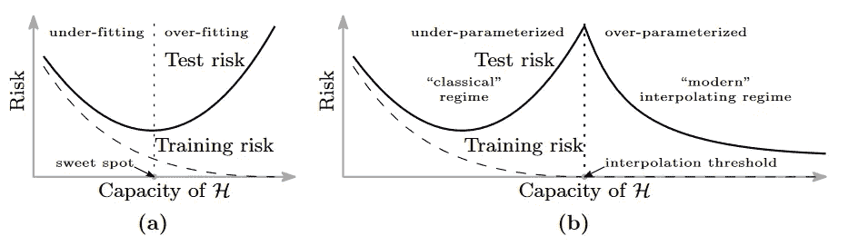
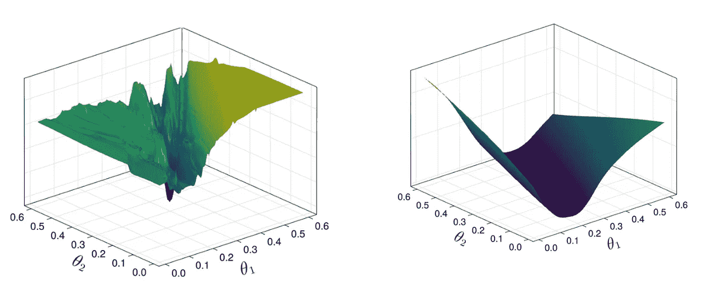

# 为什么更多即是更多（在人工智能中）

> 原文：[`towardsdatascience.com/why-more-is-more-in-deep-learning-b28d7cedc9f5`](https://towardsdatascience.com/why-more-is-more-in-deep-learning-b28d7cedc9f5)

## 大型神经网络如何泛化

 [Manuel Brenner](https://manuel-brenner.medium.com/?source=post_page-----b28d7cedc9f5--------------------------------)

·发表于 [Towards Data Science](https://towardsdatascience.com/?source=post_page-----b28d7cedc9f5--------------------------------) ·阅读时间 10 分钟·2023 年 8 月 15 日

--

> 少即是多。
> 
> -***路德维希·密斯·范·德·罗赫***
> 
> 只有当更多已经太多时，少即是多。
> 
> - ***弗兰克·劳德·赖特***

深度神经网络（DNNs）深刻地改变了机器学习的格局，常常与人工智能和机器学习的广泛领域同义。然而，它们的崛起若没有它们的“搭档”——随机梯度下降（SGD），将是难以想象的。

SGD 及其衍生优化器构成了许多自学习算法的核心。其核心概念很简单：使用训练数据计算任务的损失，确定相对于其参数的损失梯度，然后调整参数以最小化损失。

听起来很简单，但在应用中，它已经被证明极其强大：SGD 可以为各种复杂问题和训练数据找到解决方案，只要它与足够表达力的架构结合使用。它特别擅长找到使网络在训练数据上表现完美的参数集合，这被称为**插值机制**。但在什么条件下，神经网络被认为是**良好泛化**的，即在未见过的测试数据上表现良好？

总体化的追求是机器学习的核心。由 DALL-E 构想。

在某些方面，这几乎过于强大：SGD 的能力不仅限于可以期望带来良好泛化的训练数据。例如，[在这篇有影响力的论文中](https://arxiv.org/abs/1611.03530)已经表明，SGD 可以使网络完美记忆一组随机标记的图像（关于记忆与泛化之间的深层关系，我之前有过相关的讨论）。虽然这看起来具有挑战性——考虑到标签与图像内容之间的不匹配——但对于使用 SGD 训练的神经网络来说，这出奇地简单。实际上，这并不比拟合真实数据更具挑战性。

这种能力表明，使用 SGD 训练的神经网络存在过拟合的风险，避免过拟合的正则化措施，如范数、早期停止和**减少模型大小**变得至关重要。

从经典统计学的角度来看，少即是多，因此多即是少，如这幅 DALL-E 画作简洁总结的那样：

更多即是更少，由 DALL-E 创作。

> **“一切事物都应尽可能简单，但不能更简单。”** *— 阿尔伯特·爱因斯坦*

但问题在于：最令人惊讶的现代深度学习特性之一是，大多数架构在**高度过参数化的阶段，即参数远多于数据点时**表现最佳。这令人惊讶，因为标准学习理论，基于基本直觉，认为如此多的参数使得深度神经网络（DNNs）会过度调整到特定的训练数据上，从而在处理新的、未见过的数据时表现较差。

这在著名的**“双重下降”**曲线中得到了很好的体现，该曲线由 Belkin 等人在 2019 年的论文《调和现代机器学习实践与偏差-方差权衡》中推广。

观察到的经典 U 型学习曲线和双重下降现象。 [摘自 Belkin 等，2019 年。](https://arxiv.org/pdf/1812.11118.pdf)

在“经典”领域，增加容量会导致训练和测试损失的减少，但在最佳点之后，测试风险会再次增加，而训练风险降至零（“过拟合阶段”）。

但现代机器学习算法已经突破了这一门槛：移动到现代插值阶段，使用高度过参数化的模型，测试风险再次降低，甚至降到经典阶段无法达到的水平，实现了前所未有的泛化能力。

> 数学语言在物理法则表述中的适用性奇迹，是我们既无法理解也不配拥有的美妙礼物。
> 
> ***尤金·维根***

神经网络能够泛化，即便其固有的过拟合倾向，表明存在所谓的**归纳偏差**。归纳偏差指的是学习算法在预测未见数据点的输出时，基于其训练数据所作的（通常未言明的）一系列假设。就像我们常常无意识的（且常常相当麻烦的）认知偏见一样，架构的归纳偏差决定了**它对某些解决方案的偏好**，在不确定性或存在多种可能解决方案时引导它。

事实证明，我们非常幸运：许多研究指出，使用 SGD 训练的 DNNs 对函数具有**良好的泛化能力**（在结构化数据上，这也是我们在应用 DNNs 时最关心的数据）。这是一系列使深度学习如此有效的惊喜之一，特伦斯·塞伊诺斯基在[“深度学习在人工智能中的非理性有效性”](https://www.pnas.org/doi/10.1073/pnas.1907373117)中讨论了这一点，回响了尤金·维根的六十年前关于[数学在自然科学中的非理性有效性](https://en.wikipedia.org/wiki/The_Unreasonable_Effectiveness_of_Mathematics_in_the_Natural_Sciences)的著名论文，我们“既无法理解也不配拥有”。

> “深奥的科学真理之所以被发现，并不是因为它们有用；而是因为它们可以被发现。”
> 
> ***J. 罗伯特·奥本海默***

这种非理性的有效性使许多看似不可能的深度学习应用得以实现。

这也可能是我们不配拥有的，或者更确切地说，**（尚未）不该拥有的**：鉴于人工智能的迅速发展和越来越多的警示声音呼吁暂停人工智能研究，深度学习的成功也打开了潘多拉的盒子，这可能会定义未来一个世纪的人类道路。

DALL-E 设想的潘多拉盒子的开启。

但，与维根提出的关于数学与物理、思想与现实之间的基础关系的形而上学问题相比，深度学习的成功至少是我们可以理解的。

尽管对神经网络为何能如此良好地进行泛化进行了大量理论研究，但深度学习的理论仍滞后，目前尚无明确且普遍接受的解释来说明为何深度神经网络（DNNs）能够如此出色地进行泛化。

许多理论提议，例如局部最小值是全局最小值的见解，通常只适用于有限的架构，[如线性神经网络](http://proceedings.mlr.press/v80/laurent18a/laurent18a.pdf)或简单的非线性网络。通常，从学习理论中得出的结果可能与实际使深度神经网络有效的实践经验相矛盾，例如实际深度神经网络中存在许多次优的局部最小值（在这篇恰如其分标题的论文中探讨了[真相或反向传播](https://arxiv.org/pdf/1910.00359.pdf)）。

尽管尚未有普遍认可的解释，但深度学习理论中有许多引人入胜的见解可以推进我们对为什么 DNNs 中的泛化有效的理解和直觉。

在本文的其余部分，我想探索几种解释尝试，以理解为什么***更多往往意味着更多***对于神经网络训练（简要说明：我将专注于分布内泛化，而不讨论分布转移领域，即被称为分布外/OOD 泛化的领域）。

如开头所提，大致有两个潜在的罪魁祸首：**SGD/优化**和**神经网络**本身。

认为 SGD 可能是导致良好泛化的归纳偏差的原因，已经引发了大量研究。这些研究深入探讨了在这些泛化特性显现的各种机制和优化器。值得注意的是，在今天的众多优化器变体中，从 SGD 到 Adam 再到 Adagrad 到 LBFGS，选择优化器**对泛化的影响很小**。[大多数，甚至所有，都能在不同任务中实现相当的泛化结果](https://www.youtube.com/watch?v=kcVWAKf7UAg)。虽然有人理论认为，SGD 固有的随机性有助于模型逃离尖锐的、不具泛化性的最小值，推动其向损失景观中更广泛、更具泛化性的区域移动，并对参数具有正则化效果，即使是全批次 SGD（一次性在整个训练数据上进行训练）在许多情况下也表现良好。

这表明泛化可能与**损失景观的特征**更加密切相关，而非特定的优化器引导学习算法的过程。这引出了一个有趣的问题：特定最小值的泛化能力如何与周围损失景观的属性相关联？

一个自 90 年代以来流行的[解释](https://www.bioinf.jku.at/publications/older/3304.pdf)认为，**尖锐的最小值相较于平坦的最小值通常推广效果较差**。直观上，这与分类时决策边界距离数据点的远近有关：在泛化效果不佳和过拟合严重的情况下，决策边界紧贴数据点，因此参数的微小变化可能导致损失的剧烈变化，因为它们也会改变多个点的分类。相反，平坦的最小值会导致较宽的决策边际，类似于支持向量机中的目标边际。

崎岖的损失景观中包含尖锐的局部最小值与较平滑且较宽的局部最小值。损失景观的平滑度也取决于训练技术和正则化技术，如丢弃法。[摘自我们最近的 ICML 论文](https://proceedings.mlr.press/v202/hess23a.html)。

由于梯度下降在优化过程中更**容易遇到平坦的最小值**，因此自然更倾向于泛化的解决方案，这种效果因通常非常高维的损失景观而加剧。尖锐的最小值就像是高维稻草堆中的*针*，而平坦的最小值则是稻草堆中的稻草，考虑到问题的高维性质，[**找到尖锐的过拟合最小值比找到平坦的最小值要困难几个数量级**](https://www.youtube.com/watch?v=kcVWAKf7UAg)。

此外，平坦的最小值在体积上也比尖锐的最小值大，而高维空间中体积的反直观扩展意味着这可能导致它们各自体积上的数量级差异。

另一个在实践中经常观察到的现象可以进一步发挥作用：[局部最小值在实践中通常被认为由小损失的山谷连接](http://proceedings.mlr.press/v80/draxler18a/draxler18a.pdf)，即“损失山谷”。SGD 以其迭代性质可以穿越这些山谷，更容易找到并停留在这些更广泛、可泛化的区域。

在讨论了 SGD 及其与损失景观的相互作用后，现在该直接思考神经网络了：随机初始化的深度神经网络本身是否已经表现出某种**“简单/泛化”解的归纳偏差**，无论简单指的是什么？

如果简单的网络导致简单的解决方案，而 DNNs 所建模的许多过程实际上是简单的（即，比拟合随机噪声的维度低得多），那么神经网络表现出简单解决方案的倾向将给我们带来很多信息。

检查 SGD 是否与神经网络的成功有很大关系的一个好方法是观察它们在没有明确通过 SGD 训练的情况下如何解决问题。

一篇近期论文 ([SGD 是贝叶斯采样器吗？差不多。](https://arxiv.org/pdf/2006.15191.pdf)) 提出，促使 DNN 朝向“简单”解决方案的归纳偏差，可能不仅仅是 SGD 的特殊属性，而是**网络的固有特征**。

论文的核心前提围绕两个概率：P_SGD(f∣S)— 使用 SGD 或其变体训练的过参数化 DNN 收敛到一个与训练集 S 一致的函数 f 的可能性；以及 P_Bayesian(f∣S)— 给定训练集 S，函数 f 由 DNN 表示的贝叶斯后验概率，当其参数随机初始化时。

不讨论细节，这项研究发现这两个概率之间存在显著的相关性。更重要的是，**贝叶斯采样器表现出强烈倾向于具有低错误和最小复杂性的函数**。这一发现表明，DNN 的固有结构及其庞大规模，而不是 SGD 的具体细节，可能是其在过参数化设置中具备良好泛化能力的主导因素。

然而，论文也指出，尽管这两个概率紧密相关，但仍存在对超参数敏感的细微差异。这意味着架构变化、批量大小、学习率和优化器选择等因素在 DNN 性能中仍然非常重要。

> “幸运是准备与机会相遇时发生的事情。”
> 
> ***— 塞内卡***

架构偏好简单解决方案的事实也与过参数化网络的另一个新见解相契合，即所谓的[彩票票据假设](https://arxiv.org/abs/1803.03635)。

它提出，在大型的过参数化网络中，存在着较小、稀疏的子网络，这些子网络具有成功的潜力。这些被称为“赢票”的网络，不仅仅是幸运的发现，而是已经以一种特别适合学习特定任务的方式初始化。在过参数化模型中，存在着众多的“赢票”或最佳子网络。这些子结构倾向于高效学习和良好的泛化能力。整体网络的冗余性提供了一种集成学习的形式，其中多个“优质”子网络共同收敛到稳健的解决方案。此外，参数的过剩可能有助于探索损失景观，使模型能够有效地发现和利用这些子网络。

在我之前的文章中，我深入探讨了[免费午餐定理](https://medium.com/towards-data-science/why-there-kind-of-is-free-lunch-56f3d3c4279f)，以及大型预训练模型的迁移学习如何给我们提供类似于免费午餐的东西。这与泛化的主题紧密相关：大型预训练模型通常表现出显著的泛化能力，即使在特定领域的数据有限的情况下。这种现象似乎违背了传统的偏差-方差权衡，呼应了过参数化模型良好泛化的更广泛主题。像 GPT-4 这样的模型向我们展示了，拥有更多参数并辅以足够多样化的数据，确实可以导致模型不仅能够很好地拟合训练数据，而且在看似新颖且未见过的场景中也表现出色。

但用于训练的数据质量可能是泛化的最关键因素。Sam Altman 经常强调数据策划在 GPT-4 的有效性中发挥了重要作用。而在正确类型的数据上“过拟合”可能足以让你获得所需的结果。正如[AI Coffee Break](https://www.youtube.com/c/aicoffeebreak)的主持人 Letitia Parcalabescu 在我们一起录制的[最新播客集](https://open.spotify.com/episode/2sUYtwQKvLleRshLio4t1g?si=2b8af33b7d3b4bd9)中所说：“如果你在整个世界上过拟合，你基本上就完成了。”

大型神经网络之所以能够良好泛化，可能有多种原因。这是大多数人没有预料到的，尤其是在 20 世纪对偏差-方差权衡的深刻传统思维影响下。

但它确实有效。尽管所有的模型和算法都是由人类开发的，但我们仍然不确定发生了什么。也许，未来某天，我们会找到答案。如果我们找不到答案，我相信 AI 算法在自我探索的过程中会找到的。

感谢阅读！

如果你喜欢我的写作，请[订阅以通过邮件获取我的故事](https://manuel-brenner.medium.com/subscribe)，或[考虑成为推荐会员](https://manuel-brenner.medium.com/membership)。
