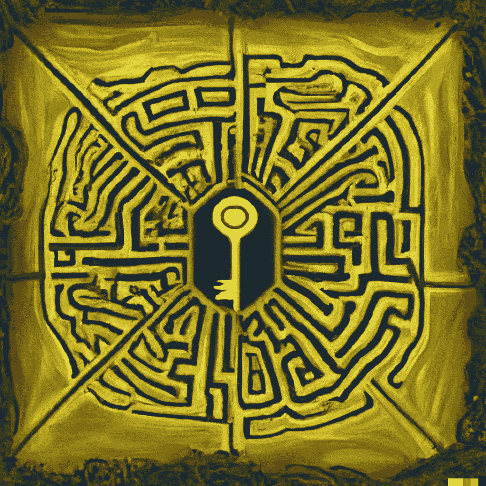

# 为什么更多即是更多（在人工智能领域）

> 原文：[`towardsdatascience.com/why-more-is-more-in-deep-learning-b28d7cedc9f5?source=collection_archive---------1-----------------------#2023-08-15`](https://towardsdatascience.com/why-more-is-more-in-deep-learning-b28d7cedc9f5?source=collection_archive---------1-----------------------#2023-08-15)

## 如何大型神经网络进行泛化

 [Manuel Brenner](https://manuel-brenner.medium.com/?source=post_page-----b28d7cedc9f5--------------------------------)

·

[关注](https://medium.com/m/signin?actionUrl=https%3A%2F%2Fmedium.com%2F_%2Fsubscribe%2Fuser%2F1fde95441432&operation=register&redirect=https%3A%2F%2Ftowardsdatascience.com%2Fwhy-more-is-more-in-deep-learning-b28d7cedc9f5&user=Manuel+Brenner&userId=1fde95441432&source=post_page-1fde95441432----b28d7cedc9f5---------------------post_header-----------) 发表在 [Towards Data Science](https://towardsdatascience.com/?source=post_page-----b28d7cedc9f5--------------------------------) ·10 分钟阅读·2023 年 8 月 15 日

--

> 少即是多。
> 
> - ***路德维希·密斯·凡·德·罗***
> 
> 只有当更多的东西已经过多时，少才是多。
> 
> - ***弗兰克·劳埃德·赖特***

深度神经网络（DNNs）深刻地改变了机器学习的格局，往往与更广泛的人工智能和机器学习领域同义。然而，它们的兴起若没有它们的“罪魁祸首”——随机梯度下降（SGD），将是难以想象的。

SGD 及其衍生优化器构成了许多自学习算法的核心。其核心概念很简单：使用训练数据计算任务的损失，确定该损失相对于其参数的梯度，然后调整参数，以减少损失。

这听起来简单，但在应用中，它已被证明是极其强大的：SGD 可以解决各种复杂问题和训练数据，只要它与足够表达力的架构结合使用。它特别擅长找到使网络在训练数据上表现完美的参数集，这被称为**插值阶段**。但在什么条件下，神经网络被认为能够**良好地泛化**，即在未见过的测试数据上表现良好？

对于机器学习来说，追求泛化是核心目标。这一理念由 DALL-E 构想。
