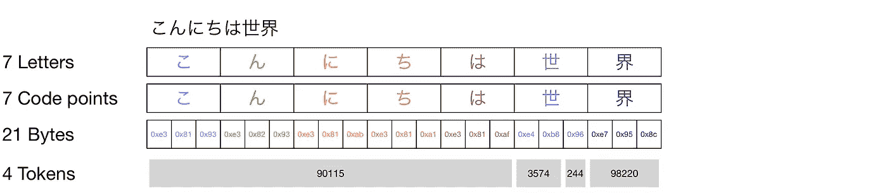

# 为什么 OpenAI 的 API 对非英语语言更昂贵

> 原文：[`towardsdatascience.com/why-openais-api-is-more-expensive-for-non-english-languages-553da4a1eecc`](https://towardsdatascience.com/why-openais-api-is-more-expensive-for-non-english-languages-553da4a1eecc)

## 超越文字：字节对编码和 Unicode 编码如何影响定价差异

[](https://medium.com/@iamleonie?source=post_page-----553da4a1eecc--------------------------------)[](https://towardsdatascience.com/?source=post_page-----553da4a1eecc--------------------------------) [Leonie Monigatti](https://medium.com/@iamleonie?source=post_page-----553da4a1eecc--------------------------------)

·发表于 [Towards Data Science](https://towardsdatascience.com/?source=post_page-----553da4a1eecc--------------------------------) ·阅读时间 7 分钟·2023 年 8 月 16 日

--


怎么会“Hello world”这个短语在英语中有两个令牌，而在印地语中却有 12 个令牌呢？

在发布了 [我最近关于如何估算 OpenAI API 成本的文章](https://medium.com/towards-data-science/easily-estimate-your-openai-api-costs-with-tiktoken-c17caf6d015e) 后，我收到了一条有趣的评论，有人注意到 OpenAI API 在其他语言中的费用远高于英语，例如使用汉字、日语或韩文 (CJK) 字符的语言。


有读者在 [我最近关于如何估算 OpenAI API 成本的文章](https://medium.com/towards-data-science/easily-estimate-your-openai-api-costs-with-tiktoken-c17caf6d015e) 上评论了 `[tiktoken](https://medium.com/towards-data-science/easily-estimate-your-openai-api-costs-with-tiktoken-c17caf6d015e)` [库](https://medium.com/towards-data-science/easily-estimate-your-openai-api-costs-with-tiktoken-c17caf6d015e)

我之前并未意识到这个问题，但很快意识到这是一个活跃的研究领域：今年年初，Petrov 等人发表了一篇名为“语言模型分词器在语言之间引入不公平性”的论文[2]，该论文显示“同一文本翻译成不同语言后，其分词长度可能会有剧烈差异，在某些情况下差异可达 15 倍。”

作为补充，分词是将文本拆分为一系列令牌的过程，这些令牌是文本中的常见字符序列。


分词的一个示例

符号化长度的差异是一个问题，因为[OpenAI API 按 1,000 个符号计费](https://openai.com/pricing)。因此，如果你在类似的文本中有多达 15 倍的符号，这将导致 15 倍的 API 费用。

# 实验：不同语言中的符号数量

让我们将短语“Hello world”翻译成日语（こんにちは世界）并转录成印地语（हैलो वर्ल्ड）。当我们用 OpenAI 的 GPT 模型中使用的`cl100k_base`分词器对这些新短语进行符号化时，得到以下结果（你可以在本文末尾找到我用于这些实验的代码）：


“Hello world”在英语、日语和印地语中的字母和符号数量（`cl100k_base`）

从上图中，我们可以得出两个有趣的观察：

1.  这个短语的字母数量在英语中最多，而在印地语中最少，但产生的符号数量在英语中最少，而在印地语中最多。

1.  在印地语中，符号的数量多于字母的数量。

这怎么可能发生？

# 基础知识

要理解为什么在除英语之外的语言中，相同的短语会产生更多的符号，我们需要回顾字节对编码和 Unicode 的两个基本概念。

## 字节对编码

字节对编码（BPE）算法最初是由 Gage [1]于 1994 年发明的，用作一种压缩算法。

> “[BPE]算法通过查找数据中最频繁出现的相邻**字节**对来压缩数据，并用一个原始数据中不存在的字节替换所有出现的对。该算法重复此过程，直到无法进一步压缩，无论是因为没有更多频繁出现的对，还是没有更多的未使用字节来表示对。”[1]

让我们通过原始论文中的例子[1]。假设你有一个最小的文本语料库，由字符串“ABABCABCD”组成。

1\. 对于每一对字节（在这个例子中，即字符），你将统计它在语料库中的出现次数，如下所示。

```py
"ABABCABCD"

pairs = {
  'AB' : 3,
  'BA' : 1,
  'BC' : 2,
  'CA' : 1,
  'CD' : 1,
} 
```

2\. 取出现次数最多的一对字节，并用一个未使用的字符替换它。在这种情况下，我们将把“AB”这对字节替换为“X”。

```py
# Replace "AB" with "X" in "ABABCABCD":
"XXCXCD"

pairs = {
  'XX' : 1,
  'XC' : 2,
  'CX' : 1,
  'CD' : 1, 
}
```

3\. 重复步骤 2，直到无法进一步压缩或没有更多的未使用字节（在这个例子中，即字符）为止。

```py
# Replace "XC" with "Y" in "XXCXCD":
"XYYD"

pairs = {
  'XY' : 1,
  'YY' : 1,
  'YD' : 1,
}
```

## Unicode

Unicode 是一种编码标准，定义了不同字符如何用称为**码点**的唯一数字表示。在本文中，我们不会涵盖 Unicode 的所有细节。如果你需要复习，可以参考这个[优秀的 StackOverflow 回答](https://stackoverflow.com/a/15128103)。

对于以下解释，你需要知道的是，如果你的文本是以 UTF-8 编码的，不同语言的字符将需要不同数量的字节。

从下面的表格中可以看出，英语字母可以用 ASCII 字符表示，只需要 1 个字节。但例如，希腊字符需要 2 个字节，而日文字符需要 3 个字节。


（灵感来自[维基百科关于 UTF-8 的文章](https://en.wikipedia.org/wiki/UTF-8)和[StackOverflow 的回答](https://stackoverflow.com/a/15128103)）

# 探索内部机制

现在我们理解了不同语言的字符在数值上需要不同的字节量，并且 OpenAI 的 GPT 模型使用的分词器是 BPE 算法，它在字节级别上进行分词，让我们深入探讨一下我们的开篇实验。

## 英语

首先，让我们看看英文分词的普通例子：


分词短语“Hello world”

从上面的可视化中，我们可以得出以下观察：

+   一个字母等于一个代码点

+   一个 Unicode 代码点等于 1 个字节

+   BPE 将“Hello”分词为 5 个字节，将“ world”分词为 6 个字节，分成两个独立的标记

这一观察结果与[OpenAI 分词器网站](https://platform.openai.com/tokenizer)上的声明一致：

> “一个有用的经验法则是，一个标记通常对应于~4 个字符的常见英文文本。”

注意到它说“对于常见的英文文本”？让我们看看非英文文本。

## 日语

那么在那些一个字母不对应一个字节而是多个字节的语言中会发生什么呢？让我们看看翻译成日语的“Hello world”，它使用了在 UTF-8 编码中为 3 字节的 CJK 字符：



分词短语“こんにちは世界”

从上面的可视化中，我们可以得出以下观察：

+   一个字母等于一个代码点

+   一个 Unicode 代码点等于 3 个字节

+   BPE 将 15 个字节的こんにちは（“Hello”的日文）分词为一个单独的标记

+   但字母界被分词为一个单独的标记

+   字母世被分词为两个标记

## 印地语

在那些一个字母不等于一个代码点而是由多个代码点组成的语言中，情况变得更加复杂。让我们看看“Hello world”翻译成印地语的情况。用于印地语的天城文字符表中的字符必须拆分成多个代码点，每个代码点需要 3 个字节：


分词短语“हैलो वर्ल्ड”

从上面的可视化中，我们可以得出以下观察：

+   一个字母可以由多个 Unicode 代码点组成（例如，字母है由代码点ह和ै组合而成）

+   一个 Unicode 代码点等于 3 个字节

+   与日文字符世类似，一个代码点可以被分为两个标记

+   一些标记跨越一个以上但少于两个字母（例如，标记 ID 31584）

# 总结

本文探讨了相同短语“Hello world”翻译成日语并转录成印地语后是如何进行分词的。首先，我们了解到 OpenAI 的 GPT 模型使用的分词器是在字节级别进行分词的。此外，我们还发现，日语和天城文字符号需要多个字节来表示一个字符，而不是像英语那样。因此，我们看到 UTF-8 编码和 BPE 分词器在最终令牌数量中发挥了重要作用，并影响了 API 成本。

当然，不同的因素，例如 GPT 模型在多语言文本上的训练不均等，会影响分词。在撰写时，这个问题是一个活跃的研究领域，我很期待看到不同的解决方案。

# 享受这个故事吗？

[*免费订阅*](https://medium.com/subscribe/@iamleonie) *以便在我发布新故事时收到通知。*

[](https://medium.com/@iamleonie/subscribe?source=post_page-----553da4a1eecc--------------------------------) [## 每当 Leonie Monigatti 发布新内容时，你会收到电子邮件。

### 每当 Leonie Monigatti 发布新内容时，你会收到电子邮件。通过注册，如果你还没有 Medium 帐户，你将创建一个…

medium.com](https://medium.com/@iamleonie/subscribe?source=post_page-----553da4a1eecc--------------------------------)

*在* [*LinkedIn*](https://www.linkedin.com/in/804250ab/),[*Twitter*](https://twitter.com/helloiamleonie)*和* [*Kaggle*](https://www.kaggle.com/iamleonie)*上找到我！*

# 参考文献

## 图片参考

如果没有另行说明，所有图片均由作者创作。

## 网络与文学

[1] Gage, P. (1994). 一种新的数据压缩算法。*C 用户杂志*, *12*(2), 23–38.

[2] Petrov, A., La Malfa, E., Torr, P. H., & Bibi, A. (2023). 语言模型分词器在语言间引入了不公平性。[*arXiv 预印本 arXiv:2305.15425*](https://arxiv.org/abs/2305.15425)。

## 代码

这是我用来计算和解码文章中令牌数量的代码。

```py
# pip install tiktoken

import tiktoken

# Define encoding
encoding = tiktoken.encoding_for_model("gpt-3.5-turbo")

# Tokenize text and get token ids
tokens = encoding.encode(text)

# Decode token ids
decoded_text = [encoding.decode_single_token_bytes(token) for token in tokens]
```
