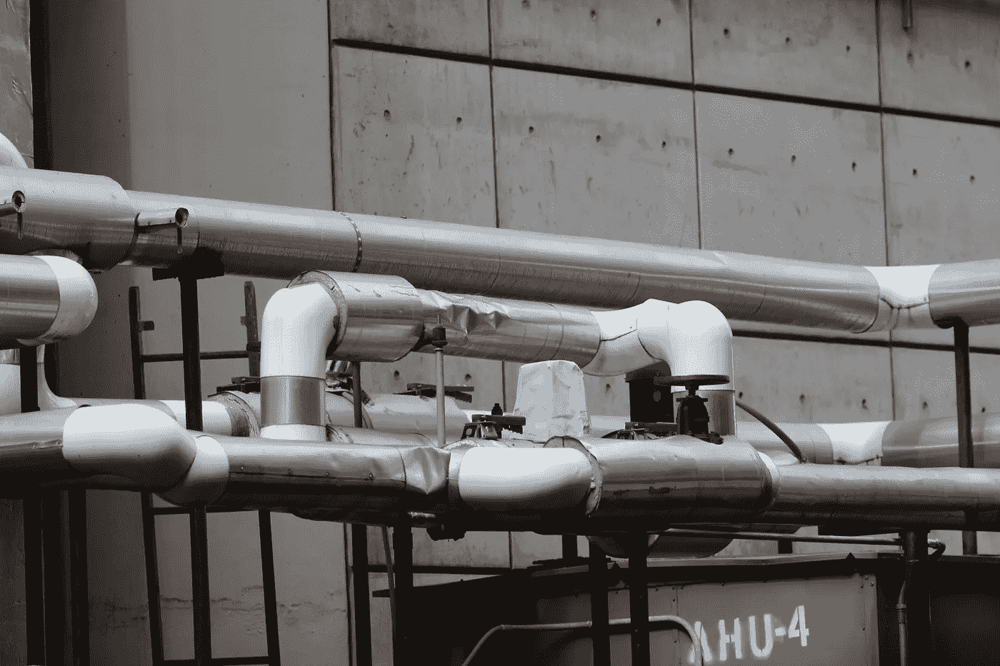
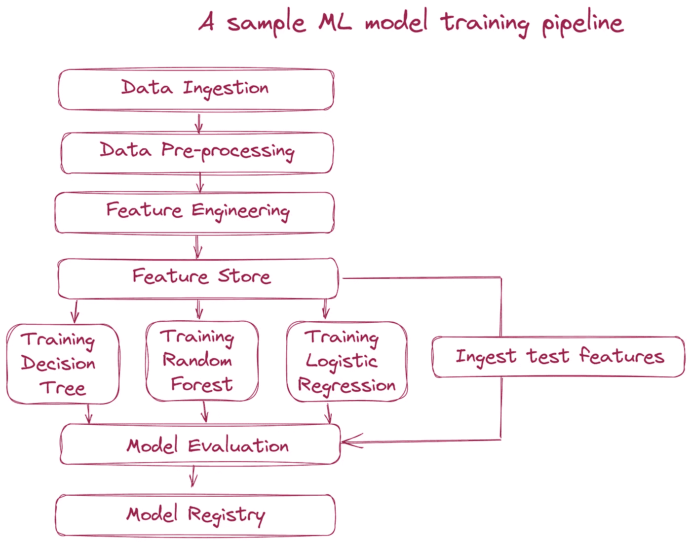
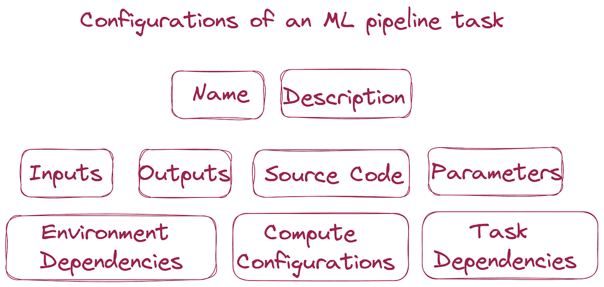
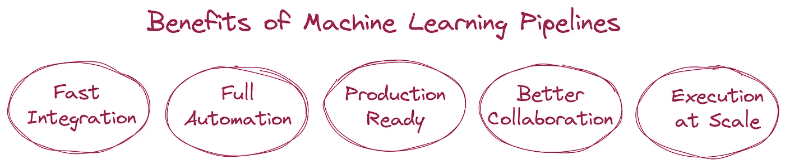

# 为什么数据科学家应该采用机器学习（ML）管道

> 原文：[`towardsdatascience.com/why-should-data-scientists-adopt-machine-learning-ml-pipelines-8fc5e24920dd`](https://towardsdatascience.com/why-should-data-scientists-adopt-machine-learning-ml-pipelines-8fc5e24920dd)

## 意见

## MLOps 实践 — 作为数据科学家，你是将一个笔记本还是一个 ML 管道交给你的 ML 工程师或 DevOps 工程师，以便在生产环境中部署 ML 模型？

 [YUNNA WEI](https://medium.com/@weiyunna91?source=post_page-----8fc5e24920dd--------------------------------)

·发表于 [Towards Data Science](https://towardsdatascience.com/?source=post_page-----8fc5e24920dd--------------------------------) ·9 分钟阅读·2023 年 2 月 1 日

--

## 背景

在我之前的文章中：

+   [学习 MLOps 核心 — 构建机器学习（ML）管道](https://medium.com/towards-data-science/learn-the-core-of-mlops-building-machine-learning-ml-pipelines-7242b77520b7)

+   MLOps 实践 — 将 ML 解决方案架构分解为 10 个组件

我谈到了构建 ML 管道的重要性。在今天的文章中，我将深入探讨 ML 管道的主题，并详细解释：

+   为什么构建 ML 管道是必要且重要的

+   ML 管道的关键组件是什么

+   为什么以及数据科学家如何采用 ML 管道？

照片由[Jon Tyson](https://unsplash.com/@jontyson?utm_source=medium&utm_medium=referral)拍摄，发布在[Unsplash](https://unsplash.com/?utm_source=medium&utm_medium=referral)。

## 为什么构建 ML 管道是必要且重要的？

数据科学家在笔记本环境中开发 ML 模型是很常见的。在笔记本中，他们会实验不同的数据集、不同的特征工程技术，以及不同的参数和超参数组合，以找到表现最佳的 ML 模型。在经过多轮性能调优和特征工程之后，他们找到理想的 ML 模型。他们继续用测试数据验证模型的性能，以确保模型没有“过拟合”并且满足业务要求。模型验证代码很可能是在同一个笔记本环境中开发和运行的。当他们对整体模型性能满意时，他们会***交接***一个笔记本（其中的代码可能涵盖数据摄取、数据探索、特征工程、模型训练和日志记录以及模型验证）给 ML 工程师或 DevOps 工程师，以便将模型部署到生产环境中。

然而，这个交接过程可能会出现许多问题：

+   **缓慢和手动的迭代** — 当在部署的 ML 系统中检测到问题时，数据科学家需要回到他们的笔记本中寻找解决方案，并再次将解决方案交给生产工程师，以便将更改部署到生产环境中。每次需要更新模型时，这个过程都会重复。这可能会有无尽的交接。这是一种非常缓慢的迭代方式。更糟糕的是，这种手动和缓慢的迭代可能会导致显著的业务损失。

+   **重复工作** — 数据科学家在笔记本环境中生成的代码很可能不适合生产环境。因此，ML 工程师需要投入精力重新编写和测试代码，并将代码转换为生产部署的模块。ML 管道可以显著减少代码重写的工作量。我将在本文后面解释原因。

+   **易出错** — ML 应用程序依赖于各种外部库来辅助模型训练过程，这使得数据科学家需要导入这些库。例如，他们通常利用 Pandas 进行数据清洗和特征工程，利用 ML/DL 框架进行特征和模型开发，利用 Numpy 进行张量和数组计算。除了这些流行的库，他们还可能会使用一些适合特定环境的小众库。由于这种依赖性，生产环境中使用的库与开发环境中使用的库不匹配时可能会引发错误。在前一点中，我们提到当笔记本被交给 ML 工程师时，通常会有大量的代码重写。在代码转换过程中可能会产生很多无意中的错误，比如模型超参数配置错误、训练和测试集不平衡、由于特征工程逻辑误用导致的数据泄露。

+   **难以扩展** — 由于在这个交接过程中花费了大量时间和精力，因此数据科学家和 ML 工程师团队很难实现大规模扩展。如果组织想要开发更多的 ML 应用程序，他们需要招聘更多的数据科学家和工程师。因此，消除数据科学家和 ML 工程师之间的手动交接可以显著提高团队效率，从而在有限的资源下构建更多的 ML 应用程序。

现在让我们看看 ML 流水线如何简化或甚至消除这一手动交接过程，并弥合开发环境中的笔记本 ML 模型实验和生产环境中的 ML 模型部署之间的差距。最终目标是以快速、自动和安全的方式部署和更新 ML 应用程序。

首先，让我们了解一下什么是 ML 流水线。

## 什么是 ML 流水线以及 ML 流水线的关键组件

在深入了解 ML 流水线之前，我们首先要理解“流水线”是什么。以下是来自维基百科的定义：

> 在计算中，流水线，也称为数据流水线，是**一组数据处理元素****串联**在一起的，其中一个元素的**输出**是下一个元素的**输入**。流水线的元素通常**并行**或**按时间切片**执行。在元素之间通常会插入一些**缓冲存储**。

上述定义中有几个关键组件，这些组件同样适用于 ML 流水线。让我们看看它是如何工作的：

1.  一组数据处理元素 — 定义的第一部分讨论了一组数据处理元素。这是非常直接的。如果我们将其应用于 ML 管道，则数据处理元素的集合可能包括数据摄取、数据预处理、特征工程、模型训练、模型预测等。对于你的 ML 管道，你可以自定义每个组件，并根据需要在管道中添加多个组件。每个组件执行一个任务，所有任务结合起来形成一个管道。将工作流分解为多个元素对于 ML 应用非常有用。原因是，ML 管道中的每个元素可能需要非常不同的计算资源。为每个元素分配适当的计算资源，而不是为整个工作流使用巨大的计算资源，这为提高计算效率提供了良好的机会。

1.  连接 — 第二个元素是这些组件是相互连接的。它们不是完全独立运行的。更重要的是，捕捉了上述数据处理元素的依赖关系。在 ML 管道的上下文中，数据摄取步骤必须在运行数据预处理之前完成，或者模型训练步骤必须在模型预测之前完成。

1.  输入/输出 — 管道中的每个数据处理元素都有输入和输出。通常，一个元素的输出文档作为后续步骤的输入文档使用。这些文档将存储在中央位置，如文档库。

1.  并行/分时执行 — 定义 ML 管道中每个元素的执行顺序。“并行”意味着两个元素可以同时运行；而“分时执行”则意味着两个元素之间有依赖关系。一个元素必须等到另一个完成后才能执行。

1.  缓冲存储 — 缓冲存储是我们在输入/输出部分提到的文档库。缓冲存储提供了一个中央位置，用于数据文档，以便下游元素可以使用上游元素的输出、日志和用于监控和跟踪的指标。通过文档库，你可以重用某些元素的输出，而不是在需要重新运行工作流时运行每个元素。这也可以提高管道效率并降低计算成本。此外，你还可以为 ML 元数据设置数据库，包括实验、作业、管道运行和指标。

以下是一个 ML 训练管道可能的示例：

一个示例 ML 模型训练管道 | 作者提供的图像

此示例 ML 训练管道包括 10 个任务。通常，ML 管道是通过 Python SDK 或 YAML 文件定义的。对于每个任务，你可以定义以下配置：

+   名称 — 任务的名称

+   描述 — 对任务的描述

+   输入 — 任务的输入设置

+   输出 — 任务的输出设置

+   计算 — 用于执行任务的底层计算资源

+   参数 — 运行任务时提供的附加参数

+   需求 — 在计算资源中需要安装的环境依赖关系

+   任务依赖关系 — 连接的上游和下游任务。

ML 流水线任务的配置 | 图片作者

## 采用 ML 流水线的好处

与将所有代码放在一个笔记本中相比，将代码模块化为 ML 流水线提供了以下特点：

+   自包含 — ML 流水线中的每个任务都是一个自包含的处理单元。你可以定义必要的配置和依赖关系，并为每个任务选择最合适的计算资源。

+   重用 — 因为每个任务都是自包含的，任务输出和相关的元数据都存储在一个中央工件位置。因此，你可以灵活决定在触发流水线重新运行时可以跳过哪些任务。例如，如果你只想重新运行模型训练任务，你可以重用之前任务的输出，如数据处理和特征工程。

+   模块化代码 — 在流水线中，每个任务都模块化了配置和依赖关系，这与通用的 DevOps 标准一致。这可以减少 ML 工程师所需的代码重写工作，并最小化此代码重写过程带来的潜在错误。

因此，构建 ML 流水线带来了以下好处：

+   快速迭代 — 一旦 ML 解决方案部署到生产环境中，数据科学家可以在必要时更新流水线，他们的代码更改将按照定义的 DevOps 标准合并并部署。这可以显著减少更新 ML 模型所需的时间，并缩短迭代周期。

+   完全自动化 — 一旦 ML 解决方案部署到生产环境中，所有代码更改将遵循定义的 DevOps 标准并自动部署。因此，数据科学家和 ML 工程师之间无需手动交接。

+   生产就绪 — 因为所有代码都模块化在流水线中，数据科学家交付的代码基本上是生产就绪的，重写工作可以非常少。

+   更好的协作 — ML 流水线的构建方式避免了数据科学家和 ML 工程师之间大量不必要的沟通，因为流水线定义和任务配置包含了 ML 工程师部署流水线所需的几乎所有信息。如果所有代码都在一个大笔记本中，ML 工程师肯定需要更多的沟通来寻求明确性。

+   大规模执行 — ML 管道的快速迭代和完全自动化特性最小化了在生产环境中操作 ML 解决方案所需的人工努力。因此，相同数量的数据科学家和 ML 工程师能够处理更多的 ML 应用。这使得组织能够在有限的资源下扩展 ML 和 AI 的好处。

ML 管道的好处 | 图片作者

总结一下，我想重申：

笔记本的输出是一个模型；而管道的输出是一段软件。**在生产阶段，部署的是*ML 系统*，而不是*ML 模型*。** 因此，ML 管道是弥合 ML 开发环境（以笔记本驱动）和 ML 生产环境（以系统驱动）之间差距的绝佳机制。

## 实现 ML 管道的开源框架

如果您现在更有动力生成 ML 管道，而不是创建笔记本，下面是您可以利用的一些开源框架的列表：

+   [ZenML](https://zenml.io/home) — 用于统一您的 ML 技术栈的开源 MLOps 框架

+   [MLflow Recipes](https://www.mlflow.org/docs/latest/recipes.html#) — [MLflow](https://www.mlflow.org/) 的一个模块，使数据科学家能够快速开发高质量的模型并将其部署到生产环境中

+   [Metaflow](https://metaflow.org/) — 适用于现实世界数据科学和 ML 的框架

+   [Kubeflow Pipelines](https://www.kubeflow.org/docs/components/pipelines/) — Kubeflow Pipelines (KFP) 是一个通过使用 Docker 容器来构建和部署可移植且可扩展的机器学习 (ML) 工作流的平台

+   [MLRun](https://www.mlrun.org/) — 开源 MLOps 编排框架

如果您希望看到我撰写关于构建 ML 管道的实践教程，请在 Medium 上关注我，并留言告诉我您最感兴趣的具体框架。

如果您想查看更多关于现代和高效的数据+AI 技术栈的指南、深入探讨和见解，请订阅我的免费通讯——[***高效的数据+AI 技术栈***](https://yunnawei.substack.com/)，谢谢！

注：如果您还没有成为 Medium 会员，您真的应该成为会员，这样您可以无限制访问 Medium，您可以使用我的[推荐链接](https://medium.com/@weiyunna91/membership)注册！

非常感谢您的支持！
