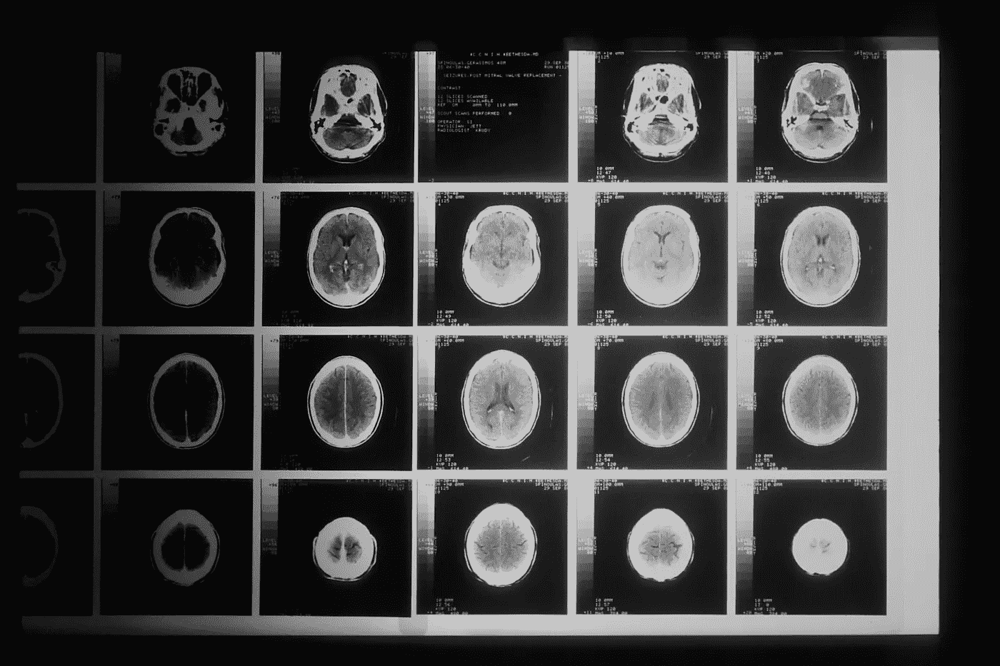

# 为什么简单模型往往更好

> 原文：[`towardsdatascience.com/why-simple-models-are-often-better-e2428964811a`](https://towardsdatascience.com/why-simple-models-are-often-better-e2428964811a)

## 奥卡姆剃刀在数据科学和机器学习中的重要性

 [Thomas A Dorfer](https://thomasdorfer.medium.com/?source=post_page-----e2428964811a--------------------------------)

·发表于 [Towards Data Science](https://towardsdatascience.com/?source=post_page-----e2428964811a--------------------------------) ·8 分钟阅读·2023 年 1 月 26 日

--

摄影：[Pablo Arroyo](https://unsplash.com/@pablogamedev) 在 [Unsplash](https://unsplash.com/photos/_SEbdtH4ZLM)

在数据科学和机器学习中，简洁是一个重要概念，对模型的性能和可解释性等特性有着显著影响。过度工程化的解决方案往往会通过增加过拟合的可能性、降低计算效率和减少模型输出的透明度，从而对这些特性产生不利影响。

后者对于需要一定解释性领域尤为重要，如医学和医疗保健、金融或法律。无法解释和信任模型的决策，并确保这一决策公平无偏，对那些命运依赖于此的个人可能带来严重后果。

本文旨在强调在实施数据科学或机器学习解决方案时优先考虑简洁性的重要性。我们将首先介绍**奥卡姆剃刀**的原则，然后深入探讨简洁性的优势，并最终确定何时需要增加复杂性。

# 奥卡姆剃刀

奥卡姆剃刀，也称为*简约法则*，是一个哲学问题解决原则，归功于 14 世纪的英语哲学家和神学家威廉·奥卡姆。原始原则通常被引用为*Entia non sunt multiplicanda praeter necessitatem*，大致翻译为“实体不应超出必要性而被增多”。

摄影：[Hair Spies](https://unsplash.com/@hairspies) 在 [Unsplash](https://unsplash.com/photos/mXw0CfTPUrM)

在数据科学和机器学习领域，这通常被解释为“简单模型通常比复杂模型更受青睐”或“在其他条件相同的情况下，最简单的解决方案往往是最好的”。奥卡姆剃刀中的 *剃刀* 象征着“剃去”不必要的复杂性和假设。

# 简单解决方案的优势

## 减少过拟合的敏感性

简单模型的主要优势之一是它们不易过拟合。过拟合发生在模型变得过于复杂并开始拟合训练数据中的噪声，而不是潜在的模式。这通常会导致在未见数据上的表现不佳，结果是模型的泛化能力差，应用性有限。

可以应用几种技术来获得对过拟合敏感性较低的模型：

+   **交叉验证：** 模型在训练集上训练，并在独立的验证集上评估其性能。最常见的类型是 k 折交叉验证，其中数据被分成 *k* 个子集，模型在 *k-1* 个子集上训练，并最终在剩余的子集（验证集）上进行评估。

+   **数据增强：** 较大的数据集往往能减少过拟合。然而，如果没有大数据，可以通过生成人工或合成数据来增强现有数据。具体过程取决于数据的性质。例如，在处理图像数据时，可以通过对图像应用旋转、翻转、缩放等变换来增加数据量。

+   **正则化：** 这种技术通过在损失函数中添加惩罚项来限制模型的参数。最常见的技术是 L1（Lasso）正则化和 L2（Ridge）正则化。L1 正则化可以导致一些模型权重被设置为零，从而有效地从模型中移除这些特征，而 L2 正则化仅将权重渐近地减少到零，结果是所有特征都被用来决定模型输出。此外，dropout 是一种常用于神经网络的正则化方法，在每次训练迭代中，随机将一定比例的神经元设置为零。这确保了剩余的神经元学习到更强大的特征，因为它们不再依赖被丢弃的神经元来承担预测的负担。

+   **特征选择：** 从训练数据中删除被认为是冗余或不相关的特征将不可避免地简化模型并提高其计算性能。特征可以通过领域知识手动删除，也可以通过单变量过滤、基于树的特征重要性、递归特征消除等方法删除。

+   **降维：** 与特征选择类似，降维技术如主成分分析（PCA）、线性判别分析（LDA）或 t 分布随机邻居嵌入（tSNE）将输入维度减少到模型中。然而，它们返回的特征要么是原始特征的线性组合，要么是非线性组合，这会减少模型的可解释性，因为很难确定哪些原始特征对模型的决策做出了贡献。

+   **早停法：** 这是应用于神经网络的一种方法，当模型在验证集上的性能开始下降时，停止模型训练。本质上，它通过在模型变得过于复杂之前停止训练来防止过拟合。

+   **减少模型复杂性：** 选择一个初始参数较少、架构更简单的模型也可以显著有助于防止过拟合。

## 提高计算效率

更简单的模型通常能提升计算性能。这种提升主要通过模型需要**更少的参数**、**更少的计算**和**更低的内存使用**来实现。

在模型部署方面，这也可能带来显著的好处。由于更简单的模型通常具有较低的推理时间和内存使用，因此它们可以更容易地部署到资源受限的设备，如智能手机和智能手表，从而可能建立一个新的客户群体。

例如，在自然语言处理领域，简单的 n-gram 模型已被证明能够与其神经网络模型表现相当，同时速度明显更快。[Doval & Gómez‐Rodríguez（2019）](https://www.ncbi.nlm.nih.gov/pmc/articles/PMC6360409/)比较了递归神经网络和 n-gram 模型在词汇分割任务上的表现，发现 n-gram 模型的精度几乎与神经网络方法相当。此外，n-gram 模型在执行时间上显著优于递归神经网络。

同样，在光学字符识别中，简单的 k 近邻（kNN）算法已被证明在某些任务上具有与卷积神经网络（CNNs）相似的准确度，同时执行时间显著较短。例如，[Sharma 等（2022）](https://www.ncbi.nlm.nih.gov/pmc/articles/PMC9307347/)评估了各种分类器在手写数字识别任务上的性能，发现虽然 CNN 的准确度为 98.83%，但轻量级 kNN 的表现几乎一样好，准确度为 97.83%，同时具有更好的计算性能。

## 提高可解释性

能够解释模型的决策，并确保这些决策**不不公平或有偏见**，这是至关重要的，尤其是在那些结果可能对个人造成严重后果的领域。

在**医学影像**领域，例如，医生能够解释、理解并信任他们的模型结果是很重要的。如果放射科医生无法确认或反驳模型对癌症诊断的负面预测，他们可能会要求进一步的检查——一些需要侵入性程序——以确立诊断。如果这些检查最终确认患者没有癌症，可以说，由于模型的不可解释性，患者暴露于不必要的侵入性程序中，而这些程序本可以避免，如果放射科医生能在最初就信任模型的决定。

图片由[国家癌症研究所](https://unsplash.com/@nci)提供，发布在[Unsplash](https://unsplash.com/photos/BDKid0yJcAk)

类似地，预测模型的输出可以决定癌症患者是否接受治疗。显然，这些结果对相关个人可能有重大后果，因此模型必须足够简单，以便透明和可信。

在**信用评分**中，一个不透明的模型可能会产生与现实完全脱节的偏见结果。想象一个旨在预测信用 worthiness 的模型，如果它在包含各种偏见的历史数据上训练，就会导致它偏向某些群体。如果一个来自被低估群体的人申请贷款，该模型可能会认为他们是高风险借款人，从而拒绝申请，即使他们实际上有良好的信用记录。这种模型缺乏可解释性可能严重影响那些计划购买房屋、创业或探索需要一些初始资本的机会的个人。

图片由[艾蒂安·马丁](https://unsplash.com/@etiennemartin)提供，发布在[Unsplash](https://unsplash.com/photos/2_K82gx9Uk8)

相同的原则适用于**刑事司法**领域。想象一个用于预测个人再犯罪概率的模型，这个模型基于个人信息、犯罪历史和各种其他因素。如果该模型在偏见数据上训练，它可能会偏向社会经济地位较高的群体，因此预测其他群体的再犯罪可能性更高。来自低社会经济地位的个人可能因此被拒绝保释并继续拘留，即使实际上他们可能再犯罪的风险非常低。再次强调，使用一个既简单又透明的模型可以减少这些不良结果的概率。

在上述所有类别中，实现更高可解释性的最简单方法是选择更简单的模型。例如，选择基于决策树的算法而不是复杂的神经网络，可以显著提高输出的透明度，因为内部树结构可以轻松可视化。这使得个别决策可以被追溯，从而提供有关特定预测形成过程的关键见解。这使得决策树在预测错误可能产生严重后果的领域（如上述所列）中广泛适用。

# 复杂性必要时

虽然简单*通常*更好，但这并非总是如此。一个过于简单的模型可能会遗漏特征与目标变量之间的相关关系，*最终*导致欠拟合。

在处理具有**非线性关系**的**大规模高维数据集**时，可能需要更复杂的模型，如神经网络，以捕捉数据中的潜在模式。

某些应用可能还具有**高准确性要求**，简单模型无法满足。当实施更复杂的模型以提高性能时，结果通常是透明度降低。因此，找到**模型性能与可解释性之间的平衡**也很重要。例如，在医学影像中，高准确性对于检测异常和做出有关患者生命的决策至关重要。然而，如上所述，同样重要的是医生能够理解、解释和信任这些决策，以建立可靠的诊断程序。

# 结论

尽管简单模型确实不是所有问题的万灵药，但在需要高可解释性和计算效率时，它们是首选。此外，它们往往能防止过拟合，从而提高模型的泛化能力和适用性。

在某些情况下，确实有必要增加解决方案的复杂性。当处理高维非线性数据或当解决方案需要高度准确性而简单模型难以实现时，这种情况尤为常见。

# 参考文献

[1] Doval & Gómez‐Rodríguez (2019). “比较神经网络与 N-gram 语言模型进行词语分割*”。* J Assoc Inf Sci Technol, 70(2): 187–197.

[2] Sharma (2022). “识别手写数字的机器学习和深度学习方法*”。* Comput Intell Neurosci, doi: 10.1155/2022/9869948.
