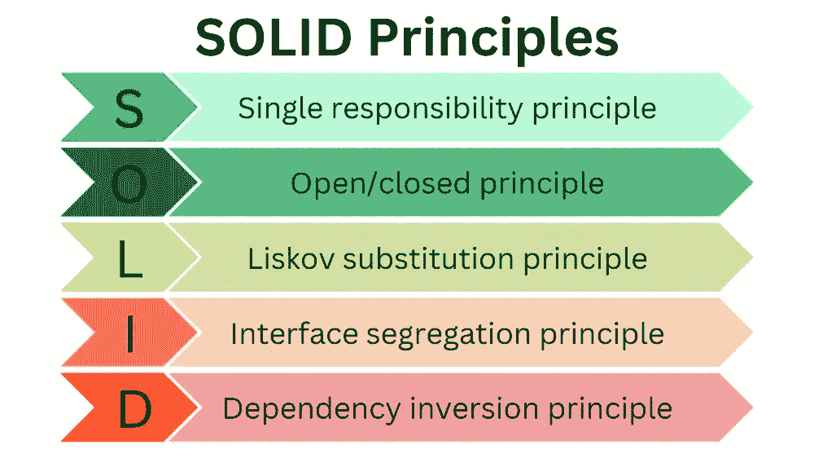

# 为什么 SOLID 设计很重要：避免代码异味并编写可维护的代码

> 原文：[`towardsdatascience.com/why-solid-design-matters-avoid-code-smells-and-write-maintainable-code-553b3c6c0ca8`](https://towardsdatascience.com/why-solid-design-matters-avoid-code-smells-and-write-maintainable-code-553b3c6c0ca8)

## 使用 SOLID 原则来设计可读、可扩展和易于维护的软件

[](https://medium.knulst.de/?source=post_page-----553b3c6c0ca8--------------------------------)[](https://towardsdatascience.com/?source=post_page-----553b3c6c0ca8--------------------------------) [Paul Knulst](https://medium.knulst.de/?source=post_page-----553b3c6c0ca8--------------------------------)

·发布于 [Towards Data Science](https://towardsdatascience.com/?source=post_page-----553b3c6c0ca8--------------------------------) ·阅读时间约 11 分钟·2023 年 1 月 6 日

--


照片由 [Markus Spiske](https://unsplash.com/@markusspiske?utm_source=unsplash&utm_medium=referral&utm_content=creditCopyText) / [Unsplash](https://unsplash.com/s/photos/code-javascript?utm_source=unsplash&utm_medium=referral&utm_content=creditCopyText) 提供

# 引言

SOLID 是面向对象设计的五个原则的首字母缩略词，这些原则最早由**Robert C. Martin**在 2000 年代初期提出。这些原则可以帮助开发人员创建更易于维护和扩展的软件系统。五个原则是：



所有五个 SOLID 原则——由作者可视化

在本文中，我想展示 SOLID 原则在构建可读和可维护的软件应用程序中的威力。此外，我还将提供如何使用 TypeScript 应用 SOLID 原则的实际示例。

这些例子将展示如何使用 SOLID 原则来设计和构建更好、更具可扩展性的应用程序。

无论你是开发人员、数据科学家，还是去中心化应用的用户，这些例子都将为你提供应用 SOLID 原则于代码中的宝贵起点。

# 单一职责原则

> 每个模块应当有且仅有一个变更的理由。
> 
> - **Robert C. Martin**

单一职责原则是一个面向对象设计的原则，规定一个类或模块应当只有一个职责或变更的理由。这意味着一个类应该有明确的范围，并且不应承担过多职责。

在 TypeScript 中，单一职责原则可以通过将一个大型复杂类划分为更小且更专注的类来应用，每个类都有其明确的职责。例如，考虑一个负责管理用户账户信息的类，包括他们的个人资料细节、偏好设置和支付信息。这个类可能有许多处理用户账户不同方面的方法，例如更新个人资料、管理偏好设置和处理支付。

为了应用单一职责原则，我们可以将这个大型类拆分为几个较小的类，每个类都有特定的职责。例如，我们可以有一个 `UserProfile` 类，负责管理用户个人资料信息，一个 `UserPreferences` 类，负责管理他们的偏好设置，以及一个 `UserPayments` 类，负责处理他们的支付。每个类都有一个狭义的范围，它们比原来的单体类更容易维护和扩展。

下面是这些类在 TypeScript 中可能实现的示例：

```py
class UserProfile {
  constructor(userId) {
    this.userId = userId;
  }

  loadProfile() {
    // load the user's profile details from the database
  }

  updateProfile(data) {
    // update the user's profile details in the database
  }
}

class UserPreferences {
  constructor(userId) {
    this.userId = userId;
  }

  loadPreferences() {
    // load the user's preferences from the database
  }

  updatePreferences(data) {
    // update the user's preferences in the database
  }
}

class UserPayments {
  constructor(userId) {
    this.userId = userId;
  }

  loadPaymentMethods() {
    // load the user's payment methods from the database
  }

  processPayment(data) {
    // process a payment for the user using the specified payment method
  }
}
```

在这个示例中，每个类都有一个狭义的职责和一个明确的接口。`UserProfile` 类负责管理用户个人资料信息，`UserPreferences` 类负责管理他们的偏好设置，而 `UserPayments` 类负责处理他们的支付。

这使得理解每个类的目的和行为变得更容易，同时也使得扩展和维护代码变得更加简单。

# 开放/封闭原则

> 模块应该对扩展开放，但对修改封闭。
> 
> - 罗伯特·C·马丁

开放/封闭原则是面向对象设计的一项原则，表示一个类应该对扩展开放，但对修改封闭。这意味着该类应该以某种方式设计，以便可以通过继承或组合添加新行为，而无需更改现有代码。

在 TypeScript 中，可以使用抽象类、接口和多态性来应用开放/封闭原则，以创建灵活且可扩展的设计。例如，考虑一个简单的 `Shape` 类，表示不同的几何形状，如圆形、正方形和三角形。这个类可能有一个 `draw()` 方法，可以用来在屏幕上渲染任何形状。

为了应用开放/封闭原则，我们可以定义一个抽象的 `Shape` 类，该类包含所有形状的共享行为，例如 `draw()` 方法。然后，我们可以为每种特定类型的形状定义子类，例如 `Circle`、`Square` 和 `Triangle`，这些子类继承自 `Shape` 类并重写 `draw()` 方法以提供其特定行为。

下面是如何在 TypeScript 中实现这一点的示例：

```py
// define the abstract Shape class
class Shape {
  constructor() {}

  // the draw() method is abstract and must be implemented by subclasses
  draw() {
    throw new Error('The draw() method must be implemented by a subclass.');
  }
}

// define the Circle class, which extends the Shape class
class Circle extends Shape {
  constructor(radius) {
    super();
    this.radius = radius;
  }

  draw() {
    // draw a circle with the specified radius
  }
}

// define the Square class, which extends the Shape class
class Square extends Shape {
  constructor(sideLength) {
    super();
    this.sideLength = sideLength;
  }

  draw() {
    // draw a square with the specified side length
  }
}

// define the Triangle class, which extends the Shape class
class Triangle extends Shape {
  constructor(sideLengths) {
    super();
    this.sideLengths = sideLengths;
  }

  draw() {
    // draw a triangle with the specified side lengths
  }
}
```

在这个例子中，`Shape` 类是开放扩展的，因为可以定义新的子类来添加新行为。我们可以定义一个 `Rectangle` 类，扩展 `Shape` 类并重写 `draw()` 方法来提供其特定行为。然而，`Shape` 类是封闭修改的，因为我们不能在不破坏扩展它的子类的情况下更改 `Shape` 类中的现有代码。

这使得代码更加灵活和可维护，因为我们可以在不改变现有代码的情况下添加新行为。

# 里氏替换原则

> 使用接口/协议来分离可替换的部分。
> 
> - 罗伯特·C·马丁

里氏替换原则是面向对象设计的一个原则，指出程序中的对象应该可以用其子类型的实例来替换，而不会改变程序的正确性。这意味着子类应该能够扩展或重写其父类的行为，而不破坏父类的合同。

换句话说，里氏替换原则是一种确保子类型可以替代其基类型的方式，这意味着任何编写为使用基类型的程序，在使用子类型时应该能够正常运行，而无需修改。

在 TypeScript 中，通过定义一个类并确保子类扩展它，可以应用里氏替换原则。例如，考虑一个简单的 `Vehicle` 类，它表示不同类型的车辆，如汽车、摩托车或船只。这个 `Vehicle` 类可能包括 `startEngine()` 方法，以及所有车辆共有的其他方法或属性。然后，我们可以为每种具体类型的车辆定义子类，如 `Car` 或 `Motorcycle`，这些子类扩展了 `Vehicle` 类，并提供 `startEngine()` 方法的具体行为。

下面是如何在 TypeScript 中实现这一点的示例：

```py
class Vehicle {
  startEngine() {
    throw new Error('The startEngine() method must be implemented by a subclass.');
  }

  stopEngine() {
    throw new Error('The stopEngine() method must be implemented by a subclass.');
  }
}

class Car extends Vehicle {
  startEngine() {
    console.log("Starting the engine of a car");
  }

  stopEngine() {
    console.log("Stopping the engine of a car");
  }
}

class Motorcycle extends Vehicle {
  startEngine() {
    console.log("Starting the engine of a motorcycle");
  }

  stopEngine() {
    console.log("Stopping the engine of a motorcycle");
  }
}

function useVehicle(vehicle) {
  vehicle.startEngine();
  // Do some other stuff with the vehicle...
  vehicle.stopEngine();
}

const vehicle = new Car();
useVehicle(vehicle);

const vehicle = new Motorcycle();
useVehicle(vehicle);
```

在这个例子中，`Car` 和 `Motorcycle` 类是 `Vehicle` 类的子类型。`useVehicle()` 函数期望一个 `Vehicle` 类型的对象，但由于里氏替换原则，我们可以将 `Car` 或 `Motorcycle` 类型的对象传递给这个函数，它将正确工作。

这是因为 `Car` 和 `Motorcycle` 可以替代 `Vehicle` —— 即 `Car` 和 `Motorcycle` 类型的对象可以在期望 `Vehicle` 类型对象的地方使用，而不会改变程序的期望属性。

# 接口分离原则

> 客户不应该被迫依赖他们不使用的接口。” — 罗伯特·C·马丁

接口隔离原则是面向对象设计的一项原则，它说明对象的客户端不应被迫依赖于他们不使用的方法。这意味着一个类的接口应该设计成每个接口都服务于特定的目的并被特定的客户端使用。这个原则有助于减少程序中的未使用代码，使程序更加高效和易于维护。

这个原则的动机是避免单一接口的问题，这种接口定义了许多可能对所有客户端不相关的方法。这可能导致客户端代码膨胀且难以维护，因为它被迫实现或模拟未使用的方法以满足接口契约。

为了应用接口隔离原则，最好定义多个小而集中的接口，而不是一个单一的庞大接口。这允许每个客户端只实现必要的方法，而不被迫实现未使用的方法。这可以导致一个更加模块化和易于维护的设计，因为接口与其客户端的需求更紧密地对齐。

在 TypeScript 中，接口隔离原则可以通过为程序中的每种对象类型创建小而具体的接口来实现。

例如，考虑一个有两种类型对象的程序：`Cat` 和 `Fish`。一个鱼对象可能有一个 `eat()` 方法，而猫对象可能有 `eat()` 和 `move()` 方法。为了遵循接口隔离原则，我们可以为 `Cat` 和 `Fish` 创建两个独立的接口，每个接口都有其独特的方法：

```py
interface Eating {
  eat(): void;
}

interface Moving {
  move(): void;
}

class Cat implements Eating, Moving {
  eat() {
    console.log('cat eats');
  }

  move() {
    console.log('cat moves')
  }
}

class Fish implements Eating {
  eat() {
    console.log('fish eats')
  }
}
```

在这个例子中，定义了 `Eating` 和 `Moving` 接口。`Eating` 接口有一个方法 `eat()`，而 `Moving` 接口有一个方法 `move()`。

`Cat` 类被定义为 `Eating` 和 `Moving` 的子类型——也就是说，它实现了这两个接口。这意味着 `Cat` 类需要具体实现 `eat()` 和 `move()` 方法。

`Fish` 类被定义为 `Eating` 接口的一个子类型。这意味着 `Fish` 类只需要实现 `eat()` 方法。`Fish` 类提供了该方法的实现，但不需要实现 `move()` 方法，因为鱼的移动方式与其他动物不同。

接口隔离原则通过将大型、通用的接口拆分为更小、更具体的接口，帮助改善程序的设计。

这可以使程序更加高效并且更容易维护。

# 依赖倒置原则

> 实体必须依赖于抽象，而不是具体实现。这说明高层模块不应依赖于低层模块，而应依赖于抽象。
> 
> - 罗伯特·C·马丁

依赖倒置原则是一个软件设计原则，它指出高层模块不应该依赖于低层模块，而是两者都应该依赖于抽象。这个原则有助于提高程序的灵活性和可维护性，使程序的不同部分能够独立演进。

在 TypeScript 中，可以通过定义抽象（接口或抽象类）来应用依赖倒置原则，这些抽象定义了程序不同部分的合同。例如，考虑一个有 `Database` 类和 `UserService` 类的程序。`UserService` 类可能依赖于 `Database` 类来存储和检索用户数据。为了遵循依赖倒置原则，我们可以定义一个抽象 `DataStore` 接口，`Database` 类实现这个接口，并让 `UserService` 类依赖于 `DataStore` 接口，而不是直接依赖 `Database` 类。这样，`UserService` 类就不会绑定到具体的数据存储实现上，可以与任何实现了 `DataStore` 接口的类一起使用：

```py
// DataStore interface
interface DataStore {
  get(id: string): any;
  set(id: string, data: any): void;
}

// Database class
class Database implements DataStore {
  // Implementation of DataStore methods
}

// UserService class
class UserService {
  constructor(private dataStore: DataStore) { }

  getUser(id: string) {
    return this.dataStore.get(id);
  }

  saveUser(user: any) {
    this.dataStore.set(user.id, user);
  }
}
```

在这个例子中，`UserService` 类依赖于 `DataStore` 接口，并且可以与任何实现该接口的类一起使用。这使得我们可以在不影响 `UserService` 类的情况下更改 `Database` 类的实现，或使用任何实现了 `DataStore` 接口的不同类。

如果应用依赖倒置原则，程序的设计将通过将高层模块与低层模块解耦，并使两者都依赖于抽象来得到改善。

这可以使程序更具灵活性，更容易维护。

# 小心！避免常见误解

不幸的是，关于 SOLID 原则存在一些误解，并且这些原则很容易被错误使用。

一个常见的误解是，这些原则应该盲目遵循，而不考虑当前项目的具体需求和限制。但实际上，这些原则是可以帮助开发者创建更具可维护性和可扩展性的指导方针。SOLID 原则应始终谨慎和有判断地应用。

例如，为了提高类的性能或简洁性，单一责任原则有时会被违反。

另一个常见的误解是，SOLID 原则只适用于面向对象的语言，如 Kotlin、TypeScript、Java 或 C++。这是错误的，因为这些原则是与语言无关的，可以应用于任何软件系统，无论使用的是何种编程范式或语言。

记住，SOLID 原则并不是一个能够解决软件设计中每一个问题的灵丹妙药。这些原则只是众多工具中的一个，可以帮助开发者创建更好的软件。

**它们应该与其他设计原则和实践一起使用，例如重构、测试和持续集成。**

# 结束语

总之，SOLID 原则是一套指导方针，可以帮助开发人员通过专注于创建单一目的、封装良好且易于修改的类和模块，来创建更具可维护性、可扩展性和易于理解的软件。

通过遵守 SOLID 原则，开发人员可以通过编写更易于维护和随时间适应的代码，从长远来看节省时间和精力。

需要明白的是，这些原则不应在所有情况下严格遵循。它们应该被视为可以根据项目的具体用例以不同方式应用的指导方针。

作为开发人员，以灵活和开放的心态对待 SOLID 原则是很重要的。这样，你可以充分利用这些指导方针，并用它们来创建更好的软件。

此外，SOLID 原则在软件设计中并不是新颖或革命性的想法。这些原则基于几十年的面向对象设计经验和研究，并且建立在许多前辈软件开发人员和研究者的工作基础上。

如果你想深入了解如何开发可读、可扩展和可维护的代码，可以查看这个视频（以及接下来的 5 个视频）。这是 Robert C. Martin 的《Coding Better World Together》的第一课，他推广了 SOLID 原则。

Robert C. Martin 的《Coding Better World Together》的第一课

最后，你对 SOLID 原则有什么看法？另外，你是否对这五个原则中的任何一个有疑问？我很愿意听听你的想法并回答你的问题。请在评论中分享你的想法。

欢迎在[我的博客](https://www.paulsblog.dev)、[LinkedIn](https://www.linkedin.com/in/paulknulst/)、[Twitter](https://twitter.com/paulknulst)和[GitHub](https://github.com/paulknulst)上与我联系。
