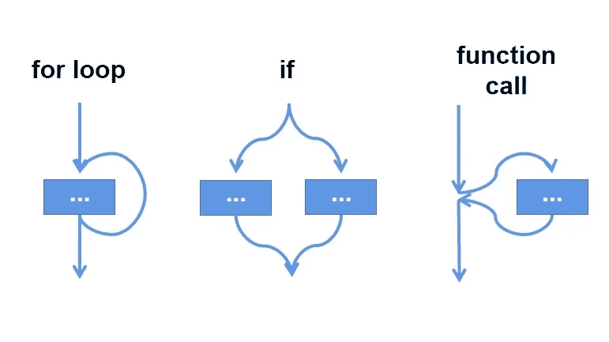
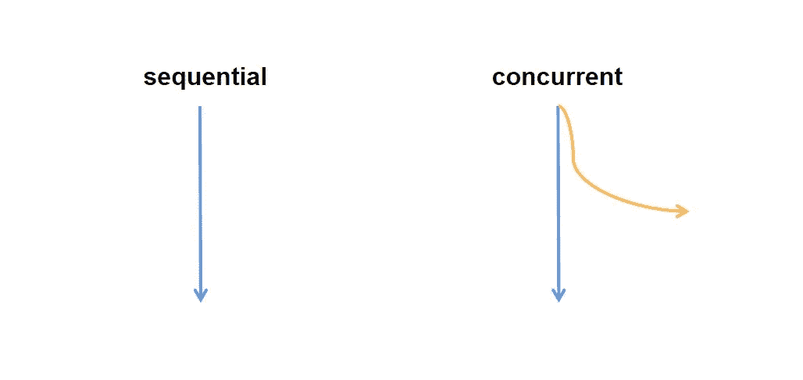
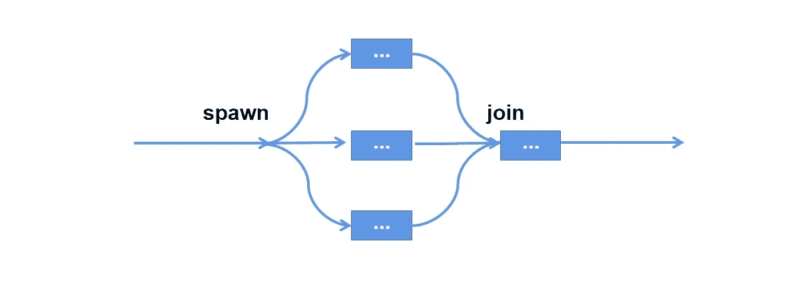
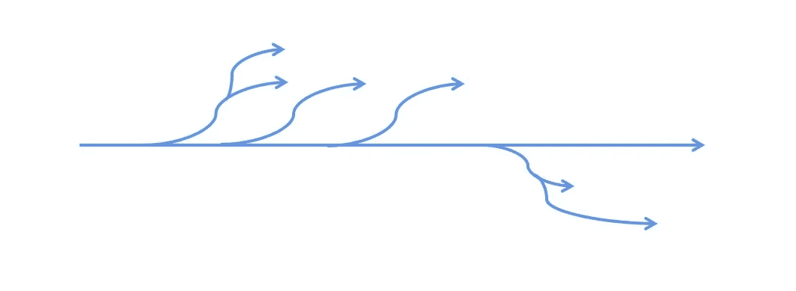

# 为什么 Taskgroup 和 Timeout 在 Python 3.11 Asyncio 中如此重要

> 原文：[`towardsdatascience.com/why-taskgroup-and-timeout-are-so-crucial-in-python-3-11-asyncio-c424bcc88b89`](https://towardsdatascience.com/why-taskgroup-and-timeout-are-so-crucial-in-python-3-11-asyncio-c424bcc88b89)

## [PYTHON CONCURRENCY](https://medium.com/@qtalen/list/python-concurrency-2c979347da3b)

## 拥抱 Python 3.11 中的结构化并发

 [Peng Qian](https://qtalen.medium.com/?source=post_page-----c424bcc88b89--------------------------------)

·发表于[Towards Data Science](https://towardsdatascience.com/?source=post_page-----c424bcc88b89--------------------------------) ·阅读时间 6 分钟·2023 年 4 月 12 日

--

图片由[Brett Jordan](https://unsplash.com/@brett_jordan?utm_source=medium&utm_medium=referral)提供，[Unsplash](https://unsplash.com/?utm_source=medium&utm_medium=referral)

# **Python 3.11 asyncio 包的新功能**

## **1\. 介绍**

在去年的 Python 3.11 版本中，asyncio 包添加了`TaskGroup`和`timeout`API。这两个 API 引入了官方的结构化并发功能，帮助我们更好地管理并发任务的生命周期。今天，我将向你介绍这两个 API 的使用以及 Python 引入结构化并发后对我们并发编程的重大改进。

## **2\. TaskGroup**

`TaskGroup` 是使用异步上下文管理器创建的，并且可以通过`create_task`方法将并发任务添加到组中，如下代码示例所示：

当上下文管理器退出时，它会等待组中的所有任务完成。在等待期间，我们仍然可以向`TaskGroup`添加新任务。

请注意，假设组中的一个任务在等待时抛出`asyncio.CancelledError`之外的异常，组中的所有其他任务将被取消。

此外，除了`asyncio.CanceledError`之外的所有异常将被合并并抛出在`ExceptionGroup`中。

## **3\. 超时**

`asyncio.timeout` 也是使用异步上下文管理器创建的。它限制了在上下文中并发代码的执行时间。

假设我们需要为单个函数调用设置超时，那么调用`asyncio.wait_for`就足够了：

但当需要为多个并发调用设置统一的超时时间时，问题就会出现。假设我们有两个并发任务，并希望它们在 8 秒内完成。让我们尝试为每个任务分配一个平均超时时间为 4 秒的设置，代码如下：

你可以看到，尽管我们为每个并发方法设置了平均超时，但这种设置可能会导致不可控的情况，因为对 IO 绑定任务的每次调用无法保证同时返回，我们仍然遇到了`TimeoutError`。

在这时，我们使用`asyncio.timeout`块来确保为所有并发任务设置一个整体超时：

## **4\. 结构化并发是什么**

`TaskGroup` 和 `asyncio.timeout` 上述使用了`async with`特性。就像`with`结构块一样，可以统一管理资源的生命周期：

但在`with`块中调用并发任务不起作用，因为并发任务会在背景中继续执行，而`with`块已经退出，这将导致资源的不当关闭：

因此，我们在这里引入了`async with`特性。像*with*、*async with* 和 `TaskGroup` 用于统一管理并发代码的生命周期，从而使代码更清晰并节省开发时间。我们称这个特性为我们今天的主角：[**结构化并发**](https://en.wikipedia.org/wiki/Structured_concurrency)。

# **为什么结构化并发如此重要**

## **1\. 并发编程的历史**

在并发编程出现之前，我们的代码是串行执行的。代码会根据调用栈的顺序依次执行`for_loop`循环、`if_else`条件分支和函数调用。

作者图片

然而，随着代码执行速度对计算效率的要求越来越高，以及计算机硬件的显著发展，逐渐出现了并行编程（CPU 绑定）和并发编程（IO 绑定）。

在协程出现之前，Python 程序员使用线程来实现并发编程。但 Python 的线程存在一个问题，即 GIL（全局解释器锁），GIL 的存在使得基于线程的并发无法达到预期的性能。

因此，`asyncio` 协程应运而生。没有全局解释器锁（GIL）和线程间切换，并发执行变得更加高效。如果线程是由 CPU 控制的基于时间片的任务切换，那么协程则是将子任务的创建和切换交到程序员自己手中。虽然程序员享受了便利，但也遇到了一系列新问题。

## **2\. 并发编程模型的问题**

正如[这篇文章](https://vorpus.org/blog/notes-on-structured-concurrency-or-go-statement-considered-harmful/)中详细描述的，并发编程引发了有关控制流的几个问题。

并发编程是在主线程中打开多个分支进程。这些分支任务在后台默默地执行网络请求、文件访问、数据库查询等工作。

并发编程将把我们的代码流程从这样改变成这样：

作者提供的图片

根据编程中的“低耦合，高内聚”原则，我们都希望在执行后将所有后台任务集中在一个模块中，如下所示：

作者提供的图片

但实际上，由于多个成员开发我们的应用程序或调用了许多第三方组件，我们需要知道哪些任务仍在后台执行，哪些任务已经完成。一个后台任务很可能会分支成几个其他的分支任务。

终极目标是这些分支任务需要被调用者找到，并等待其执行完成，因此变成了这样：

作者提供的图片

虽然这不是[漫威的多元宇宙](https://en.wikipedia.org/wiki/Multiverse_(Marvel_Comics))，但目前的情况就像多元宇宙一样，给我们的自然世界带来了绝对的混乱。

有读者表示，`asyncio.gather` 可以负责合并所有后台任务。但`asyncio.gather`也有其问题：

+   它无法以统一的方式集中管理后台任务。通常是在一个地方创建后台任务，而在另一个地方调用`asyncio.gather`。

+   `asyncio.gather` 接收的参数`aws`是一个固定列表，这意味着在调用`asyncio.gather`时，我们已设置后台任务的数量，它们无法在等待过程中随意添加。

+   当任务在`asyncio.gather`中等待时抛出异常时，它无法取消正在执行的其他任务，这可能导致一些任务在后台无限运行，程序错误地终止。

因此，Python 3.11 引入的结构化并发特性是解决我们并发问题的**绝佳**方案。它允许相关的异步代码在同一位置完成执行，同时，它还使`tg`实例能够作为参数传递给后台任务，从而使在后台任务中创建的新后台任务不会跳出当前异步上下文的生命周期管理。

因此，结构化并发是对 Python asyncio 的**革命性**改进。

# **与其他实现结构化并发的库的比较**

结构化并发并不是 Python 3.11 中首个此类特性；在 3.11 之前，我们已经有几个并发基础的包很好地实现了这个特性。

## **1\. Trio 中的托儿所**

[Trio](https://trio.readthedocs.io/en/stable/) 是 Python 世界中首个提出结构化并发的库，在 Trio 中，API `open_nursery` 被用来实现这个目标：

## **2\.** `**create_task_group**` **在 Anyio 中**

但随着官方 Python asyncio 包的出现，越来越多的第三方包使用 asyncio 实现并发编程。在这一点上，使用 Trio 不可避免地会遇到兼容性问题。

此时，声称兼容 asyncio 和 Trio 的 [Anyio](https://anyio.readthedocs.io/en/stable/index.html) 出现了。它还可以通过 `create_task_group` API 实现结构化并发：

## **3\. 在低版本 Python 中使用 quattro**

如果您希望在未来轻松享受 Python 3.11 asyncio 的便利，保持代码本地化，有一个不错的替代方案，[quattro](https://github.com/Tinche/quattro)，其星标较少，风险较低。

# **结论**

Python 3.11 引入的 TaskGroup 和 timeout APIs 为我们带来了官方的结构化并发功能。

通过结构化并发，我们可以使并发编程代码更好地抽象化，程序员可以更容易地控制后台任务的生命周期，从而提高编程效率并避免错误。

由于经验有限，如果本文中关于并发编程或结构化并发的内容有遗漏，或者您有更好的建议，请发表评论。我会很感激并回答您。

在下一篇文章中，我们将讨论在 asyncio 中使用不同 APIs 的并发编程最佳实践。您可以在这里阅读：

 [## 使用这些方法提升你的 Python 并发任务表现]

### asyncio.gather、asyncio.as_completed 和 asyncio.wait 的最佳实践

towardsdatascience.com](/use-these-methods-to-make-your-python-concurrent-tasks-perform-better-b693b7a633e1?source=post_page-----c424bcc88b89--------------------------------)

通过 [加入 Medium](https://medium.com/@qtalen/membership)，您将能够无限制地访问我所有的帖子以及其他成千上万作者的帖子。这只需一杯咖啡的价格，对我来说是极大的鼓励。

本文最初发布于：[`www.dataleadsfuture.com/why-taskgroup-and-timeout-are-so-crucial-in-python-3-11-asyncio/`](https://www.dataleadsfuture.com/why-taskgroup-and-timeout-are-so-crucial-in-python-3-11-asyncio/)
