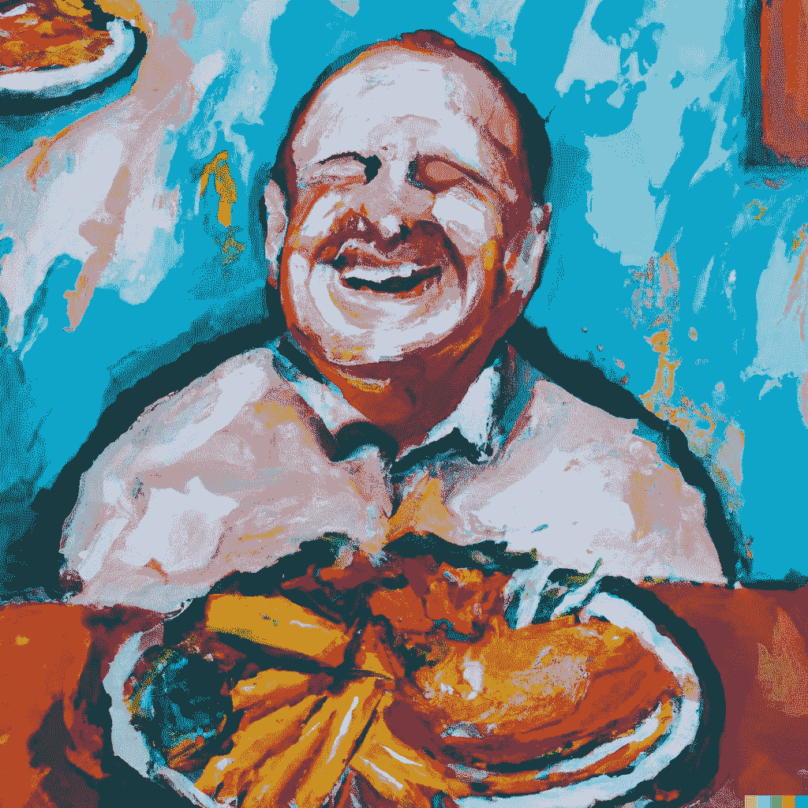
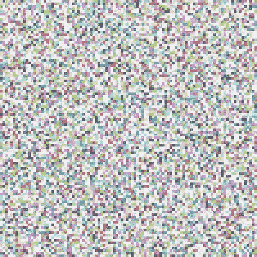
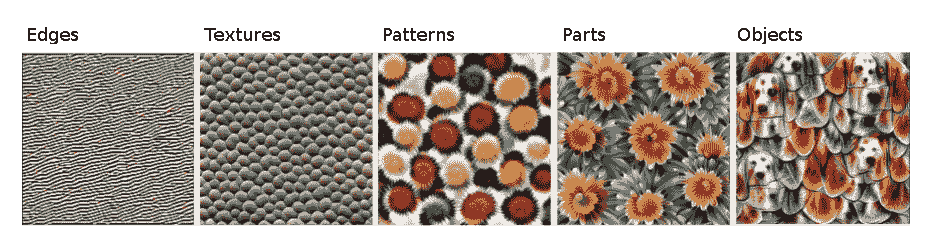
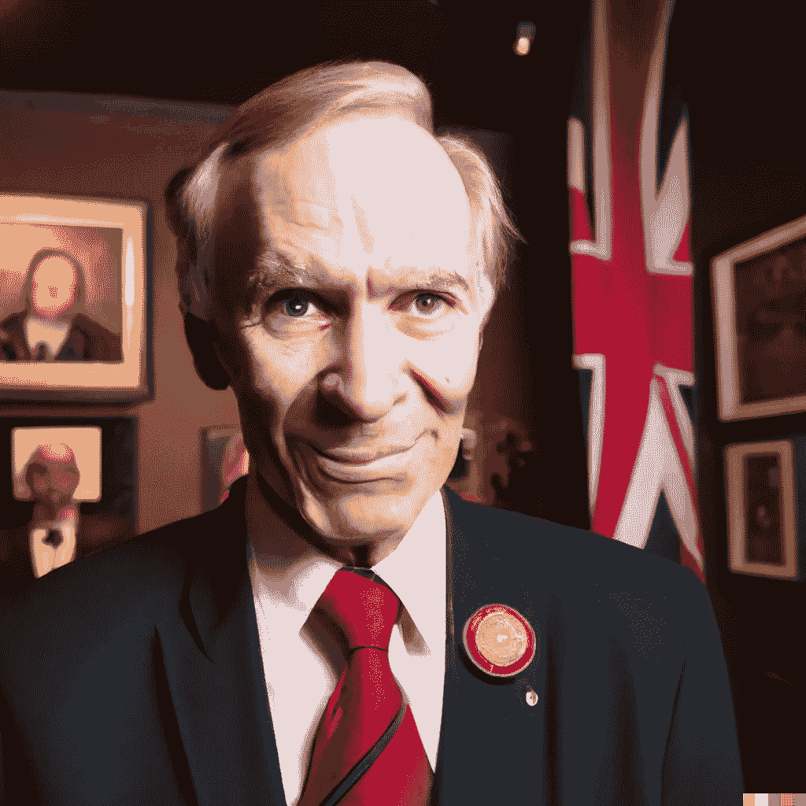
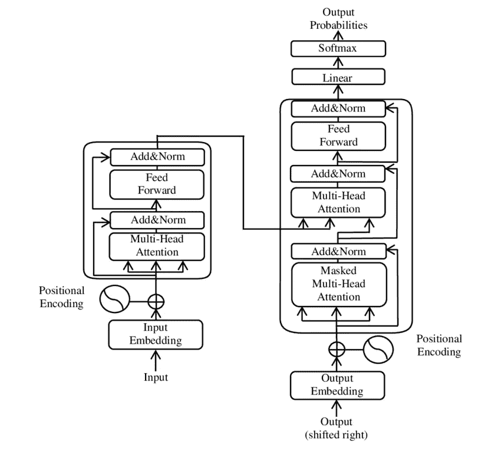

# 为什么似乎存在“免费午餐”

> 原文：[`towardsdatascience.com/why-there-kind-of-is-free-lunch-56f3d3c4279f`](https://towardsdatascience.com/why-there-kind-of-is-free-lunch-56f3d3c4279f)

## 神经科学与人工智能中模式的普遍性

 [Manuel Brenner](https://manuel-brenner.medium.com/?source=post_page-----56f3d3c4279f--------------------------------)

·发表在 [Towards Data Science](https://towardsdatascience.com/?source=post_page-----56f3d3c4279f--------------------------------) ·11 分钟阅读·2023 年 6 月 27 日

--

> **‘没有所谓的免费午餐。’
> 
> - **罗伯特·A·亨莱因**

机器学习领域中的“No Free Lunch”定理让我想起了数学世界中的哥德尔不完备性定理。

虽然这些定理经常被引用，但很少有深入的解释，而且对实际应用的影响往往不明确。正如哥德尔定理成为 20 世纪初数学家对完整自洽形式系统信仰的障碍一样，“No Free Lunch”定理挑战了我们对通用机器学习算法有效性的信任。然而，这些定理对日常实际应用的影响通常较小，大多数从业者在这些理论限制下仍能顺利进行工作。

一位机器学习者意识到或许真的存在免费午餐，如 DALL-E 所设想的那样。

在这篇文章中，我想探讨“No Free Lunch”定理的内容，并深入研究它与视觉、迁移学习、神经科学和人工通用智能的关系。

**“No Free Lunch”** 定理，[由 Wolpert 和 Macready 于 1997 年提出](https://ieeexplore.ieee.org/document/585893)，并常用于机器学习的背景中，**指出没有一种算法可以普遍适用于所有可能的问题**。没有一种神奇的“一刀切”解决方案。一个算法可能在某一任务上表现非常好，但在另一个任务上可能表现不佳。

机器学习的一个基本目标是辨识不同数据中的有意义的模式。然而，算法的有效性通常取决于所处理数据的具体性质。它可能对一种数据类型非常有用，但在应用于另一种数据时效果较差。

当考虑我们可能遇到的不同类型数据时，这一点变得显而易见。像抛硬币这样简单的事情生成了两种模式的简单概率分布。

另一方面，实际中更重要的例子，如图像数据或文本数据，复杂得多。潜在模式的宇宙随着像素数量的增加而呈指数增长，使得一个 500x500 图像中的所有可能配置的数组已经巨大到难以想象：

鉴于这个空间的大小，我们如何仍然能从数据中学习到有意义的东西？

答案的一个重要部分是，大多数感兴趣的样本不是从所有可能样本空间中均匀采样的，而是与随机采样相比，带有大量的预先存在的结构。

语言数据是另一个经典例子。任何给定语言中所有单词的总和包含了一组模式的子集，与所有可能的字母组合集合相比，这些模式处于一个维度更低的空间，这一点在语言的第一个简单统计模型中被使用了（我在我的马尔可夫链文章中对此进行了更深入的探讨）。

对于机器学习者来说，许多类型的输入数据中存在一些重复出现的模式无疑是一个好消息。这意味着我们可以训练模型来学习提取这些模式，并可能将这些模型重新用于不同应用中的类似模式提取。

**迁移学习**技术明确利用了大多数现实世界问题共享某些共同结构这一事实。

迁移学习使用已经从大型数据集中学习到模式的预训练模型，来适应并**“微调”**到不同但相关的任务。一个训练用于识别图像中的物体的模型可能已经学会了诸如边缘和颜色渐变等低级特征，以及形状等高级特征。这些学到的特征可以应用于相关任务，例如识别手写数字或在医学图像中分类肿瘤。

Hubel 和 Wiesel 通过发现视觉皮层由处理越来越复杂模式的层次组成，从而获得了 1981 年的诺贝尔奖。自卷积神经网络（CNNs）出现以来，他们的工作在机器学习算法中得到了广泛的讨论。

例如，在初级视觉皮层中，简单细胞检测边缘和颜色梯度，而复杂细胞则将这些简单细胞的输出聚合以识别更广泛的模式，如运动或特定形状。深入到视觉系统中，神经元识别的模式变得越来越复杂，从简单的几何形状到面孔和复杂的物体，最终到达那种（不）著名的“奶奶神经元”，它只在你看到奶奶（或你品尝她小时候给你的玛德琳蛋糕时）才会激活。

通过在 ImageNet 数据上训练的卷积神经网络（Inception V1）所学到的特征。从左到右，特征的复杂性逐渐增加。图来自 Olah 等人（2017，CC-BY 4.0）[`distill.pub/2017/feature-visualization/appendix/`](https://distill.pub/2017/feature-visualization/appendix/)。

同样，CNN 的各层提取了逐渐复杂的特征。在初始层中，CNN 可能会学习检测简单的结构，如线条、角度和颜色块。随着层次的推进，这些简单特征被组合成更复杂的表示：圆形、矩形，最终是开始看起来像猫、狗或大象的可辨识物体。

也许这些相似之处不应该令人感到惊讶：两个系统都进化并被设计出来，分别用于**利用视觉数据中固有的结构**。对所有类型的视觉场景中最常出现的模式的理解可以被重新利用或转移，以处理不同但相关的任务，就像之前讨论的那样。

这就是迁移学习的概念和大脑适应及学习能力发挥作用的地方。一个学会识别自行车的孩子，在学习识别摩托车时不会从零开始。他们将自行车的基本结构理解转移到另一个情境中。同样，一个在各种图像上训练的 CNN 在从识别面孔切换到识别手写数字时，不需要重新学习“边缘”的概念。

我们的大脑发现了支撑我在标题中讨论的**‘免费午餐’**的相同真理：对我们有用的世界远非完全随机，而是充满了反复出现的模式和结构。鉴于这些模式是我们感兴趣的内容，我们的大脑被硬编码以选择性地感知它们。

我们甚至可以进一步说，我们的运气不仅仅是因为世界上存在有意义的模式。现代认知神经科学理论认为，大脑更像是一个**预测机器**，而不是一个‘现实’感知工具。

贝叶斯脑假说例如，建议我们的脑袋不断地对世界进行概率预测，并根据感官输入更新这些预测。因此，我们对世界的感知不是一个被动的过程，而是一个主动的过程。我们不仅仅是感知世界的真实情况，而是根据我们的先验知识积极地解释它，其中一些先验知识基于我们的记忆经验，但一些则回溯到由数十亿年的进化经历所产生的结构性先验。

认知的主动、先验驱动成分对我们的感知有着如此显著的影响，以至于像阿尼尔·塞思这样的科学家将我们大脑的活动称为类似于‘**受控幻觉**’的东西。

这也与[唐纳德·霍夫曼的挑衅性观点](https://www.youtube.com/watch?v=4HFFr0-ybg0)（反对现实的观点）相关，该观点认为我们并没有按原样感知现实，而是感知在数百万年的发展过程中成为一种‘用户界面’，其主要目标是帮助我们的生存。例如，计算机桌面上的图标并不揭示机器内部发生的真实情况，而是提供一个使你可以轻松使用计算机的界面。

我们感知的红色苹果并非苹果本身，而是引导我们获得营养食物的表现形式。我们的感知系统因此对我们的感官输入施加了强烈的先验，过滤掉大量不符合我们现有模型的数据或不直接有助于我们生存的数据。这种对显著模式的偏好以及远离感知噪声（如我上面展示的噪声图片中所有可能的视觉模式）反映了我们讨论过的结构，这种结构是迁移学习和**‘某种免费午餐’**在机器学习中的基础。

我们的大脑就像是预训练模型，已经学会只关注世界上某些模式，帮助我们应对不断涌入的新感官输入。

随着年龄的增长，我们更不容易反转我们的模型并在看不见的模式出现时进行微调，更多的是将脑海中的推理机器视为（自我感知的）免费午餐的极致表现：按照这种说法，‘老白人’是一个通过已经牢固建立的世界模型的视角来解释他所遇到的一切的人，这个模型（在他看来）是从每一个学习问题中获得免费午餐的普遍算法。

生成的老白人政治家，傲慢地微笑，因为他认为自己什么都知道。 我发誓它自己生成了英国国旗。

说笑归说笑，尽管在模态内迁移学习至关重要，我们的讨论也很自然地扩展到神经科学和机器学习中的多模态设置的当前发展。

大脑具有惊人的重组能力，称为**神经可塑性**，这种能力在中风或其他剧烈的感官丧失情况后经常被观察到。

感觉丧失常常导致某些大脑区域的重新利用。例如，盲人常常发展出更敏锐的听觉和触觉。这不仅仅是注意力或练习的结果。研究显示，通常处理视觉信息的视觉皮层在盲人的听觉和触觉任务中也会变得活跃（David Eagleman 的《Livewired》一书对神经可塑性在大脑中扮演的核心角色进行了极好的阐述）。

就好像大脑已经接受了一个在视觉任务上预训练的神经网络，并在发现自己不再接收视觉输入后，将其微调以处理听觉和触觉信息一样。

类似地，研究发现聋人使用的脑区通常与处理语言有关，例如 Broca 区和 Wernicke 区，这些区域在使用手语时也会被激活。这些区域专注于更广泛的沟通，而不论该沟通的具体模态是什么。大脑的语言网络足够灵活，能够处理不同形式的沟通——无论是口语、书面语还是手语。

这些神经可塑性的实例表明，我们大脑的计算是基于一种普遍学习算法，这种算法能够处理各种模式，而不仅仅是那些通常与特定感觉模态相关的模式。这个算法究竟是什么仍有争议（例如，Jeff Hawkins 的《千脑理论》或 Kurzweil 的模式识别器提供了流行的神经科学解释，《The Master Algorithm》一书由 Pedro Domingues 提供了计算机科学的视角），但神经可塑性清楚地表明类似的东西确实存在。

大脑的多功能性也体现在我们最先进的机器学习模型上。虽然变压器最初是为自然语言处理而开发的，反映了语言的归纳偏差，但它们随后被应用于各种数据类型，从图像和音频到时间序列数据（这是否主要是因为当前对它们的炒作还有待讨论）。正如盲人的视觉皮层可以重新用于听觉或触觉任务一样，变压器也可以适应多种数据类型，这暗示了这些模型可以捕捉的普遍模式的存在，不论具体的输入模态（公平地说，这也可能部分因为变压器非常适合在当前计算架构上进行优化，因为它们可以被高度并行化）。

基本变压器架构。Yuening Jia，CC BY-SA 3.0。

引用 Wolpert 和 Macready 的原始 NFL 论文：“任何两个[优化](https://en.wikipedia.org/wiki/Optimization_(mathematics))算法在其性能在所有可能的问题中平均时都是相等的。”但套用 Orwell 的话，当我们查看真正关心的大多数问题时，一些优化算法比其他算法更为平等。

例如，将 Transformers 应用到图像数据中，产生了像 Vision Transformers 这样的模型，这些模型将图像视为一系列的补丁，并应用相同的自注意力机制。

这个理念在多模态 Transformers 中得到了进一步的体现，这些模型可以同时处理和理解多种类型的数据。像 CLIP 模型这样的文本和图像嵌入被训练来同时理解图像及其相关的文本描述。CLIP 通过将这两种模态结合到一个联合嵌入空间中来学习它们之间的关系。

这些模型利用不同数据类型之间的共同结构，有效地创建了它们之间的“翻译”系统。CLIP 的这一能力的一个显著例子现在大多数人都熟悉：通过为基于扩散的模型如 DALL-E 提供基础，它们使我们能够仅凭文本描述生成令人印象深刻的图片。

这种效果之所以如此良好，也许并非全然巧合：语言中的基本意义单元可能在视觉处理上有对应物，而视觉感知也可能在有限的一组基本视觉模式或‘视觉词汇’的概念下被理解。

在语言中，对人类最有意义的单元，如‘cat’、‘dog’或‘love’，都是短小的，语言的结构与我们在视觉场景中具有重要性的相同概念一致：互联网很可能包含比喧闹的颜色斑块更多的猫的图片。更一般地说，值得注意的是语言已经是一种衍生模态，是一个大型群体共同发展起来的，用以将所有对他们最重要的事物浓缩为简洁的符号表示。

也许最深刻的是，“`kind of is free lunch`”这一事实还与人工通用智能（AGI）有关，因为 AGI 是一种能够从大多数应用中获得“免费午餐”的算法。

DALL-E 设想中的 AGI。

想象一下 Chat-GPT：尽管 GPT 模型完全基于文本进行训练，但它们开始表现出理解、推理和交流关于世界的能力，远远超出了文本数据的范围。尽管这些模型仅被训练来预测文本数据，它们似乎挖掘出了一种超越文本的普遍逻辑，扩展到不同的模态和理解维度。

尤其是当与其他模态共同训练时，LLMs 超越了对该模态的文本描述，而是理解超越模态的潜在模式，并能从中生成新颖的想法，这类似于大脑的功能。

我认为，人们（包括我自己）对 LLMs 在实现泛化智能方面取得成功感到如此惊讶的原因之一是，我们集体低估了对我们最显著的感知世界在多大程度上已经依赖于模式的普遍性以及我们大脑中相应的学习算法的普遍性。

虽然免费午餐定理在理论上是成立的，但显然大多数让我们最关心的问题在统计意义上远非普遍。相反，它们往往占据一个较低维度的空间，主要关注视觉、语言和声音，这是人类兴趣和显著性的主要领域。

在多模态大型语言模型的出现中，我们拥有一个算法框架，它利用了这些低维和跨模态的表示。它提供了一个激动人心且稍微有些吓人的预览，展示了 AGI 的潜力，以及它可能如何改变我们的世界和对世界的理解。

感谢阅读！

如果你喜欢我的写作，请[订阅以通过邮件获取我的故事](https://manuel-brenner.medium.com/subscribe)，或者[考虑成为推荐会员](https://manuel-brenner.medium.com/membership)。
