# 为什么理解数据生成过程比数据本身更重要

> 原文：[`towardsdatascience.com/why-understanding-the-data-generation-process-is-more-important-than-the-data-itself-f1b3b847e662`](https://towardsdatascience.com/why-understanding-the-data-generation-process-is-more-important-than-the-data-itself-f1b3b847e662)

图片来源：[Ryoji Iwata](https://unsplash.com/@ryoji__iwata?utm_source=medium&utm_medium=referral) 通过 [Unsplash](https://unsplash.com/?utm_source=medium&utm_medium=referral)

## “为什么”第五章和第六章，读书系列

 [朱子晶，博士](https://zzhu17.medium.com/?source=post_page-----f1b3b847e662--------------------------------)

·发布于 [Towards Data Science](https://towardsdatascience.com/?source=post_page-----f1b3b847e662--------------------------------) ·15 分钟阅读·2023 年 12 月 7 日

--

在婴儿早期阶段，我们的大脑已经学会将相关性与因果性联系起来，并试图为我们周围发生的每一件事找到解释。如果我们身后的车在很长一段时间里做出与我们相同的转弯，我们会认为它在跟随我们，这是一种因果假设。然而，当我们从电影的情节中清醒过来时，我们会认为我们只是正好前往同一个目的地——一个混淆因素。一个共同的原因在两辆车的运动之间引入了相关性。Pearl 给出的这个生动且贴切的例子证明了人脑是如何工作的。

那些我们无法找到合理解释的相关性呢？例如，某些在整个群体中不相关但在住院人群中相关的疾病。如果你回忆一下[我上一篇文章](https://medium.com/towards-data-science/causal-diagram-confronting-the-achilles-heel-in-observational-data-a69cdb1c4818)讨论的不同因果结构，它指出对碰撞点（住院患者）的条件生成了一种解释效应，使得两个不相关的变量虚假地相关。换句话说，住院人群并不是普通人群的准确代表，从这个样本中得出的任何观察结果都不能推广。

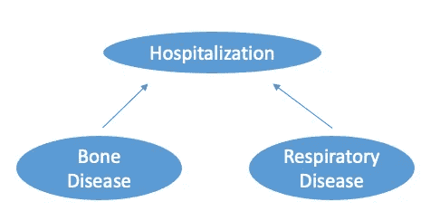

碰撞偏差，作者根据《为什么》一书第六章制作的图像

碰撞引起的相关性对人脑来说不直观，因此产生了这些所谓的悖论。在这篇文章中，我将探讨更多有趣的悖论，这些悖论像魔术一样在我们的大脑中制造视觉错觉，但可以通过因果图进行解释。了解这些悖论的原因是有意义和有教育意义的。这是“和我一起阅读”系列的第 4 篇文章，基于犹大·珍珠的《[为何之书](https://www.amazon.com/Book-Why-Science-Cause-Effect/dp/046509760X)》第五章和第六章中的内容。根据珍珠在这两个章节中提供的所有例子，这应该是一次有趣的阅读体验！你可以在这里找到上一篇文章：

+   [**开场：从一则猫的故事开始**](https://medium.com/towards-data-science/read-with-me-a-causality-book-club-edd7085d6ae6)

+   [**第一章&2 章：数据告诉我们‘什么’，而我们总是追寻‘为什么’**](https://medium.com/towards-data-science/data-tells-us-what-and-we-always-seek-for-why-66da7dc3f24d)

+   [**第三章&4 章：因果图：应对观察数据中的阿基琉斯之踵**](https://medium.com/towards-data-science/causal-diagram-confronting-the-achilles-heel-in-observational-data-a69cdb1c4818)

由 [Glenn Carstens-Peters](https://unsplash.com/@glenncarstenspeters?utm_source=medium&utm_medium=referral) 在 [Unsplash](https://unsplash.com/?utm_source=medium&utm_medium=referral) 提供的照片

## 让我们来做交易

美国电视节目“让我们来做交易”展示了一个著名的统计问题，称为“蒙提霍尔问题”，以节目主持人蒙提·霍尔的名字命名。在这个游戏中，参与者面临三扇门，其中一扇门后面有一个非常抢手的奖品，如汽车，而其他两扇门后面是较不受欢迎的奖品，通常幽默地称为山羊。规则如下：

+   第一步：参与者选择三扇门中的一扇作为初始选择，比如门 1；

+   第二步：主持人知道每扇门后面是什么，打开其他两扇门中的一扇，揭示出山羊，比如门 3；

+   第三步：参与者可以选择坚持原来的选择，或换到剩下的未开门，即参与者可以保留门 1 或选择门 2。

赢得汽车的最佳策略是主持人揭示另一扇门后面的山羊后始终选择换门。如果你想查看详细的计算，可以在本文的第 9 个问题中找到使用贝叶斯统计的计算方法。

 ## 12 个数据科学面试概率练习题

### 自信地通过数据科学面试，第三部分

towardsdatascience.com

或者，你可以参考下面的表格，显示了三种情景和切换或不切换的结果，假设参与者选择了门 1。第一行显示汽车在门 1 中，主持人可以打开门 2 或门 3 来揭示山羊。如果参与者切换，他们会失败。在第二行中，主持人必须打开门 3 来揭示山羊，类似地，主持人只能打开门 2 来揭示山羊。由于参与者选择任何门作为初始选择的概率是相等的，通过比较“切换”和“不切换”的列，我们可以看到切换门的获胜概率为 2/3，而不切换的概率为 1/3。因此，切换门是一种更优的策略。

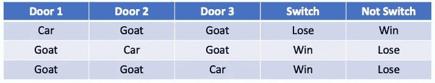

表格由作者根据《为什么的书》第六章制作

这可能看起来有些违反直觉，因为这意味着节目制作人似乎能够猜到参与者的初始选择。切换策略比不切换更受欢迎，这表明参与者的初始选择与汽车的位置有关，而直观地说，这两个变量应该是相互独立的。那么这里的解释是什么呢？我们可以通过这个因果图来解决这个悖论：

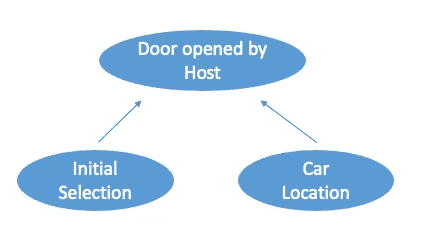

图片由作者根据《为什么的书》第六章制作

这个因果图展示了***混杂偏倚***。节目规则的第 2 步表明，根据汽车的位置和参与者的第一次选择，主持人只会选择打开山羊门。这个规则实际上**增加了信息**。主持人打开门 3 而不是门 2，使得门 2 更可能有一辆汽车在后面。条件化在混杂因子下，在这种情况下，考虑到主持人打开了门 3，参与者的第一次选择门 1 更不可能是汽车位置，因为切换是更好的策略。

如果我们改变游戏规则，在第 2 步中，主持人可以打开任何门，即使门后面有汽车，那么结果会是什么？下面的表格展示了初始选择门 1 的参与者的所有可能情景：

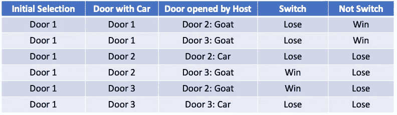

表格由作者根据《为什么的书》第六章制作

现在，如果我们根据最后两列的结果计算切换或不切换的获胜概率，我们可以看到没有区别。两种策略的获胜概率都是 1/3。结合因果图：

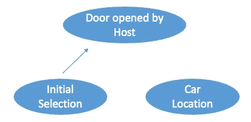

图片由作者根据《为什么的书》第六章制作

在第 2 步中修改规则去除主持人打开的门与汽车位置之间的因果关系。因此，参与者初始选择与节目制作人放置汽车的位置之间的虚假相关性消失了。

在这种情况下，即使数据（主持人打开的门）相同，修改**数据生成过程**（规则）也会指向不同的策略。

## 重新审视辛普森悖论

辛普森悖论也是一个广为讨论的著名困惑。当我们观察总体和子总体之间两个变量的不同关系时，我们应该信任哪个结果？例如，如果一种药物对男性组和女性组分别有害，但对整个群体有益，我们是否仍然应批准这种药物？

[Brendan Church](https://unsplash.com/@bdchu614?utm_source=medium&utm_medium=referral) 的照片，来自 [Unsplash](https://unsplash.com/?utm_source=medium&utm_medium=referral)

Pearl 认为

> 辛普森悖论的困惑源于**因果原则在统计比例中的不正确应用**。

通过使用因果图来说明不同的数据生成过程，即使在处理相同的数据时，我们也可能得出截然不同的结论。让我们检查一个旨在减少心脏病风险的药物的例子。

## **情景 #1: 信任子组**

下表比较了治疗组和对照组在两个性别子群体以及整个群体中的心脏病发作率，数据为合成数据。请注意，该研究未进行随机化。

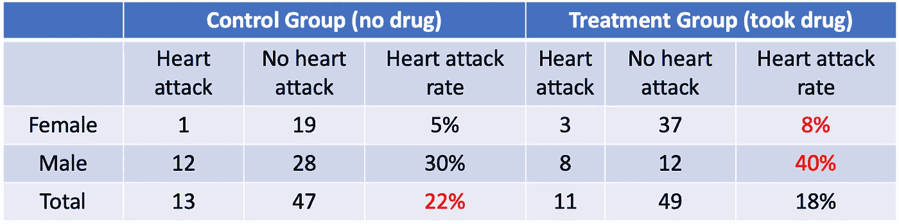

作者根据《为什么的书》第六章制作的表格

通过比较心脏病发作率，我们可以看到该药物对女性和男性子组有害，但对合并组有帮助。我们应该信任哪个结果？要回答这个问题，我们需要使用以下因果图：

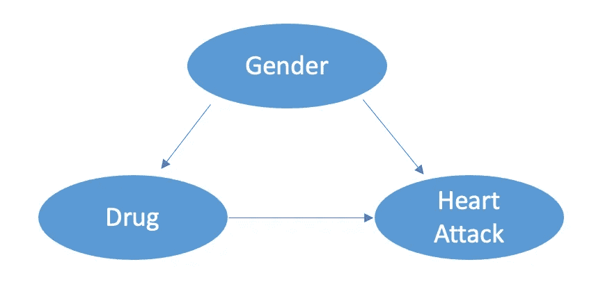

作者根据《为什么的书》第六章制作的图像

该图显示性别作为药物和心脏病的混杂因素，如果不对其进行控制，会偏离因果关系。换句话说，在“总计”行中，22%和 18%显示了偏倚的估计。

为了计算药物对整体人群的影响，我们需要估计药物对不同性别组的影响，然后取加权平均。

根据上述数据，我们知道在对照组中，女性和男性的心脏病发作率分别为 5%和 30%。假设女性和男性在一般人群中的比例相等，那么对照组的心脏病发作率为 (5%+30%)*0.5 = 17.5%。

类似地，我们可以得到治疗组的心脏病发作率为 (8%+40%)*0.5 = 24%。总体上，这仍然高于对照组，这与我们在子组中发现的一致。因此，这种药物不应被批准。

## 情景 #2: 信任聚合

现在，让我们进入另一个情境，数据相同，但这次我们是按患者的血压水平进行分类，而不是按性别分类。

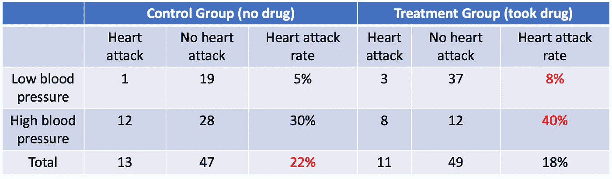

作者根据《为什么的书》第六章制作的表格

在这里，数据揭示了分开和汇总组之间相同的矛盾。然而，不同的因果图改变了我们的结论。这个概念是药物旨在通过降低患者的血压来减少心脏病发作的风险：

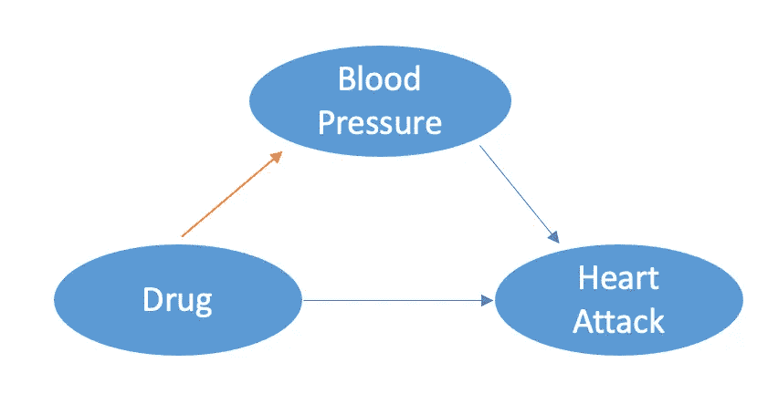

图像由作者根据《为什么的书》第六章制作

因果图显示血压作为中介变量而不是混杂变量。回想一下我们在[上一篇文章](https://medium.com/towards-data-science/causal-diagram-confronting-the-achilles-heel-in-observational-data-a69cdb1c4818)中讨论的内容：控制中介变量或中介变量的代理会完全或部分阻断因果影响。

因此，汇总数据是合适的。我们可以得出结论，药物有益，因为它将治疗组的心脏病风险从 22%降低到 18%，相比对照组。

## 连续变量中的辛普森悖论

现在，我们已经看到在决定是否按组汇总或分开时，检查数据生成过程的重要性。让我们看看一个应用相同概念于连续变量的示例。

这一悖论最早由弗雷德里克·洛德在 1967 年提出，当时他研究了不同餐厅提供的饮食效果，特别是饮食对女孩和男孩的不同影响。

学生的体重在 9 月份作为初始体重测量，并在接下来的 6 月再次测量以计算增重。结果显示在以下图表中：

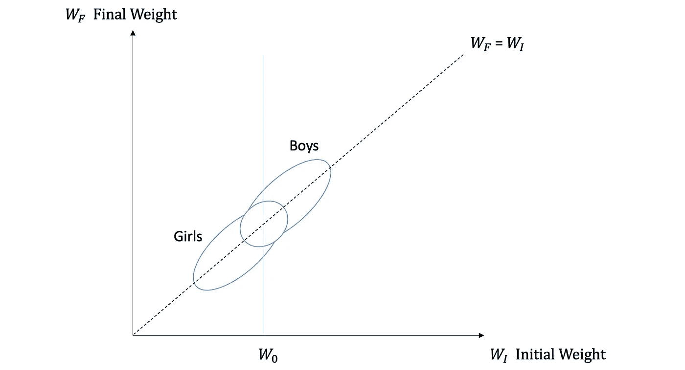

图像由作者根据《为什么的书》第六章制作

两个椭圆代表了女孩和男孩的初始体重和最终体重的散点图。图表本身显示了饮食对女孩和男孩的影响存在矛盾的结论：

+   如果我们关注 45 度线（W_f = W_i），我们可以看到，平均而言，饮食对女孩和男孩没有影响，因为体重分布在 W_f = W_i 处是对称的；

+   如果我们认为初始体重对最终体重有影响，并关注每个初始体重观察值，如 W0，我们可以看到垂直线在男孩的椭圆上交点比女孩的高。换句话说，平均而言，体重为 W0 的男孩最终体重会比体重相同的女孩更高。

图表显示，男孩在每个初始体重下增重比女孩多。然而，同样明显的是，男孩和女孩都没有增重。这两个结论给学校营养师提供了不同的指导。它们应该做出什么决定？这时以下因果图会派上用场：

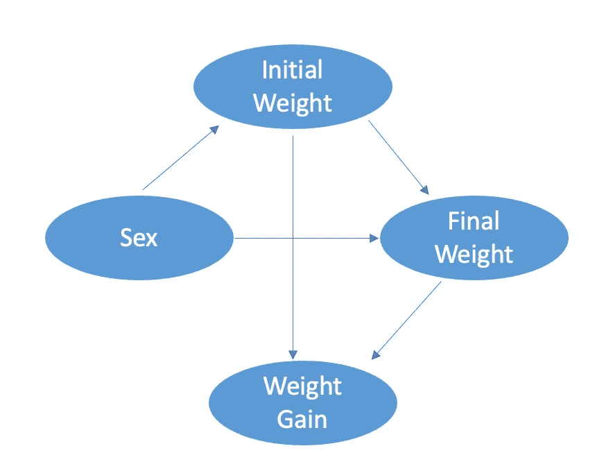

图像由作者根据《为什么的书》第六章制作

在研究性别是否影响体重增长时，因果图显示没有反向路径。因此，观察到的汇总数据提供了准确的结论，即饮食对女孩和男孩的体重增长没有影响。如果我们控制初始体重，我们将控制一个实际上阻断了从性别到体重增长部分因果影响的中介变量。

这个结论还证明了整体增益不总是分层特定增益的平均值（**确定性原则**）。如果每个层次的女孩和男孩数量相同，即每个初始权重相同，那么我们在每个初始权重下观察到的情况可以推广到整个总体。然而，这里明显不是这种情况，因为每个初始权重下女孩和男孩的分布不同。

如果我们在相同的数据中使用不同的叙述呢？我们可以在不同的餐厅提供不同的饮食，并比较在不同餐厅就餐的学生的体重增长，而不是观察性别如何影响体重增长。图表现在变为：

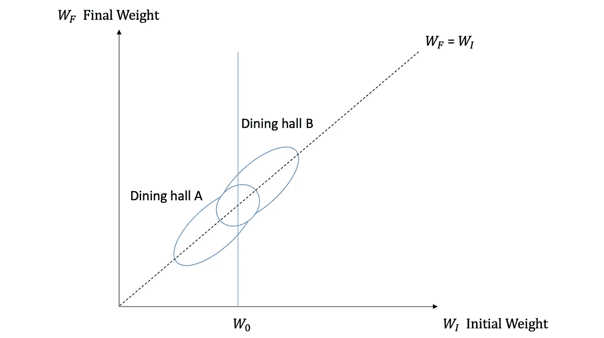

作者基于《为什么》一书第六章制作的图像

我们可以看到，去餐厅 B 的学生初始体重更高。由于数据相同，因此可以得出相同的矛盾结论。然而，因果图已经发生了变化：

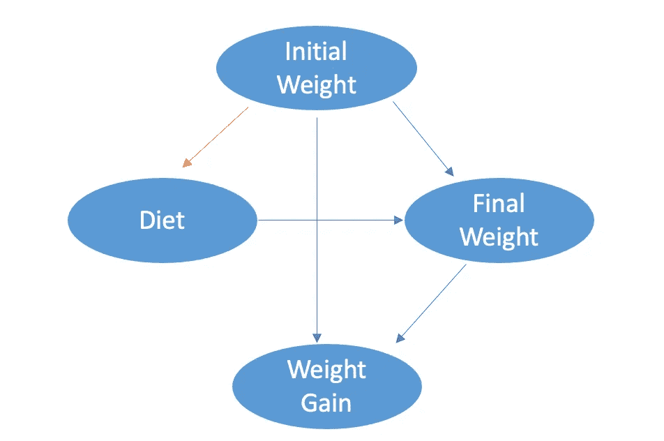

作者基于《为什么》一书第六章制作的图像

现在，存在一个指向饮食和体重增长的反向路径。如果我们未能控制初始体重，它已成为一个混杂变量，将偏向饮食和体重增长之间的因果关系。

因此，我们应考虑将初始体重纳入考虑的结论。从图表中，我们可以看到，平均而言，去餐厅 B 的学生体重增长比去餐厅 A 的学生更多。

从以上所有这些例子中，我们可以看到，辛普森悖论不仅仅是我们在现实世界数据集中经常发现的逆转。所谓逆转，是指如果我们观察到 A/B > a/b，并且 C/D > c/d，并不保证(A+C)/(B+D) > (a+c)/(b+d)。这仅仅是算术不等式中的规则。

然而，辛普森悖论超越了数学计算。当面对矛盾结论时，必须彻底分析因果模型，以理解数据生成过程，而不是仅仅依赖观察到的数据。

## 吸烟与肺癌之间的长期辩论

除了在第六章中提供现实生活中的例子来说明理解数据生成过程的重要性外，Pearl 还在第五章中探讨和关注吸烟与肺癌之间的因果关系，以证明这一观点。

图片由 [Volodymyr Hryshchenko](https://unsplash.com/@lunarts?utm_source=medium&utm_medium=referral) 提供，来源于 [Unsplash](https://unsplash.com/?utm_source=medium&utm_medium=referral)

从关于吸烟是否是致病因素的长期辩论中，我们可以推断出理论是如何发展的，以及因果关系是如何逐渐被提到台前的。

关于吸烟是否引发肺癌的研究因至少这三种因素而充满挑战：

+   强迫参与者吸烟并使他们暴露于潜在健康风险的 RCT 是不道德的；

+   观察数据可能存在混杂因素，因为治疗组的分布可能与对照组根本不同。

+   烟草公司可能采取的潜在障碍和故意努力，以误导公众有关健康风险的信息。

在过去的几十年里，统计学家们进行了多次试验以寻找正确的方法论，即使面临这些障碍。

## 一项病例对照研究

正如 Pearl 在他的书中总结的那样，这项研究始于一项病例对照研究，该研究比较了肺癌患者与健康志愿者对照组。研究随后确定了“病例”组中的吸烟者是否比对照组中的更多，考虑到一些混杂因素如年龄、性别和环境污染物暴露。

然而，这项研究面临几个缺陷：

+   **一种倒退的逻辑**：与其回答吸烟者得癌症的概率是多少，不如展示癌症患者是吸烟者的概率是多少；

+   **回忆偏倚**：尽管研究人员确保在调查之前没有让患者知道他们的诊断，但他们可能会根据自己的健康状况推断出这一点；

+   **选择偏倚**：这项研究仅关注住院癌症患者，这并不能很好地代表整个群体或甚至吸烟群体。

## Cornfield 不等式

当问题出现时，辩论继续，即吸烟者是否是“自我选择”的，他们在基因上是否与非吸烟者不同。Pearl 在他的书中提到的一些担忧是：

> 他们更具风险倾向或更容易发展出实际上会导致健康不良影响的成瘾行为。

换句话说，辩论的问题在于以下哪种因果图是正确的。“吸烟基因”是否是我们观察到“吸烟”和“肺癌”之间关系的唯一原因？

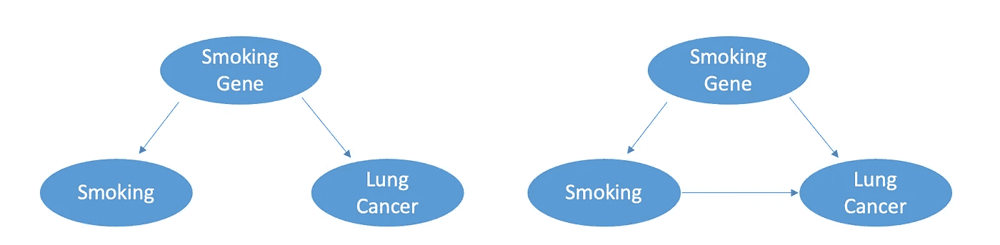

图片由作者基于《为何的书》第五章绘制

Cornfield 使用简单数学对左侧因果图提出了挑战。如果左侧因果图是正确的，并且在数据中我们观察到吸烟者**有九倍**的可能性发展为肺癌，这必须是因为他们比非吸烟者**有九倍**的可能性拥有吸烟基因。

如 Pearl 在书中所述，参照 Cornfield 的论点：

> 如果 11%的非吸烟者有吸烟基因，那么 99%的吸烟者必须具有这个基因。然而，如果我们观察到 12%的非吸烟者有吸烟基因，这个比例在数学上就变得不可能了。

在这种情况下，吸烟基因无法完全解释吸烟与肺癌之间的关系。因此，正确的因果图提供了更准确的解释。

这个论点以其提出者命名，被称为 Cornfield 不等式，它通过评估在没有因果关系的情况下，替代关系必须有多强来解释观察到的数据，从而揭示了推断的光明。

## 出生体重悖论

我希望我们已经建立了足够的基础，以便可以声明数据不足以理解因果关系，并解释现实世界中表现为悖论的场景。

Pearl 在他的书中给出的另一个例子是一个研究，专注于寻找吸烟的母亲如何影响她们婴儿的生存率，挑战了吸烟导致死亡率的论点。研究结果显示，吸烟母亲的婴儿确实体重较轻。然而，吸烟母亲的低出生体重婴儿的生存率比非吸烟母亲的婴儿更高。

这个发现可能看起来违反直觉，即吸烟减少了出生体重并降低了儿童死亡率。然而，如果我们进一步考虑除了吸烟之外，哪些因素会影响婴儿的出生体重，我们会发现这里的碰撞偏差。

例如，其他威胁生命的遗传异常也可能解释出生率较低。我们可以通过绘制因果图更清楚地看到这一点：

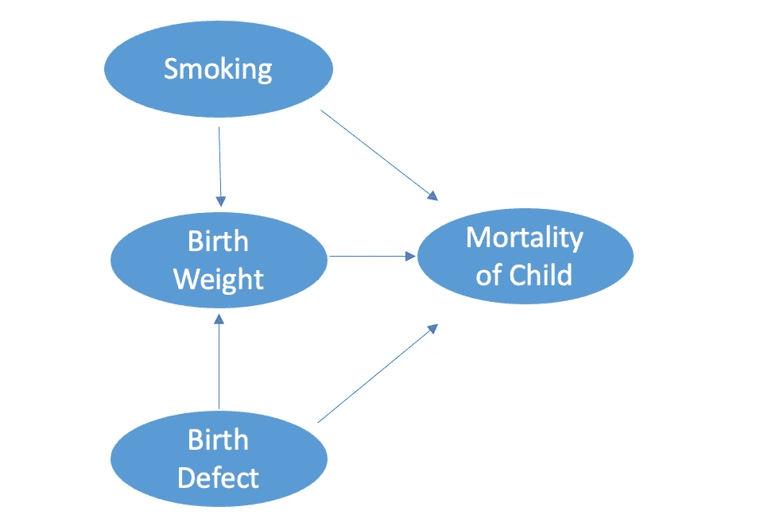

图片由作者基于《为什么的书》第五章制作

在这里，“吸烟 -> 出生体重 <- 出生缺陷”形成了一个碰撞结构。除非我们控制出生体重，否则吸烟与出生缺陷没有相关性。如果我们只看低出生体重的婴儿，我们就打开了吸烟到死亡率的后门路径。这个关系会被出生缺陷到死亡率的因果路径所偏倚。

确实，其他因素可以添加到因果图中，这将指向出生体重。例如，研究发现***种族***是另一个影响出生体重和儿童死亡率的因素。

列表可以继续，唯一需要记住的是从因果图中得出的**行动点**。正如 Pearl 在他的书中所说：

> 我们可以使用这个图表和数据来说服孕妇停止吸烟。但我们不能告诉孕期黑人女性停止做黑人的事情。

## 最后的说明

碰撞偏差无处不在。你是否注意到从你朋友的经验中，所有他们约会的人中，吸引人的人往往都是混蛋？相较于利用涉及创伤和人格障碍的心理社会理论，Pearl 证明了**碰撞偏差**可能是答案。你朋友的约会对象选择取决于两个因素：吸引力和个性。在这种情况下，你会约会一个刻薄的、吸引人的人，一个友好的、不吸引人的人，当然还有一个友好的、吸引人的人。然而，你永远不会约会一个刻薄的、不吸引人的人。如下图所示的因果图：

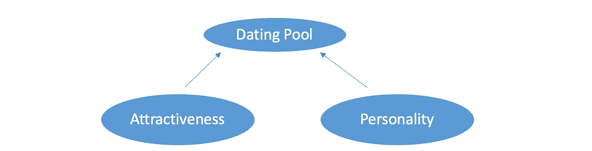

作者基于《为什么的书》第六章的图像

仅仅通过观察你朋友的约会对象，你就会操控一个导致吸引力和个性之间产生虚假负相关的碰撞器。

正如 Pearl 所说，尽管悲哀的事实是，在整个群体中，不吸引人的人和吸引人的人一样刻薄（吸引力和个性没有相关性），但你的朋友们从未意识到这一点，因为约会池中从未出现过既刻薄又不吸引人的人。

这篇文章总结了使用因果图解释的趣闻和悖论。悖论是我们观察到的数据，它们欺骗和困惑我们。然而，通过深入挖掘数据生成过程并绘制因果图，我们可以对这些悖论提供解释，这不仅清除了困惑，还为决策提供了可靠的指导。

这就是我想分享的《为什么的书》第五章和第六章的内容，完成了“伴读系列”的第 4 篇文章。希望这篇文章对你有帮助。如果你还没有阅读前三篇文章，可以在这里查看：

 ## 伴读：因果关系书籍俱乐部

### 从一个猫的故事开始……

towardsdatascience.com  ## 数据告诉我们“什么”，而我们总是寻找“为什么”

### 《为什么的书》 第一章和第二章，伴读系列

towardsdatascience.com  ## 因果图：面对观察数据中的阿喀琉斯之踵

### 《为什么的书》 第三章和第四章，伴读系列

towardsdatascience.com  ## 你无法踏入同一条河流两次

### 《为什么的书》 第七章和第八章，伴读系列

towardsdatascience.com  ## 什么造就了强大的 AI？

### 《为什么的书》 第九章和第十章，伴读系列

towardsdatascience.com  ## 因果推断在学术界和工业界有何不同？

### “《为什么的书》系列”的附加文章

towardsdatascience.com

如果感兴趣，[订阅我的邮件列表](https://zzhu17.medium.com/subscribe) 以加入目前正在进行的双周讨论。和往常一样，我非常鼓励你阅读、思考，并在这里或在 [你自己的博客](https://youtu.be/oFDl0-SKAL8?si=r1QiRIizhDBdvX-A)上分享你的主要收获。

感谢阅读。如果你喜欢这篇文章，别忘了：

+   ***查看我最近的文章，关于*** [***数据讲述中的 4Ds：将艺术融入科学***](https://medium.com/towards-data-science/the-4ds-in-data-storytelling-making-art-out-of-science-c4998ed7875e);***数据科学中的持续学习******;*** ***我如何成为数据科学家******;***

+   ***查看我的*** [***其他文章***](https://zzhu17.medium.com/my-blog-posts-gallery-ac6e01fe5cc3) ***，涵盖不同主题，如*** [***数据科学面试准备***](https://zzhu17.medium.com/list/data-science-interview-preparation-bfb0986a61a3)***;*** ***因果推断******;***

+   [***订阅***](https://zzhu17.medium.com/subscribe) ***我的邮件列表；***

+   [***注册成为 Medium 会员***](https://zzhu17.medium.com/membership)***;***

+   ***或者关注我的*** [***YouTube 频道***](https://youtube.com/channel/UCMs6go1pvY5OOy1DXVtMo5A) ***，观看我最新的 YouTube 视频，介绍我阅读的其他书籍：***

# 参考

[***《为什么的书》***](https://www.amazon.com/Book-Why-Science-Cause-Effect/dp/046509760X) ***，作者：朱迪亚·佩尔***
