# 为什么 WGANs 超越 GANs：从 KL 散度到 Wasserstein 损失

> 原文：[`towardsdatascience.com/why-wgans-beat-gans-a-journey-from-kl-divergence-to-wasserstein-loss-9ee5faf10b48?source=collection_archive---------11-----------------------#2023-01-12`](https://towardsdatascience.com/why-wgans-beat-gans-a-journey-from-kl-divergence-to-wasserstein-loss-9ee5faf10b48?source=collection_archive---------11-----------------------#2023-01-12)

## 介绍

[](https://medium.com/@rm12?source=post_page-----9ee5faf10b48--------------------------------)[](https://towardsdatascience.com/?source=post_page-----9ee5faf10b48--------------------------------) [Shashank Kumar](https://medium.com/@rm12?source=post_page-----9ee5faf10b48--------------------------------)

·

[关注](https://medium.com/m/signin?actionUrl=https%3A%2F%2Fmedium.com%2F_%2Fsubscribe%2Fuser%2Fe447b689ba76&operation=register&redirect=https%3A%2F%2Ftowardsdatascience.com%2Fwhy-wgans-beat-gans-a-journey-from-kl-divergence-to-wasserstein-loss-9ee5faf10b48&user=Shashank+Kumar&userId=e447b689ba76&source=post_page-e447b689ba76----9ee5faf10b48---------------------post_header-----------) 发布于 [Towards Data Science](https://towardsdatascience.com/?source=post_page-----9ee5faf10b48--------------------------------) ·7 分钟阅读·2023 年 1 月 12 日[](https://medium.com/m/signin?actionUrl=https%3A%2F%2Fmedium.com%2F_%2Fvote%2Ftowards-data-science%2F9ee5faf10b48&operation=register&redirect=https%3A%2F%2Ftowardsdatascience.com%2Fwhy-wgans-beat-gans-a-journey-from-kl-divergence-to-wasserstein-loss-9ee5faf10b48&user=Shashank+Kumar&userId=e447b689ba76&source=-----9ee5faf10b48---------------------clap_footer-----------)

--

[](https://medium.com/m/signin?actionUrl=https%3A%2F%2Fmedium.com%2F_%2Fbookmark%2Fp%2F9ee5faf10b48&operation=register&redirect=https%3A%2F%2Ftowardsdatascience.com%2Fwhy-wgans-beat-gans-a-journey-from-kl-divergence-to-wasserstein-loss-9ee5faf10b48&source=-----9ee5faf10b48---------------------bookmark_footer-----------)

在 2014 年，Ian Goodfellow 提出了 GAN 的概念，或者我们今天所称的“原始 GAN”。虽然这一想法令人印象深刻，但训练起来却 notoriously 很困难。原始 GAN 面临无法收敛、梯度消失以及模式崩溃等问题。随后，大量的研究集中于解决这些问题。研究人员尝试了不同的模型架构、损失函数和训练方法。一个特别有效的解决方案是 Wasserstein GAN，它在 2017 年由 [Arjovsky et al](https://arxiv.org/pdf/1701.07875.pdf) 提出。


图片由 [Arnold Francisca](https://unsplash.com/ja/@clark_fransa?utm_source=medium&utm_medium=referral) 提供，来源于 [Unsplash](https://unsplash.com/?utm_source=medium&utm_medium=referral)

本文尝试解释为什么 Wasserstein GANs 比普通 GANs 表现更好。它假设读者对 GANs 和 VAEs 的数学原理及其训练过程有一定了解。让我们从生成网络的介绍开始。

## 1\. 生成网络：简要介绍

生成网络努力生成与真实数据家族相似的新样本。它们通过模仿数据分布来实现这一点。像 GANs 和 VAEs 这样的流行框架通过学习一个映射 **G** 来将已知/假设的分布 **Z** 转换为实际的分布空间。GANs 中的生成器和 VAEs 中的编码器完成了这一工作。这些网络的神经权重参数化了 **G**。

网络通过最小化实际数据分布和生成数据分布之间的差异来学习映射。量化这种差异的三种常用度量是：

1.  KL 散度

1.  JS 散度

1.  Earth-Mover (EM) 或 Wasserstein-1 距离

让我们来窥探一下它们。

## 2\. 为什么 KL 和 JS 散度会失败？

我们将简要介绍 KL 和 JS 散度，并了解它们为何会失败。

1.  Kullback-Leibler (KL) 散度可以通过正向或逆向两种方式计算，因此是非对称的。根据分布是连续的还是离散的，它们的正向 KL 散度如下：

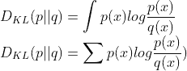

正向 KL 散度

我们可以通过使用 **Q** 来加权分布的对数差异，从而计算逆 KL 散度。**VAEs** 操作于逆 KL。


逆 KL 散度

2\. 与前者不同，Jensen-Shannon (JS) 散度是对称的。它本质上是两个 KL 散度的平均值。它在损失函数二元交叉熵中并不明显，但当鉴别器达到最优时，GANs 会基于 JS 散度。我建议你阅读这篇 [博客](https://lilianweng.github.io/posts/2017-08-20-gan/#:~:text=best%20value%20for,D) 以了解原因。

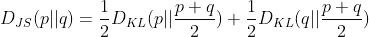

JS 散度

Arjovsky 等人用一个简单的例子来展示 KL 和 JS 散度的陷阱。考虑下面图像中的两条平行线所描述的两个概率分布。红色是实际分布（P），绿色是其估计（Q）。θ 是它们之间的水平距离。

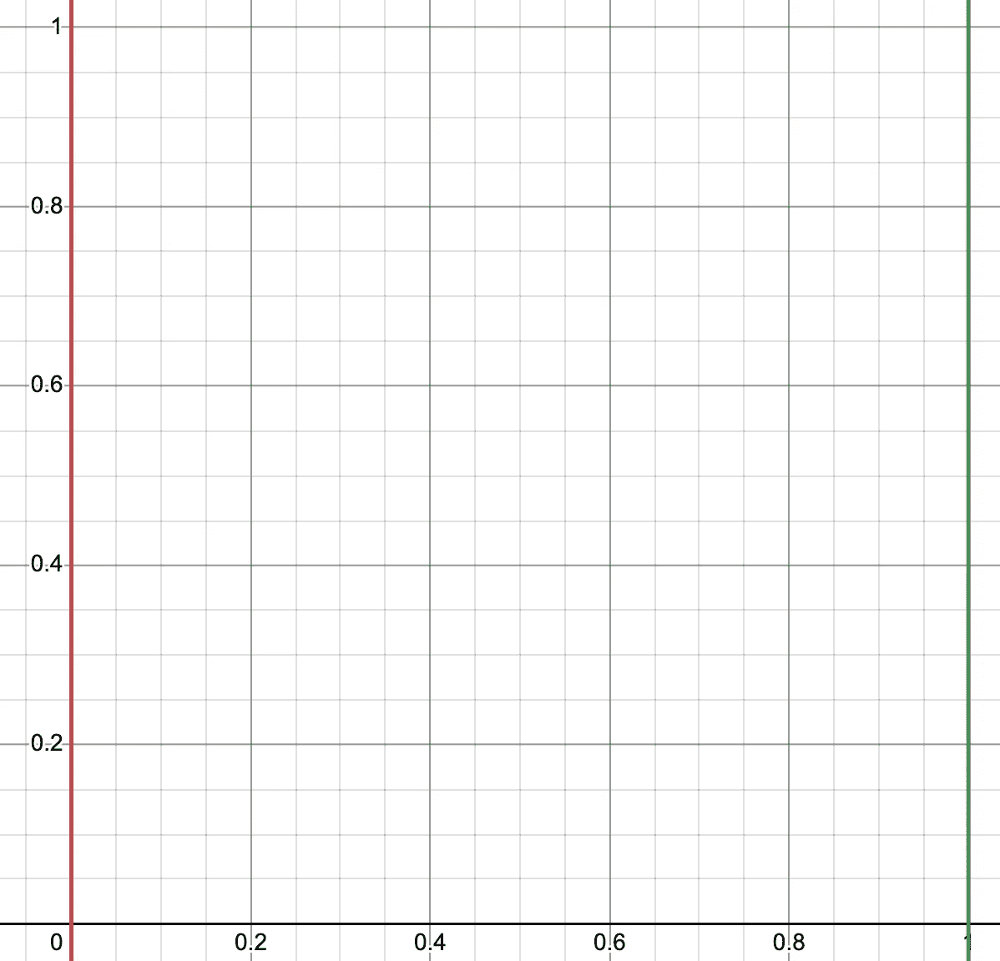

作者提供的图片

生成模型将努力将绿色靠近红色，这个红色固定在 0。当 θ = 1 时，你能计算 JS 和 KL 散度吗？

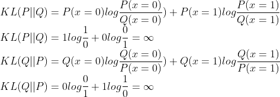

KL 散度

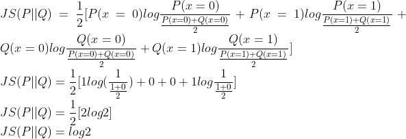

JS 散度

那么，这些度量会随着 θ 的变化而有所不同吗？如果你仔细观察，它们不会改变，除非 θ=0。

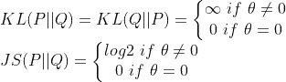

我观察到这些度量有两个主要缺点。

1.  在 θ=0.1 和 θ=1 之间的分布差异是相同的。在 θ=0.1 时，绿线与红线的距离更近，因此差异应该更小。

1.  θ 可以大致看作是估计的分布。如果我们的生成模型由 φ 参数化，那么 θ 是 f(φ) 的一个函数。在反向传播过程中，我们将计算相对于 φ 的损失函数的梯度，该损失函数由上述度量之一定义，以调整参数。第二个方程的第一个项将始终为 0。因此，由于梯度为零，我们的模型将无法学习任何东西。

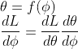

使用链式法则进行反向传播

从上述示例中，我们可以得出一些重要的推论。

1.  KL 和 JS 散度未考虑两个概率分布之间的水平差异

1.  在预测和实际分布不重叠的情况下，这种情况在训练过程中很常见，梯度可能为 0，从而导致无法学习。

那么，Wasserstein 距离是如何解决这些问题的呢？

## **3\. 为什么 Wasserstein 距离是一种更好的度量？**

坦白说，EM/Wasserstein-1 距离的公式非常糟糕。所以，我将避免其数学细节。相反，让我们直观地理解它。

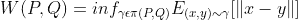

EM/Wasserstein-1

让我们回到平行线。这次，有四条线。红线构成一个概率分布，蓝线也是如此。顶部的数字是对应点（x=0,1,2,3）的概率质量。我们打算调整蓝线，使其与红线系列对齐（相似分布）。为此，我们将移动概率质量。

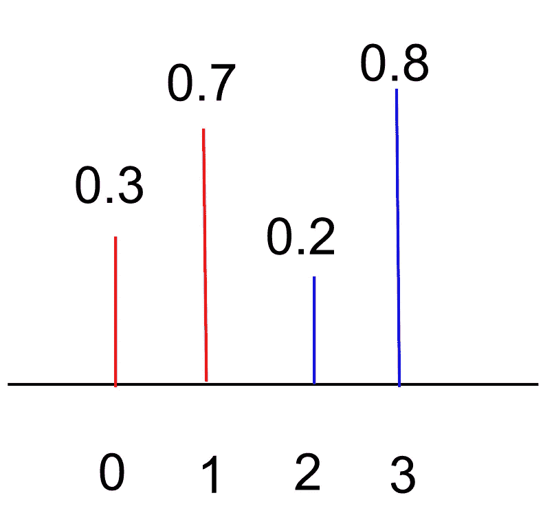

图片来源：作者

1.  从 x=2 移动 0.2 到 x=0

1.  从 x=3 移动 0.1 到 x=0

1.  从 x=3 移动剩余的 0.7 到 x=1

然而，这只是众多运输计划中的一个。我们还可以

1.  从 x=2 移动 0.1 到 x=0

1.  从 x=2 移动 0.1 到 x=1

1.  从 x=3 移动 0.2 到 x=0

1.  从 x=3 移动 0.6 到 x=0

在这两个计划中，哪个更优化？为了确定这一点，我们可以借用物理中的工作类比。在这里，我们将工作定义为质量乘以移动距离。因此，这两个运输方案中的工作量分别为 2.1 和 2.7。

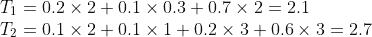

图片来源：作者

2.1，即最优运输计划中涉及的工作量，因此是 EM 距离。相同的原理也适用于连续领域。由于每个点在连续分布中都有一个相关的概率质量，积分取代了求和。

总之，上述复杂的方程涉及计算所有运输方案中所需的工作，以在两个分布之间建立相似性，并选择其中的最小值。与其他度量相比，EM 距离考虑了两个分布之间的水平差异，同时保留了它们的整体形状。此外，它还解决了梯度消失的问题。

重新考虑第一部分中的例子。对齐两个分布的最小成本是 θ，即线条之间的水平距离。因此，即使预测和实际分布不重叠，我们也能获得稳定的梯度来调整参数。

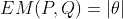

作者提供的图像

## 4\. 使用 Python 可视化所有度量

现在，让我们在 Python 中计算所有讨论的度量，以可视化它们的行为。

```py
import numpy as np
from scipy.stats import norm
from matplotlib import pyplot as plt
from scipy.stats import wasserstein_distance
```

我们将定义计算 KL 和 JS 发散的函数，幸运的是，对于 EM 距离，我们可以使用 scipy 库。

```py
def kld(d1,d2,eps=10^-6):
    return np.sum(d1*np.log((d1)/(d2)))

def jsd(d1,d2):
    return 0.5 * kld(d1,(d1+d2)/2) + 0.5 * kld(d2,(d1+d2)/2)
```

接下来，我们将定义两个正态分布，并可视化当高斯分布被分离时度量如何变化。也就是说，它们的均值差异增加。

```py
x = np.arange(-40, 40, 0.001)
q_mean_range = (2,20)
fkl = []
bkl = []
js = []
em = []
p = norm.pdf(x, 0, 2)
for i in range(*q_mean_range):
    q = norm.pdf(x, i, 2)
    fkl.append(kld(p,q))
    bkl.append(kld(q,p))
    js.append(jsd(p,q))
    em.append(wasserstein_distance(p,q))
x = np.arange(*q_mean_range,1)
f,ax = plt.subplots(2,2,figsize=(10,10))
ax = ax.flatten()
for i,(vals,name) in enumerate(zip([fkl,bkl,js,em],['FWD KL','REV KL','JS Divergence','EM Distance'])):
    ax[i].plot(x,vals)
    ax[i].set_xlabel('Mean difference')
    ax[i].set_title(name)
plt.show()
```

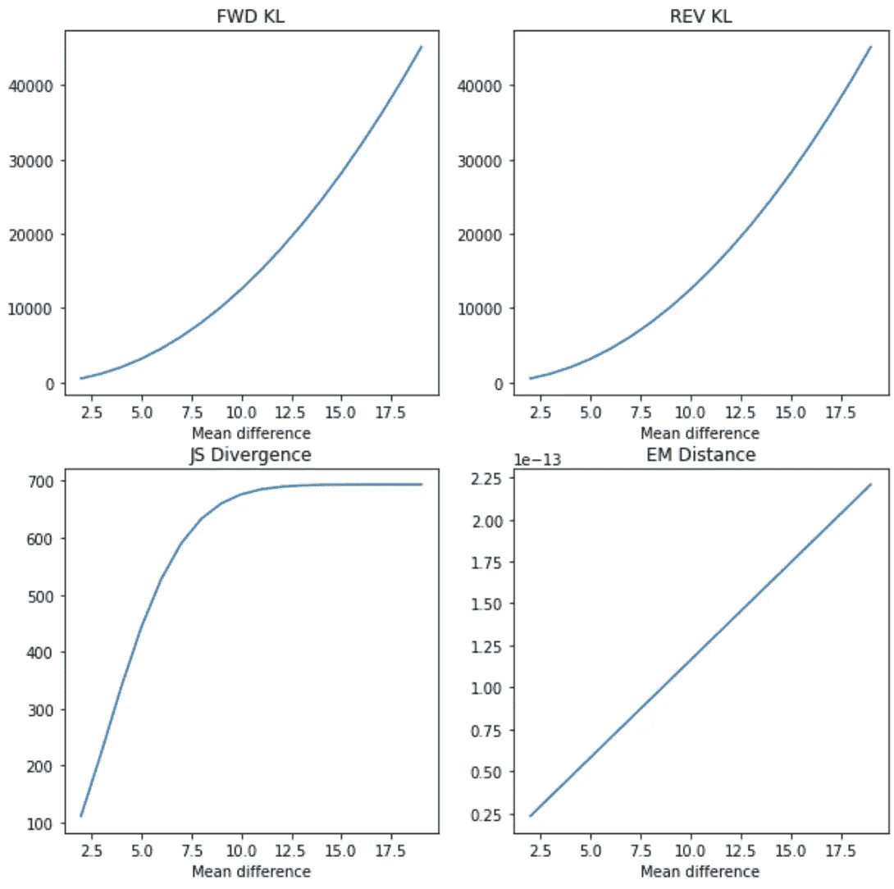

所有度量与均值差异的图

你注意到什么了吗？随着均值差异的增加，KL 发散爆炸，而 JS 发散饱和。然而，EM 距离线性增加。因此，在四者中，EM 距离似乎是训练过程中保持梯度流的最佳选择。

EM/Wasserstein 距离还缓解了模式崩溃。粗略来说，模式崩溃发生在生成器学会生成特定模式，从而欺骗陷入局部极小值的判别器。正如第二部分所讨论的，当判别器处于最小值时，GANs 基于 JS 发散操作，导致梯度为零。因此，判别器被困住，生成器没有动力生成不同的样本。

使用 Wasserstein 距离，判别器可以在梯度不会消失的情况下达到最优。它们可以逃离局部最小值并丢弃生成器输出，促使生成器不会过拟合于特定判别器，从而生成多个模式。

## **结论**

至此，我们结束了这篇文章。希望这总结了为什么 Wasserstein GANs 优于传统的 GANs 和 VAEs。我略过了一些关于 EM 距离的数学细节。如果你感兴趣，需要阅读 [论文](https://arxiv.org/pdf/1701.07875.pdf)。你必须注意，讨论的 EM 距离方程是不可处理的。使用了一个数学技巧来近似它。在实际中你不太可能需要它。不过，如果你迫切想知道，可以在 [这里](https://www.alexirpan.com/2017/02/22/wasserstein-gan.html#:~:text=exactly%20is%20intractable) 或在 [论文](https://arxiv.org/pdf/1701.07875.pdf) 中阅读有关近似的内容。

## 参考文献

1.  [`arxiv.org/pdf/1701.07875.pdf`](https://arxiv.org/pdf/1701.07875.pdf)

1.  [`www.alexirpan.com/2017/02/22/wasserstein-gan.html#`](https://www.alexirpan.com/2017/02/22/wasserstein-gan.html#)

1.  [`lilianweng.github.io/posts/2017-08-20-gan/#:~:text=best%20value%20for,D`](https://lilianweng.github.io/posts/2017-08-20-gan/#:~:text=best%20value%20for,D)
