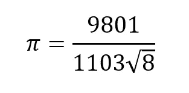
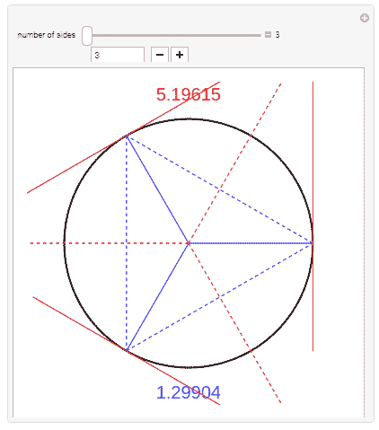
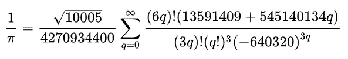
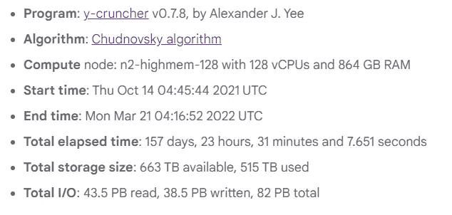

# 为什么你（几乎）不能在家中用 Python 计算圆周率到一亿位

> 原文：[`towardsdatascience.com/why-you-almost-cant-calculate-pi-to-a-billion-digits-in-python-at-home-4262a4de9f80`](https://towardsdatascience.com/why-you-almost-cant-calculate-pi-to-a-billion-digits-in-python-at-home-4262a4de9f80)

## 这比你想象的要困难

[](https://ibexorigin.medium.com/?source=post_page-----4262a4de9f80--------------------------------)[](https://towardsdatascience.com/?source=post_page-----4262a4de9f80--------------------------------) [Bex T.](https://ibexorigin.medium.com/?source=post_page-----4262a4de9f80--------------------------------)

·发表在[数据科学的前沿](https://towardsdatascience.com/?source=post_page-----4262a4de9f80--------------------------------) ·阅读时间 9 分钟·2023 年 10 月 9 日

--


图片由我使用 Midjourney 生成。

## 介绍

2022 年 6 月 9 日，谷歌设立了计算圆周率最多位数的新世界纪录——100 万亿位！这一重大成就得益于在谷歌云上运行的 y-cruncher 程序。该程序计算了整整 157 天、23 小时、31 分钟和 7.651 秒。

如果一亿是 10 万倍小于 100 万亿，那么运行时间会相应减少吗？换句话说，是不是只需要 136 秒？

但 136 秒实在太过雄心勃勃。家用电脑远不如谷歌云的强大环境。那么，像 24 小时这样更合理的运行时间如何？

结果发现，在 24 小时内计算即使是一亿位的圆周率也是一个巨大的梦想。本文通过 Python 证据解释了原因。

## 首先，`math.pi`有什么问题？

```py
import math

print(math.pi)
```

```py
3.141592653589793
```

`math.pi`的精度为 15 位。虽然这不是很多，但足以进行科学中的最高精度计算。

例如，NASA 的喷气推进实验室（JPL）使用 15 位数字的圆周率来在行星间导航。为了给你一个概念，这种精度足以计算一个半径为 150 亿英里的圆的周长。结果是 940 亿英里的周长误差不超过你小指的宽度。想一想吧！

那么，为什么还要纠结于一亿位，更不用说 100 万亿位了？

好吧，给你一个极客的答案：“因为这实在太酷了！”

## 如果我们增加小数点精度会怎样？

在我们使用大招（算法！）之前，如果我们在 Python 中增加近似π的小数点精度呢？那会简单得多。

对于这种近似，我们将使用拉马努 jan 的π公式。全球的数学家都用它来极其准确地近似π。



图片由我制作

```py
from decimal import Decimal
from math import sqrt

def pi():
    return Decimal(9801) / (Decimal(1103) * Decimal(sqrt(8)))

pi()
```

```py
Decimal('3.141592730013305445560728363')
```

我们使用简单的算术达到了 16 位的精度。让我们将其提高到 1000 位并测量运行时间：

```py
# Increase float precision to 1000
from decimal import getcontext

getcontext().prec = 1000
```

```py
%%time

approximation = pi()
```

```py
CPU times: user 14 µs, sys: 2 µs, total: 16 µs
Wall time: 16.2 µs
```

仅仅花了不到一秒的时间就获得了 1000 位的精度！让我们大胆地将运行时间增加到 100 万：

```py
getcontext().prec = 1_000_000
```

```py
%%time

approximation = pi()
```

```py
CPU times: user 3.18 ms, sys: 0 ns, total: 3.18 ms
Wall time: 3.18 ms
```

仅仅三毫秒——发生了什么？看起来我们可以在瞬间计算出十亿位数字。我们来试试：

```py
# One billion digit precision
getcontext().prec = 1_000_000_000
```

```py
%%time

approximation = pi()
```

```py
CPU times: user 3.04 s, sys: 301 ms, total: 3.34 s
Wall time: 3.32 s
```

甚至不到 10 秒！`approximation`现在包含了十亿位的圆周率，仅计算了……等等！我们没有将前几十位数字与验证过的圆周率数字进行比较，以确保近似值的准确性。

所以，让我们检查一下：

```py
# I got this from the Internet
verified_pi = Decimal(3.1415926535897932384626433832795028841971)
rounded_pi = round(approximation, 50)

print(verified_pi)
print(rounded_pi)
```

```py
3.141592653589793115997963468544185161590576171875
3.14159273001330544556072836229812077562268642913720
```

嗯，看起来我们的近似值仅准确到第 7 位。真让人失望！

## 那么，刚刚发生了什么问题？

为什么我们得到如此糟糕的结果？拉曼努金的公式不正确吗？当然不是！G.H. 哈代本人认为发现拉曼努金的才华是他最大的数学贡献。

问题在于现代计算机存储浮点数和表示它们的方式。我不会深入探讨这个问题，但建议你参考[这个维基百科页面](https://en.wikipedia.org/wiki/Floating-point_arithmetic)和[这个出色的 StackOverflow 讨论](https://stackoverflow.com/questions/588004/is-floating-point-math-broken)。

基本上，我们面临的是以下难题的更复杂版本：

```py
0.1 + 0.1 + 0.10.30000000000000004
```

由于精度的限制，上述错误可能会积累，特别是对于像圆周率这样的无理数。即使是一个小的舍入误差，也可能在多次操作中积累，完全改变最终结果。

这让我们意识到：使用比例和简单数学的公式无法快速准确地计算圆周率的位数。

## 大牌或者计算机简史

阿基米德通过增加多边形的边数来近似圆周率，内切和外切于圆。但自那时以来，世界已经走了很长一段路。这个两千年前的方法简单，但它不是为计算机设计的。对不起，阿基米德。



GIF 由我使用 Wolfram 制作。

[](https://demonstrations.wolfram.com/ArchimedesApproximationOfPi/?source=post_page-----4262a4de9f80--------------------------------) [## 阿基米德的圆周率近似 - Wolfram 演示项目

### 显示了一个单位圆。一个正多边形被内切。另一个正多边形被……

demonstrations.wolfram.com](https://demonstrations.wolfram.com/ArchimedesApproximationOfPi/?source=post_page-----4262a4de9f80--------------------------------)

当然，牛顿在他的时代也有所贡献，并且贡献了他的收敛级数来近似圆周率。但他只能计算出 14 位数字。要计算更多位，他需要活得更久，因为每增加一位需要更多的级数项。

然后，拉马努金用他的公式迅速收敛并计算π。我们之前使用的比例是一个简化。对于 20 世纪中期的计算机来说，他的方法的效率几乎是光速。

到 20 世纪末，科学家们使用了更多基于快速收敛系列的算法。例如，Gauss-Legendre 算法的不同变体在 1982 年从 16500 位到 2002 年的 240 亿位之间打破了六项世界纪录。但这些算法对于富有的科学家来说才适用——它们需要大量的计算资源，特别是内存。

所以，21 世纪初，Spigot 算法开始兴起。这些算法可以从左到右顺序计算[超越数](https://en.wikipedia.org/wiki/Transcendental_number)的位数。这意味着它们需要显著较小的内存，因为它们不需要记住之前的位数来计算下一位。但它们的缺点是比收敛系列要慢。

## 那么，Google 使用了什么？

由于 Google 可以投入（浪费？）他们想要的资源来创下世界纪录，他们选择了[Chudnovsky 算法](https://en.wikipedia.org/wiki/Chudnovsky_algorithm)。这个系列基于拉马努金的公式。它已经创造了**七项世界纪录**用于计算π。这些记录从 2009 年到 2022 年设立，所有记录都在万亿位数级别。



Chudnovsky 算法。图片来自维基百科。维基媒体共享资源。

在介绍中，我提到 Google 使用了一个名为 y-cruncher 的特殊程序。这个程序可以计算像π这样的万亿位数字。它的理想环境是多核系统，因为它是一个多线程软件。

而且 Google 提供了一个理想的环境！

为了进行 100 万亿位数字的实验，计算引擎具有这些疯狂的规格：



图片来自 Google 的记录公告。

当然，硬件并不是成就成功的唯一因素。要了解更多关于软件架构和细节，请访问[Google Cloud](https://cloud.google.com/blog/products/compute/calculating-100-trillion-digits-of-pi-on-google-cloud)页面。

## 尝试使用 Chudnovsky

为了感受算法的效果，让我们在我的 PC 上尝试 Chudnovsky 来计算前 10k 位。我正在运行一台配有 32GB RAM 的 AMD Ryzen 9 3200x 12 核 CPU 的普通电脑。

首先，让我们编写一个计时器装饰器，可以添加到任何π计算函数中：

```py
import time

def timer(func):
    def wrapper(*args, **kwargs):
        start_time = time.time()
        result = func(*args, **kwargs)
        end_time = time.time()
        execution_time = end_time - start_time
        print(f"Execution time: {execution_time} seconds")
        return result

    return wrapper
```

现在，让我们将 Chudnovsky 放入一个函数中。你不必阅读它，因为这是一个相当复杂的函数（我自己也不理解）。它唯一的作用是近似计算π的`n_digits`位，并将结果写入文本文件中。

```py
import decimal

@timer
def chudnovsky_to_file(n_digits):
    decimal.getcontext().prec = n_digits + 1
    C = 426880 * decimal.Decimal(10005).sqrt()
    K = 6.0
    M = 1.0
    X = 1
    L = 13591409
    S = L

    for i in range(1, n_digits):
        M = M * (K**3 - 16 * K) / ((i + 1) ** 3)
        L += 545140134
        X *= -262537412640768000
        S += decimal.Decimal(M * L) / X

    pi = C / S

    with open("pi_digits.txt", "w") as file:
        file.write(str(pi) + "\n")
```

让我们尝试计算前 1000 位：

```py
n_digits = 1000

chudnovsky_to_file(n_digits)
```

```py
Execution time: 1.8556151390075684 seconds
```

尽管函数运行时间不到两秒，但它的准确度仅为 13 位小数。为什么？

首先，函数严重未优化。`chudnovsky_to_file`是一个基础的 Chudnovsky，没有添加任何华丽的技巧或调料。在这里添加它们会破坏 Medium 界面。

此外，原生 Python 在处理大整数或长精度浮点数的某些操作时并不充分准备。例如，导致上述函数问题的是函数体第二行的平方根函数。

要在 Python 中加速 Chudnovsky，请阅读[这篇优秀（但痛苦详细）的文章](https://www.craig-wood.com/nick/articles/pi-chudnovsky/)。它实际上在不到 10 分钟内计算了 10 亿位数字。

对于我们来说，让我们尝试一种或多种易于理解且无需过多修改的算法。

## 尝试 Spigot 算法

除了需要较低的内存资源外，Spigot 算法还有一个独特的优点，那就是可以无限期运行。这意味着，只要你有时间，你可以计算任意精度的超越常数。

这篇[优秀的文章](https://www.gavalas.dev/blog/spigot-algorithms-for-pi-in-python/)列出了许多 Python 中的 Spigot 算法，并按效率顺序排列。对于这篇文章，我们将选择 Gosper 的验证系列：

```py
def gospers_pi():
    q, r, t, n, i = 1, 0, 1, 8, 1
    while True:
        if n == (q * (675 * i - 216) + 125 * r) // (125 * t):
            yield n
            q, r = 10 * q, 10 * r - 10 * n * t
        else:
            q, r, t, i = (
                i * (2 * i - 1) * q,
                3 * (3 * i + 1) * (3 * i + 2) * ((5 * i - 2) * q + r),
                3 * (3 * i + 1) * (3 * i + 2) * t,
                i + 1,
            )
        n = (q * (27 * i - 12) + 5 * r) // (5 * t)
```

`gospers_pi`是一个生成器，所以我们将把它包装在另一个函数中，该函数运行到`n_digits`并将数字写入文本文件：

```py
@timer
def gospers_to_file(n_digits):

    with open("pi_digits.txt", "w") as file:
        pi = gospers_pi()
        for n in range(n_digits + 1):
            if n == 0:  # Put the dot after 3
                file.write(str(next(pi)) + ".")
            else:
                file.write(str(next(pi)))
```

现在，让我们试试前 1000 位：

```py
n_digits = 1000

gospers_to_file(n_digits)
```

```py
Execution time: 0.012832880020141602 seconds
```

这花了不到一秒钟，并且在将最后几位数字与验证过的 1000 位π数字进行比较时，我们可以看到该算法既快速又准确。

现在，我将让函数运行 1 百万位数字，同时对这篇文章进行一些编辑。

## 结论

当我开始 1 百万位数字实验时，我意识到一个重大问题——我应该每隔 10k 位左右设置一个里程碑检查！

已经过了好几个小时。文章已编辑完成。但函数似乎不会很快停止。我只知道自从开始以来我的 RAM 使用量增加了 1 GB。我会在函数完成（如果有的话）后更新结果。

这仅仅展示了这一点：计算π的位数需要极大的耐心和毅力。从在互联网上寻找合适的算法到呆呆地等待程序退出（并希望最后的数字与互联网上验证的结果相匹配）。

本文还讨论了一些 Python 的明显问题。它对高精度数学的支持有限，而且速度像乌龟一样慢。但如果你足够耐心，比如计算 10 亿位数字的文章，你将获得回报。

感谢阅读！

好了，它终于在一夜之间完成了。

```py
n_digits = 1_000_000

gospers_to_file(n_digits)
```

```py
Execution time: 20107.50238442421 seconds
```

2 万秒或接近 6 小时。我检查了最后四位数字与 piday.org 上验证的百万位π数字，结果完全正确！

你可以从[这里](https://raw.githubusercontent.com/BexTuychiev/medium_stories/master/2023/10_october/1_calculating_pi/pi_million_digits.txt)下载我的百万位数字（文件在 GitHub 上小于 1 MB）。

感谢你坚持到最后！
