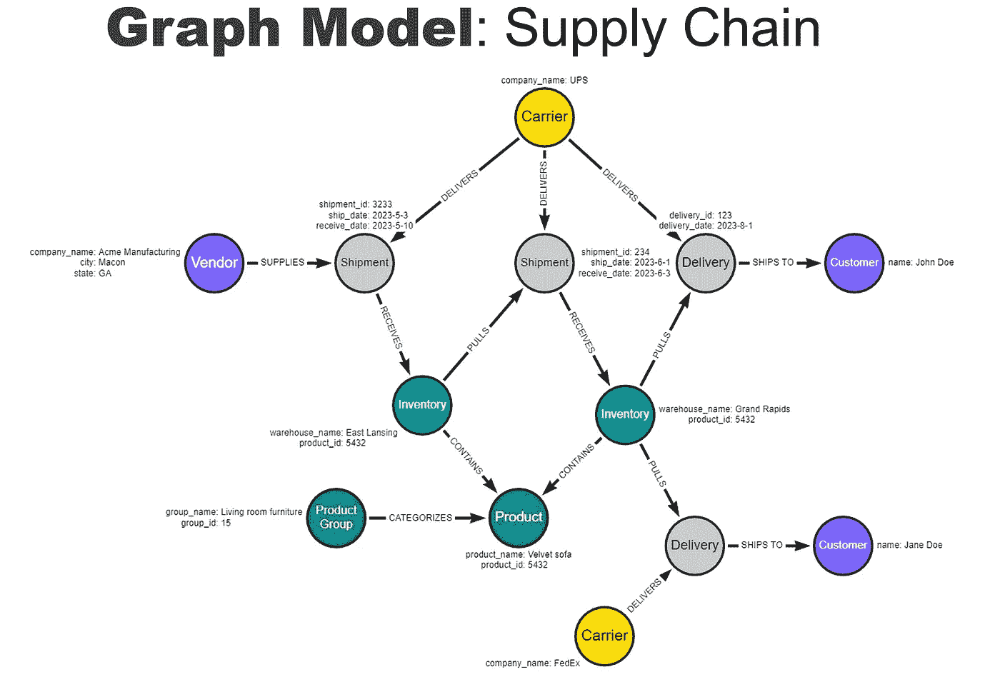
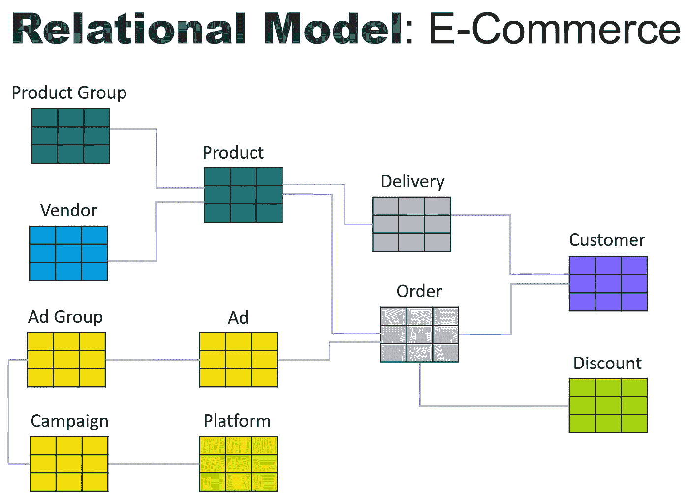
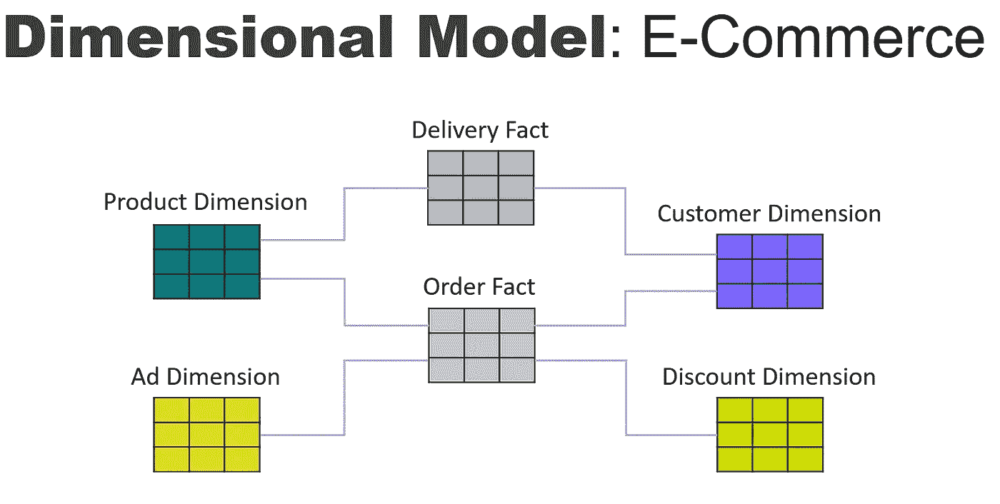
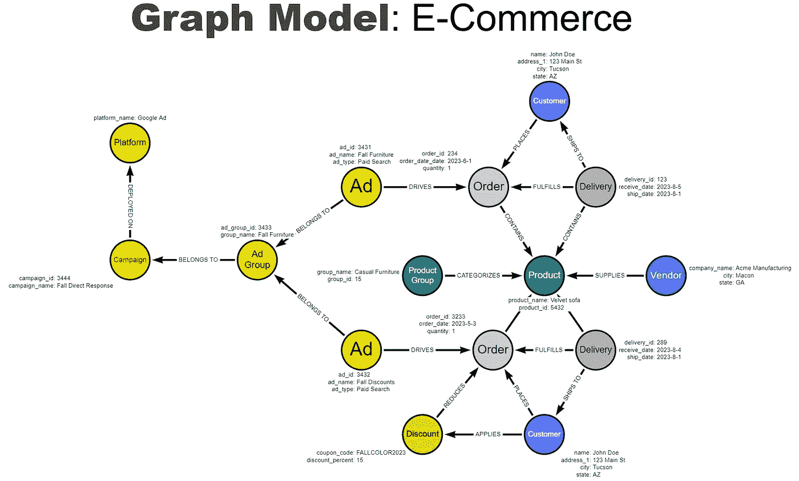
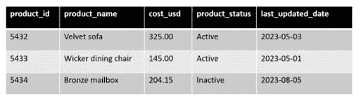
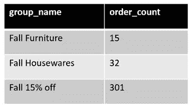
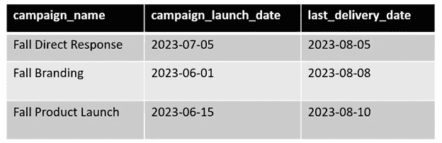

# 为什么你需要知识图谱，以及如何构建它

> 原文：[`towardsdatascience.com/why-you-need-a-knowledgegraph-and-how-to-build-it-ac4f35cb75b7?source=collection_archive---------0-----------------------#2023-08-09`](https://towardsdatascience.com/why-you-need-a-knowledgegraph-and-how-to-build-it-ac4f35cb75b7?source=collection_archive---------0-----------------------#2023-08-09)

## 从关系数据库迁移到图数据库的指南

[](https://swpugsley.medium.com/?source=post_page-----ac4f35cb75b7--------------------------------)[](https://towardsdatascience.com/?source=post_page-----ac4f35cb75b7--------------------------------) [Stan Pugsley](https://swpugsley.medium.com/?source=post_page-----ac4f35cb75b7--------------------------------)

·

[关注](https://medium.com/m/signin?actionUrl=https%3A%2F%2Fmedium.com%2F_%2Fsubscribe%2Fuser%2Fc3a1e6da7396&operation=register&redirect=https%3A%2F%2Ftowardsdatascience.com%2Fwhy-you-need-a-knowledgegraph-and-how-to-build-it-ac4f35cb75b7&user=Stan+Pugsley&userId=c3a1e6da7396&source=post_page-c3a1e6da7396----ac4f35cb75b7---------------------post_header-----------) 发表在 [Towards Data Science](https://towardsdatascience.com/?source=post_page-----ac4f35cb75b7--------------------------------) ·7 分钟阅读·2023 年 8 月 9 日[](https://medium.com/m/signin?actionUrl=https%3A%2F%2Fmedium.com%2F_%2Fvote%2Ftowards-data-science%2Fac4f35cb75b7&operation=register&redirect=https%3A%2F%2Ftowardsdatascience.com%2Fwhy-you-need-a-knowledgegraph-and-how-to-build-it-ac4f35cb75b7&user=Stan+Pugsley&userId=c3a1e6da7396&source=-----ac4f35cb75b7---------------------clap_footer-----------)

--

[](https://medium.com/m/signin?actionUrl=https%3A%2F%2Fmedium.com%2F_%2Fbookmark%2Fp%2Fac4f35cb75b7&operation=register&redirect=https%3A%2F%2Ftowardsdatascience.com%2Fwhy-you-need-a-knowledgegraph-and-how-to-build-it-ac4f35cb75b7&source=-----ac4f35cb75b7---------------------bookmark_footer-----------)

**TLDR: 知识图谱通过图数据库组织事件、人物、资源和文档，以进行高级分析。本文将解释知识图谱的目的，并向你展示如何将关系数据模型转换为图模型，将数据加载到图数据库中，并编写一些示例图查询。**

# 为什么需要知识图谱？

关系数据库非常适合创建列表，但在管理各种实体的网络方面却很糟糕。你是否尝试过用关系数据库完成以下任务？

+   分析一个**医疗护理事件**，当一个患者与许多人、地点和程序互动时

+   在涉及到**金融欺诈**时，通过供应商、客户和交易类型的网络找到模式

+   优化**供应链**的依赖关系和互联元素

这些都是事件、人员和资源网络的示例，这些网络给使用关系数据库的 SQL 分析师带来了巨大的头痛。随着网络规模的增加，关系数据库的速度会呈指数级下降，而图数据库则具有相对线性的关系。如果你在管理一个活动和事物的网络或网络，一个图数据库是正确的选择。未来，我们应该期待看到企业数据组采用**关系数据库进行孤立分析**，以及**知识图谱处理跨功能的复杂网络过程**的组合。

基于图数据库技术的知识图谱，是为了处理多样的过程和实体网络而构建的。在知识图谱中，你会有代表人员、事件、地点、资源、文档等的节点。你还有表示节点之间链接的关系（边）。这些关系在数据库中物理存储，并具有名称和方向。并非所有的图数据库都是知识图谱。要被视为知识图谱，设计必须**嵌入业务** [**语义模型**](https://medium.com/@nripapathak/semantic-data-modelling-92aa64582dc7)，通过清晰的业务名称反映在多个业务功能跨越的节点集合中。你实际上是在创建一个**无缝的网络**，连接所有交互的业务部分，并使用业务语义将数据紧密地与其代表的过程联系起来。这可以作为**未来生成型 LLM 模型**使用的**基础**。

为了在知识图谱中展示多样的数据集，我们来看一个关于供应链物流的简单示例。业务流程可能被建模为如下：



供应链图数据库模型。图像由作者提供。

该模型可以扩展到包括业务流程的任何相关部分：客户退货、发票、原材料、制造过程、员工，甚至客户评论。没有预定义的模式，因此模型可以在任何方向或深度上扩展。

# 从关系模型到维度模型再到图模型

现在，让我们通过将一个典型的关系数据库模型转换为图模型的过程，使用电子商务供应商的场景。假设该供应商正在进行一系列数字营销活动，在其网站上接收订单，并向客户发货。关系模型可能如下所示：



电子商务关系数据库模型。图像由作者提供。

如果我们将其转换为数据仓库中的维度模型，该模型可能如下所示：



电子商务维度模型（数据仓库）。图片由作者提供。

请注意，事实表集中于事件，而维度表表示将业务实体的所有属性组合成一个表。这种以事件为中心的设计提供了更快的查询时间，但也带来了其他问题。每个事件都是一个独立的事实表，从一个事件到相关事件的连接很难看出。当这些关系被分割在多个事实表之间时，没有简单的方法来理解维度实体（如产品）与另一个维度中的实体（如承运人）之间共享的所有事件的关系。维度模型专注于一次一个事件，但掩盖了不同事件之间的连接。

图形模型通过将过程建模为如下方式，解决了显示实体间相互关系的问题：



电子商务图形数据库模型。图片由作者提供。

首次查看，这个图形模型与关系模型的相似性多于与维度模型的相似性，但它可以用于与数据仓库相同的分析目的。注意每个关系都有名称和方向。而且，可以在任何节点之间创建关系——事件与事件、人际与人际、文档与事件等。**图形查询还允许你以 SQL 无法实现的方式遍历图形。**

例如，你可以收集与关键事件相关的任何节点，并研究其出现模式。层次结构得到保留，每个层级可以单独引用，这不同于非规范化的维度表。最重要的是，图形在建模业务中的任何事件或实体时更具灵活性，不需要遵循严格的模式约束。图形设计旨在匹配业务的语义模型。

# 提取、转换和加载（ETL）

现在让我们看一个示例关系数据库表，并创建一些示例脚本以提取、转换和加载数据到图形数据库中。在这篇文章中，我将使用由[Neo4j](https://neo4j.com/)提供的 Cypher 语言，Neo4j 是最受欢迎的商业图形数据库。但这些概念也适用于其他变体的[图形查询语言（GQL）](https://www.gqlstandards.org/)。我们将使用以下示例产品表：



产品表。图片由作者提供。

使用这个查询，我们可以提取过去 24 小时内更新的新产品：

```py
SELECT product_id,
  product_name,
  cost_usd,
  product_status
FROM Product
WHERE last_updated_date > current_date -1;
```

我们可以将这些结果提取到一个名为“df”的[Python Pandas](https://pandas.pydata.org/)数据框中，打开图形数据库连接，然后使用此脚本将数据框合并到图形中。

```py
UNWIND $df as row
MERGE INTO (p:Product {product_id: row.product_id})
SET p.product_name = row.product_name,
  p.cost_usd = row.cost_usd,
  p.product_status= row.product_status,
  p.last_updated_date = datetime();
```

第一行引用了一个参数“df”，这是来自 Pandas 的数据框。我们将合并到节点类型“Product”中，该节点通过别名“P”进行引用。然后，“product_id”部分用于绑定到节点中的唯一标识符。之后，Merge 语句看起来类似于 SQL 中的合并。

在使用如上所述的合并语句创建每个节点后，我们创建关系。关系可以在同一脚本中创建，也可以在后处理脚本中使用像这样的合并命令创建：

```py
MATCH (p:Product), (o:Order)
WHERE p.product_id = o.order_id
MERGE (o)-[:CONTAINS]->(p);
```

Match 语句看起来像 Oracle 中的传统连接用法，在 Match 之后声明两个节点类型，然后在 Where 子句中进行连接。

# 图模型上的查询

假设我们已经构建了图，现在想要查询它。我们可以使用类似这样的查询来查看来自亚利桑那州的广告组推动的订单。

```py
MATCH (ag:AdGroup)<-[:BELONGS_TO]-(a:Ad)-[:DRIVES]->(o:Order)<-[:PLACES]-(c:Customer)
WHERE c.state = 'AZ'
RETURN ag.group_name,
  COUNT(o) as order_count
```

这个查询将返回广告组名称和订单数量，筛选自亚利桑那州。请注意，Cypher 中不需要 Group By 子句，与 SQL 不同。从该查询中，我们将收到以下示例输出：



图查询的示例结果。图片由作者提供。

这个例子可能看起来微不足道，因为你可以很容易地在关系数据库或数据仓库中使用订单事实表创建类似的查询。但让我们考虑一个更复杂的查询。假设你想查看从广告活动启动到可归因的交付被接收所需的时间。在数据仓库中，这个查询将跨越事实表（不是一项简单的任务）并且需要大量资源。在关系数据库中，这个查询将涉及一系列长连接。在图数据库中，这个查询看起来如下：

```py
MATCH (cp:Campaign) )<-[:BELONGS_TO]-(ag:AdGroup)<-[:BELONGS_TO]-(a:Ad)
MATCH (a)-[:DRIVES]->(o:Order)<-[:FULFILLS]-(d:Delivery)
RETURN cp.campaign_name,
  cp.start_date as campaign_launch_date,
  MAX(d.receive_date) as last_delivery_date
```

我使用了一个示例查询路径，但用户可以采取多种路径来回答不同的业务问题。在查询中，请注意从 Campaign 到 Delivery 的路径通过 Order 和 Delivery 之间的关系。此外，为了提高可读性，我将路径拆分为两部分，第二行以 Ad 的别名开始。查询的输出结果如下所示：



图查询的示例结果。图片由作者提供。

# 结论

我们已经查看了一些将电子商务业务流程从关系模型转换为图模型的示例步骤，但在这篇文章中无法涵盖所有设计原则。希望你已经看到，图数据库要求的**技术水平**与关系数据库大致相同，并且迁移并不是一个巨大障碍。

最大的挑战是让你的大脑摆脱传统的关系建模技术，转而以语义或业务建模的方式进行思考。如果你发现图形技术有潜在应用，试着通过一个概念验证项目进行尝试。知识图谱的分析可能性远远超出了你在二维表格中能做到的！

*所有图片均由作者提供*
