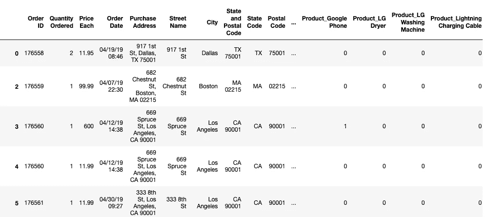
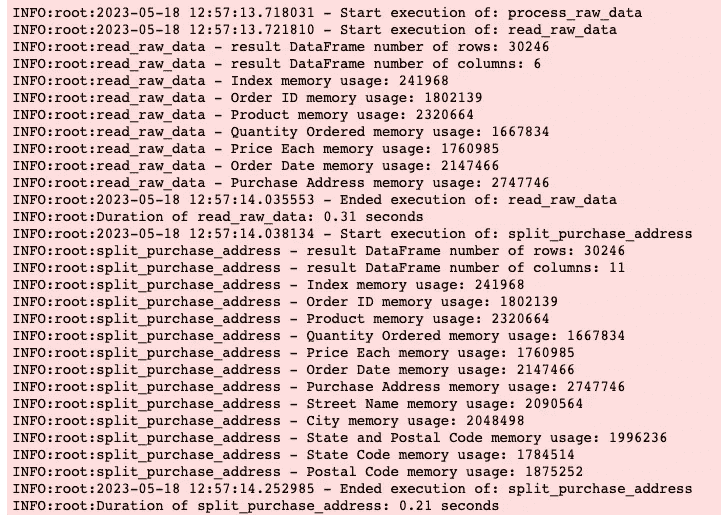
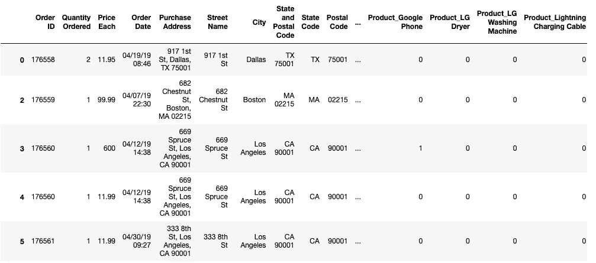

# 为什么你需要在 Python 中使用装饰器来编写 DRY 代码

> 原文：[`towardsdatascience.com/why-you-need-to-write-dry-code-with-decorators-in-python-3930ea23f569`](https://towardsdatascience.com/why-you-need-to-write-dry-code-with-decorators-in-python-3930ea23f569)

## 数据

## 使用装饰器来查看你的数据在 Pandas 处理管道中的变化

[](https://byrondolon.medium.com/?source=post_page-----3930ea23f569--------------------------------)[](https://towardsdatascience.com/?source=post_page-----3930ea23f569--------------------------------) [Byron Dolon](https://byrondolon.medium.com/?source=post_page-----3930ea23f569--------------------------------)

· 发表在 [Towards Data Science](https://towardsdatascience.com/?source=post_page-----3930ea23f569--------------------------------) · 9 分钟阅读 · 2023 年 5 月 19 日

—


装饰是关键 — 图片由 [Adi Goldstein](https://unsplash.com/@adigold1?utm_source=medium&utm_medium=referral) 提供，来源于 [Unsplash](https://unsplash.com/?utm_source=medium&utm_medium=referral)

**DRY 代码是高效编程的关键之一。**

DRY 代表“不要重复自己”，无论是为个人项目编写代码还是为大规模代码库编写代码，这一点都很重要。这意味着你应该拥抱 DRY 代码的概念，创建模块化的解决方案，而不是将逻辑从一个文件复制到另一个文件，或从一个函数复制到另一个函数。

在 Python 中使用装饰器可以帮助实现这一点。简而言之，装饰器允许你操作现有函数并增加其功能。装饰器可以在许多不同的场景中派上用场，但在本文中，我们将探讨如何使用装饰器来改进 Pandas 数据处理管道。

装饰器可以帮助我们理解数据处理管道中每个阶段的情况，这对于处理大规模数据时非常有用。你可以使用它们来跟踪数据的变化，随着对初始 DataFrame 应用不同的转换，这可能会变得难以管理。

随意在你自己的笔记本中跟进。你可以从 Kaggle [这里](https://www.kaggle.com/datasets/deepanshuverma0154/sales-dataset-of-ecommerce-electronic-products?resource=download) 下载数据集，CC0 1.0 通用公共领域献身许可下免费使用。

如果你打算跟进，请确保运行以下代码来导入所有必要的库：

```py
import logging
import functools
import time
from datetime import datetime

logging.basicConfig(level=logging.INFO)
```

# Pandas 中的标准数据处理管道

在深入讨论装饰器之前，让我们先看看 Pandas 中现有的数据处理管道，并快速了解它的功能。

```py
FILE_PATH = "Updated_sales.csv"
CHUNK_SIZE = 1000

def read_raw_data(file_path: str, chunk_size: int=1000) -> DataFrame:
    csv_reader = pd.read_csv(file_path, chunksize=chunk_size)
    processed_chunks = []

    for chunk in csv_reader:
        chunk = chunk.loc[chunk["Order ID"] != "Order ID"].dropna()
        processed_chunks.append(chunk)

    return pd.concat(processed_chunks, axis=0)

def split_purchase_address(df_to_process: DataFrame) -> DataFrame:
    df_address_split = df_to_process["Purchase Address"].str.split(",", n=3, expand=True)
    df_address_split.columns = ["Street Name", "City", "State and Postal Code"]

    df_state_postal_split = (
        df_address_split["State and Postal Code"]
        .str.strip()
        .str.split(" ", n=2, expand=True)
    )
    df_state_postal_split.columns = ["State Code", "Postal Code"]

    return pd.concat([df_to_process, df_address_split, df_state_postal_split], axis=1)

def extract_product_pack_information(df_to_process: DataFrame) -> DataFrame:
    df_to_process["Pack Information"] = df_to_process["Product"].str.extract(r'.*\((.*)\).*').fillna("Not Pack")

    return df_to_process

def one_hot_encode_product_column(df_to_process: DataFrame) -> DataFrame:    
    return pd.get_dummies(df_to_process, columns=["Product"])

def process_raw_data():
    df = read_raw_data(file_path=FILE_PATH, chunk_size=CHUNK_SIZE)

    return (
        df
        .pipe(split_purchase_address)
        .pipe(extract_product_pack_information)
        .pipe(one_hot_encode_product_column)
    )

final_df = process_raw_data()
```



初始管道的输出 — 作者提供的图片

在这个管道中，本质上有一个“main”函数，它调用几个其他的读取和处理函数，以输出一个准备好用于训练机器学习模型的 DataFrame。这是一个只有三个预处理步骤的简单示例，但你可以通过查看`process_raw_data`函数来了解它是如何工作的，具体如下：

1.  使用自定义`read_raw_data`函数按指定的块大小读取原始数据；

1.  在结果 DataFrame 对象上调用 Pandas 的`pipe`方法以实现方法链，这涉及将自定义数据预处理函数按顺序传递给`pipe`方法。

在这种情况下，我们有三个主要任务要处理我们的数据，这些任务被封装在三个函数中：`split_purchase_address`、`extract_product_pack_information`和`one_hot_encode_product_columns`。所有这些函数以不同的方式转换初始 DataFrame，并使原始数据在进行机器学习时真正可用。

然而，如果在管道的每个连续步骤中很难看到发生了什么。因为我写了代码，我知道每次调用`pipe`方法时 DataFrame 正在发生什么。但如果基础数据发生变化或其他人想知道发生了什么，返回一些以日志形式呈现的数据会很有用！

实现日志有很多不同的方法，但让我们看看 Python 中的装饰器如何帮助我们了解数据的情况。

# 什么是装饰器？

因此，我们的目标是理解 DataFrame 在管道的多个阶段处理时发生了什么。解决方案是为我们定义的函数添加一个包装层，以便增加额外的功能，返回有关 DataFrame 的信息等。做到这一点意味着我们需要定义装饰器函数。

这比在每个函数中添加相同类型的日志行更高效。特别是在大规模处理时，想象一下需要在十几个不同的数据处理函数或散布在几个不同文件中的函数中复制粘贴相同的三条日志消息。

从事“元编程”要高效得多，其中我们定义装饰器函数，其目标是操控现有代码。理想情况下，装饰器函数应该做的就是接受一个函数作为输入，并运行该函数并返回它通常的结果，但在函数上添加一些额外的功能。

# 定义你可以用来处理数据的装饰器

## 记录函数的执行时间

对于装饰器的初步示例，让我们从简单地记录每个函数的开始时间以及计算函数运行时间开始。

```py
def log_execution_and_time(function):
    @functools.wraps(function)
    def wrapper(*args, **kwargs):
        start_time = time.time()
        logging.info(f"{datetime.fromtimestamp(start_time)} - Start execution of: {function.__name__}")
        result = function(*args, **kwargs)
        end_time = time.time()
        logging.info(f"{datetime.fromtimestamp(end_time)} - Ended execution of: {function.__name__}")
        logging.info(f"Duration of {function.__name__}: {round(end_time - start_time, 2)} seconds")
        return result
    return wrapper
```

有很多内容需要详细了解，所以让我们看看这里发生了什么。我们首先定义了我们的装饰器函数`log_execution_and_time`。由于装饰器应该接受一个函数作为输入，我们还定义了一个`function`参数。

如果我们在不使用`functools.wraps`这一行的情况下使用函数，我们将无法保留现有函数的元数据并在日志中使用它。总是记得在你的装饰器中包含这一行，否则它们将不会按你想要的方式行为。例如，原函数名将不会在包装器中保留（例如，装饰器无法识别`read_raw_data`函数名是`read_raw_data`）。你可以在[Python 文档](https://docs.python.org/3/library/functools.html#functools.wraps)中查看一个简单的例子。

接下来，我们定义包装器来实际实现我们想要的附加功能。在这种情况下，我们想要跟踪函数运行所需的时间。这样做很简单：我们只需使用`time`库将当前时间分配给`start_time`和`end_time`变量，然后取这两者之间的差值以获得函数的持续时间。你会看到在我们定义这些变量的中间，我们运行了函数。执行此操作的行是：

`result = function(*args, **kwargs)`

这就像我们之前读取原始数据时所使用的语法一样：

`df = read_raw_data(file_path=FILE_PATH, chunk_size=CHUNK_SIZE)`

在`wrapper`和`function`中定义`args`和`kwargs`参数的原因是为了允许我们通过装饰器传递的函数接受任意数量的参数和关键字参数。

在这个函数中，我们还使用`logging.info`语法写了一些日志行。我们还使用`function.__name__`来提取日志消息中的实际函数名称。

最后，在包装器函数内部，我们返回先前定义的`result`，这是原函数执行的结果。在我们的数据处理管道中，这将始终是一个 Pandas DataFrame。在我们的装饰器函数中，我们返回`wrapper`函数，其中包括我们对现有函数的附加功能。

## 记录 DataFrame 元数据

既然我们已经了解了装饰器的工作原理，让我们来看看如何在日志中返回关于 DataFrame 的元数据的信息。

```py
def log_dataframe_metadata(function):
    @functools.wraps(function)
    def wrapper(*args, **kwargs):
        result = function(*args, **kwargs)
        logging.info(f"{function.__name__} - result DataFrame number of rows: {len(result)}")
        logging.info(f"{function.__name__} - result DataFrame number of columns: {len(result.columns)}")
        for column, memory in result.memory_usage(deep=True).iteritems():
            logging.info(f"{function.__name__} - {column} memory usage: {memory}")
        return result
    return wrapper
```

装饰器语法与之前相同。相反，我们首先返回函数的结果，然后基于结果 DataFrame 定义日志消息。在这里，你可以看到你可以使用装饰器对函数的结果执行操作。

在这种情况下，我们想要查看 DataFrame 中的三项内容：

1.  行数：`len(result)`

1.  列数：`len(result.columns)`

1.  每列的内存使用量：`result.memory_usage(deep=True)`

在这里，记住 `result` 在这种情况下始终是一个 Pandas DataFrame，这意味着我们可以在其上调用 Pandas 方法。根据你定义的函数来转换 DataFrame，这些方法中的每一个都可能会很有用。

例如，如果你向 DataFrame 添加了新列，你可以通过检查列数来验证列是否已添加。此外，如果你只是添加了额外的列，DataFrame 中不应添加任何行，你也可以对其进行合理性检查。

最后，监控每一列的内存使用情况是有用的，以确保你在一些预定义的限制范围内。为了方便，我们的日志装饰器处理 `result.memory_usage` 的输出，这是一系列包含每列信息的数据，因此我们可以遍历此系列，并以易于阅读的方式返回每列使用的内存。

# 向我们的管道添加装饰器

现在我们已经定义了装饰器，将它们应用到我们的管道中非常简单。我们之前的初始代码可以像这样修改，以添加我们在装饰器函数中定义的功能。

```py
@log_execution_and_time
@log_dataframe_metadata
def read_raw_data(file_path: str, chunk_size: int=1000) -> DataFrame:
    csv_reader = pd.read_csv(file_path, chunksize=chunk_size)
    processed_chunks = []

    for chunk in csv_reader:
        chunk = chunk.loc[chunk["Order ID"] != "Order ID"].dropna()
        processed_chunks.append(chunk)

    return pd.concat(processed_chunks, axis=0)

@log_execution_and_time
@log_dataframe_metadata
def split_purchase_address(df_to_process: DataFrame) -> DataFrame:
    df_address_split = df_to_process["Purchase Address"].str.split(",", n=3, expand=True)
    df_address_split.columns = ["Street Name", "City", "State and Postal Code"]

    df_state_postal_split = (
        df_address_split["State and Postal Code"]
        .str.strip()
        .str.split(" ", n=2, expand=True)
    )
    df_state_postal_split.columns = ["State Code", "Postal Code"]

    return pd.concat([df_to_process, df_address_split, df_state_postal_split], axis=1)

@log_execution_and_time
@log_dataframe_metadata
def extract_product_pack_information(df_to_process: DataFrame) -> DataFrame:
    df_to_process["Pack Information"] = df_to_process["Product"].str.extract(r'.*\((.*)\).*').fillna("Not Pack")

    return df_to_process

@log_execution_and_time
@log_dataframe_metadata
def one_hot_encode_product_column(df_to_process: DataFrame) -> DataFrame:    
    return pd.get_dummies(df_to_process, columns=["Product"])

@log_execution_and_time
@log_dataframe_metadata
def process_raw_data():
    df = read_raw_data(file_path=FILE_PATH, chunk_size=CHUNK_SIZE)

    return (
        df
        .pipe(split_purchase_address)
        .pipe(extract_product_pack_information)
        .pipe(one_hot_encode_product_column)
    )

final_df = process_raw_data()
```



带有日志装饰器的数据处理管道输出 — 作者图片

我们需要做的就是在函数定义的顶部添加 `@log_execution_and_time` 和 `@log_dataframe_metadata` 以实现装饰器功能。然后，当我们以相同的方式运行代码时，我们会额外得到每个函数运行时的日志输出。

现在，用户可以看到 DataFrame 在处理管道中移动时发生了什么。结果 DataFrame 与之前完全相同。



最终的 DataFrame 没有改变 — 作者图片

就这些！这只是你可以用装饰器做的许多事情的开始。你可以通过更多的详细日志、向装饰器添加可选参数以使其在不同函数中表现不同，甚至让它们根据需要编辑每个 DataFrame 的结果（如删除空值）等来进一步改善你的数据处理管道。

感谢你抽出时间阅读这篇文章！如果你喜欢我的内容，我希望你通过下面的推荐链接注册 Medium。这将使我获得你月度订阅的一部分，并且你将获得仅限 Medium 会员的独家功能。如果你已经在关注我，感谢你的支持！

[## 使用我的推荐链接加入 Medium — Byron Dolon](https://byrondolon.medium.com/membership?source=post_page-----3930ea23f569--------------------------------)

### 作为 Medium 会员，你的一部分会员费会流向你阅读的作者，你可以完全访问每一个故事……

[byrondolon.medium.com](https://byrondolon.medium.com/membership?source=post_page-----3930ea23f569--------------------------------)

> **更多内容**：*-* [*5 个实用的技巧供有志数据分析师参考*](https://byrondolon.medium.com/5-practical-tips-for-aspiring-data-analysts-9917006d4dae?sk=019edbddaca4d313665caafe4b747d26) *-* [*掌握电商数据分析*](https://python.plainenglish.io/mastering-analysis-for-e-commerce-with-pandas-e4219a87b10c?sk=9aa8fd1024b89e89e4b0904c8d00d242) *-* *在 Pandas 数据框中检查子字符串* *-* [*学习 Python 的 7 个最佳 GitHub 仓库*](https://medium.com/towards-data-science/top-7-repositories-on-github-to-learn-python-44a3a7accb44) *-* *用 Pandas 理解数据的 5（又半）行代码*
