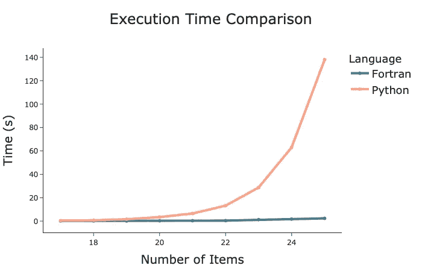

# 为什么作为数据科学家你应该考虑使用 Fortran

> 原文：[`towardsdatascience.com/why-you-should-consider-using-fortran-as-a-data-scientist-5511e05ef89`](https://towardsdatascience.com/why-you-should-consider-using-fortran-as-a-data-scientist-5511e05ef89)

## 探讨 Fortran 可以为数据科学和机器学习带来的好处

[](https://medium.com/@egorhowell?source=post_page-----5511e05ef89--------------------------------)[](https://towardsdatascience.com/?source=post_page-----5511e05ef89--------------------------------) [Egor Howell](https://medium.com/@egorhowell?source=post_page-----5511e05ef89--------------------------------)

·发表于[Towards Data Science](https://towardsdatascience.com/?source=post_page-----5511e05ef89--------------------------------) ·阅读时间 8 分钟·2023 年 5 月 16 日

--


由[Federica Galli](https://unsplash.com/@fedechanw?utm_source=medium&utm_medium=referral)拍摄，来自[Unsplash](https://unsplash.com/?utm_source=medium&utm_medium=referral)。

# 背景

Python 被广泛认为是数据科学的金标准语言，与数据科学相关的所有包、文献和资源总是可以在 Python 中找到。这并不一定是坏事，因为这意味着对于你可能遇到的任何数据相关问题，已经有大量记录的解决方案。

然而，随着数据集的增大和模型复杂度的提升，也许是时候探索其他语言了。这时，老牌语言[**Fortran**](https://en.wikipedia.org/wiki/Fortran)可能会再次流行。因此，今天的数据科学家们了解它并尝试实现一些解决方案是非常值得的。

# 什么是 Fortran？

Fortran，意为“公式翻译器”，是 1950 年代首个被广泛使用的编程语言。尽管其年代久远，它仍然是高性能计算语言，并且[比 C 和 C++都要快](https://benchmarksgame-team.pages.debian.net/benchmarksgame/fastest/ifc-gpp.html)。

最初为科学家和工程师设计，以运行如流体力学和有机化学等领域的大规模模型和仿真，Fortran 至今仍被物理学家频繁使用。我在物理学本科期间也学过它！

它的专长在于建模和仿真，这对包括机器学习在内的众多领域至关重要。因此，Fortran 非常适合解决数据科学问题，因为这正是几十年前它被发明出来的目的。

# 优势与劣势

Fortran 相对于其他编程语言如 C++和 Python 有几个关键优势。以下是一些主要点：

+   **易于阅读**：Fortran 是一种紧凑的语言，只有五种原生数据类型：INTEGER、REAL、COMPLEX、LOGICAL 和 CHARACTER。这种简洁性使其易于阅读和理解，特别是在科学应用中。

+   [**高性能**](https://en.wikipedia.org/wiki/High-performance_computing)：Fortran 通常用于基准测试高性能计算机的速度。

+   **大型库**：Fortran 有广泛的[库](https://fortranwiki.org/fortran/show/Libraries)，主要用于科学目的。这些库为开发人员提供了大量的函数和工具，用于执行复杂的计算和模拟。

+   **历史数组支持**：Fortran 从一开始就支持多维数组，这对于机器学习和数据科学如[神经网络](https://dl.acm.org/doi/pdf/10.1145/3460944.3464312)至关重要。

+   **为工程师和科学家设计**：Fortran 专门为纯数值计算而构建，这与 C/C++和 Python 的通用用途不同。

然而，这并非全是美好如画。以下是 Fortran 的一些缺点：

+   **文本操作**：不适合字符和文本处理，因此在[自然语言处理](https://en.wikipedia.org/wiki/Natural_language_processing)方面并不理想。

+   **Python 有更多的包**：尽管 Fortran 有很多库，但远不及 Python 中的总数。

+   **小社区**：Fortran 语言的关注度不如其他语言。这意味着它没有大量的 IDE 和插件支持，也没有很多的 Stack Overflow 回答！

+   **不适合许多应用程序**：它显然是一种科学语言，所以不要试图用它来建立网站！

# 设置 Fortran

## **Homebrew**

让我们快速了解一下如何在你的计算机上安装 Fortran。首先，你应该安装**Homebrew** ([链接在这里](https://brew.sh/))，它是 MacOS 的一个包管理器。

要安装 Homebrew，只需运行其网站上的命令：

```py
/bin/bash -c "$(curl -fsSL https://raw.githubusercontent.com/Homebrew/install/HEAD/install.sh)"
```

你可以通过运行命令`brew help`来验证 Homebrew 是否已安装。如果没有错误，那么 Homebrew 已经成功安装在你的系统上。

## **GCC 编译器**

由于 Fortran 是一个[**编译语言**](https://en.wikipedia.org/wiki/Compiled_language)，我们需要一个能够编译 Fortran 源代码的编译器。不幸的是，MacOS 并不自带 Fortran 编译器，因此我们需要自行安装一个。

一个受欢迎的选项是 [**GCC**](https://gcc.gnu.org/)（GNU 编译器集合）编译器，你可以通过 Homebrew 安装：`brew install gcc`。GCC 编译器是一个支持 C、Go 以及当然还有 Fortran 的编译器集合。GCC 组中的 Fortran 编译器叫做 [**gfortran**](https://gcc.gnu.org/wiki/GFortran)，它可以编译所有主要版本的 Fortran，如 77、90、95、2003 和 2008。建议使用 `.f90` 扩展名来命名 Fortran 代码文件，尽管 [关于这个话题有些讨论](https://fortran-lang.discourse.group/t/is-there-a-standard-file-suffix-for-modern-fortran-code/3550)。

为了验证 gfortran 和 GCC 是否成功安装，运行命令 `which fortran`。输出应该如下所示：

```py
/opt/homebrew/bin/gfortran
```

gfortran 编译器迄今为止是最受欢迎的，然而还有其他几个编译器。可以在 [这里](https://fortran-lang.org/en/compilers/) 找到一个列表。

## 集成开发环境（IDE）与文本编辑器

一旦我们有了 Fortran 编译器，下一步是选择一个集成开发环境（IDE）或文本编辑器来编写 Fortran 源代码。这是个人偏好的问题，因为有许多选项可供选择。个人而言，我使用 PyCharm 并安装 [Fortran 插件](https://plugins.jetbrains.com/plugin/9699-fortran)，因为我不喜欢使用多个 IDE。其他由 [Fortran 网站](https://fortran-lang.org/en/learn/os_setup/text_editors/) 推荐的流行文本编辑器包括 [Sublime Text](https://www.sublimetext.com/)、[Notepad++](https://notepad-plus-plus.org/downloads/) 和 [Emacs](https://www.gnu.org/software/emacs/)。

## 运行程序

在我们进入第一个程序之前，重要的是要注意本文不会进行语法或命令的教程。[这里的链接](https://fortran-lang.org/en/learn/quickstart/) 是一个简短的指南，将涵盖所有基本语法。

以下是一个名为 `example.f90` 的简单程序：

GitHub Gist 由作者提供。

我们的编译过程如下：

```py
gfortran -o example example.f90 
```

这个命令编译代码并创建一个名为 `example` 的可执行文件。你可以用任何你喜欢的名字替换 `example`。如果你没有使用 `-o` 标志指定名称，编译器将使用一个默认名称，通常对于大多数 [**Unix**](https://en.wikipedia.org/wiki/Unix) 系统来说是 `a.out`。

运行 `example` 可执行文件的方法如下：

```py
./example
```

`./` 前缀用于指示可执行文件位于当前目录中。此命令的输出将如下所示：

```py
 Hello world
           1
```

现在，让我们解决一个更“实际”的问题！

# 性能示例：背包问题

## 概述

[**背包问题**](https://en.wikipedia.org/wiki/Knapsack_problem) 是一个著名的 [**组合优化**](https://en.wikipedia.org/wiki/Combinatorial_optimization) 问题，其核心是：

> 一组项目，每个项目都有一个值和重量，必须被打包进一个背包中，以最大化总值，同时遵守背包的重量限制。

尽管问题听起来很简单，但解决方案的数量随着物品数量的增加而呈指数增长。因此，使得在超出一定数量的物品时，通过[**暴力破解**](https://en.wikipedia.org/wiki/Brute-force_search)方式解决[**不可解的**](https://www.umsl.edu/~siegelj/information_theory/classassignments/Lombardo/04_intractableproblems.html)。

[**启发式**](https://en.wikipedia.org/wiki/Heuristic) 方法如[**遗传算法**](https://medium.com/towards-data-science/from-biology-to-computing-an-introduction-to-genetic-algorithms-b39476743483)可以用来在合理的时间内找到一个“足够好”或“近似”的解决方案。如果你有兴趣了解如何使用遗传算法解决胶囊问题，可以查看我之前的帖子：

[## 遗传算法与胶囊问题：初学者指南](https://pub.towardsai.net/genetic-algorithms-and-the-knapsack-problem-a-beginners-guide-a11236ca30e4?source=post_page-----5511e05ef89--------------------------------)

### 通过实践遗传算法，逐步学习如何解决胶囊问题

[pub.towardsai.net](https://pub.towardsai.net/genetic-algorithms-and-the-knapsack-problem-a-beginners-guide-a11236ca30e4?source=post_page-----5511e05ef89--------------------------------)

胶囊问题在数据科学和[**运筹学**](https://en.wikipedia.org/wiki/Operations_research)中有广泛的应用，包括库存管理和供应链效率，因此高效解决这个问题对业务决策非常重要。

在这一部分，我们将看到 Fortran 如何通过纯暴力破解方式快速解决胶囊问题，并与 Python 进行比较。

> 注意：我们将专注于基本版本，即[**0–1 胶囊问题**](https://www.javatpoint.com/0-1-knapsack-problem#:~:text=The%200%2F1%20knapsack%20problem%20means%20that%20the%20items%20are,pick%20the%202kg%20item%20completely.)，其中每个物品要么完全放入背包，要么完全不放入背包。

## Python

让我们从 Python 开始。

以下代码使用暴力破解方法解决 22 个物品的胶囊问题。每个物品在一个 22 元素的数组中编码为 0（不在）或 1（在）（每个元素代表一个物品）。由于每个物品只有 2 种可能的值，总的组合数量是`2^(num_items)`。我们利用`itertools.product`方法计算所有可能解决方案的[**笛卡尔积**](https://en.wikipedia.org/wiki/Cartesian_product)，然后进行迭代。

作者的 GitHub Gist。

这段代码的输出：

```py
Items in best solution:
Item 1: weight=10, value=10
Item 6: weight=60, value=68
Item 7: weight=70, value=75
Item 8: weight=80, value=58
Item 17: weight=170, value=200
Item 19: weight=190, value=300
Item 21: weight=210, value=400
Total value: 1111
Time taken: 13.78832197189331 seconds
```

## Fortran

现在，让我们用相同的变量来解决相同的问题，但用 Fortran 来实现。与 Python 不同，Fortran 没有执行排列和组合操作的包。

我们的方法是使用[**模运算**](https://en.wikipedia.org/wiki/Modulo)运算符将迭代次数转换为二进制表示。例如，如果迭代次数是 6，那么 6 除以 2 的模是 0，这意味着第一个项目未被选择。然后我们将迭代次数除以 2 以将位向右移动，再次取模以获取下一个项目的二进制表示。这个过程对每个项目（即 22 次）重复，最终得到每一个可能的组合。

作者提供的 GitHub Gist。

使用 [linux](https://linuxize.com/post/linux-time-command/) `[time](https://linuxize.com/post/linux-time-command/)` [命令：](https://linuxize.com/post/linux-time-command/)

```py
time gfortran -o brute brute_force.f90
time ./brute
```

输出：

```py
 Items in best solution:
 Item:           1 Weight:          10 Value:          10
 Item:           6 Weight:          60 Value:          68
 Item:           7 Weight:          70 Value:          75
 Item:           8 Weight:          80 Value:          58
 Item:          17 Weight:         170 Value:         200
 Item:          19 Weight:         190 Value:         300
 Item:          21 Weight:         210 Value:         400
 Best value found:         1111
./brute  0.26s user 0.01s system 41% cpu 0.645 total
```

> Fortran 代码速度约为 Python 的 21 倍！

## 比较

为了获得更直观的比较，我们可以将执行时间绘制为项目数量的函数：



由作者在 Python 中生成的图表。

> Fortran 的性能超越了 Python！

尽管 Fortran 的计算时间会增加，但增长幅度远远小于 Python。这确实展示了 Fortran 在解决优化问题时的计算能力，而优化问题在许多数据科学领域至关重要。

# 总结与进一步思考

尽管 Python 一直是数据科学的首选，但像 Fortran 这样的语言仍然能提供显著的价值，特别是在处理优化问题时，因其固有的数值计算能力。它在解决背包问题的暴力破解中优于 Python，随着问题中项目的增加，性能差距进一步扩大。因此，作为数据科学家，如果你需要在计算能力上获得优势以解决业务和行业问题，你可能需要考虑将时间投入到 Fortran 中。

本文中使用的完整代码可以在我的 GitHub 上找到：

[](https://github.com/egorhowell/Medium-Articles/tree/main/Optimisation/knapsack?source=post_page-----5511e05ef89--------------------------------) [## Medium-Articles/Optimisation/knapsack 在主分支 · egorhowell/Medium-Articles

### 你此时无法执行该操作。你在另一个标签页或窗口中登录。你在另一个标签页或窗口中注销…

github.com](https://github.com/egorhowell/Medium-Articles/tree/main/Optimisation/knapsack?source=post_page-----5511e05ef89--------------------------------)

# 另一个事项！

我有一个免费的通讯，[**Dishing the Data**](https://dishingthedata.substack.com/)，我在其中分享每周成为更好数据科学家的技巧。

[](https://newsletter.egorhowell.com/?source=post_page-----5511e05ef89--------------------------------) [## Dishing The Data | Egor Howell | Substack

### 如何成为更好的数据科学家。点击阅读《Dishing The Data》，作者**Egor Howell**，Substack 发表的…

[newsletter.egorhowell.com](https://newsletter.egorhowell.com/?source=post_page-----5511e05ef89--------------------------------)

# 与我联系！

+   [**YouTube**](https://www.youtube.com/@egorhowell?sub_confirmation=1)

+   [**LinkedIn**](https://www.linkedin.com/in/egor-howell-092a721b3/)

+   [**Twitter**](https://twitter.com/EgorHowell)

+   [**GitHub**](https://github.com/egorhowell)

# 参考资料及进一步阅读

+   [*优化算法*](https://mitpress.mit.edu/9780262039420/algorithms-for-optimization/)*.* [Mykel J. Kochenderfer](https://mitpress.mit.edu/author/mykel-j-kochenderfer-18773) 和 [Tim A. Wheeler](https://mitpress.mit.edu/author/tim-a-wheeler-28144)。***2019***。

+   *Fortran 网站*: [`fortran-lang.org/en/`](https://fortran-lang.org/en/)
