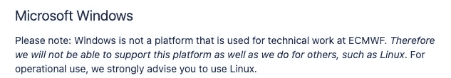
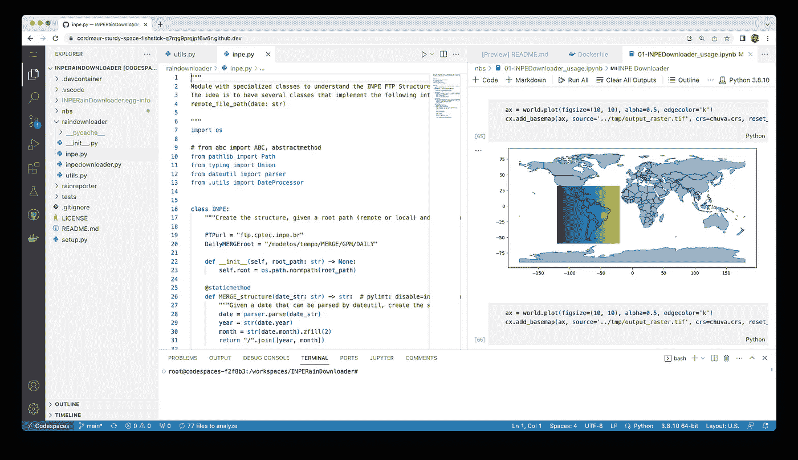

# 为什么你应该在地理空间开发中使用 DevContainers

> 原文：[`towardsdatascience.com/why-you-should-use-devcontainers-for-your-geospatial-development-600f42c7b7e1`](https://towardsdatascience.com/why-you-should-use-devcontainers-for-your-geospatial-development-600f42c7b7e1)

## 了解使用 DevContainers 和 Codespaces 在跨平台和设备上进行无缝地理空间开发的优势

 [Maurício Cordeiro](https://cordmaur.medium.com/?source=post_page-----600f42c7b7e1--------------------------------)

·发表于[Towards Data Science](https://towardsdatascience.com/?source=post_page-----600f42c7b7e1--------------------------------) ·阅读时间 5 分钟·2023 年 3 月 31 日

--

图像由 Midjourney 创建。说明：“世界被电缆包围，在一个杂乱的环境中，赛博朋克，真实的 3D”

> 由于 Medium.com 政策的变动（自 2023 年 9 月实施），这篇文章现在可以在**geocorner.net**上免费获取：[`www.geocorner.net/post/why-you-should-use-devcontainers-for-your-geospatial-development`](https://www.geocorner.net/post/why-you-should-use-devcontainers-for-your-geospatial-development)

# 介绍

在我最近的一篇文章中，发表于 TDS（[使用 Python 配置用于空间分析的最小 Docker 镜像](https://medium.com/towards-data-science/configuring-a-minimal-docker-image-for-spatial-analysis-with-python-dc9970ca8a8a)），我展示了如何配置一个包含 GDAL 和 XArray 等基本地理空间分析工具的 Python Docker 镜像。管理包依赖可能很具挑战性，尤其是当涉及到专门的地理空间库时。在这方面，Docker 容器提供了一个优雅的解决方案，用于将系统部署到云服务器。但是，开发过程本身呢？在这篇文章中，我将探讨改变我对开发环境管理看法的关键因素，以及 DevContainers 和 Codespaces 如何改造地理空间开发工作流。

# 理由

## 1- 跨平台环境一致性的需求

图像由 Midjourney 创建 - 说明：“一位程序员在使用不同年代的多台计算机工作”

我正在开发一个新的软件包，用于从巴西空间研究机构（INPE）提取气候数据。上周我不得不在以前的 Windows 笔记本电脑上运行这个软件包，以进行一些性能评估。这次经历突显了跨平台管理依赖项和配置的挑战。这个新软件包需要支持 GRIB2 数据格式，这在国家气象中心、天气机构和研究人员中很常见。然而，在 Windows 上安装必要的依赖项证明是麻烦的，最终导致我的整个开发环境崩溃。这让我花了一整天时间修复 Windows 环境，更糟糕的是，由于每个平台上可用的软件包版本不同，我不得不绕过代码中的语法差异。这次事件强调了拥有一致的开发环境以避免这些麻烦的重要性。

## 2- 地理空间软件包的复杂性

地理空间软件包本质上是科学软件。因此，它们通常起源于学术界，由研究人员或实习生开发，这些人可能缺乏适当的软件工程专业知识。这些问题在之前的一篇文章中已经讨论过：[7 个原因说明科学软件设计不佳](https://medium.com/towards-data-science/7-reasons-why-scientific-software-are-not-well-designed-5b9f38e0027d)。

因此，这些软件包常常缺乏支持、稳健性和适当的软件工程设计。这种复杂性在尝试设置和维护开发环境时会带来额外的障碍，特别是在将这些软件包与其他工具和库集成时。

更糟的是，这些软件包有些建立在较旧的软件和命令行工具之上，这些工具使用不同的语言编写，要使它们正常工作不仅需要安装 Python 软件包本身，还需要单独的安装程序和特定的环境配置。举一个例子，`cfgrib` 需要 `eccodes` 库来正确编码/解码 **GRIB2** 文件格式。直接取自 `eccodes` 文档：

来源：eccodes 文档 ([`confluence.ecmwf.int/display/ECC/ecCodes+installation`](https://confluence.ecmwf.int/display/ECC/ecCodes+installation))

## 3- 从任何设备访问代码

照片由 [Firmbee.com](https://unsplash.com/@firmbee?utm_source=medium&utm_medium=referral) 提供，在 [Unsplash](https://unsplash.com/?utm_source=medium&utm_medium=referral) 上发布

另一个促使我重新考虑开发环境管理的情况是，当我需要从妻子的电脑访问我的代码时。我知道，这确实是个紧急情况，但有时当你没有笔记本电脑时这种情况是可能发生的。虽然我的所有代码都托管在 GitHub 上，但在她的机器上安装所有所需的开发工具来完成如此小的任务是不现实的。这种挫败感促使我探索 **DevContainers** 和 **Codespaces** 作为潜在的解决方案。

# 解决方案

## 无缝开发的 DevContainers

DevContainers 是 Visual Studio Code 在 2019 年推出的一项功能，允许开发者在不同的机器之间标准化开发环境。通过利用 Docker 容器的强大功能，DevContainers 封装了依赖项和配置，确保无论本地系统如何都能提供一致的体验。

简而言之，开发者可以将 VSCode 连接到一个容器，并在利用容器化环境的同时保持高质量的开发体验。

## GitHub Codespaces

使用 DevContainers，设置一个 GitHub Codespace 来进行你的项目变得轻而易举。GitHub Codespaces 提供了一个功能齐全的、基于云的 VSCode 环境，支持扩展和各种开发工具（图 1）。你甚至可以在其中运行 Jupyter notebooks、绘制地图，并从几乎任何带有浏览器的设备上访问它。

截至 2022 年 11 月 9 日，GitHub Codespaces 每月提供 120 小时的免费核心时间和 15GB 的存储空间。这不足以进行全职编码，但在主要开发机器不可用时，它是一个宝贵的资源，用于紧急编码情况。

图 1：运行在 GitHub Codespace 内的基于云的 VSCode。

# 结论

虽然 DevContainers 提供了许多优点，但也有一些潜在的缺点需要注意。一个这样的缺点是需要在开发机器上安装 Docker。对于不熟悉 Docker 的开发者来说，这一要求可能会引入学习曲线并增加设置过程的复杂性。

此外，运行 Docker 容器可能会消耗大量系统资源，这可能导致在硬件能力有限的机器上出现性能问题。在决定是否采用 DevContainers 进行地理空间开发时，重要的是要考虑这些缺点。

你呢？你是否曾经使用过 DevContainers 或 Codespaces？你遇到了什么其他的优点或缺点？请在评论中留下你的想法。

感谢阅读，下篇文章见。

# 保持联系

*如果你喜欢这篇文章并希望支持我作为作家，考虑成为一名* [*Medium 会员*](https://cordmaur.medium.com/membership)*。每月仅需 5 美元，我将从你的会员费中获得少量佣金，对你没有额外费用。或者你也可以随时* [*请我喝咖啡*](https://www.buymeacoffee.com/cordmaurl)*。*

 [## 通过我的推荐链接加入 Medium - Maurício Cordeiro

### 阅读每一个来自**Maurício Cordeiro**的故事（以及 Medium 上的成千上万其他作者的故事）。你的会员费用将直接…

cordmaur.medium.com](http://cordmaur.medium.com/membership?source=post_page-----600f42c7b7e1--------------------------------)
