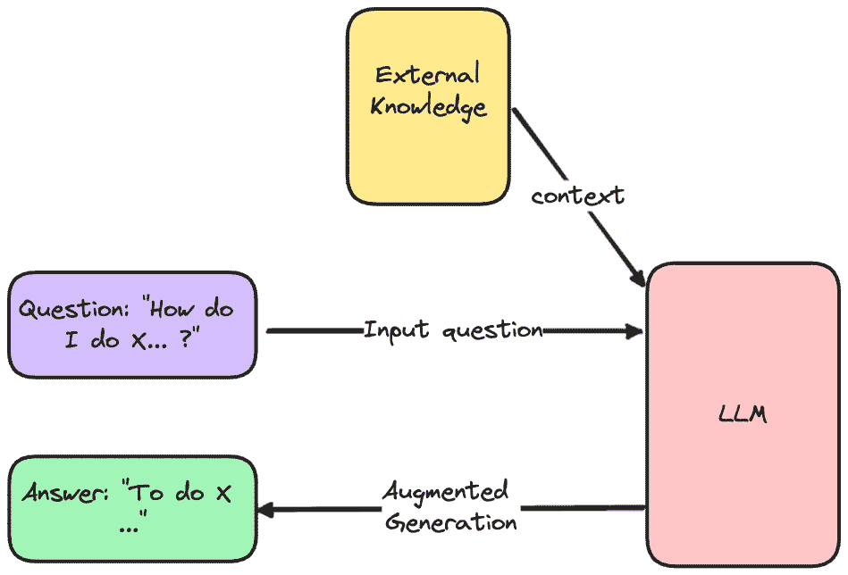

# 为什么你的 RAG 在生产环境中不可靠

> 原文：[`towardsdatascience.com/why-your-rag-is-not-reliable-in-a-production-environment-9e6a73b3eddb`](https://towardsdatascience.com/why-your-rag-is-not-reliable-in-a-production-environment-9e6a73b3eddb)

## 以及你应该如何正确调整它

[](https://ahmedbesbes.medium.com/?source=post_page-----9e6a73b3eddb--------------------------------)[](https://towardsdatascience.com/?source=post_page-----9e6a73b3eddb--------------------------------) [Ahmed Besbes](https://ahmedbesbes.medium.com/?source=post_page-----9e6a73b3eddb--------------------------------)

·发表于 [Towards Data Science](https://towardsdatascience.com/?source=post_page-----9e6a73b3eddb--------------------------------) ·阅读时间 7 分钟·2023 年 10 月 12 日

--


图片来源：[Ivan Jermakov](https://unsplash.com/@ivanjermakov?utm_source=medium&utm_medium=referral) 在 [Unsplash](https://unsplash.com/?utm_source=medium&utm_medium=referral)

随着 LLM 的兴起，检索增强生成（RAG）[框架](https://arxiv.org/abs/2005.11401) 也因能够在数据上构建问答系统而获得了广泛关注。

我们都见过那些聊天机器人与 PDF 或电子邮件对话的演示。

虽然这些系统确实令人印象深刻，但在生产环境中，如果不进行调整和实验，它们可能不够可靠。

> ***在这篇文章中，我探讨了 RAG 框架背后的问题，并提出了一些提升其性能的技巧。这些技巧包括利用文档元数据和调整超参数。***

这些发现基于我作为一名 ML 工程师的经验，我仍在学习这项技术并在制药行业构建 RAG。

事不宜迟，我们来看一看 🔍

> 如果你对提高构建 ML 系统的生产力感兴趣，可以随时订阅我的 [通讯](https://thetechbuffet.substack.com/)。
> 
> 我每周发送关于编程和系统设计的见解，帮助你更快地推出 AI 产品。

# RAG 简要介绍 ⚙️

首先，我们要弄清楚基本概念。

这是 RAG 的工作原理。

它首先接受一个输入问题，并从外部数据库中检索相关文档。然后，它将这些片段作为上下文传递给提示，以帮助 LLM 生成一个 *增强的* 回答。

这基本上是说：

> *“嘿 LLM，这里是我的问题，还有一些文本片段帮助你理解问题。给我一个回答。”*



图片由作者提供

不要被这个图表的简单性所欺骗。

事实上，RAG 隐藏了某些复杂性，并且涉及以下组件：

+   解析不同格式的外部数据的加载器：PDF、网站、Doc 文件等。

+   用于将原始数据分割成较小文本块的分割器

+   用于将文本块转换为向量的嵌入模型

+   用于存储和查询向量的向量数据库

+   用于将问题和检索到的文档结合的提示

+   用于生成答案的 LLM

如果你喜欢图示，这里有另一个给你。

稍微复杂一点，但它展示了索引和检索过程。


作者修改的图像

哎呀！

不过别担心，你仍然可以很快原型化你的 RAG。

像[LangChain](https://www.langchain.com/)这样的框架抽象了构建 RAG 涉及的大部分步骤，使得原型设计这些系统变得容易。

这有多简单？五行代码就搞定了。


当然，这种代码片段的明显简化总是有问题的：根据你的使用情况，它们并不总是能按原样工作，需要非常仔细的调整。

它们作为快速启动的工具很棒，但绝对不是工业化应用的可靠解决方案。

# RAG 的问题

如果你开始构建 RAG 系统而几乎没有调整，你可能会感到惊讶。

这是我在使用 LangChain 和构建 RAG 的前几周所注意到的情况。

**1 — 检索到的文档不总是与问题相关。**

如果你仔细查看数据库检索到的块，你有时会注意到它们并不完全与问题相关。它们与问题在某种程度上相似，但在许多情况下，它们并没有完全对准用户的请求。此外，这些块往往冗余且重叠，这使得生成的答案……重复。

这是一个小实验，展示了与查询（在嵌入空间）最相似的文档既不是最相关的，也不是最语义相似的（这真令人惊讶！）。

在这个例子中，模型忽略了句子的情感，并且对复数形式（添加“s”将相似度降低了 8%）也不够鲁棒。


**2 — RAG 系统缺乏基本的世界知识** 如果你指示 RAG 仅依赖外部数据库来提供答案，它可能会通过编造事实或拒绝回答简单问题来让你感到惊讶。

我曾经在与网球相关的 Reddit 帖子上构建过一个 RAG。虽然它成功回答了有关当时温布尔登公开赛的问题，但对网球规则的一般问题却无能为力。

我知道你不应该问超出系统数据范围的问题，但如果你部署了基于 RAG 的服务，你应该对用户提出的任何问题做好准备。

**3 — 速度**

根据你使用的数据库类型和 LLM 的大小，你的 RAG 可能会非常慢。这会降低用户体验。你应该在构建解决方案之前先做一些基准测试。

**4 — 一个有损的过程**

由于 RAG 将原始数据分割成块，嵌入这些块，并检索最相似的 K 个，固有的信息会逐渐丧失和提炼。

因此，保留外部文档中的所有信息并提供完美的答案几乎是不可能的。

记住这一点很重要：我们在这里处理的是很多近似值。

# 提升 RAG 性能的技巧

如果你盲目地将 RAG 接入数据，它可能会表现出奇怪的行为。

你可以通过应用一些技巧和最佳实践来解决这些问题。

👉 **检查和清理数据**

“垃圾进，垃圾出”的原则仍然适用于 RAG。

如果你提供的文档是噪声较大的（例如 HTML 标签！）、彼此不一致、令人困惑，甚至是重复的，那么生成的答案将会受到影响，并反映出这些缺陷。

在选择 RAG 将使用的数据时要小心。

例如，与其将固有较短的 FAQ 与长 PDF 合并，不如创建两个向量存储。

这里有一个快速的质量检查来评估数据质量：尝试回答一两个问题。如果你发现很难用现有的数据支持得到答案，那就不要指望 RAG 表现得更好。

👉 **微调块大小、top_k 和块重叠**

这些参数**非常**重要，因为分块是 RAG 系统的核心部分。（记住，我们从存储中检索到的文档是**块**！）

这些参数影响检索结果的质量，从而影响生成的答案。

例如，小块大小可能无法捕捉到足够的上下文，而大块大小可能引入大量无关的噪声。

这里没有什么神奇的数字可以给你。最好的解决方案是进行实验并在测试集上验证这些超参数。（是的，构建测试集很重要！）

Pinecone 有一个关于分块策略的[指南](https://www.pinecone.io/learn/chunking-strategies/)，值得阅读。

👉 **利用文档元数据**

有时候在从数据库检索到文档后，基于可用的元数据（例如日期）进行过滤是有用的。这提供了另一种过滤维度，而且不需要额外费用。

👉 **调整你的系统提示**以给 RAG 一个默认行为或特定指令。这是我在一个项目中使用的系统提示：

```py
You're a helpful assistant that works for a big pharmaceutical company.

You'll be asked questions about diseases and treatments among other things.

Stick to the question, provide a comprehensive answer and don't invent facts.

Use the following pieces of context to answer the question at the end.

If you don't know the answer, just say that you don't know, don't try to make up an answer.

%CONTEXT%
{context}

%Question%
 {question}
Answer:
```

👉 **转换输入查询**

如果你表达得不够清楚，RAG 可能找不到它需要的相关文档来建立有用的上下文。解决这一问题的一种方法是通过 LLM**重新表述**查询，然后再试一次。

另一种解决方案可能是尝试[HyDE](https://boston.lti.cs.cmu.edu/luyug/HyDE/HyDE.pdf)方法，它接受查询，生成一个假设性回应，并在嵌入空间中使用这两者进行检索。

查询转换是一个令人兴奋的领域，它可能会改善 RAG 系统，因为 LLMs 往往在较小的查询上表现更好。

# 结论

今天就到这里！

希望你喜欢这篇文章，并从中学到了有关 RAG 的一些有用信息。

由于这项技术相对较新，许多优化技术将会出现，使这个框架更加可靠，并准备好用于工业化应用。

如果你也在构建 RAG，我很好奇你使用了哪些优化技术。请在评论中告诉我。

下次见👋！
