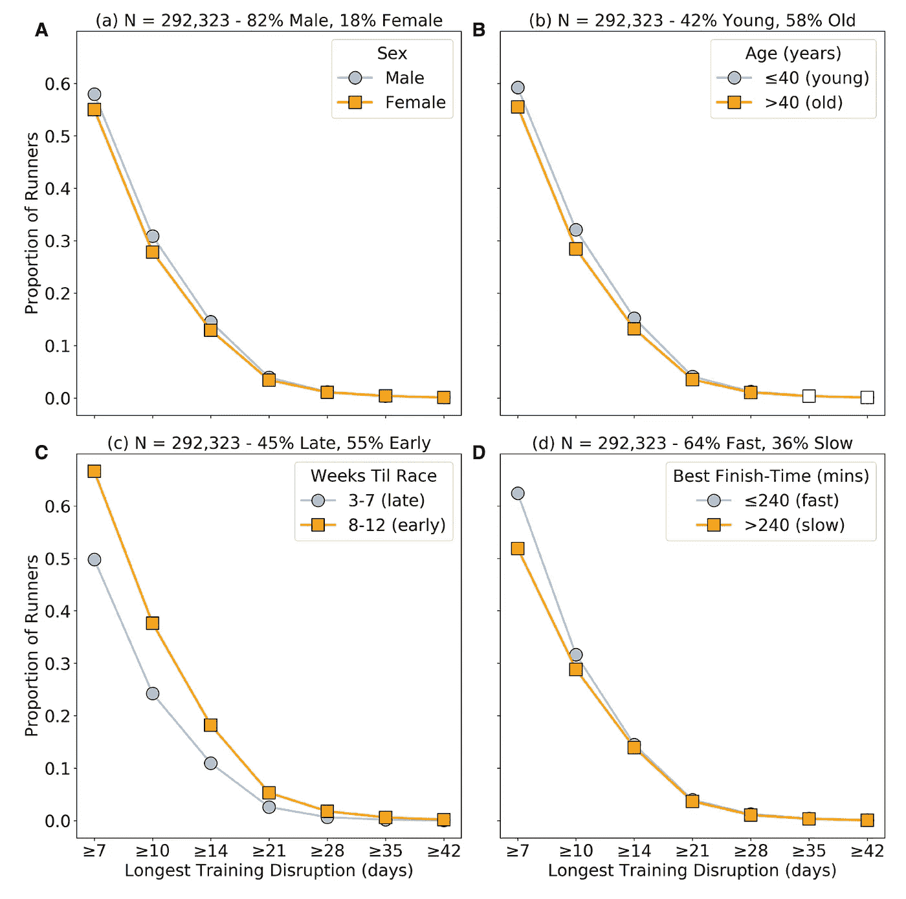
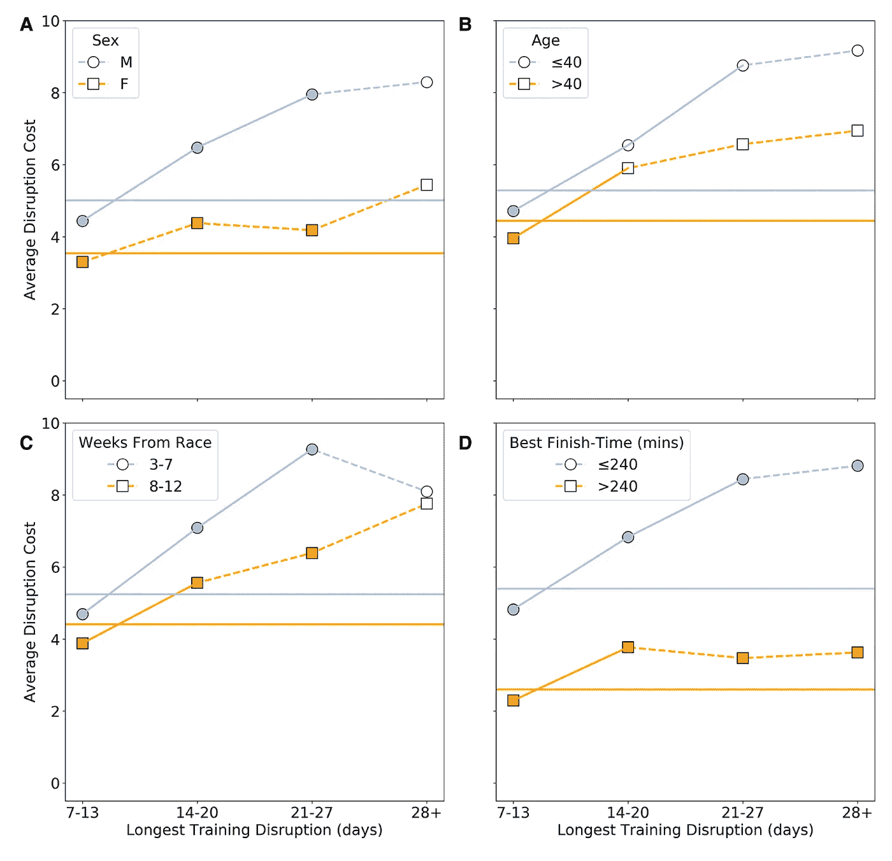

# 训练中断会毁掉我的马拉松吗？

> 原文：[`towardsdatascience.com/will-a-training-break-ruin-my-marathon-465e94cb949e`](https://towardsdatascience.com/will-a-training-break-ruin-my-marathon-465e94cb949e)

## 大规模数据分析训练中断对马拉松准备的表现成本

 [barrysmyth](https://barrysmyth.medium.com/?source=post_page-----465e94cb949e--------------------------------)

·发表在[Towards Data Science](https://towardsdatascience.com/?source=post_page-----465e94cb949e--------------------------------) ·10 min 阅读·2023 年 1 月 13 日

--

[照片](https://www.pexels.com/photo/senior-man-with-beard-resting-peacefully-on-racetrack-5067713/) 由[Anna Shvets](https://www.pexels.com/@shvetsa/)拍摄。

# TLDR;

+   超过 50%的跑者在训练马拉松时会经历至少 7 天的跑步中断。更长时间的训练中断（≥7 天）也经常发生。但仍有希望，因为即使是长时间的中断也不一定会毁掉你的马拉松。

+   然而，中断确实会带来成本，训练中断的完成时间比没有长时间训练中断时的完成时间长 2%–9%。

+   完成时间的成本取决于中断的性质（其持续时间和时机）以及跑者的类型（男性与女性、年轻与年长、快速与慢速）。

+   通过理解这些成本，跑者可以在训练中断后调整马拉松目标，以确保更好的比赛结果。

# 介绍

训练马拉松并不容易。在许多方面，它比实际跑马拉松更困难。事实上，许多报名并开始训练马拉松的跑者，最终未能到达起跑线，更不用说完成比赛了。作为那些开始马拉松之旅的人的百分比，*未能参赛者*的估计数从[15](https://www.runtri.com/2012/03/boston-marathon-entrants-dns-did-not.html)%到高达[50](https://bjsm.bmj.com/content/bjsports/23/2/97.full.pdf)%不等。

值得注意的是，最近的都柏林马拉松（2022 年）中，几乎 10,000 名注册跑者[未能如期出现](https://www.independent.ie/regionals/dublin/dublin-news/how-did-10000-runners-go-missing-from-dublin-marathon-42116657.html)。然而，这至少部分是由于疫情的影响，因为许多注册转移自取消的 2020 年和 2021 年的赛事。在‘正常’年份中，都柏林的缺席率可能接近[20%](https://corkrunning.blogspot.com/2022/11/the-2022-dublin-marathon-and-missing.html)。

好消息是，如果你能够坚持度过漫长的训练月份，并且在马拉松起跑线上（相对）完好无损，那么你完成比赛的机会非常高。通常，只有 2-3%的参赛者会在完成前退出，尽管这通常取决于比赛当天的情况。例如，2018 年波士顿马拉松的恶劣寒冷天气导致了大量参赛者未能完成比赛，甚至包括精英选手在内，[5%的男性和 3.8%的女性在比赛中途退出](https://www.nytimes.com/2018/04/20/opinion/boston-marathon-women-nurse.html)。

跑者们经常在训练未能按计划进行时，[a](https://bjsm.bmj.com/content/bjsports/23/2/97.full.pdf)放弃他们的马拉松训练和比赛。有些人因伤病或生病离比赛日过近而无法及时恢复。其他人由于各种原因（如繁忙的生活方式、家庭责任、旅行等）而训练受到干扰，感到比赛准备被毁掉，因此选择退出。但情况真的如此吗？

+   训练中断是否意味着比赛当天的灾难？

+   如果不是灾难，那是否有证据表明训练中断会影响表现？

+   如果确实有表现成本，那么这种成本如何依赖于中断的性质（中断的持续时间和训练期间的时机）或跑者的类型（性别、年龄、能力）？

在这篇文章中，我将总结我参与的一项近期研究的结果，该研究利用了一个非常大的马拉松跑者及其训练活动的数据集。艰苦的工作由[Ciara Feely](https://www.ml-labs.ie/cohort_1/ciara-feely/)完成，她目前是[都柏林大学](http://www.ucd.ie)的最后一年博士生，该研究最近由期刊[Frontiers in Sports and Active Living](https://www.frontiersin.org/journals/sports-and-active-living)发表，[Frontiers in Sports and Active Living](https://www.frontiersin.org/articles/10.3389/fspor.2022.1096124/full)。

# 数据集

这项研究基于 292,323 名跑者（每位跑者比赛日前最多 12 周）的 15,697,711 条跑步活动的数据集。这些跑者在 2014 年至 2017 年期间完成了 509,979 场马拉松，并将他们的训练和比赛数据上传到 [Strava](http://www.strava.com)。Strava Inc.根据与作者的数据共享协议提供了这些数据的匿名版本。更多数据集细节可以在 [这里](https://www.frontiersin.org/articles/10.3389/fspor.2022.1096124/full) 查阅，简而言之，我们注意到以下几点：

+   男性和女性之间的比例为 80/20，男性的平均年龄约为 40 岁，而女性的平均年龄为 38 岁。

+   男性跑者的平均马拉松完成时间稍低于 4 小时，而女性的平均完成时间略高于 4 小时 24 分钟。

+   平均而言，跑者每周训练时间稍超过 3 天，并且在训练期间每周完成平均 40–41 公里。

重要的是，这个数据集只包括了参加了比赛日的跑者；即，它不包括那些开始马拉松训练但最终未能到达起跑线的跑者。因此，这项研究应视为对未严重到足以使跑者放弃马拉松的训练干扰的调查。

此外，我们专注于每个跑者在特定年份的最快马拉松成绩。我们这样做主要是为了避免包括那些作为其他比赛训练的一部分的马拉松。

在我们的分析中，我们还基于以下三个不同的跑者分组进行研究：

1.  **性别** — *男性* 与 *女性* 跑者。

1.  **年龄** — *年轻*（≤40 岁）与 *年长*（>40 岁）跑者。

1.  **能力** — *更快* 与 *更慢* 的跑者；更快的跑者在我们的数据集中拥有的 *个人最佳*（PB）马拉松时间少于 240 分钟。更快的跑者占数据集中所有跑者的 53%以上，并且主要（88%）是男性。

接下来，我们将比较这些分组的各种特征，探索训练干扰与完成时间之间的关系。

# 训练干扰的频率

*训练干扰* 是指一段时间——几天连续——没有任何记录的训练活动。由于每周训练期间的常规恢复日，预计会有一些短暂的训练干扰。实际上，由于我们的跑者每周跑步大约 3 次，因此我们会发现每周训练中有≤4 天的连续间隔，具体取决于训练日如何分布。然而，更长时间的训练间隔（≥7 天）应当较少出现，可能指示一些未预期的训练干扰。

较长的训练中断发生的频率如何？为探索这一点，我们计算了训练历史中包含“*最长* *训练中断*” ≥7 天的跑者比例，并比较了这些比例在性别、年龄和能力上的差异，以及中断时机的差异；*早期* 中断发生在比赛日前 8-12 周，而*晚期* 中断发生在比赛日前 3-7 周。

按性别（A）、年龄（B）、中断时机（C）和能力（D）划分的最长训练中断时长的跑者比例。转载自 [Frontiers](https://www.frontiersin.org/articles/10.3389/fspor.2022.1096124/full) 根据 [CC BY](https://creativecommons.org/licenses/by/4.0/) 许可证。

上面的图表（A-D）展示了不同训练中断时长（7-42+天，x 轴）对性别（A）、年龄（B）、中断时机（C）和跑者能力（D）的结果。大多数跑者在比赛当天经历了至少 7 天的训练中断，而更长时间的中断则越来越不常见。值得注意的是，10-20%的跑者经历了至少 14 天的中断，这可能被视为比单纯的忙碌日程更严重的中断，例如伤病或疾病。

图 A、B 和 D 表明，基于性别、年龄或能力，经历不同时长中断的跑者比例差异不大；男性、年轻跑者和更快的跑者的比例有所增加，但大多数情况下差异较小。

当我们考虑中断时机时，情况有所不同，见图 C。早期的中断比晚期中断更为常见（无论时长如何），这表明跑者在接近比赛日时，经历训练中断的可能性较低。一个解释可能是，随着比赛日的临近，跑者变得更加投入，不愿意牺牲训练，除非必须。然而，也必须承认，由于我们的数据集排除了未完成训练的跑者，这些跑者可能倾向于晚期中断。换句话说，经历晚期中断的跑者的退赛率可能高于早期中断的跑者。例如，晚期受伤可能没有足够的时间恢复，而如果受伤发生在训练早期则可能会有所不同。因此，这种分析可能低估了经历晚期中断的跑者的比例，因为至少有一些跑者可能未能到达起跑线。尽管如此，这种效应不太可能完全解释跑者经历早期和晚期中断之间的相对差异（35%-60%）。

# 训练中断的成本

尽管马拉松训练中出现较长时间的干扰（≥7 天）并不罕见，但好消息是，这些干扰不一定会对比赛日造成致命影响。大多数跑者经历过干扰，但大多数跑者仍能顺利到达起跑线。然而，很可能长时间的训练干扰会有一定代价。可以推测，错过两周的训练将会对表现产生影响，特别是当这两周的训练是在高峰期错过的，此时跑者正在适应一些非常长的跑步，以模拟比赛日的疲劳。

为了探索这一点，我们区分了两种类型的训练历史：

1.  *干扰*的训练历史是指最长训练干扰时间为≥7 天的情况。

1.  *未干扰*的训练历史是指最长训练干扰时间为<7 天的情况。

接下来，我们关注了那些至少跑过 2 场马拉松的跑者，其中一段训练历史受到干扰而另一段则未受干扰；这产生了一组包含 43,933 名跑者（83.39% 男性和 26.61% 女性）的数据，这些跑者都有受到干扰和未受干扰的训练历史。

然后，我们将干扰马拉松（与干扰训练相关的马拉松）的完成时间与相应的未干扰马拉松的完成时间逐一比较。我们根据这两个完成时间之间的相对差异估算了“*干扰成本*”。例如，如果一个干扰马拉松的完成时间为 244 分钟，而同一跑者最近的未干扰马拉松完成时间为 235 分钟，那么这个 9 分钟的减慢代表了一个 3.8%的干扰成本，当转换为未干扰完成时间的百分比时。

现在，还有其他几个因素可能解释这种时间差异——不同的路线、不同的天气条件、不同的训练方法（尽管有干扰）、比赛日的配速或补给变化、基础体能差异、调整后的恢复策略等——但预计这些因素在干扰和未干扰的训练中出现的可能性是相同的，因此通过我们使用的数据集的规模，这些因素将会*被平均化*。

按性别（A）、年龄（B）、干扰时机（C）和能力（D）计算的训练干扰平均成本；摘自[这里](https://www.frontiersin.org/articles/10.3389/fspor.2022.1096124/full)，根据[CC BY](https://creativecommons.org/licenses/by/4.0/) 许可证发布。

训练干扰的成本在上面的图表中进行了总结，再次按最长训练干扰的持续时间（x 轴）进行分类，并通过比较训练历史中的性别（A）、性别（A）、年龄（B）、干扰时机（C）和跑者能力（D）进行分析。

正如我们可能预期的那样，较长的中断与更大的成本相关。在（A）中，对于给定的中断持续时间，男性的中断成本高于女性，这在基于 21–27 天的中断持续时间的统计上是显著的；顺便提一下，统计显著性是基于*z-test*或*t-test*（适用时）（*p<0.01*），在图中用填充标记和实线表示（有关使用的统计方法的更多信息，请参见[论文](https://www.frontiersin.org/articles/10.3389/fspor.2022.1096124/full)）。较快的跑者或较晚的中断也与比较慢的跑者或较早的中断更大的成本相关；年轻跑者经历的成本高于年长跑者，尽管超过 7–13 天的差异在统计上不显著。

在（A）中，我们可以看到，男性跑者在经历 21–27 天的训练中断后，完成时间增加了近 8%；对于同样受中断影响的女性跑者，成本略高于 4%。这种性别差异可能与[男性跑者往往高估自己的能力以及他们跑得不够有纪律的比赛倾向](https://www.ncbi.nlm.nih.gov/pmc/articles/PMC6400853/pdf/fpsyg-10-00333.pdf)有关，这可能会加重训练中断对比赛日的影响。

此外，最快和最慢跑者之间的成本差异最大。平均而言，较快的跑者的中断成本约为 5.5%（峰值接近 9%），而较慢跑者的平均成本不到 3%（峰值不到 4%）。其中一个原因可能是较快的跑者中男性占比更高（88%），正如上文所讨论的。

最后，在得出结论之前，值得注意的是，在类似的研究中，我们总是需要小心避免混淆因果关系和相关性。这里的重点是通过关联性来看相关性。较长的中断与较慢的完成时间相关，但是否*导致*较长的完成时间还需要进一步的研究。至少，更仔细地控制如赛道和天气条件、位置和补给策略、训练实践，或跑者从休息中恢复的速度等因素将是重要的，但这需要另一天的工作。

# 结论

马拉松训练并不总是顺利进行。一些跑者可能永远无法到达起跑线，但那些能够到达的跑者通常会经历较长时间的训练中断，有些人可能需要多周的时间来恢复疾病或伤害。

幸运的是，这样的中断并不一定会过早终结跑者的马拉松梦想。然而，长时间的训练中断确实会带来表现上的成本。证据表明，它们与完成时间的延长有关，可能会比正常情况下长 2%–9%，具体取决于中断的性质（持续时间和时机）以及跑者的类型（性别、年龄、能力）。

虽然确认干扰与表现成本相关并不令人惊讶，但量化这些成本是有用的。例如，它可以帮助跑者更好地规划即将到来的比赛日。当然，更好地理解训练干扰与完成时间之间的关系应该能帮助跑者调整他们的比赛目标，并在训练受到干扰时调整他们的配速。这将帮助他们确保从下一个马拉松中获得最大的收益。
