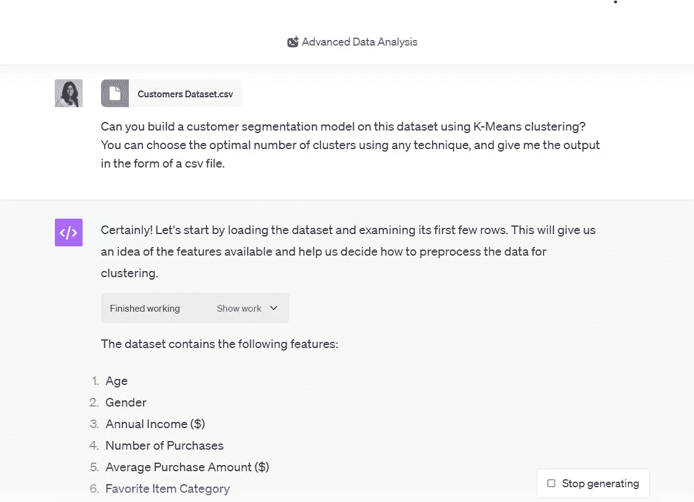
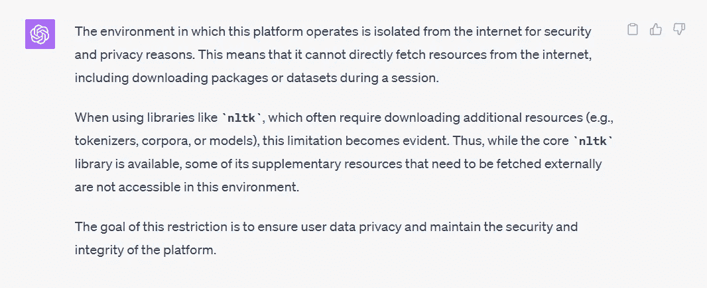

# ChatGPT 会取代数据科学工作吗？

> 原文：[`towardsdatascience.com/will-chatgpt-take-data-science-jobs-73e4fbb706b8`](https://towardsdatascience.com/will-chatgpt-take-data-science-jobs-73e4fbb706b8)

## 观点

## 数据科学的黄金时代是否终于结束了？

[](https://natassha6789.medium.com/?source=post_page-----73e4fbb706b8--------------------------------)[](https://towardsdatascience.com/?source=post_page-----73e4fbb706b8--------------------------------) [Natassha Selvaraj](https://natassha6789.medium.com/?source=post_page-----73e4fbb706b8--------------------------------)

·发表于[Towards Data Science](https://towardsdatascience.com/?source=post_page-----73e4fbb706b8--------------------------------) ·8 分钟阅读·2023 年 9 月 15 日

--


图片来源：[iStock](https://www.istockphoto.com/)

如果你正在阅读这篇文章，你可能已经在数据行业有一份工作，或者正在寻找进入这个领域的机会。

随着过去一年生成型人工智能领域的所有进展，你可能担心数据科学工作会被自动化取代。

一年前，我会嘲笑任何提及将我的数据科学工作自动化的可能性的人。

实际上，我甚至写了一篇[完整文章](https://www.kdnuggets.com/2022/01/data-science-dying-career.html)来嘲笑 AI 能够取代数据科学家的想法——我的意思是，我们编写代码、构建机器学习模型、分析数据，并将复杂的信息传达给非技术相关方。

我们的工作很困难。这些技能需要多年的磨练。AI 可以提高数据团队的效率和协作，但不可能取代我们所做的实际工作。

然而，上述博客文章是在 ChatGPT 发布之前写的。

自那时起，我们见证了生成型 AI 领域的范式转变。

在这篇文章中，我将基于生成型 AI 领域的现有进展重新评估我对数据科学未来的立场。

基于我广泛的研究和行业专家的见解，我将呈现一系列观点，解释为什么 ChatGPT 可能会取代数据科学家，以及它可能不会取代的原因。

我将审视辩论的两个方面，并留给你，读者，去做出明智的决定，判断生成型 AI 是否会使数据科学家变得过时。

如果你更喜欢视频格式，请观看这个：

点击[这里](https://youtu.be/bnwBwTiXb7s?si=K2kww2eYVT8pk1-g)查看视频版本

# 糟糕的情况：为什么数据科学工作面临风险

## 1\. ChatGPT 能快速编写代码

数据科学家大约花费[40%-50%](https://enjoymachinelearning.com/blog/programming-need-in-data-science/)的时间在编写代码上。

不仅如此，ChatGPT 不仅能够编写代码，而且变得非常熟练，速度也非常快。

该聊天机器人已经在多个顶级公司[通过了编码面试](https://www.youtube.com/watch?v=3rXgNoSMtA8)，可以将手绘草图转化为[完全成熟的网站](https://officechai.com/startups/gpt-4-can-create-a-working-website-from-a-hand-drawn-sketch-in-seconds/)，并且能够[从用户故事中构建数据库表](https://betterprogramming.pub/chatgpt-and-software-architecture-308b6e0cc25a)。

实际上，这家软件公司 CEO 表示，该模型将完成编码任务的时间从[9 周缩短到仅仅几天](https://www.geeksforgeeks.org/chatgpt-shortens-coding-time-from-9-weeks-to-days-claims-freshworks-ceo/)。

这是超过 20 倍的效率提升——这将显著减少组织需要雇佣的人员来完成编程任务。

## 2\. ChatGPT 能够摄取和分析数据

现在，你可能在想，“编程只是数据科学家工作的一小部分。我们的工作涉及机器学习建模、统计分析以及向利益相关者提供见解。”

好吧，ChatGPT 也能做这些事情。

该模型的新[代码解释器](https://openai.com/blog/chatgpt-plugins)插件，现在更名为“高级数据分析”，允许你在 ChatGPT 界面内上传和分析数据。

这是一个高级数据分析插件根据纯文本要求构建客户细分模型的截图：



图片由作者提供

该模型能够预处理数据集，找到 K 均值聚类的最佳簇数，构建算法，并且根据模型的输出提供数据驱动的见解。

根据[商业内幕](https://www.businessinsider.com/chatgpt-jobs-at-risk-replacement-artificial-intelligence-ai-labor-trends-2023-02)的报道，编程和分析相关的角色是最容易被 AI 自动化取代的职位之一。

[马克·穆罗](https://www.businessinsider.com/chatgpt-jobs-at-risk-replacement-artificial-intelligence-ai-labor-trends-2023-02)，布鲁金斯学会的高级研究员，曾研究过 AI 对美国劳动力的影响，他声称这是因为 ChatGPT 可以比人类更快地产生代码，并且擅长分析数据和预测结果。

## 3\. 架起人类与技术之间的桥梁

我合作过的许多非技术型利益相关者在阅读 Excel 表格中呈现的数据时感到困惑。这些都是忙碌的人，他们需要以简单、直接的语言呈现结果。

例如，营销团队会问诸如“哪些客户最有可能再次购买产品 X”这样的问题，并期望你在几页幻灯片中给出答案，突出显示驱动重复购买的预测指标。

作为一个语言模型，这样的使用场景正是 ChatGPT 的强项。

你可以问它以下问题：

```py
I work in marketing and have no technical background whatsoever. 
Can you explain, based on this dataset, which of my customers are most likely
to purchase product X again and why?
```

ChatGPT 不会给你提供复杂的图表和计算，而是会准确告诉你有关客户数据集所需了解的内容，使你具备做出数据驱动的营销决策所需的知识。

ChatGPT 的对话能力，加上其技术能力，可以让数据科学和分析领域变得更加普及。

以前需要你对 Excel 或 Python 有很强掌握的任务，现在可以轻松使用像高级数据分析插件这样的工具完成。

此外，[ChatGPT Enterprise](https://openai.com/blog/introducing-chatgpt-enterprise)刚刚发布，允许公司为其员工购买语言模型的订阅。

OpenAI 称这是“迄今为止最强大的 ChatGPT 版本”，因为它没有使用限制，性能提升至两倍快。它还提供无限访问高级数据分析插件的权限。

由于这个版本的 ChatGPT 符合 SOC2 标准，员工可以将公司专有的数据集直接上传到 ChatGPT 界面，而无需担心泄露敏感的公司信息。

# 积极的一面：为什么你的数据科学工作是安全的

好吧，之前部分的悲观言论可能让人有些沮丧，我几乎可以看到你们中的一些人对屏幕摇头，不同意我提出的观点。

但不用担心！

我们现在将深入探讨更令人安心的方面，并探讨为什么许多业内人士认为数据科学工作是安全的（至少现在是）。

## 1\. ChatGPT 无法进行复杂的数据分析

数据科学家（和分析师）通常从多个来源收集数据，并使用各种工具从中提取洞察。

这项工作并不像使用高级数据分析插件将单一数据集上传到 ChatGPT 那么简单。

例如，我目前正在处理一个需要分析数千个 PDF 文件的项目。

这样的任务具有挑战性，因为数据量很大，每个 PDF 文档包含多种类型的信息，如表格和图像。

在这项任务中，ChatGPT 的帮助有限，因为它无法访问分析甚至一个文档所需的包：



图片由作者提供

当然，它能够帮助我编写提取和分析数据所需的代码——但没有编程知识的人无法运行、验证或调试这些代码。

此外，大多数公司将其信息存储在 SQL 数据库中。

高级数据分析插件仅限于文件上传，这意味着它不能直接与公司数据库交互。

你仍然需要具备数据库管理和 SQL 查询必要技能的人来访问、解释和分析这些数据库中的数据。

## 2\. ChatGPT 无法模拟人类决策

根据畅销书作者和顶尖商业及数据专家 Bernard Marr 的说法，[即使是最先进的 LLMs](https://www.forbes.com/sites/bernardmarr/2023/02/07/will-chatgpt-put-data-analysts-out-of-work/?sh=161d4caa4030)也缺乏如批判性思维、战略规划和解决问题的能力。

这些模型对业务的内部运作没有洞察力，且缺乏领域专业知识。

如果你问它“为什么产品销售在过去 2 个月暴跌”，模型将缺乏关于你组织的必要背景信息来提供有根据的回答。

此外，人类分析师或数据科学家通常会接触到组织内的不同团队——我们询问他们目前面临的问题，深入了解业务问题，并提出解决策略。

另一方面，LLM 无法像人类一样进行协作性问题解决。

## 3\. ChatGPT 会犯错误

最后，ChatGPT 易受[幻觉](https://www.cspinet.org/blog/chatgpt-amazing-beware-its-hallucinations)的影响。它在编写代码、解释数据和生成见解时可能会出错。

根据 AI 生成的数据做出商业决策是一种大多数组织不愿意冒的风险。

仍然需要人类专家来验证 AI 模型生成的代码和输出。

实际上，我合作过的许多组织在做出决定之前通常有两种生成预测的方式——一个是内部数据科学团队，另一个是外部咨询公司。

由这两个实体生成的数字会被比较，并经常进行对账，以确保预测的一致性。

如果公司愿意花费数万美元聘请第三方咨询公司仅仅是为了在决定如何进行之前交叉验证他们的预测，你真的认为他们会用 AI 模型来替代数据科学家以节省成本吗？

如果你问我，这种可能性非常小。

在我看来，AI 生成的预测将作为一个基准——它可能成为组织验证其数据科学团队提供的见解的另一种方式。

# 我在数据科学领域工作。我该如何保护我的职业免受 AI 影响？

首先，你必须拥抱 AI。利用它来跟上行业趋势并学习新知识。根据[这篇](https://www.forbes.com/sites/bernardmarr/2023/02/07/will-chatgpt-put-data-analysts-out-of-work/)《福布斯》文章，假装 AI 不会显著改变你的工作方式只会带来更多的坏处而非好处。

相反，利用生成性 AI 模型来自动化工作中的某些部分，并利用效率提升来发展能使你在行业中脱颖而出的技能。

此外，[Tina Huang](https://youtu.be/12lV1HWchNQ?si=rTECQatIJlb0RBqV)，前 Meta 数据科学家，建议你建立多个收入来源，而不是仅仅依赖全职工作。

你可以开始提供自由职业数据科学服务，以获取被动收入，确保你的工作安全不依赖于单一雇主的决定。

最终，我个人认为，组织在招聘员工时看重的素质将会发生变化。传统上，职位要求非常重视技术技能——你在 Excel、编程或 Tableau 上的表现越好，被录用的可能性就越大。

我相信，重心将会慢慢转移 away from 工具和技术专长，因为生成性 AI 模型正在弥合这一领域的技能差距。当然，技术技能仍然有价值，但它只能带你走到一定程度。

相反，组织将开始看重沟通、创造力、领导力和决策能力等技能。

一个理解如何利用 AI 实现公司目标的人，将比仅具备技术专长的人对雇主更具价值。
