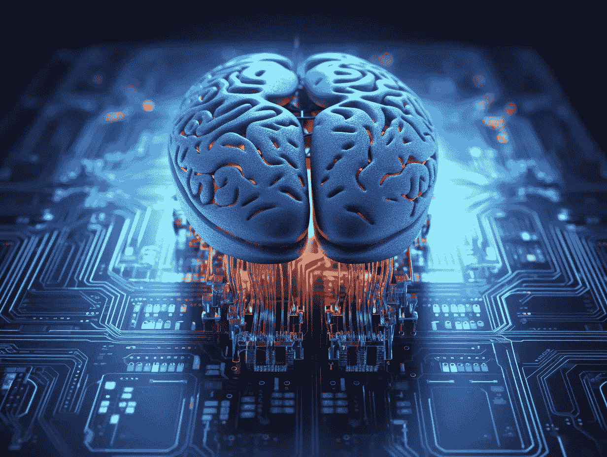

# 生成式 AI 是否会取代数据分析师的需求？

> 原文：[`towardsdatascience.com/will-generative-ai-replace-the-need-for-data-analysts-6b6807599d00?source=collection_archive---------1-----------------------#2023-05-23`](https://towardsdatascience.com/will-generative-ai-replace-the-need-for-data-analysts-6b6807599d00?source=collection_archive---------1-----------------------#2023-05-23)

作者使用 Midjourney 创作的艺术作品

## 不会。但它***会***重新定义数据分析师的角色。

 [加伦·冈崎](https://medium.com/@kingkoa96746?source=post_page-----6b6807599d00--------------------------------)

·

[关注](https://medium.com/m/signin?actionUrl=https%3A%2F%2Fmedium.com%2F_%2Fsubscribe%2Fuser%2F2ffe9e541c63&operation=register&redirect=https%3A%2F%2Ftowardsdatascience.com%2Fwill-generative-ai-replace-the-need-for-data-analysts-6b6807599d00&user=Galen+Okazaki&userId=2ffe9e541c63&source=post_page-2ffe9e541c63----6b6807599d00---------------------post_header-----------) 发表在 [Towards Data Science](https://towardsdatascience.com/?source=post_page-----6b6807599d00--------------------------------) ·6 分钟阅读·2023 年 5 月 23 日

--

自 2022 年 11 月 ChatGPT 发布以来，关于**数据分析师**的角色是否最终会被生成式 AI（如 ChatGPT、Bard 和 Bing Chat 等大型语言模型）取代的猜测越来越多。**这种猜测很大程度上源于这些大型语言模型（LLMs）编写代码的能力。**

作为在数据分析领域工作大部分职业生涯的人，理解生成 AI 在我们领域的影响确实引起了我的兴趣。出于好奇，我花了相当多的时间评估生成 AI 在数据分析中的当前能力。

在这篇文章中，我总结并分享了我的发现，因为我相信生成 AI 将在未来的数据分析工作中发挥重要作用。此外，我认为数据分析师社区有必要理解它将对他们的领域以及整个商业环境产生深远的影响。

## 我们目前的状态

到目前为止，我们知道生成 AI 可以编写 SQL、Python 和 R 代码。我们还可以假设，随着不断的微调，它们生成的代码的效率将会随着时间的推移而提高。但这只是开始。

在 2023 年 3 月底，OpenAI 的 ChatGPT 发布了一个名为[**代码解释器**](https://openai.com/blog/chatgpt-plugins#code-interpreter)的插件。如果你是目前少数几位可以访问 Alpha 版本的人之一，你可以将数据文件上传到其中，并调用 Python 进行回归分析和描述性分析，查找数据中的模式，甚至创建可视化。***全部无需编写或了解一行 Python 代码！*** 受人尊敬的沃顿商学院教授[伊桑·莫利克对此进行了很好的总结](https://www.oneusefulthing.org/p/it-is-starting-to-get-strange)。

所以，你看到了。能够加载、分析和呈现数据而不写一行代码。游戏结束了吗？还不那么快。

尽管这些能力令人难以置信，但 Code Interpreter 有一些显著的局限性，显示了生成 AI 在接管数据分析行业时可能面临的一些挑战。

首先，它需要上传一个表格。一个二维的 CSV 文件（目前限制为 100 MB）。除了大小限制之外，想象一下任务是构建一个包含您公司所有数据的表格……

我可能到此为止，但我们继续吧。

拿着你的一个表格，你现在还需要获得批准，将你公司所有数据的一个表格推送到公司防火墙之外的 LLM 中，而你对此没有控制权……

我们可以到此为止。

当前（稍后会详细讨论）的替代方案是您的公司建立自己的 LLM。虽然理论上可行，但训练和微调模型的复杂性、所需的专业知识以及巨大的成本，使得只有极少数公司能够使其成本效益显著。

但为了更好地理解，让我们退一步，假设你的公司在那个名单上。

但首先，让我们从一些视角开始。如果我们回顾到 2000 年代初商业智能工具的引入，这些工具的巨大价值在于它们能够让非技术的业务人员利用他们的领域知识，通过使他们能够选择、分析和呈现数据，而不需要编写一行代码。听起来熟悉吗？

提供用户友好的数据分析手段并不是什么新鲜事。它始终具有巨大的价值。确实，这是一个持续增长的数十亿美元行业。然而，这些工具没有***领域知识***就毫无用处。这适用于任何数据分析，无论使用什么工具。即使是生成性 AI 也是如此。没有领域知识，我们不知道该向数据提出什么问题。即使问题已经提供给我们，我们又如何解读我们的发现呢？

在我看来，数据分析工作的最大价值在于其回答临时问题的能力。不可预见的、关键任务的问题。复杂的、多层次的、非线性的类型问题。回答这些问题需要领域知识。

例如，为什么我们最畅销的产品销售额突然暴跌？我们的主要供应商刚刚倒闭，我们该怎么办？为什么我们客户流失率上个月翻了一番？这些不是可以遵循既定决策树的简单问题。

这些少数示例的共同点在于，它们需要对从未被问过的情境性问题给出即时答案。这才是关键。如果你理解生成性 AI 的构造，它在回答这种性质的问题上的无能为力确实是它完全取代数据分析师的致命弱点。

简要总结一下，生成性 AI 利用现有数据集来“训练”一个 LLM，以***生成***基于其所接收的训练数据的概率驱动答案。虽然你可以持续通过更精确的数据集来微调你的模型，但你如何训练你的模型应对从未被问过的多层次、情境性问题呢？

这就像你刚刚开始一份你尚不熟悉的行业数据分析师的新工作。在第一天，你被要求紧急回答上述问题之一。你会从哪里开始？你会提取什么数据？你怎么知道你需要考虑哪些所有潜在变量？即使你能以某种方式得出一个答案，你又如何知道它是否正确？

正因为如此，我不认为数据分析师的角色会完全被生成性 AI 取代。然而……生成性 AI 在当前状态下，已经在数据分析领域有许多用途，而且这些用途将随着功能的不断增加而不断扩展。

## 生成性 AI 在数据分析中的当前潜在用途

截至今天，生成式人工智能在数据分析领域的最佳应用是它既能编写代码，又能解释所写的代码（它做得相当好）。我个人用它来帮助我编写和理解 Python 代码。

对于那些希望进入数据分析领域的人，我强烈建议你利用生成式人工智能来帮助你学习编码。当我刚开始进入这个领域时，它将大大加快我的学习曲线。

在数据分析领域，还有另一个令人兴奋的发展：生成式人工智能推动了专用编码工具的发展。GitHub 发布了其[***Copilot***](https://github.com/features/copilot)产品，它可以在你编写代码时实时建议编码解决方案/改进！

在本文早些时候，我提到了公司在构建自己的 LLM 时可能面临的潜在障碍。现在可能有一个新的替代方案：Databricks 最近发布了一个[**Dolly**](https://www.databricks.com/blog/2023/03/24/hello-dolly-democratizing-magic-chatgpt-open-models.html?utm_medium=paid+search&utm_source=google&utm_campaign=17107065832&utm_adgroup=150868748114&utm_content=blog&utm_offer=hello-dolly-democratizing-magic-chatgpt-open-models.html&utm_ad=654151923015&utm_term=databricks+dolly&gclid=Cj0KCQjwsIejBhDOARIsANYqkD1fHrzElKeDiIZRaEhWgzSkv_L3_xjPmu23r2FaDLArEe77vyaOiAcaAg9kEALw_wcB)的***开源*** LLM。理论上，这可以解决成本（开源）和将数据推送到公司防火墙之外的问题。它是一个小规模的 LLM，更适合于专注的数据集。

我提到 Dolly，主要是作为生成式人工智能领域发展速度的一个例子，并提醒它可能对数据分析领域产生的影响。

正如我们已经看到的那样，人工智能的演变只会以光速继续发展。

## 结论

我毫不怀疑生成式人工智能将重塑数据分析中的工作流程。一般来说，重复性的任务甚至分析将在未来由生成式人工智能执行。我也可以看到编程成为一种商品，而不再是高度发展的技能。

基于上述观点，我相信未来典型的数据分析师将具备业务线级的领域知识，并结合生成式人工智能工具，以帮助他们更高效地利用时间。

最后，从个人角度来说，我鼓励每位读者拥抱生成式人工智能。了解它，并在个人和商业生活中使用它。随着新 API 和插件的不断出现，它的覆盖范围和能力将不断增长。

无论好坏。

我喜欢写关于数据分析领域影响深远的话题。如果你想关注我的未来文章，请在[Medium](https://medium.com/@kingkoa96746)上关注我。谢谢！

作者使用 Midjourney 创作的艺术作品
