# 窗口函数：数据工程师和数据科学家必知的内容

> 原文：[`towardsdatascience.com/window-functions-a-must-know-for-data-engineers-and-data-scientists-4dd3e4ad0d2`](https://towardsdatascience.com/window-functions-a-must-know-for-data-engineers-and-data-scientists-4dd3e4ad0d2)

## 回到基础 | 揭开 SQL 窗口函数的神秘面纱

[](https://iffatm.medium.com/?source=post_page-----4dd3e4ad0d2--------------------------------)[](https://towardsdatascience.com/?source=post_page-----4dd3e4ad0d2--------------------------------) [Iffat Malik](https://iffatm.medium.com/?source=post_page-----4dd3e4ad0d2--------------------------------)

·发表于 [Towards Data Science](https://towardsdatascience.com/?source=post_page-----4dd3e4ad0d2--------------------------------) ·阅读时间 13 分钟·2023 年 6 月 14 日

--

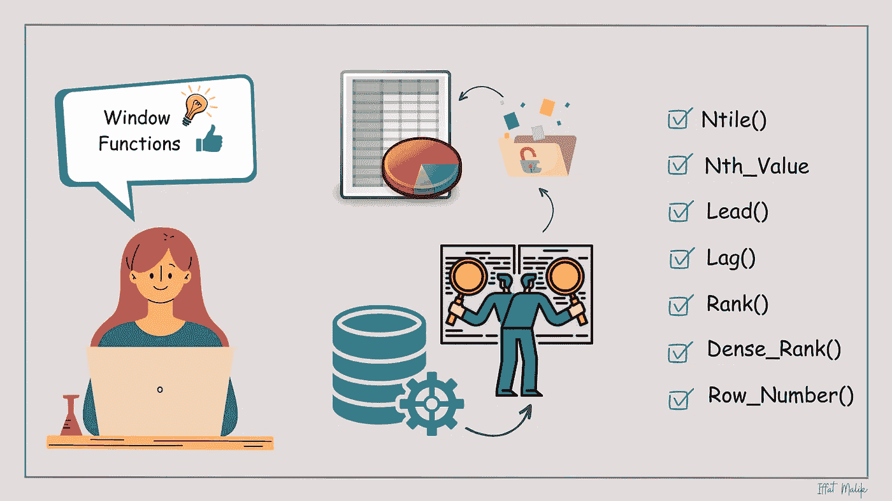

数据增长在过去几年中非常显著，尽管我们有各种工具和技术，但 SQL 仍然是大多数工具的核心。它是数据分析的基本语言之一，被各类公司广泛使用来解决与数据相关的挑战。

我始终相信，你不需要仅仅为了通过面试或解决特定问题而了解某些概念。如果你愿意深入学习这些概念及其底层架构，它将帮助你在任何工作中取得成功。窗口函数有点棘手，刚开始可能会让人感到有些害怕，但一旦掌握，它们会变得非常有趣。

如果你熟悉 SQL 聚合函数，理解窗口函数的概念会更容易。聚合函数对一组值进行计算并返回一个值；当与*GROUP BY*子句配合使用时，它为每个组返回一个值。你可以在这里阅读更多内容：

[](/how-to-use-sql-aggregate-functions-92f7244a07cb?source=post_page-----4dd3e4ad0d2--------------------------------) ## SQL 聚合函数为你的下一个数据科学面试做准备

### 回到基础 | SQL 初学者的基础知识

towardsdatascience.com

在进一步讨论之前，让我向你介绍一下示例数据库。我们将使用来自一个虚拟汽车零售公司的数据，你可以在我的 [GitHub Repo](https://github.com/PhoenixIM/All_Things_SQL)中找到源数据，

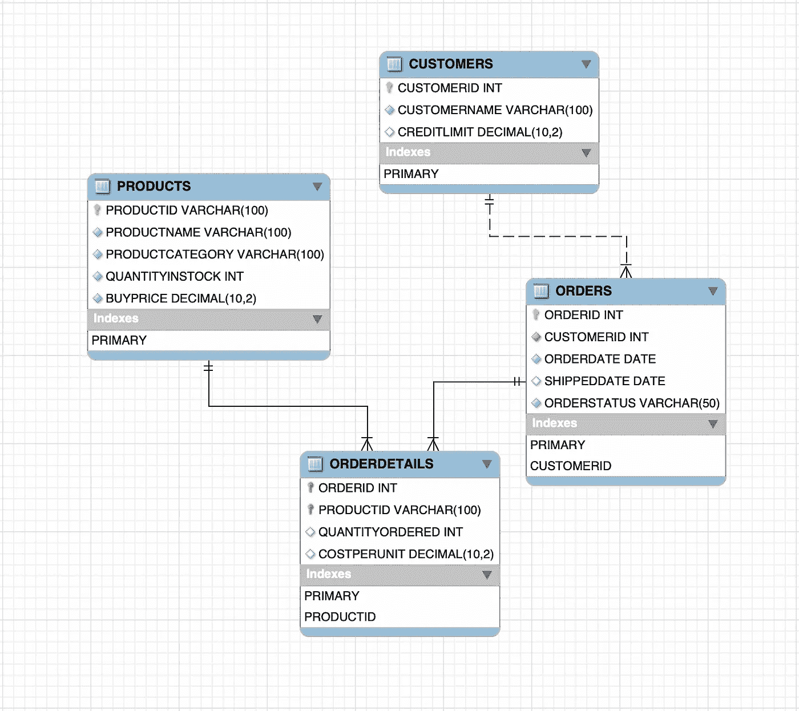

作者提供的图片

## 什么是窗口函数？

窗口函数的传统定义是，

> 窗口函数在与当前行相关的一组表行上执行计算。

如果我将其拆解，窗口函数使我们能够对分区执行计算。分区只是用户定义的一组、子组或行桶，窗口函数将在其上执行计算。

它们也被广泛称为*分析函数*。

## 为什么我们需要窗口函数？

如我们所知，聚合函数将来自多行的数据汇总为一行（如果与 GROUP BY 子句一起使用，则每组一行）；而窗口函数也在一组行上执行计算，但与聚合函数不同的是，它们不会将结果集汇总为一行。相反，所有行保持其原始形式/身份，并且为每行添加计算后的行。

听起来有趣吧？让我们来分解一下。这是来自表 PRODUCTS 的示例数据，

```py
--query PRODUCTS table
SELECT 
    * 
FROM 
    PRODUCTS 
LIMIT 10;
```

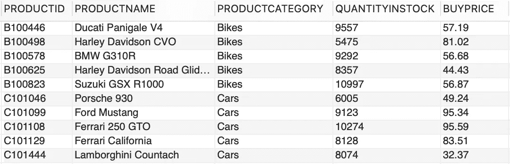

图片由作者提供

比如，我们需要关于每个*PRODUCTCATEGORY*的平均购买价格的信息，

```py
--average buy price for each product category
SELECT
    PRODUCTCATEGORY,
    FORMAT(AVG(BUYPRICE),2) AS AVERAGE_BUYPRICE
FROM
    PRODUCTS
GROUP BY PRODUCTCATEGORY;
```

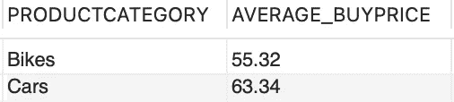

图片由作者提供

现在，仅这些信息可能用处不大。是的！你现在确实知道了每个*PRODUCTCATEGORY*的平均购买价格，但接下来呢？这些信息如何产生商业洞察？如果我想将每个产品的购买价格与特定*PRODUCTCATEGORY*的平均购买价格进行比较呢？让我重新表述一下我的新需求，

1.  显示每个*PRODUCTCATEGORY*中的购买价格以及该*PRODUCTCATEGORY*的平均购买价格。

1.  按*PRODUCTCATEGORY*分组排列结果集。

你能仅用普通的聚合函数实现这一点吗？上述要求希望显示一些信息原样（例如*PRODUCTCATEGORY*、*PRODUCTNAME*、*BUYPRICE*），并且还希望新增一列显示每个*PRODUCTCATEGORY*的平均购买价格。这就是英雄般的窗口函数登场的时候，

```py
--using window function
SELECT 
    PRODUCTCATEGORY,
    PRODUCTNAME,
    BUYPRICE,
    FORMAT(AVG(BUYPRICE) OVER (PARTITION BY PRODUCTCATEGORY),2) AS AVERAGE_BUYPRICE
FROM
    PRODUCTS; 
```

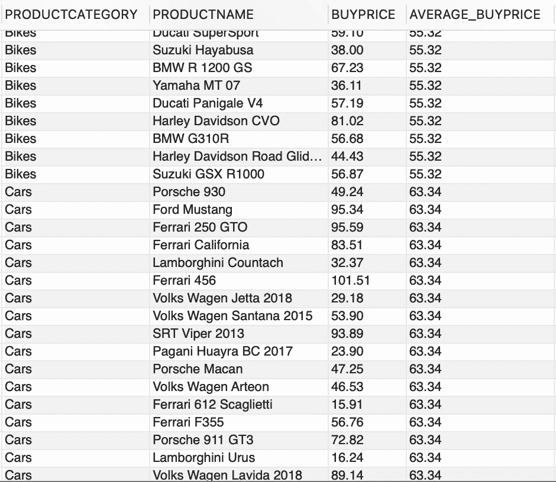

GIF 由作者提供

在我们跳到常用的窗口函数之前，让我们了解一下基本的语法和配对的子句。

窗口函数的一般语法是，

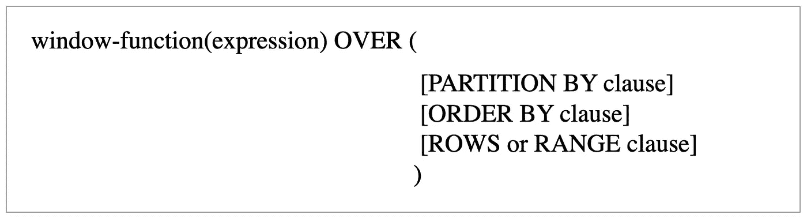

图片由作者提供

其中，

+   ***OVER()***子句定义了一组用户指定的行。窗口函数将仅在该特定集合上执行计算。

    它专门与窗口函数一起使用；然而，它也可以与聚合函数一起使用，就像我们在上面用*AVG()*函数一样，从而将其转变为窗口函数。

    如果你在*OVER()*中不提供任何内容，窗口函数将应用于整个结果集。

+   ***PARTITION BY*** 与*OVER*子句一起使用。它将查询结果集划分为多个分区，然后窗口函数应用于每个分区。

    这是可选的，如果你没有指定*PARTITION BY* 子句，那么函数会将所有行视为一个分区。

+   ***ORDER BY*** 子句用于在结果集的每个分区内按升序或降序排序。默认情况下是升序。

+   ***ROWS/RANGE*** 是*FRAME*子句的一部分，它定义了分区中的一个子集。

你可以在这里阅读关于窗口函数与聚合函数的详细比较以及窗口函数子句的内容，[*SQL 窗口函数的结构*](https://medium.com/towards-data-science/anatomy-of-sql-window-functions-7256d8cf509a)。

现在我们已经熟悉了窗口函数的基本结构，让我们探索最常用的窗口函数，

## ROW_NUMBER()

*ROW_NUMBER()* 给表或使用*PARTITION BY* 子句的分区中的每一行分配了一个顺序整数。常见的语法是，

> **ROW_NUMBER() OVER ([PARTITION BY clause] [ORDER BY clause])**

这是来自*PRODUCTS*表的示例数据，它包含了汽车零售商提供的一系列产品数据。

```py
--query PRODUCTS table
SELECT 
    * 
FROM 
    PRODUCTS 
LIMIT 10;
```


作者提供的图片

让我们从基础开始，

```py
--assigns a row number to each row in a table
SELECT 
    *,
    ROW_NUMBER() OVER() AS ROW_NUM
FROM 
    PRODUCTS;
```

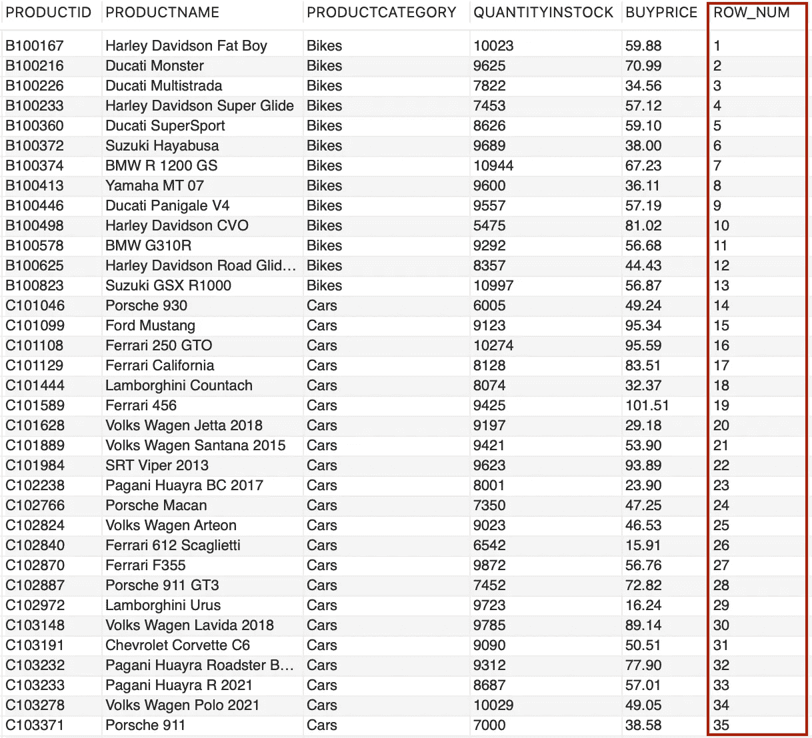

作者提供的图片

在这里，*ROW_NUMBER()* 给表*PRODUCTS*中的每一行分配了从 1 开始的顺序整数。让我们稍微升级一下，为每个*PRODUCTCATEGORY*添加行号，为此我们需要使用*PARTITION BY* 子句。

```py
--row_number by productcategory
SELECT 
    *,
    ROW_NUMBER() OVER(PARTITION BY PRODUCTCATEGORY) AS ROW_NUM
FROM 
    PRODUCTS;
```

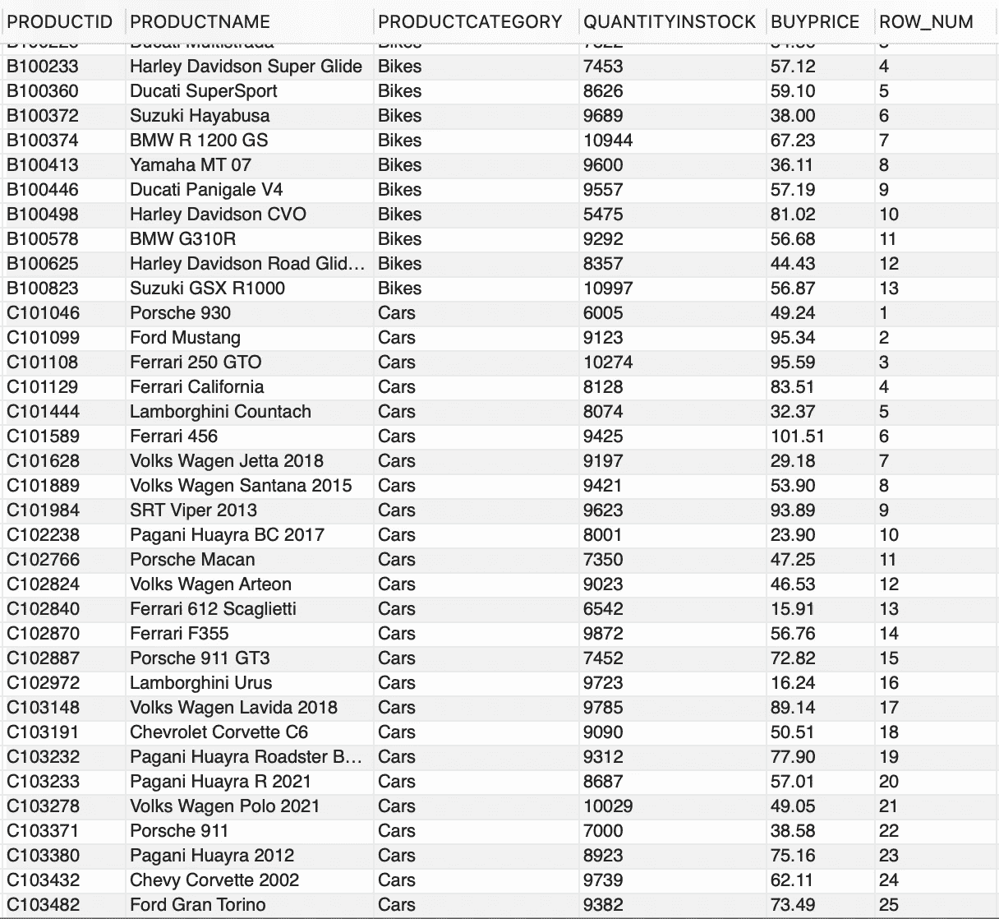

作者提供的 GIF

我们在*PRODUCTS*表中有 2 个不同的*PRODUCTCATEGORY*，

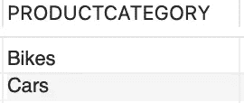

作者提供的图片

*ROW_NUMBER()* 为每一行生成了一个顺序整数，*PARTITION BY* 子句将结果集按*PRODUCTCATEGORY* 划分成桶。因此，*ROW_NUMBER()* 结合*OVER* 和*PARTITION BY* 子句，为每个*PRODUCTCATEGORY*生成了唯一的数字序列。

现在，让我们也利用*ORDER BY* 子句。这也是入门/中级面试中最常被问到的问题之一。假设我们想知道每个*PRODUCTCATEGORY*中库存数量最高的前 3 个产品。

```py
--top 3 products with the highest quantity in each product category
WITH PRODUCT_INVENTORY AS
(
SELECT
    PRODUCTCATEGORY,
    PRODUCTNAME,
    QUANTITYINSTOCK,
    ROW_NUMBER() OVER (PARTITION BY PRODUCTCATEGORY ORDER BY QUANTITYINSTOCK DESC) AS ROW_NUM
FROM
    PRODUCTS
)

SELECT
    PRODUCTCATEGORY,
    PRODUCTNAME,
    QUANTITYINSTOCK,
    ROW_NUM AS TOP_3_PRODUCTS
FROM 
    PRODUCT_INVENTORY
WHERE ROW_NUM <= 3;
```

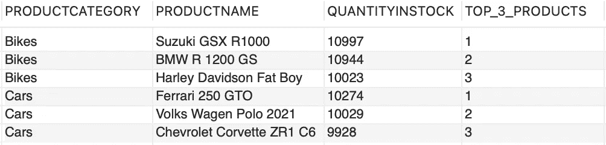

作者提供的图片

首先让我们将整个查询分成两部分，如下图所示；首先，我们在创建一个*PRODUCT_INVENTORY*。表数据将被划分为每个*PRODUCTCATEGORY*的分区/组，按每个产品类别的库存数量的降序排列。然后，*ROW_NUMBER()* 将为每个分区生成顺序整数号码。这里的有趣之处在于，每个*PRODUCTCATEGORY*中的行号会在每个分区中重置。

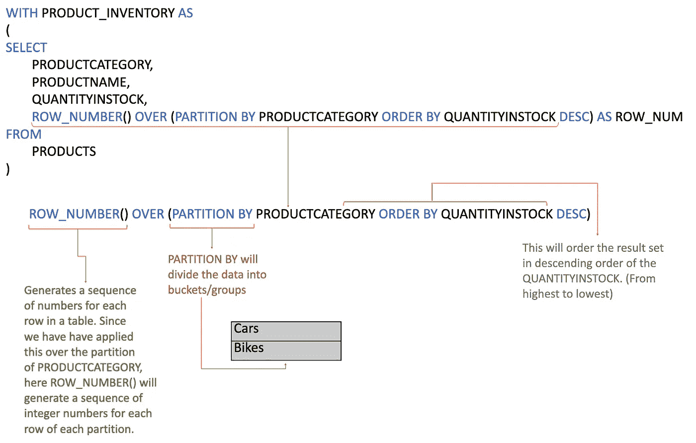

作者提供的图片

上面的查询将返回以下结果，

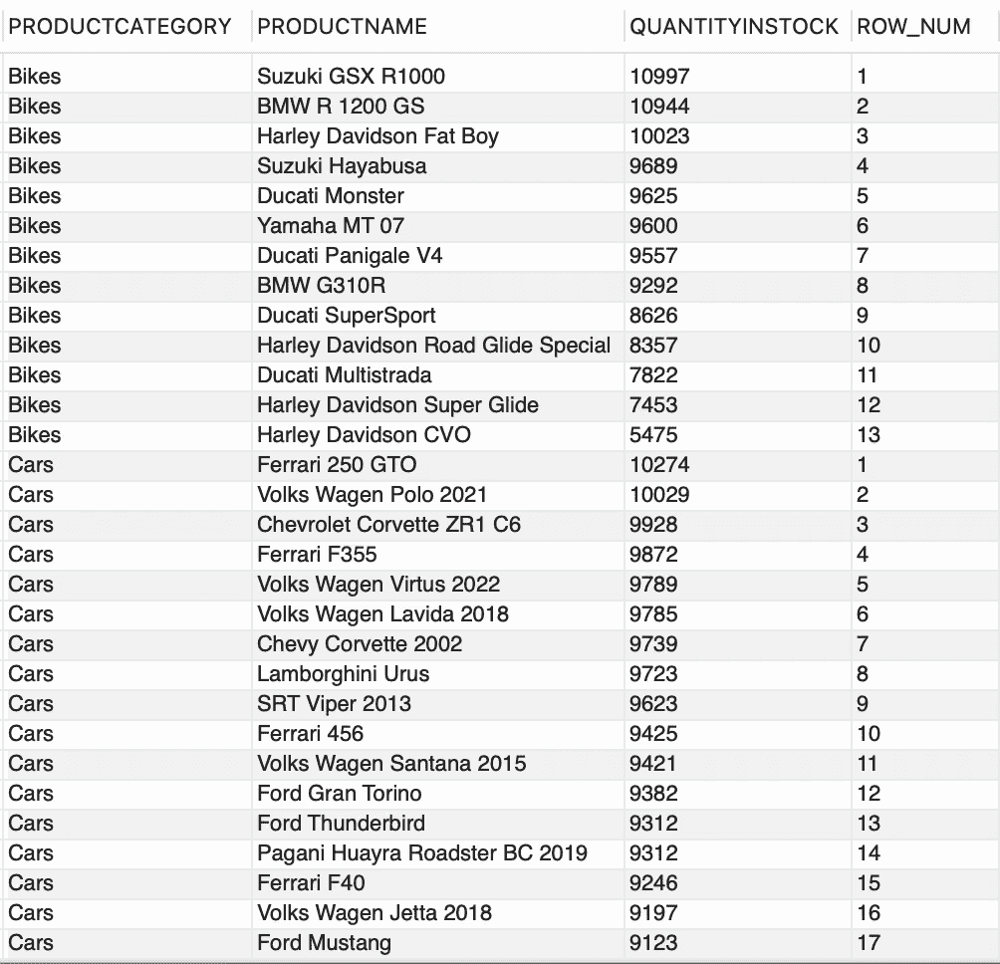

作者提供的图片

现在我们查询的第二部分是相当简单的。它将利用这个结果集作为输入，并从每个 *PRODUCTCATEGORY* 中选取前 3 个产品，基于条件 *ROW_NUM ≤ 3*。最终结果如下，

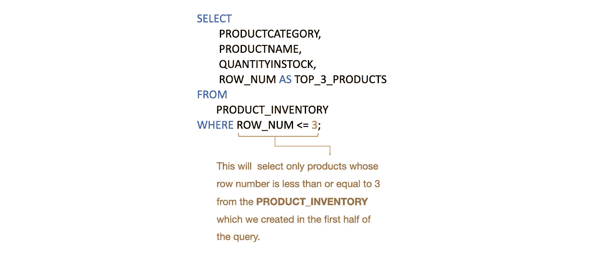

作者提供的图片

这将得到最终结果，如下所示，

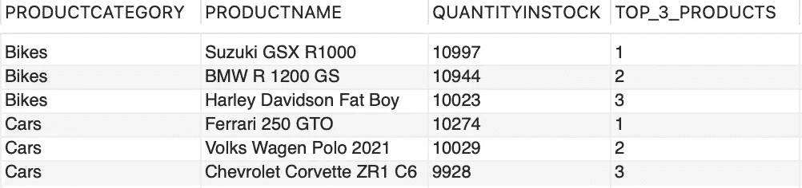

作者提供的图片

## RANK()

如其名称所示，*RANK()* 为表中的每一行或每个分区中的每一行分配一个排名。一般语法是，

> **RANK() OVER ([PARTITION BY 子句] [ORDER BY 子句])**

继续我们*PRODUCTS*表的例子，让我们根据库存数量以降序为产品分配一个排名，按*PRODUCTCATEGORY*进行分区。

```py
--generate rank for each product category
SELECT
    PRODUCTCATEGORY,
    PRODUCTNAME,
    QUANTITYINSTOCK,
    RANK() OVER (PARTITION BY PRODUCTCATEGORY ORDER BY QUANTITYINSTOCK DESC) AS "RANK"
FROM
    PRODUCTS;
```

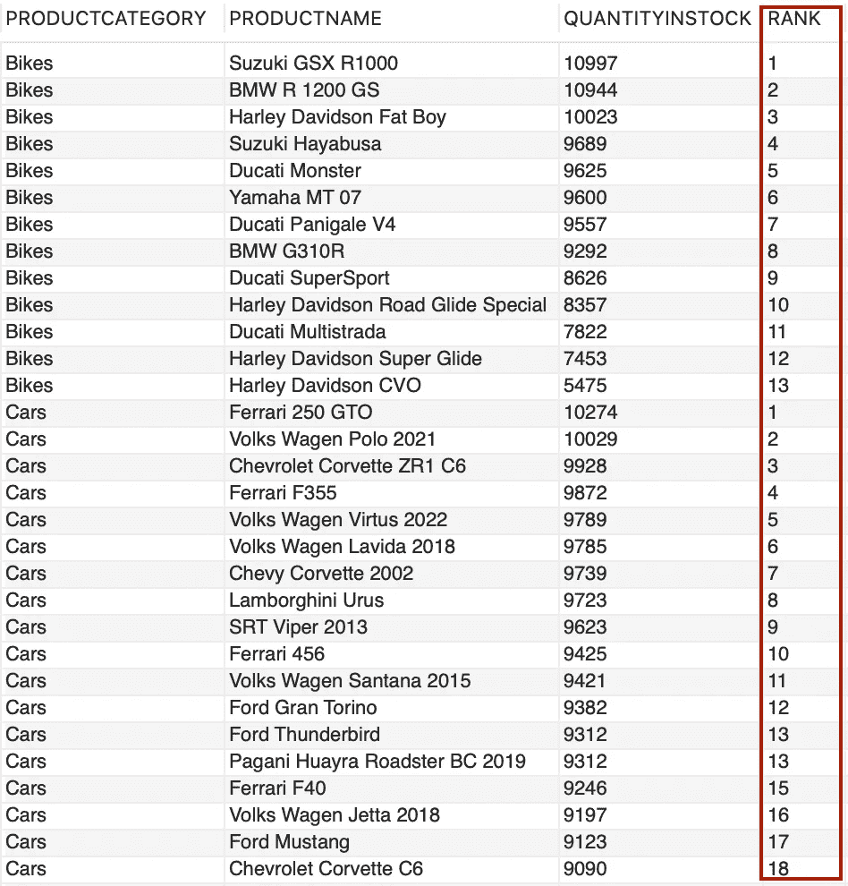

作者提供的图片

我已经将结果集限制为演示目的。现在，不要将 *ROW_NUMBER()* 和 *RANK()* 混淆。这两者的结果集可能看起来相似；然而，存在差异。*ROW_NUMBER()* 为表中的每一行或每个分区中的每一行分配唯一的顺序整数编号；而 *RANK()* 也为表中的每一行或每个分区中的每一行生成顺序整数编号，但对具有相同值的行分配相同的排名。

让我们通过一个例子来理解，以下是 *CUSTOMERS* 表的示例数据，

```py
-- sample data from table customers
SELECT
    CUSTOMERID,
    CUSTOMERNAME,
    CREDITLIMIT
FROM 
    CUSTOMERS
LIMIT 10; 
```

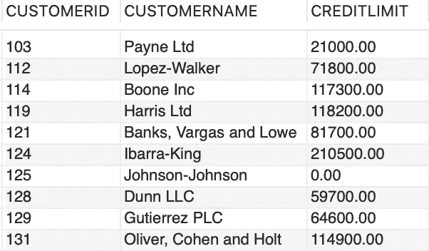

作者提供的图片

在以下演示中，我为 *CUSTOMERS* 表生成了 *ROW_NUMBER()* 和 *RANK()*，按 *CREDITLIMIT* 降序排列。

```py
--row_number() and rank() comparison
SELECT 
    CUSTOMERID,
    CUSTOMERNAME,
    CREDITLIMIT,
    ROW_NUMBER() OVER (ORDER BY CREDITLIMIT DESC) AS CREDIT_ROW_NUM,
    RANK() OVER (ORDER BY CREDITLIMIT DESC) AS CREDIT_RANK
FROM 
    CUSTOMERS;
```

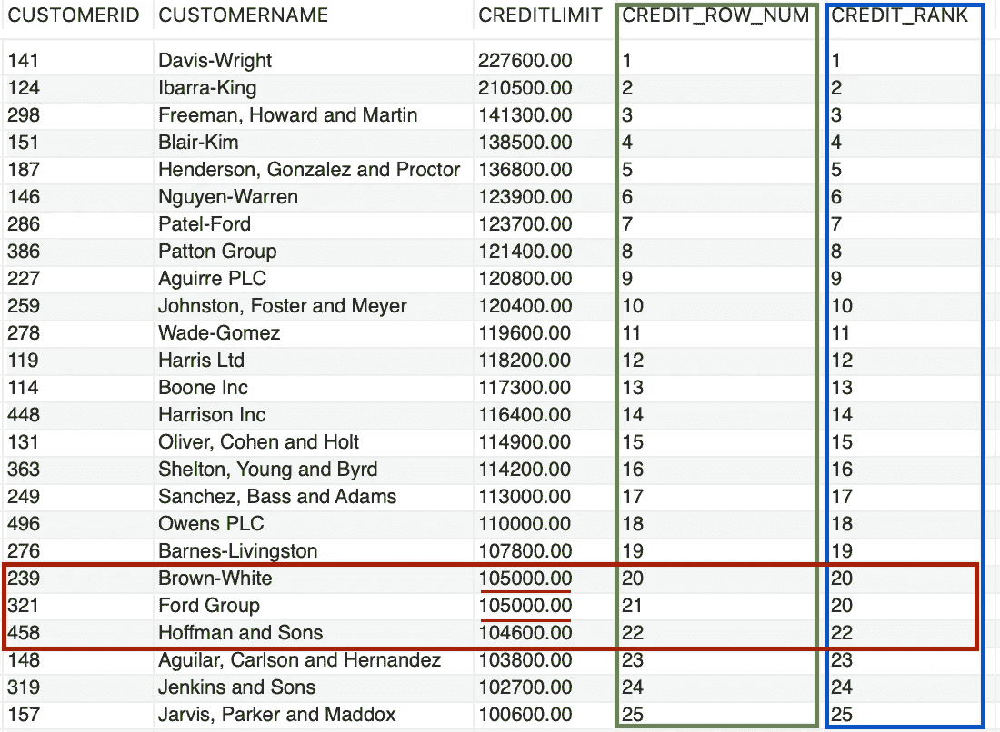

作者提供的图片

我已经将结果集限制为演示目的。绿色高亮的是 *ROW_NUMBER()*，蓝色高亮的是 *RANK()*。

现在，如果你查看红色高亮的 3 条记录，这就是两个函数结果集不同的地方；*ROW_NUMBER()* 为所有行生成了唯一的顺序整数编号。而另一方面，*RANK()* 为 *CUSTOMERID* ***239*** 和 ***321*** 分配了相同的排名 ***20***，因为它们具有相同的信用额度，即 ***105000.00***。不仅如此，对于下一个记录，即 *CUSTOMERID* ***458***，它跳过了排名 ***21*** 并分配了排名 ***22***。

## DENSE_RANK()

现在如果你在想，为什么我们需要 *DENSE_RANK()*，如果我们已经有了 *RANK()*？正如我们在前面的例子中看到的，*RANK()* 为具有相同值的行生成相同的排名，然后跳过下一个连续排名（参见上面的图片）。

*DENSE_RANK()* 与 *RANK()* 类似，只是有一个区别，它在对行进行排名时不会跳过任何排名。通用语法是，

> **DENSE_RANK() OVER ([PARTITION BY 子句] [ORDER BY 子句])**

回到 *CUSTOMERS* 表，让我们比较 *RANK()* 和 *DENSE_RANK()* 的结果集，

```py
--dense_rank() and rank() comparison
SELECT 
    CUSTOMERID,
    CUSTOMERNAME,
    CREDITLIMIT,
    RANK() OVER (ORDER BY CREDITLIMIT DESC) AS CREDIT_RANK,
    DENSE_RANK() OVER (ORDER BY CREDITLIMIT DESC) AS CREDIT_DENSE_RANK
FROM 
    CUSTOMERS;
```

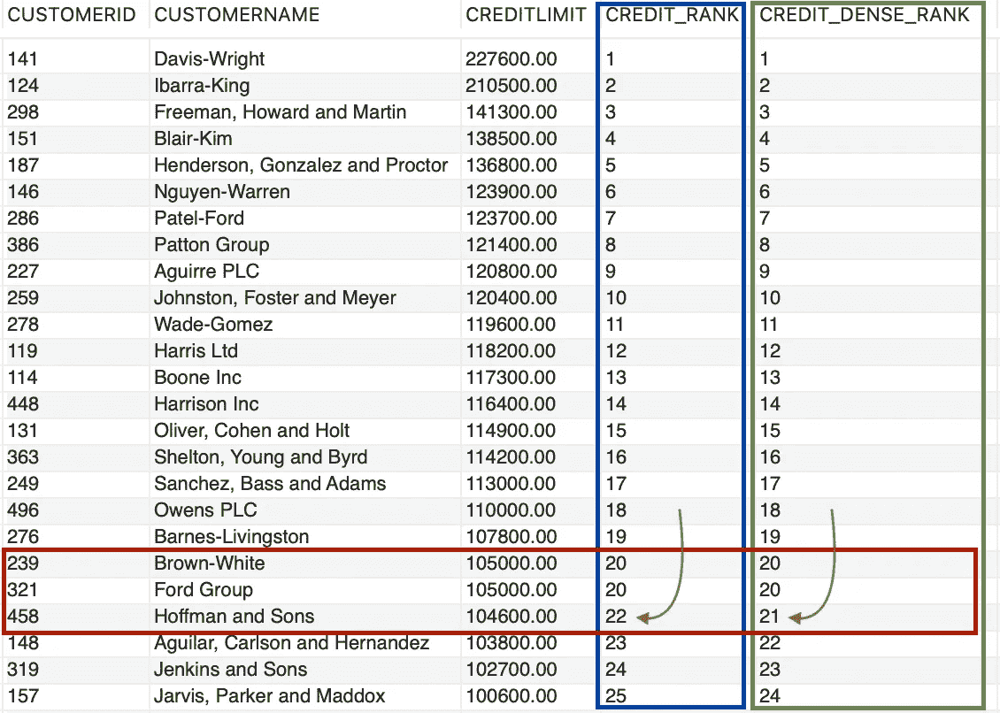

作者提供的图片

与 *RANK()*（以蓝色突出显示）类似，*DENSE_RANK()*（以绿色突出显示）为 *CUSTOMERID* ***239*** 和 ***321*** 生成了相同的排名，而 *DENSE_RANK()* 与 *RANK()* 不同的是，它没有跳过下一个连续数字，而是保持了序列，并将 ***21*** 排名分配给 *CUSTOMERID* ***458***。

## NTH_VALUE()

这与我们之前讨论的有点不同。*NTH_VALUE()* 将返回指定窗口中表达式的 *Nth* 行的值。常见的语法是，

> **NTH_VALUE(expression, N) OVER ([PARTITION BY clause] [ORDER BY clause] [ROW/RANGE clause])**

*‘N’* 必须是正整数值。如果数据不存在于 *Nth* 位置，函数将返回 *NULL*。在这里，如果你注意到，我们在语法中有一个额外的子句，即 *ROW/RANGE* 子句*。

RAW/RANGE 是窗口函数中 *Frame Clause* 的一部分，它定义了窗口分区内的子集。*ROW/RANGE* 根据当前行定义此子集的起点和终点，你以当前行的位置为基点，并以此为参考，在分区内定义你的框架。

+   *ROWS* - 这定义了框架的开始和结束，通过指定当前行之前或之后的行数。

+   *RANGE* - 与 *ROWS* 相反，*RANGE* 通过与当前行的值进行比较来定义分区内框架的值范围。

通用语法是，

> **{ROWS | RANGE} BETWEEN <frame_starting> AND <frame_ending>**

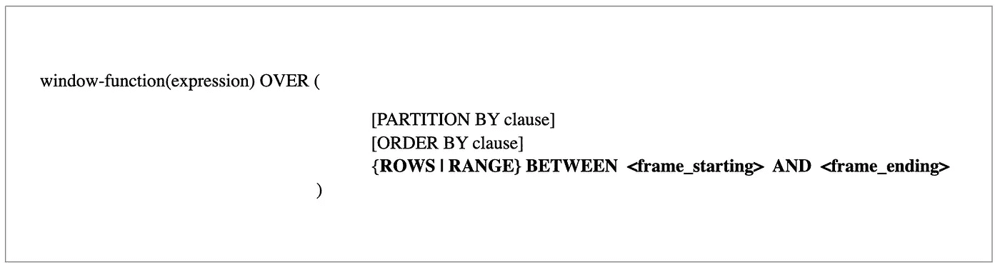

图片由作者提供

每当你使用 *ORDER BY* 子句时，它将设置默认框架为，

> *{ROWS/RANGE} BETWEEN* **UNBOUNDED PRECEDING** *AND* **CURRENT ROW**

如果没有 ORDER BY 子句，默认框架是，

> *{ROWS/RANGE}* BETWEEN **UNBOUNDED PRECEDING** 和 **UNBOUNDED FOLLOWING**

这些内容现在可能看起来有些多，但无需记住语法及其含义，只需练习即可！你可以在这里阅读详细的 *Frame Clause* 和一系列示例，

[](/anatomy-of-sql-window-functions-7256d8cf509a?source=post_page-----4dd3e4ad0d2--------------------------------) [## SQL 窗口函数的结构]

### 回到基础 | SQL 初学者基础

towardsdatascience.com

现在假设，我们需要找出每个 *PRODUCTCATEGORY* 中的第二高买价的 *PRODUCTNAME*，

```py
--productname for each productcategory with 2nd highest buy price
SELECT
    PRODUCTNAME,
    PRODUCTCATEGORY,
    BUYPRICE,
    NTH_VALUE(PRODUCTNAME,2) OVER(PARTITION BY PRODUCTCATEGORY ORDER BY BUYPRICE DESC) AS SECOND_HIGHEST_BUYPRICE
FROM
    PRODUCTS;
```

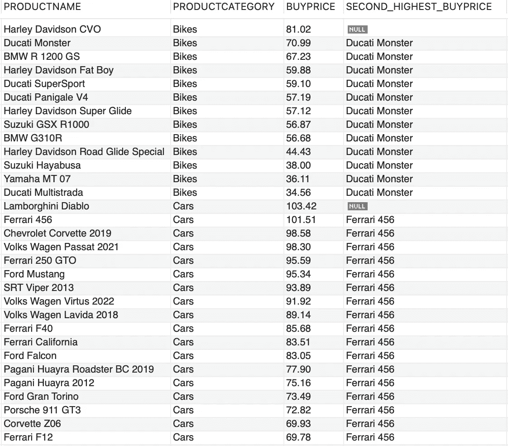

图片由作者提供

我们还有两个类似于 *NTH_VALUE()* 的值函数；*FIRST_VALUE()* 和 *LAST_VALUE()*。顾名思义，它们分别从排序列表中返回最高（第一个）和最低（最后一个）值。通用语法是，

> **FIRST_VALUE(expression) OVER ([PARTITION BY clause] [ORDER BY clause] [ROW/RANGE clause])**
> 
> **LAST_VALUE(expression) OVER ([PARTITION BY clause] [ORDER BY clause] [ROW/RANGE clause])**

类似于上述示例，现在你能找出每个*PRODUCTCATEGORY*中买价最高和最低的*PRODUCTNAME*吗？

## NTILE()

有时会出现需要将分区内的行安排到一定数量的组或桶中的情况。NTILE() 就是用于这种目的，它将分区中有序的行分成特定数量的桶。每个桶都会分配一个从 1 开始的组号。它会尽量创建尽可能大小相等的组。对于每一行，*NTILE()* 函数返回一个组号，表示该行所属的组。

通用语法是，

> **NTILE(N) OVER ([PARTITION BY 子句] [ORDER BY 子句])**

其中 'N' 是定义要创建的组数的正整数。

比如，我们想要将*PRODUCTCATEGORY -‘Cars’* 分类为高价、中价和低价的汽车列表。

```py
--segregate the 'Cars' for high range, mid range and low range buy price
SELECT 
    PRODUCTNAME,
    BUYPRICE,
    NTILE(3) OVER (ORDER BY BUYPRICE DESC) AS BUYPRICE_BUCKETS
FROM 
    PRODUCTS
WHERE
    PRODUCTCATEGORY = 'Cars';
```

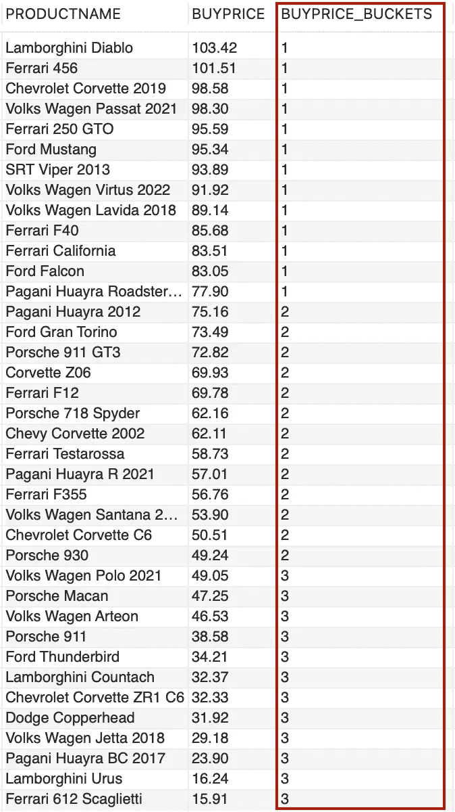

作者提供的图片

## LAG() 和 LEAD()

我们经常遇到需要进行某种比较分析的场景。例如，将选定年份的销售与前一年或后一年进行比较。这种比较在处理时间序列数据和计算时间上的差异时非常有用。

*LAG()* 从当前行之前的行提取数据。如果没有前导行，则返回*NULL*。常见的语法是，

> **LAG(expression, offset) OVER ([PARTITION BY 子句] [ORDER BY 子句])**

*LEAD()* 从当前行之后的行获取数据。如果没有后续行，则返回*NULL*。常见的语法是，

> **LEAD(expression, offset) OVER ([PARTITION BY 子句] [ORDER BY 子句])**

其中***offset***是可选的，但使用时其值必须是 0 或正整数，

+   当指定为 0 时，*LAG()* 和 *LEAD()* 会对当前行评估表达式。

+   如果省略，1 被认为是默认值，它会取当前行的直接前一行或后一行。

```py
--yearly total sales for each product category
WITH YEARLY_SALES AS
(
SELECT
    PROD.PRODUCTCATEGORY,
    YEAR(ORDERDATE) AS SALES_YEAR,
    SUM(ORDET.QUANTITYORDERED * ORDET.COSTPERUNIT) AS TOTAL_SALES
FROM
    PRODUCTS PROD
INNER JOIN
    ORDERDETAILS ORDET
    ON PROD.PRODUCTID = ORDET.PRODUCTID
INNER JOIN
    ORDERS ORD
    ON ORDET.ORDERID = ORD.ORDERID
GROUP BY PRODUCTCATEGORY, SALES_YEAR  
)

SELECT
    PRODUCTCATEGORY,
    SALES_YEAR,
    LAG(TOTAL_SALES) OVER (PARTITION BY PRODUCTCATEGORY ORDER BY SALES_YEAR) AS LAG_PREVIOUS_YEAR,
    TOTAL_SALES,
    LEAD(TOTAL_SALES) OVER (PARTITION BY PRODUCTCATEGORY ORDER BY SALES_YEAR) AS LEAD_FOLLOWING_YEAR
FROM YEARLY_SALES;
```

在这里，我们首先使用*CTE（公共表表达式）*来获取每个*PRODUCTCATEGORY*按年度的总销售数据。然后，我们使用这些数据与*LAG()* 和 *LEAD()* 结合，以获取按*PRODUCTCATEGORY* 分区且按*SALES_YEAR* 排序的前一年和后一年总销售数据。

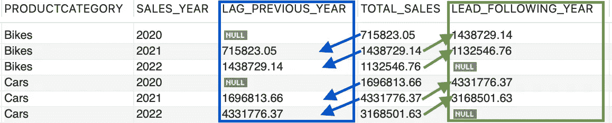

作者提供的图片

## 结论

窗口函数在你想以多种方式分析数据时非常有用。不同的 SQL 变体可能有略微不同的实现，因此查阅特定 SQL 变体的官方文档总是一个好主意。以下是一些资源，帮助你入门，

+   [窗口函数的解剖](https://anatomy-of-sql-window-functions-7256d8cf509a)

+   [窗口函数概念和语法](https://dev.mysql.com/doc/refman/8.0/en/window-functions-usage.html)

+   [MySQL 窗口函数限制](https://dev.mysql.com/doc/refman/8.0/en/window-function-restrictions.html)

+   [SQL 窗口函数备忘单](https://learnsql.com/blog/sql-window-functions-cheat-sheet/)

如果你记得某些东西非常清楚，你一定是练习得很好，

+   [HackerRank](https://www.hackerrank.com) 或 [LeetCode](https://leetcode.com) 用来练习基础/中级/高级 SQL 问题。

[*成为会员，阅读 Medium 上的所有故事*](https://medium.com/@iffatm/membership)*.*

快乐学习！
