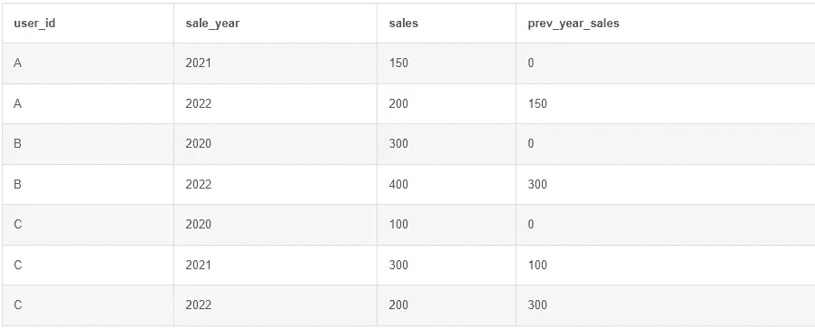

# PostgreSQL 中的窗口函数

> 原文：[`towardsdatascience.com/window-functions-in-postgresql-788d2ad57c6b`](https://towardsdatascience.com/window-functions-in-postgresql-788d2ad57c6b)

## 任何数据从业者必须了解的知识

[](https://ms101196.medium.com/?source=post_page-----788d2ad57c6b--------------------------------)[](https://towardsdatascience.com/?source=post_page-----788d2ad57c6b--------------------------------) [梅尔林·舍费尔](https://ms101196.medium.com/?source=post_page-----788d2ad57c6b--------------------------------)

·发布于[数据科学前沿](https://towardsdatascience.com/?source=post_page-----788d2ad57c6b--------------------------------) ·阅读时间 8 分钟·2023 年 1 月 6 日

--


照片由[斯蒂芬·道森](https://unsplash.com/@dawson2406?utm_source=medium&utm_medium=referral)提供，来源于[Unsplash](https://unsplash.com/?utm_source=medium&utm_medium=referral)

你是否曾经发现自己编写了许多步骤或包含聚合函数的长 SQL 查询，以计算看似简单的指标？你是否曾经想过“是否可以通过不同的方式计算表中的内容，以简化操作”？那么，也许是时候看看窗口函数了。

窗口函数是 SQL 中一个方便且强大的特性，它允许你对多行进行类似于聚合函数的计算。但不同于可能会与 GROUP BY 一起使用的聚合函数，它们不会返回一组行的单一值，而是返回集合中每一行的值。我们来看看一个例子：

```py
SELECT
  user_id,
  SUM(sales)
FROM transactions
GROUP BY 
  user_id;
```


```py
SELECT
SUM(sales) OVER(
            PARTITION BY user_id
)
FROM transactions;
```


## 你为什么以及何时应该使用窗口函数？

窗口函数的一个优势是，它们允许你结合使用聚合值和非聚合值，因为行不会被合并在一起。这为在一步中计算许多内容提供了一种方法，否则需要多个步骤。

与多个子查询和自连接相比，窗口函数相对简单易用且易于阅读。它们减少了查询的复杂性和步骤数，从而使得后续维护变得更加容易。

这样，它们也可以帮助解决性能问题。例如，你可以使用窗口函数，而不是进行自连接或子查询。

## 重要的窗口函数

你可以将 SUM()和 COUNT()等函数用作窗口函数，但还有一些特殊函数仅作为窗口函数可用。

以下是一些 PostgreSQL 中最重要的窗口函数：

1.  RANK(): 返回每行在数据集中的排名。排名是根据行在数据集中的顺序决定的。排名为 1 的是第一行。排名相同的行会获得相同的排名，这可能导致排名中出现间隙。

1.  DENSE_RANK(): 类似于 RANK()，但如果行值相同，它不会跳过任何排名。例如，如果两行具有相同的值且被排序为第一行和第二行，它们的排名将是 1 和 1，接下来的是 2，而不是 1 和 1 和 3，正如 RANK() 的情况。

1.  ROW_NUMBER(): 返回数据集中每行的唯一编号。第一行的行号为 1，第二行的行号为 2，依此类推。

1.  NTILE(): 将行分成指定数量的组或“块”，并为每行分配一个块编号。例如，如果你指定 NTILE(3) 并且数据集中有 9 行，前 3 行将被分配块编号 1，接下来的 3 行将被分配块编号 2，最后 3 行将被分配块编号 3。这个函数可以用来计算分位数。

1.  5\. LAG() 和 LEAD(): 这些函数用于访问数据集中前一个或后一个行的值。例如，如果你有一组值，并且想将每一行的值与前一行的值进行比较，可以使用 LAG() 函数来访问前一个值。

**让我们看一些示例！**

**RANK()、DENSE_RANK 和 ROW_NUMBER()**: 使用这些函数时，你需要指定要排名的列名，以及决定数据集行顺序的 ORDER BY 子句。

例如，要按“销售”列中的值数量对表中的行进行排名，你可以使用以下查询：

```py
SELECT
user_id,
RANK() OVER(
          ORDER BY COUNT(*)
),
DENSE_RANK() OVER(
          ORDER BY COUNT(*)
),
ROW_NUMBER() OVER(
          ORDER BY COUNT(*)
)
FROM transactions
GROUP BY user_id;
```


在这个示例中，相应的排名函数将最高值的行分配排名 1，第二高值的行分配排名 2（或如果允许并列，则为 1），依此类推。

**NTILE()**: 使用 NTILE() 函数时，你需要指定要创建的块数以及决定数据集行顺序的 ORDER BY 子句。例如，要将表中的行分成 4 个块（四分位数），你可以使用以下查询：

```py
SELECT
  user_id,
  sales,
  NTILE(4) OVER(
            ORDER BY sales)
FROM transactions;
```


如你所见，我们现在可以轻松确定前/后四分位数的销售额。我发现这个函数对于找出高于或低于某个百分比/分位数的值非常有用。

**LAG()** 和 **LEAD()**: 使用 LAG() 或 LEAD() 函数时，你需要指定要访问的列名、移动的行数以及如果指定的行不存在时使用的默认值。例如，要访问“销售”列中前一行的值，你可以使用以下查询：

```py
SELECT
  user_id,
  sale_year,
  sales,
  LAG(sales,1,0) OVER(
                  PARTITION BY user_id 
                  ORDER BY sale_year
  ) AS prev_year_sales
FROM transactions
ORDER BY 
  user_id, sale_year;
```



在这里，LAG()函数将访问“sales”列中前一行的值，如果没有前一行，则返回 0（例如，如果当前行是集合中的第一行）。

## OVER、PARTITION BY 和 ORDER BY

OVER 子句是 PostgreSQL 中许多窗口函数的可选语法部分。它指定决定函数操作的行集的标准。例如，如果你想使用窗口函数计算每年的平均“sales”值，你可以使用 OVER 子句将行集定义为所有具有相同“year”值的行。OVER 子句通常包括 PARTITION BY 和 ORDER BY 子句，这些子句用于将行分成组（或分区）并确定每个分区内的行顺序。

OVER 子句是 PostgreSQL 中窗口函数的一个强大特性，它允许你控制决定窗口函数操作的行集的标准。这使得你可以根据需要对行组或单行进行计算。

如果你需要对包含的行进行更精细的控制，可以使用**OVER 子句中的行选择**。行选择子句决定了窗口函数操作的集合中将包含哪些行。行选择子句可以用来指定**包含的行数**或**行的范围**，根据当前行在集合中的位置来确定。如果你只想从集合的开始或结束部分包含某些行，或想排除计算中的某些行，这会很有用。以下是一些你可能经常遇到的例子：

1.  ROWS BETWEEN UNBOUNDED PRECEDING AND UNBOUNDED FOLLOWING：这个子句指定集合中的所有行都应包含在计算中。这是默认行为，如果没有指定行选择子句，你不会经常看到它，但这是最常用的行选择。

1.  ROWS BETWEEN CURRENT ROW AND UNBOUNDED FOLLOWING：这个子句指定从当前行到集合的末尾的所有行都应包含在计算中。

1.  ROWS BETWEEN UNBOUNDED PRECEDING AND CURRENT ROW：这个子句指定从集合开始到当前行的所有行都应包含在计算中。我发现这在累积计算中非常有用。

1.  ROWS BETWEEN 1 PRECEDING AND 1 FOLLOWING：这个子句指定当前行及其前后各一行应包含在计算中。你可以更改数值来调整计算窗口的大小和形状。

## 这里还有一些值得了解的内容：

1.  窗口函数可以在查询的 SELECT、WHERE 和 HAVING 子句中使用。这允许你在查询的各个部分使用窗口函数的结果，甚至用它们来过滤查询返回的行。

1.  窗口函数可以与聚合函数结合使用。例如，你可以使用窗口函数来计算每一行的排名，然后使用 SUM()等聚合函数来计算排名的总和。这在计算分数和百分比时非常有用。

1.  窗口函数可以与 GROUP BY 子句一起使用。当与 GROUP BY 子句结合使用时，窗口函数将计算每一组行的值，而不是整个行集的值。

1.  窗口函数可以与子查询和 CTE（公共表表达式）一起使用。这允许你对子查询/CTE 的结果进行计算，而不是对原始数据集进行计算。

1.  在 PostgreSQL 中，有一个 WINDOW 关键字用于定义窗口函数的窗口帧。窗口帧是窗口函数操作的行集，由 OVER 子句和函数语法中包含的任何行选择子句决定。通过使用 WINDOW 关键字，你可以在单个查询中为多个窗口函数指定窗口帧，而不是为每个函数重复 OVER 和行选择子句。这可以使你的查询更具可读性，更易于维护。

```py
SELECT
 year,
 sales,
 AVG(sales) OVER w1 ,
 SUM(sales) OVER w1 
FROM sales_table
WINDOW w1 AS (PARTITION BY year 
            ORDER BY month 
            ROWS BETWEEN UNBOUNDED PRECEDING 
            AND UNBOUNDED FOLLOWING
          );
```

总之，窗口函数是 PostgreSQL 中一种强大且多功能的工具，它允许你对行集合进行复杂的计算。无论你是需要计算排名、将行分组，还是访问其他行的值，窗口函数都能满足你的需求。

希望你学到了东西，并能利用窗口函数改进你的计算和分析！

-梅林

[](https://ms101196.medium.com/membership?source=post_page-----788d2ad57c6b--------------------------------) [## 通过我的推荐链接加入 Medium - 梅林·谢费尔

### 阅读梅林·谢费尔（Merlin Schäfer）和其他成千上万名作家的每个故事。你的会员费用直接支持……

ms101196.medium.com](https://ms101196.medium.com/membership?source=post_page-----788d2ad57c6b--------------------------------)
