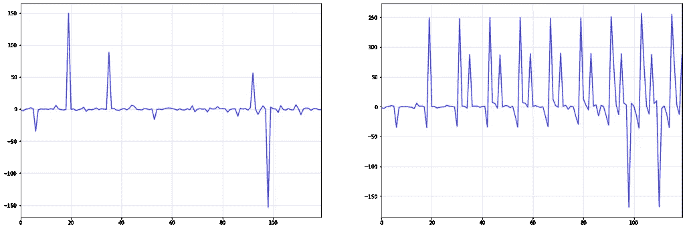

# 用简单的，甚至非线性的时间序列模型获胜

> 原文：[`towardsdatascience.com/winning-with-simple-not-even-linear-time-series-models-6ece77be22bc`](https://towardsdatascience.com/winning-with-simple-not-even-linear-time-series-models-6ece77be22bc)

## 如果你的数据集较小，接下来的想法可能会很有用

 [Sarem Seitz](https://sarem-seitz.medium.com/?source=post_page-----6ece77be22bc--------------------------------)

·发布在 [Towards Data Science](https://towardsdatascience.com/?source=post_page-----6ece77be22bc--------------------------------) ·9 分钟阅读·2023 年 5 月 10 日

--

照片由 [Thomas Bormans](https://unsplash.com/@thomasbormans?utm_source=unsplash&utm_medium=referral&utm_content=creditCopyText) 拍摄，来源于 [Unsplash](https://unsplash.com/de/s/fotos/time?utm_source=unsplash&utm_medium=referral&utm_content=creditCopyText)

**免责声明：** 标题深受 [这个](https://www.youtube.com/watch?v=68ABAU_V8qI&pp=ygUad2lubmluZyB3aXRoIHNpbXBsZSBtb2RlbHM%3D&ref=sarem-seitz.com) 精彩讲座的启发。

正如名字所示，今天我们想要考虑几乎简单到微不足道的模型。尽管目前的趋势是趋向复杂模型，即使是时间序列模型，我仍然非常相信简单性。特别是当你的数据集较小时，接下来的想法可能会很有用。

公平地说，这篇文章可能对刚开始进行时间序列分析的人最有价值。其他人应首先查看目录，自己决定是否继续阅读。

就个人而言，我对即使是最简单的时间序列模型能推到多远仍然感到非常好奇。接下来的段落展示了一些我在这个话题上逐渐积累的想法和见解。

# 纯 i.i.d.噪声的模型

我们从最简单的（概率性）方式开始建模（单变量）时间序列。也就是说，我们希望查看纯粹的**i**独立的，**i**同分布的，**d**分布随机性：

（图像作者提供）

这意味着我们的所有观测在任何时间点都遵循相同的分布（**同分布**）。更重要的是，我们假设观测之间完全没有相互关系（**独立分布**）。显然，这排除了任何自回归项。

你可能首先会问这样模型是否过于简单以至于无法用于现实问题。当然，大多数时间序列不太可能与自身过去没有统计关系。

尽管这些担忧完全正确，但我们仍然可以推导出以下内容：

> *任何比纯噪声模型更复杂的时间序列模型也应该能提供比纯噪声模型更好的预测。*

简而言之，我们至少可以使用随机噪声作为基准模型。可以说，没有比这更简单的方法来创建基准基准了。即使平滑技术可能也需要更多的参数进行拟合。

除了这个相当明显的用例之外，i.i.d. 噪声还有另一个潜在的应用。由于其简单性，噪声模型对非常小的数据集也可能有用。考虑一下：如果大型复杂模型需要大量数据以防止过拟合，那么简单模型只需少量数据。

当然，什么数据集大小可以被视为“小型”是有争议的。

# 积分 i.i.d.噪声

现在，事情变得更有趣了。虽然原始 i.i.d.噪声无法解释观察值之间的自相关，但积分噪声可以。在我们进行演示之前，让我们介绍一下*differencing operator*：

(image by author)

如果你还没听说过时间序列问题中的差分——太好了！如果你听说过，那么希望你仍然能学到一些新东西。

## 积分时间序列的定义

有了我们的差分算子，我们现在可以定义一个*积分时间序列*：

(image by author)

这个定义中有几个我们应该进一步澄清的想法：

首先，你可能注意到差分算子的指数概念。你可以简单地把它看作是多次进行微分。对于平方差分算子，这看起来如下：

(image by author)

正如我们将看到的，多重差分算子使我们可以一次处理不同的时间序列模式。

第三，通常的约定是简单地写

(image by author)

我们会很乐意在这里采用这一约定。此外，我们称这样的时间序列为*简单积分*，而不参考其顺序或季节性。

显然，我们还需要将差分表示重新转换回其原始领域。在我们的记号中，这意味着我们反转差分变换，即

(image by author)

必须适用于任意差分变换。如果我们展开这个公式，我们得到

(image by author)

这些简化源于差分运算符是线性运算符的事实（我们在这里不会详细讨论）。从技术上讲，最后的方程仅仅表示下一个观测值是当前观测值加上一个增量。

在一个预测问题中，我们通常会有一个变化的预测。

（图片作者提供）

让我们将这个预测表示为

（图片作者提供）

强调这不是实际变化，而是预测的变化。因此，积分时间序列的预测为

（图片作者提供）

之后，我们将这种逻辑递归应用到预测应该延续的未来：

（图片作者提供）

白噪声时间序列（左）及其对应的积分时间序列（右）。这两个时间序列通过简单的差分运算符及其逆相关联。（图片作者提供）

## 对于看似复杂的模式，积分噪声

到现在，你可能已经能想象什么是积分噪声模型。实际上，我们可以通过将一些差分运算符与随机噪声链式组合来提出无数种积分噪声模型变体。

**来自积分时间序列的线性趋势：** 一种可能性是简单的积分时间序列，即

（图片作者提供）

使用普通标准正态分布模拟这种模型的数据是一个有趣的练习。

结果是，这个时间序列的样本似乎展示了具有潜在变化点的线性趋势。然而，这些趋势和变化点显然完全是随机的。

这意味着简单地将分段线性函数拟合用于预测这些趋势可能是一种危险的方法。毕竟，如果变化是随机发生的，那么所有线性趋势线只是随机数据生成过程的伪影。

作为一个重要的免责声明，虽然‘*不可预测*’意味着从时间序列本身不可预测，但一个外部特征可能仍然能够准确预测潜在的变化点。然而，在这里，我们假设时间序列是我们唯一可用的信息来源。

下面，你可以看到上述现象的一个示例。虽然在 t=50 左右似乎有一个趋势变化，但这个变化完全是随机的。t=50 之后的上升趋势在 t=60 左右也停滞了。想象一下，如果你在 t=60 之后对上升趋势进行外推，你的模型会如何表现。

*通过对标准正态噪声进行积分生成具有变化线性趋势的时间序列。*（图片作者提供）

当然，有句谚语说‘永远不要说永远’，即使在这些情况下也是如此。然而，如果你应用这样的模型，你真的应该知道自己在做什么。

**季节性模式：** 类似于简单集成产生趋势的方式，我们也可以创建季节性模式：

正式来说，我们现在需要季节性过程的第 s 阶差分是一个平稳过程，例如：

（图片作者提供）

逆操作——将 i.i.d.过程转换回季节集成——与之前的操作类似：

（图片作者提供）

你可以把季节差分的逆操作看作是在`s`个周期内的*cumsum*操作。由于我不知道相应的本地 Python 函数，我决定通过`reshape->cumsum->reshape`来获得所需的结果。以下是`s=4`的示例：

纯 i.i.d.过程的`4`阶季节性。（图片作者提供）

如你所见，生成的时间序列看起来相当真实。我们可以轻松地将其作为某产品的季度销售数字出售给一位不知情的数据科学家。

我们甚至可以结合这两种类型的集成，以生成具有趋势行为的季节性时间序列：

通过对白噪声进行集成，可以显现出季节性和趋势模式。（图片作者提供）

此时，你可能会意识到这篇文章的标题有些点击诱饵。事实上，集成时间序列完全是线性模型。然而，我相信大多数人不会认为一个参数更多或更少的模型是典型的线性模型。

**集成中的记忆效应：** 集成时间序列的另一个有趣特性是能够建模记忆效应。

当数据中出现较大冲击或异常值时，这种效果尤为明显。考虑下面的示例，它显示了从标准[Cauchy 分布](https://en.wikipedia.org/wiki/Cauchy_distribution?ref=sarem-seitz.com)中进行 i.i.d.抽样时的季节集成，顺序为`s=12`：

i.i.d.标准 Cauchy 序列（左）及其对应的季节性集成时间序列。（图片作者提供）

i.i.d. Cauchy 序列中大约 t=20 的第一次大冲击在右侧整个集成序列中得以维持。随着时间的推移，更多的冲击发生，这些冲击也得以维持。

这个记忆属性在实践中非常有用。例如，疫情带来的经济冲击导致了许多时间序列中的持续变化。

# 与 NBEATS 和 NHITS 的基准比较

现在让我们使用*AirPassengers*数据集，来自 Nixtla 的[neuralforecast](https://github.com/Nixtla/neuralforecast?ref=sarem-seitz.com)，对上述想法进行快速评估。如果你经常阅读我的文章，你可能还记得[这篇文章](https://www.sarem-seitz.com/facebook-prophet-covid-and-why-i-dont-trust-the-prophet/#:~:text=even%20simpler%20forecast-,model,-As%20you%20might)中的一般程序。

首先，我们将数据分为训练期和测试期，后者包含 36 个月的数据：

航空乘客数据集——训练和测试拆分。(作者提供的图像)

为了获得一个平稳的 i.i.d.序列，我们执行以下变换：

(作者提供的图像)

首先，平方根稳定了不断增加的方差。然后，两次差分操作去除了季节性和趋势。有关相应的反变换，请查看下方代码。

平稳性变换后的时间序列（训练集）。(作者提供的图像)

我们还可以检查稳定时间序列的直方图和密度图：

平稳时间序列的核密度和直方图。(作者提供的图像)

我们的平稳序列看起来也有些接近正态分布，这总是一个很好的特性。

现在，让我们为测试期创建预测。假设我们不知道 i.i.d.序列的确切分布，我们仅仅通过训练数据从经验分布中抽样。因此，我们通过重新整合来自经验数据的随机样本来模拟未来值：

训练集（蓝色）、测试集（红色）、均值预测（绿色线）和 90%置信区间（绿色区域）。(作者提供的图像)

这看起来非常好——均值预测非常接近测试数据。此外，我们的模拟允许我们经验性地抽样整个预测分布。因此，我们还可以轻松地添加置信区间。

最后，让我们看看我们的方法与复杂时间序列模型的比较。为此，我使用了 Nixtla 的[NBEATS](https://arxiv.org/abs/1905.10437?ref=sarem-seitz.com)和[NHITS](https://arxiv.org/abs/2201.12886?ref=sarem-seitz.com)的实现：

以下是测试集的*均方根误差*（RMSE）：

+   **简单模型:** 25.5021

+   **NBEATS:** 42.6277

+   **NHITS:** 62.6822

正如我们所见，我们几乎简单的模型已经比两个复杂的时间序列模型超出不少。当然，我们需要强调，这并不允许得出任何普遍性的结论。

相反，我期望神经模型在较大的数据集上超越我们简单的方法。然而，作为基准，这些简单模型总是值得考虑的。

# 结论——我们从中得到什么？

正如本文多次指出的：

> 看似复杂的时间序列仍然可能遵循相当简单的数据生成过程。

最终，你可能会花费数小时尝试拟合一个过于复杂的模型，即使基础问题几乎是微不足道的。某些时候，可能有人会出现，拟合一个简单的 ARIMA(1,0,0)，并且仍然超越你的复杂神经模型。

为了避免上述最坏的情况，考虑以下想法：

> 在开始解决新的时间序列问题时，总是从最简单的模型开始，并将其作为所有其他模型的基准。

尽管这是数据科学领域的常识，但我觉得在这种情况下仍然值得特别强调。尤其是由于如今（在某种程度上是有道理的）围绕深度学习的炒作，直接从一些花哨的东西开始可能会很诱人。

对于许多问题，这可能正是正确的解决方案。今天没有人会在大规模语言模型嵌入几乎是免费的情况下考虑使用隐马尔可夫模型来进行自然语言处理。

然而，一旦你的时间序列变得庞大，现代机器学习可能会更好。特别是，[梯度提升树](https://lightgbm.readthedocs.io/en/v3.3.2/?ref=sarem-seitz.com) 在这种大规模问题中非常受欢迎。

更具争议的方法是，你猜对了，时间序列的深度学习。虽然有些人认为这些模型在这里效果不好，但它们在像[亚马逊这样的科技公司](https://www.amazon.science/videos-and-tutorials/forecasting-big-time-series-theory-and-practice?ref=sarem-seitz.com)的流行程度可能说明了一切。

# 参考文献

**[1]** Hamilton, James Douglas. *时间序列分析*. 普林斯顿大学出版社, 2020。

**[2]** Hyndman, Rob J., & Athanasopoulos, George. *预测：原理与实践*. OTexts, 2018。

*最初发布于* [*https://www.sarem-seitz.com*](https://www.sarem-seitz.com/winning-with-simple-not-even-linear-time-series-models/) *于 2023 年 5 月 10 日。*
