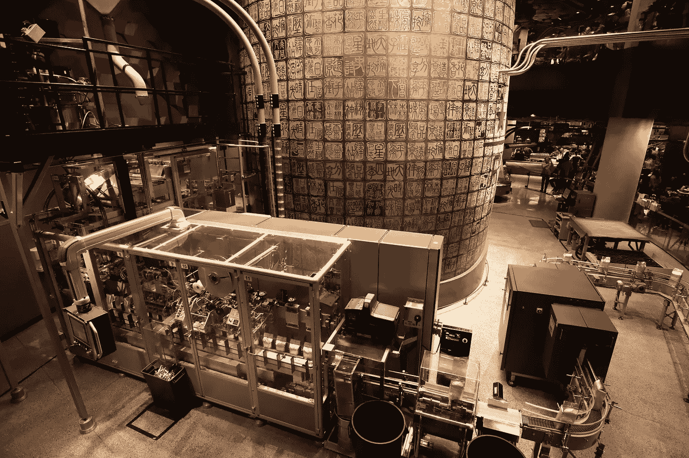

# 事不宜迟：自动化开发环境和构建

> 原文：[`towardsdatascience.com/without-further-ado-automate-dev-environments-and-build-f2f9bcaaae1e?source=collection_archive---------9-----------------------#2023-02-24`](https://towardsdatascience.com/without-further-ado-automate-dev-environments-and-build-f2f9bcaaae1e?source=collection_archive---------9-----------------------#2023-02-24)

## 通过环境和构建自动化，使你的软件易于使用，从而给你的开发者同事带来快乐。包括 Python 和 Hatch 的代码示例。

 [Mattia Di Gangi](https://medium.com/@mattiadigangi?source=post_page-----f2f9bcaaae1e--------------------------------)

·

[关注](https://medium.com/m/signin?actionUrl=https%3A%2F%2Fmedium.com%2F_%2Fsubscribe%2Fuser%2F8a5b9f193a3c&operation=register&redirect=https%3A%2F%2Ftowardsdatascience.com%2Fwithout-further-ado-automate-dev-environments-and-build-f2f9bcaaae1e&user=Mattia+Di+Gangi&userId=8a5b9f193a3c&source=post_page-8a5b9f193a3c----f2f9bcaaae1e---------------------post_header-----------) 发表于 [Towards Data Science](https://towardsdatascience.com/?source=post_page-----f2f9bcaaae1e--------------------------------) ·11 分钟阅读·2023 年 2 月 24 日

--

图片来源：[Carol Jeng](https://unsplash.com/@carolran?utm_source=medium&utm_medium=referral) 在 [Unsplash](https://unsplash.com/?utm_source=medium&utm_medium=referral)

大多数开发者讨厌遗留软件，为什么？在我们行业中，“遗留”指的是已经使用多年的代码库，通常原始开发者已不在公司，且无人能够真正维护它。

遗留软件配方中的一些重要成分包括：缺乏文档、难以理解的代码、**尝试修改的困难**以及**构建软件以进行发布的严重困难**。

然而，遗留软件之所以被称为“遗留软件”，是因为公司依赖它，这就是为什么尽管大多数开发人员不知道如何处理它，它仍然在使用。我们从过去的同事那里继承了它，而现在我们的职责是使它在未来继续像过去一样正常运行。

然而，也有一些软件符合上述遗留软件的要求，却没有服务多年的优势。其中一部分代码也是相当新的。这意味着，人们编写的代码已经根据其负面定义成为“遗留”代码。
