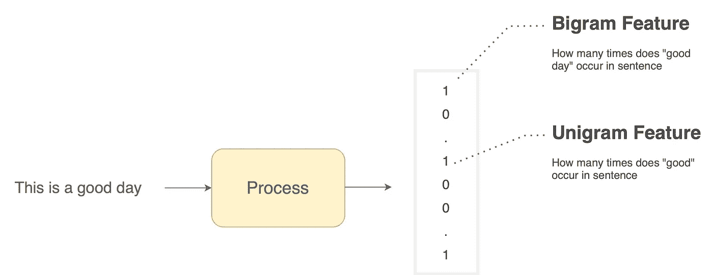
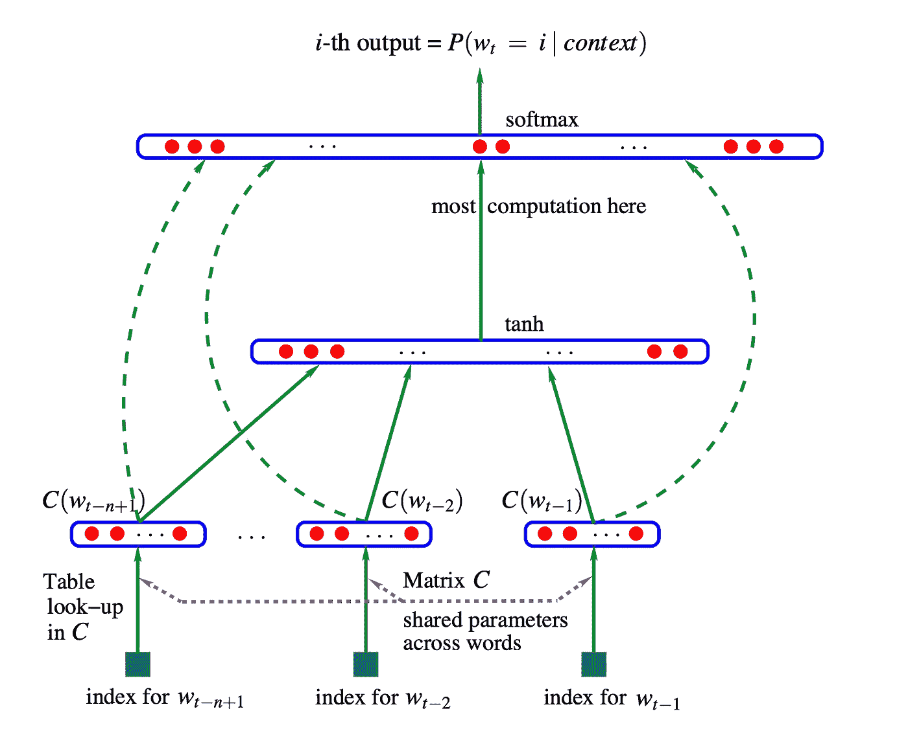
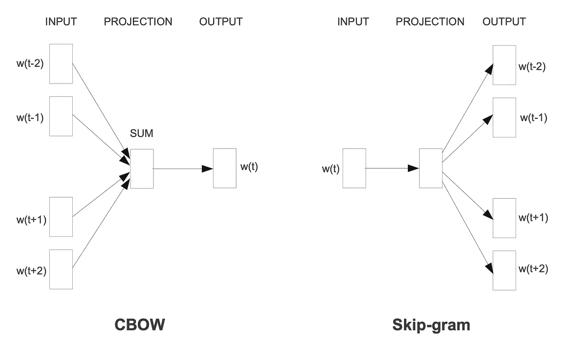
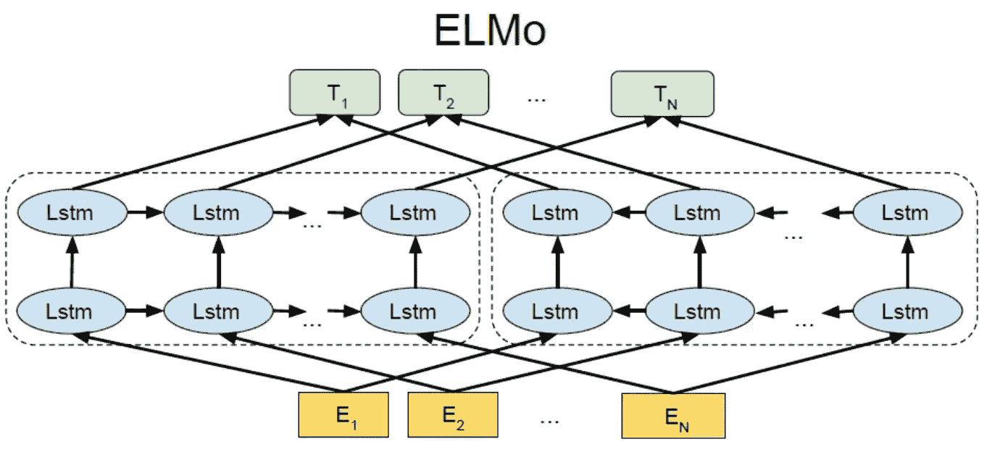
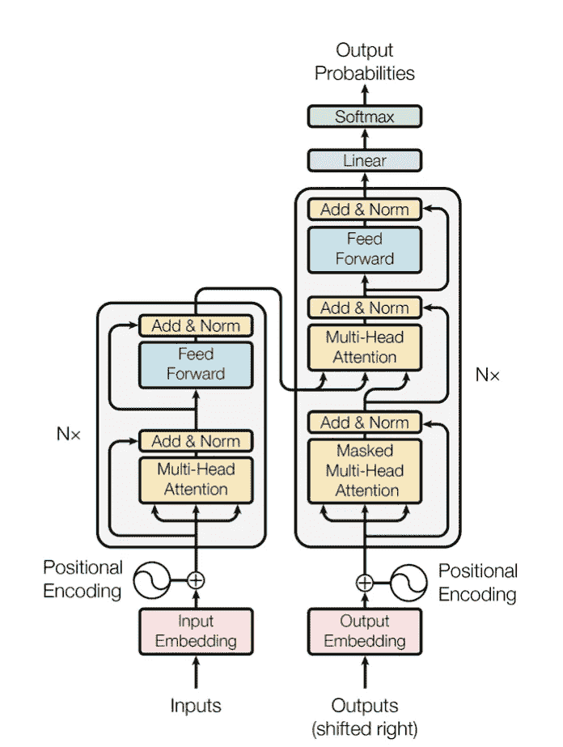
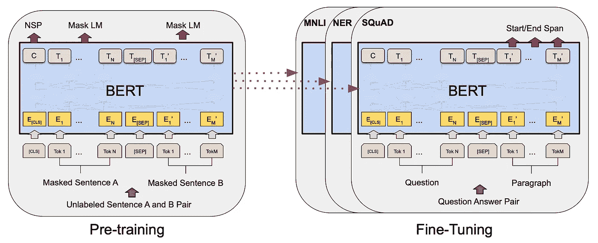

# 词嵌入的解释

> 原文：[`towardsdatascience.com/word-embeddings-explained-c07c5ea44d64`](https://towardsdatascience.com/word-embeddings-explained-c07c5ea44d64)

 [Ajay Halthor](https://medium.com/@dataemporium?source=post_page-----c07c5ea44d64--------------------------------)

·发布于 [Towards Data Science](https://towardsdatascience.com/?source=post_page-----c07c5ea44d64--------------------------------) ·7 min read·2023 年 5 月 30 日

--

在自然语言处理领域，我们处理的是单词。然而，计算机无法直接理解单词，因此需要将其转换为数值表示。这些数值表示，称为向量或嵌入，由可以被人类解释或无法解释的数字组成。在这篇博客中，我们将深入探讨这些词汇表示的学习进展。

# 1 N-grams

图 1: 句子的 N-gram 向量表示（作者提供的图片）

让我们以 n-grams 为例，更好地理解这一过程。假设我们有一句话，希望计算机能够理解。为此，我们将句子转换为数值表示。这种表示包括各种词汇组合，如 unigrams（单词）、bigrams（词对）、trigrams（三词组）以及更高阶的 n-grams。结果是一个可以表示任何英语句子的向量。

在图 1 中，考虑对句子“This is a good day”进行编码。假设向量的第一个位置表示在原句中出现的 bigram “good day”的次数。由于它出现了一次，因此这个位置的数值表示为“1”。同样，我们可以用这个向量的不同位置来表示每一个 unigram、bigram 和 trigram。

这个模型的一个主要优点是**可解释性**。这个向量中的每个数字都有一定的含义，人类可以关联。当进行预测时，不难看出什么影响了结果。然而，这种数值表示有一个主要的缺点：**维度灾难**。这个 n-gram 向量很大。如果用于统计建模，需要从中挑选特定的部分。原因在于维度灾难。随着向量维度的增加，句子表示之间的距离也增加。这有利于表示更多信息，但如果过于稀疏，统计模型难以判断哪些句子在物理上（从而在意义上）更接近。此外，挑选是一个手动过程，开发人员可能会遗漏一些有用的 n-gram 表示。

# 2 神经网络

图 2：神经概率语言模型（Bengio 等，2003）

为了解决这一不足，[神经概率语言模型](https://www.jmlr.org/papers/volume3/bengio03a/bengio03a.pdf)在 2003 年被引入。语言模型预测序列中下一个出现的词。例如，一个训练好的语言模型会将“我想要一个法式”这个词序列，生成下一个词“吐司”。如图 2 所示的神经语言模型在很大程度上以相似的方式工作，即使用前 N 个词的上下文来预测下一个词。

对于每个词，我们学习一个密集表示，这是一个包含固定数量数字的向量来表示每个词。与 n-gram 不同，向量中的这些数字不易被人类直接解释。然而，它们捕捉了人类可能未察觉的各种细微差别和模式。

激动人心的部分是，由于这是一个神经网络，**我们可以端到端地训练它**以掌握语言建模的概念，并同时学习所有词向量表示。然而，训练这样的模型可能**计算开销很大**。

例如，如果我们用一个包含 100 个数字的向量来表示每个词，而我们需要将这些向量连接起来，这将涉及到成千上万的数字。考虑到词汇量可能达到数万个或更多，我们可能会面临数百万甚至数千万个参数需要计算。这在处理大型词汇表、大量示例或每个词表示的高维度时成为一个挑战。

理想情况下，较大的维度将使我们能够捕捉到语言的更复杂特性，考虑到语言本质上的复杂性。

在接下来的十年里，推出了各种架构来提升词嵌入的质量。一个这样的架构在论文中描述了，[使用新颖的神经网络架构进行快速语义提取](https://aclanthology.org/P07-1071.pdf)。它引入了为每个词汇加入位置性信息的概念，以改进嵌入。然而，这种方法也存在训练时计算开销大的缺点，仅用于学习词嵌入。

# 3 Word2Vec

图 3：向量空间中词表示的高效估计（Milikov 等，2013）

在 2013 年，生成词嵌入的一个重大突破是 Word2Vec 的引入。[这篇论文](https://arxiv.org/pdf/1301.3781.pdf)提出了两种模型，即连续词袋模型（CBOW）和 Skip-gram 模型，旨在**保持简单性**同时理解词嵌入。在 CBOW 模型中，当前词是基于前两个和后两个词进行预测的。投影层表示该特定词的词嵌入。而 Skip-gram 模型则执行类似的任务，但方向相反，给定一个词预测其上下文周围的词。同样，投影层表示当前词的向量表示。在训练这些网络之后，会得到一个词及其对应嵌入的表格。这种架构更简单，参数更少，标志着预训练词嵌入时代和 word2vec 概念的到来。

然而，这种方法也有一些局限性。首先，它生成**每次出现的词的相同向量表示**，无论其上下文如何。例如，“drag queen”中的“queen”和“king and queen”中的“queen”将具有相同的词嵌入，尽管它们含义不同。此外，这些词嵌入的生成**考虑了有限的上下文窗口**，在训练阶段仅查看前两个词和后两个词。这一局限性影响了模型的上下文意识。

# 4 ELMo

图 4：深度上下文化的词表示（Peters 等，2018）

为了提高生成嵌入的质量，[ELMo](https://arxiv.org/abs/1802.05365)（来自语言模型的嵌入）在 2018 年被引入。ELMo 是一种双向 LSTM（长短期记忆）模型，在同一个训练过程中处理语言建模和创建密集的词嵌入。该模型通过利用 LSTM 单元，有效地**捕捉上下文信息**，尤其是在较长的句子中。然而，与 LSTM 模型类似，ELMo 也存在一些缺陷。训练这些模型可能**较慢**，并且它们采用了一种称为 BPTT（时间反向传播）的截断版本。此外，它们**并非真正双向**，因为它们分别学习前向和后向上下文，然后将其连接，这可能导致一些上下文信息的丢失。

# 5 Transformers

图 5：Attention is all you need（Vaswani 等，2017）

在 ELMo 引入之前不久，[Attention Is All You Need 论文](https://arxiv.org/pdf/1706.03762.pdf) 提出了 Transformer 神经网络架构。Transformers 包括一个编码器和一个解码器，这两个部分都结合了位置编码以生成具有上下文意识的词向量。例如，当输入句子 “I am Ajay” 时，编码器生成三个密集的词嵌入表示，保留词义。Transformers 还解决了 LSTM 模型的缺点。由于数据可以并行处理，利用 GPU，训练速度更快。此外，Transformers 是深度双向的，因为它们采用了一个注意力机制，使得词语可以同时关注前后词语，从而实现有效的上下文理解。

Transformers 的主要问题是对于不同的语言任务，**我们需要大量的数据**。然而，如果人类对语言有一定的内在理解，那么他们不需要看到大量的例子就能理解如何回答问题或进行翻译。

# 6 BERT 和 GPT

图 6：BERT：深度双向 Transformers 的语言理解预训练（Devlin 等，2019）

为了克服 Transformer 模型在语言任务中的局限性，引入了两个强大的模型，[BERT](https://www.youtube.com/watch?v=xI0HHN5XKDo)（双向编码器表示从 Transformers）和 [GPT](https://www.youtube.com/watch?v=3IweGfgytgY)（生成预训练 Transformer）。这些模型利用了迁移学习，涉及两个训练阶段。

在第一阶段，称为预训练阶段，模型从大量数据中学习关于一般语言理解、上下文和语法的知识。在这个阶段，它们获得了坚实的知识基础。在第二阶段，称为微调阶段，模型通过提供特定任务的数据进行训练。这一微调过程使模型能够专注于执行期望的任务**而无需大量的任务特定数据**。

BERT 在两个任务上进行了预训练：掩蔽语言建模和下一个句子预测。通过这种预训练，BERT 对每个单词的上下文和含义有了深刻的理解，从而改进了词嵌入。它可以在特定任务上进行微调，如问答或翻译，使用相对较少的任务特定数据。

同样，GPT 在语言建模上进行了预训练，这涉及预测句子中的下一个单词。这种预训练帮助 GPT 发展了对语言的全面理解。之后，它可以在特定任务上进行微调，以便像 BERT 一样利用其语言理解能力。

BERT 和 GPT 都具备 Transformer 架构和学习各种语言任务的能力，相比于早期方法，提供了更优越的词嵌入。这就是为什么 GPT 尤其作为许多现代语言模型的基础，例如 [ChatGPT](https://www.youtube.com/watch?v=NpmnWgQgcsA&list=PLTl9hO2Oobd9coYT6XsTraTBo4pL1j4HJ)，使得先进的自然语言处理和生成成为可能。

# 7 结论

在这篇博客中，我们探讨了计算机如何通过被称为“嵌入”的表示来理解语言。我们见证了近年来的进展，特别是随着变换器的兴起，成为现代语言模型的基础。如果你对从头开始构建自己的变换器模型感兴趣，查看 [这份视频播放列表](https://www.youtube.com/watch?v=QCJQG4DuHT0&list=PLTl9hO2Oobd97qfWC40gOSU8C0iu0m2l4)，其中深入探讨了相关的代码和理论。祝学习愉快！
