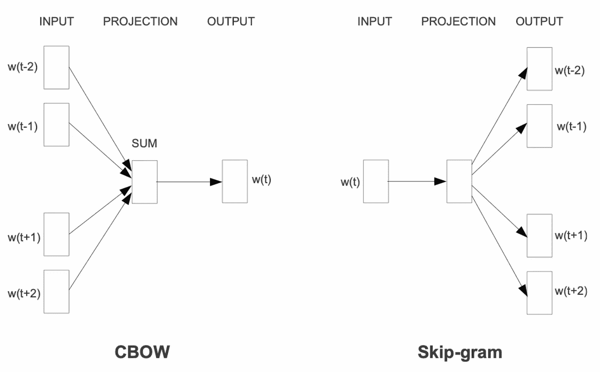

# Word2Vec、GloVe 和 FastText 解析

> 原文：[`towardsdatascience.com/word2vec-glove-and-fasttext-explained-215a5cd4c06f?source=collection_archive---------3-----------------------#2023-06-20`](https://towardsdatascience.com/word2vec-glove-and-fasttext-explained-215a5cd4c06f?source=collection_archive---------3-----------------------#2023-06-20)

## 计算机如何理解词汇

 [Ajay Halthor](https://medium.com/@dataemporium?source=post_page-----215a5cd4c06f--------------------------------)

·

[关注](https://medium.com/m/signin?actionUrl=https%3A%2F%2Fmedium.com%2F_%2Fsubscribe%2Fuser%2Fb0a3e7e495ca&operation=register&redirect=https%3A%2F%2Ftowardsdatascience.com%2Fword2vec-glove-and-fasttext-explained-215a5cd4c06f&user=Ajay+Halthor&userId=b0a3e7e495ca&source=post_page-b0a3e7e495ca----215a5cd4c06f---------------------post_header-----------) 发表在 [Towards Data Science](https://towardsdatascience.com/?source=post_page-----215a5cd4c06f--------------------------------) ·10 分钟阅读·2023 年 6 月 20 日

--

图片由 [Growtika](https://unsplash.com/@growtika?utm_source=medium&utm_medium=referral) 提供，来源于 [Unsplash](https://unsplash.com/?utm_source=medium&utm_medium=referral)

计算机不像我们一样理解词汇。它们更倾向于处理数字。因此，为了帮助计算机理解词汇及其含义，我们使用一种叫做嵌入的方法。这些嵌入以数学向量的形式数值化地表示词汇。

这些嵌入的酷炫之处在于，如果我们正确学习它们，那么具有相似含义的词汇将具有相似的数值。换句话说，它们的数值会更接近。这使得计算机可以基于数值表示理解不同词汇之间的联系和相似性。

一种学习词嵌入的显著方法是 Word2Vec。在本文中，我们将深入探讨 Word2Vec 的复杂性，并探讨其各种架构和变体。

# Word2Vec

图 1：Word2Vec 架构（[来源](https://arxiv.org/abs/1301.3781)）

在早期，句子通过 n-gram 向量表示。这些向量旨在通过考虑单词序列来捕捉句子的本质。然而，它们存在一些局限性。n-gram 向量通常很大且稀疏，这使得它们在计算上难以创建。这就产生了…
