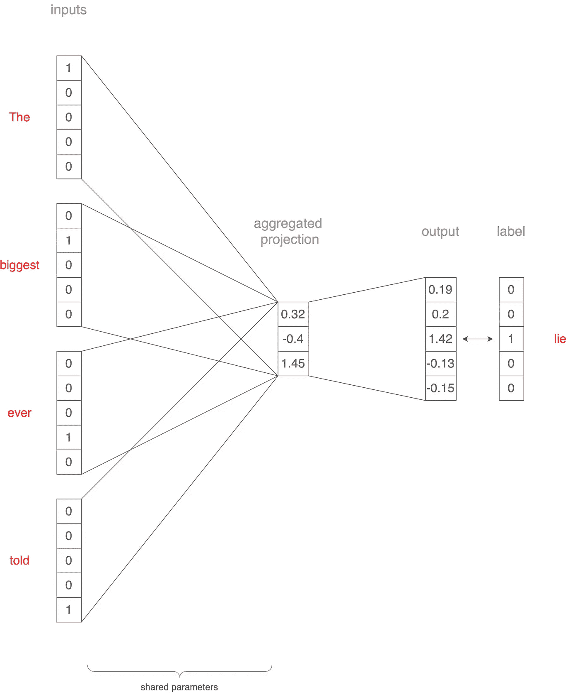

# 解释 Word2Vec、GloVe 和 FastText

> 原文：[`towardsdatascience.com/word2vec-glove-and-fasttext-explained-215a5cd4c06f`](https://towardsdatascience.com/word2vec-glove-and-fasttext-explained-215a5cd4c06f)

## 计算机如何理解单词

 [Ajay Halthor](https://medium.com/@dataemporium?source=post_page-----215a5cd4c06f--------------------------------)

·发表于 [Towards Data Science](https://towardsdatascience.com/?source=post_page-----215a5cd4c06f--------------------------------) ·10 min 阅读·2023 年 6 月 20 日

--

[Growtika](https://unsplash.com/@growtika?utm_source=medium&utm_medium=referral) 在 [Unsplash](https://unsplash.com/?utm_source=medium&utm_medium=referral) 上的照片

计算机不像我们那样理解单词。它们更喜欢处理数字。因此，为了帮助计算机理解单词及其含义，我们使用一种叫做嵌入的技术。这些嵌入以数学向量的形式数值化地表示单词。

这些嵌入的酷炫之处在于，如果我们正确学习它们，那么具有相似含义的单词将具有相似的数值。换句话说，它们的数值会更接近。这使得计算机能够基于数值表示把握不同单词之间的联系和相似性。

一种学习单词嵌入的显著方法是 Word2Vec。在这篇文章中，我们将深入探讨 Word2Vec 的复杂性，并探索其各种架构和变体。

# Word2Vec

图 1: Word2Vec 架构 ([来源](https://arxiv.org/abs/1301.3781))

在早期，句子通过 n-gram 向量进行表示。这些向量旨在通过考虑单词序列来捕捉句子的本质。然而，它们存在一些局限性。n-gram 向量通常非常大且稀疏，这使得它们在计算上很具挑战性。这造成了一个被称为[维度诅咒](https://youtu.be/L9eNxU-9jBQ)的问题。本质上，这意味着在高维空间中，表示单词的向量距离过远，从而很难确定哪些单词真正相似。

然后，在 2003 年，随着[神经概率语言模型](https://www.jmlr.org/papers/volume3/bengio03a/bengio03a.pdf)的引入，出现了一个显著的突破。这个模型通过使用所谓的连续密集向量完全改变了我们对词语的表示方式。与离散且稀疏的 n-gram 向量不同，这些密集向量提供了连续的表示。即使这些向量发生小的变化，也会产生有意义的表示，尽管它们可能不直接对应特定的英语单词。

在这一激动人心的进展基础上，[Word2Vec](https://arxiv.org/abs/1301.3781)框架于 2013 年出现。它提供了一种将词义编码为连续密集向量的强大方法。在 Word2Vec 中，引入了两种主要架构：连续词袋模型（CBoW）和 Skip-gram。

这些架构为生成高质量的词嵌入的高效训练模型打开了大门。通过利用大量的文本数据，Word2Vec 使单词在数字世界中栩栩如生。这使计算机能够理解单词之间的上下文含义和关系，为自然语言处理提供了一种变革性的方法。

# 连续词袋模型（CBoW）

图 2：CBoW 训练示意图（作者提供的图片）

在本节及下一节中，让我们了解如何使用一个包含五个单词的小词汇表训练 CBoW 和 skip-gram 模型：biggest、ever、lie、told 和 the。我们有一个示例句子“The biggest lie ever told”。我们将如何将其传递给 CBoW 架构？这在*图 2*中显示，但我们也会描述这个过程。

假设我们将上下文窗口大小设置为 2。我们取“the”、“biggest”、“ever”和“told”这几个词，并将它们转换为 5x1 的独热向量。

然后将这些向量作为输入传递到模型，并映射到一个投影层。假设这个投影层的大小为 3。每个词的向量乘以一个 5x3 的权重矩阵（在输入间共享），得到四个 3x1 的向量。取这些向量的平均值，得到一个 3x1 的向量。然后使用另一个 3x5 的权重矩阵将这个向量投影回 5x1 的向量。

这个最终向量代表了中间单词“lie”。通过计算真实的独热向量和实际的输出向量，我们得到一个损失，用于通过反向传播更新网络的权重。

我们通过滑动上下文窗口并将其应用于成千上万的句子来重复这个过程。训练完成后，模型的第一层，尺寸为 5x3（词汇表大小 x 投影大小），包含了学习到的参数。这些参数用作查找表，将每个单词映射到其对应的向量表示。

# Skip-gram

图 3：Skip-gram 训练示意图（作者提供的图片）

在 skip-gram 模型中，我们使用了类似于连续词袋（CBoW）模型的架构。然而，与其根据周围词预测目标词相反，我们将场景反转，如*图 3*所示。现在，词“lie”成为输入，我们的目标是预测其上下文词。名称“skip-gram”反映了这种方法，因为我们预测的上下文词可能会“跳过”几个词。

为了说明这一点，我们来看一些例子：

+   输入词“lie”与输出词“the”配对。

+   输入词“lie”与输出词“biggest”配对。

+   输入词“lie”与输出词“ever”配对。

+   输入词“lie”与输出词“told”配对。

我们对训练数据中的所有词汇重复这一过程。一旦训练完成，第一层的参数，其维度为词汇大小 x 投影大小，将捕捉输入词与其对应向量表示之间的关系。这些学习到的参数使我们能够在 skip-gram 模型中将输入词映射到其相应的向量表示。

# 优点

1.  **以简洁的方式克服维度灾难**：Word2Vec 提供了一个直接而高效的解决方案来应对维度灾难。通过将词表示为密集向量，它减少了与传统方法（如 n-gram 向量）相关的稀疏性和计算复杂度。

1.  **生成向量，使得意义相近的词具有更接近的向量值**：Word2Vec 的嵌入展现了一个有价值的特性，即具有相似意义的词由数值更接近的向量表示。这允许捕捉语义关系并执行诸如词语相似性和类比检测等任务。

1.  **预训练的嵌入用于各种 NLP 应用**：Word2Vec 的预训练嵌入广泛可用，并可以用于各种自然语言处理（NLP）应用。这些嵌入经过大规模语料库的训练，为情感分析、命名实体识别、机器翻译等任务提供了宝贵的资源。

1.  **自监督框架用于数据增强和训练**：Word2Vec 以自监督的方式运行，利用现有数据来学习词表示。这使得收集更多数据和训练模型变得容易，因为它不需要大量标记数据集。该框架可以应用于大量未标记的文本，从而增强训练过程。

# 缺点

1.  **对全局信息的有限保留**：Word2Vec 的嵌入主要关注捕捉局部上下文信息，可能无法保留词之间的全局关系。这一限制可能会影响需要更广泛理解文本的任务，例如文档分类或文档级别的情感分析。

1.  **不太适合形态丰富的语言**：形态丰富的语言特征是复杂的单词形式和词形变化，这可能对 Word2Vec 造成挑战。由于 Word2Vec 将每个单词视为原子单位，它可能难以捕捉此类语言中的丰富形态学和语义细微差别。

1.  **缺乏广泛的上下文意识**：Word2Vec 模型在训练过程中只考虑了目标单词周围的局部上下文窗口。这种有限的上下文意识可能导致在某些语境中对单词意义的理解不完整。它可能难以捕捉某些语言现象中存在的长期依赖关系和复杂的语义关系。

在接下来的部分中，我们将看到一些能够解决这些缺点的词嵌入架构。

# GloVe: 全球向量

Word2Vec 方法在一定程度上成功地捕捉了局部上下文，但没有充分利用语料库中可用的全局上下文。全局上下文指的是使用语料库中的多个句子来收集信息。这就是[GloVe](https://nlp.stanford.edu/pubs/glove.pdf)发挥作用的地方，因为它利用词-词共现来学习词嵌入。

词-词共现矩阵的概念是 GloVe 的关键。它是一个矩阵，捕捉语料库中每个单词在其他每个单词上下文中的出现情况。矩阵中的每个单元格表示一个单词在另一个单词上下文中的出现次数。

图 4：词共现概率比率的示例（[来源](https://nlp.stanford.edu/pubs/glove.pdf)）

与 Word2Vec 直接处理共现概率不同，GloVe 从共现概率的比率开始。在*图 4*的背景下，P(*k* | *ice*)表示单词 k 在“ice”一词上下文中的出现概率，而 P(*k* | *steam*)表示单词 k 在“steam”一词上下文中的出现概率。通过比较比率 P(*k* | *ice*) / P(*k* | *steam*)，我们可以确定单词 k 与冰或蒸汽的关联。如果比率远大于 1，则表明与冰的关联更强。相反，如果接近 0，则表明与蒸汽的关联更强。比率接近 1 则表明与冰或蒸汽没有明确的关联。

例如，当 k = “solid”时，概率比率远大于 1，表明与冰的关联很强。另一方面，当 k = “gas”时，概率比率接近 0，表明与蒸汽的关联更强。至于“water”和“fashion”这两个词，它们与冰或蒸汽都没有明确的关联。

基于概率比率的词语关联正是我们希望实现的目标。而在学习 GloVe 的嵌入时，这一点得到了优化。

# FastText

传统的 word2vec 架构除了缺乏全球信息的利用外，也无法有效处理形态丰富的语言。

那么，语言形态丰富意味着什么呢？在这种语言中，单词的形式可以根据其使用的上下文而变化。我们以一种名为“卡纳达语”的南印度语言为例。

在卡纳达语中，“house”的单词是写作 ಮನೆ (mane)。然而，当我们说“在房子里”时，它变成了 ಮನೆಯಲ್ಲಿ (maneyalli)，而当我们说“从房子里”时，它则变为 ಮನೆಯಿಂದ (maneyinda)。如你所见，只有介词发生变化，但翻译的词具有不同的形式。在英语中，这些都是简单的“house”。因此，传统的 word2vec 架构会将所有这些变体映射到相同的向量。然而，如果我们为形态丰富的卡纳达语创建一个 word2vec 模型，那么这三种情况中的每一种将被分配不同的向量。此外，卡纳达语中的“house”可以有比这三个例子更多的形式。由于我们的语料库可能不包含所有这些变体，传统的 word2vec 训练可能无法捕捉所有不同的词表示。

为了解决这个问题，[FastText](https://arxiv.org/pdf/1607.04606.pdf) 通过在生成词向量时考虑子词信息引入了一个解决方案。FastText 不将每个单词作为一个整体，而是将单词分解为从三元组到六元组的字符 n-grams。这些 n-grams 被映射到向量上，然后这些向量被聚合以代表整个单词。聚合后的向量接着被输入到 skip-gram 架构中。

这种方法能够识别语言中不同单词形式的共同特征。即使我们可能没有在语料库中见过单词的每一种形式，所学到的向量仍能捕捉这些形式之间的共性和相似性。形态丰富的语言，如阿拉伯语、土耳其语、芬兰语以及各种印度语言，可以受益于 FastText 能生成考虑不同形式和变体的词向量。

# 上下文意识

图 5：ELMo 和 BERT ([来源](https://arxiv.org/abs/1810.04805))

尽管有其优点，前述的 word2vec 架构存在一个局限性：它们为给定的单词生成相同的向量表示，而不考虑其上下文。

为了说明这一点，我们考虑以下两个句子：

1.  “那个变装皇后真棒。”

1.  “她有一张王牌和一张皇后，手牌完美。”

在这些句子中，单词“queen”有不同的含义。然而，在 word2vec 架构中，这两种情况下“queen”的向量是相同的。这并不理想，因为我们希望词向量能够根据上下文捕捉和表示不同的含义。

为了解决这一问题，引入了更先进的架构，如[LSTM](https://youtu.be/QciIcRxJvsM)单元。这些架构被设计为将上下文信息纳入词语表示中。随着时间的推移，基于 Transformer 的模型如[BERT](https://youtu.be/xI0HHN5XKDo)和[GPT](https://youtu.be/3IweGfgytgY)的出现，推动了我们今天看到的大规模语言模型的发展。这些模型在考虑上下文和生成对周围词语和句子敏感的词语表示方面表现出色。

通过考虑上下文，这些先进的架构使得生成更加细致和有意义的词向量成为可能，确保相同的词在不同的具体上下文中可以有不同的向量表示。

# 结论

总之，本文提供了关于 word2vec 架构及其使用连续稠密向量表示词语的能力的见解。后续实现如 GloVe 利用了全局上下文，而 FastText 使得对形态丰富的语言如阿拉伯语、芬兰语和各种印度语言的向量学习变得高效。然而，这些方法的一个共同缺点是，在推理过程中，它们对一个词分配相同的向量，无论其上下文如何，这可能会阻碍对具有多重含义的词的准确表示。

为了解决这一局限性，后续在自然语言处理（NLP）领域的进展引入了 LSTM 单元和 Transformer 架构，这些技术在捕捉特定上下文方面表现出色，并成为现代大型语言模型的基础。这些模型能够理解并生成根据周围上下文变化的词语表示，适应了不同场景中词语的细微含义。

然而，重要的是要承认 word2vec 框架依然具有重要意义，因为它继续推动着自然语言处理领域中的众多应用。尽管词义的上下文变化带来了挑战，其简单性和生成有意义的词嵌入的能力仍然被证明是有价值的。

欲了解更多关于语言模型的信息，[查看这个 YouTube 播放列表](https://www.youtube.com/playlist?list=PLTl9hO2Oobd_bzXUpzKMKA3liq2kj6LfE)。

*快乐学习！*
