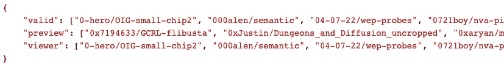
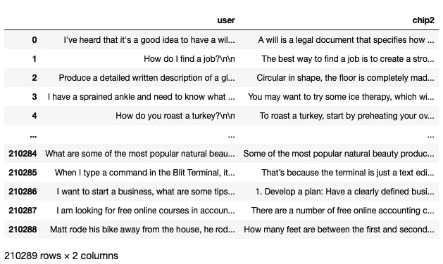
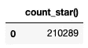
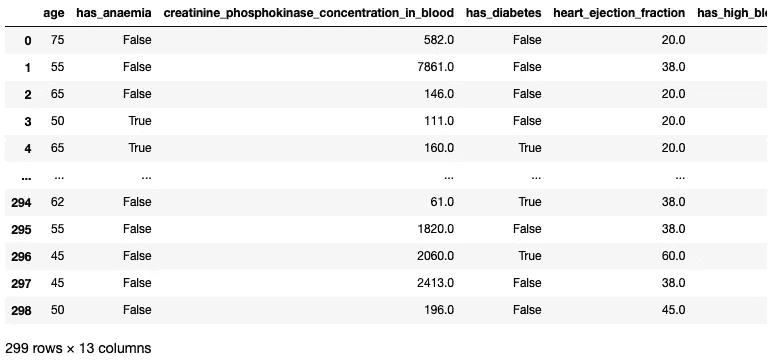
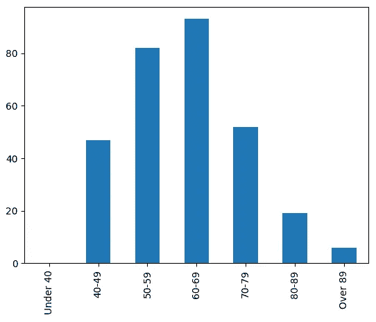
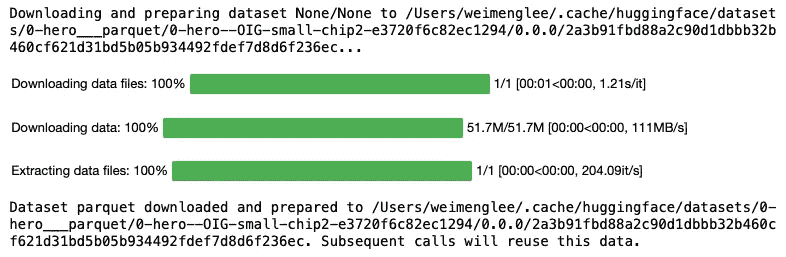
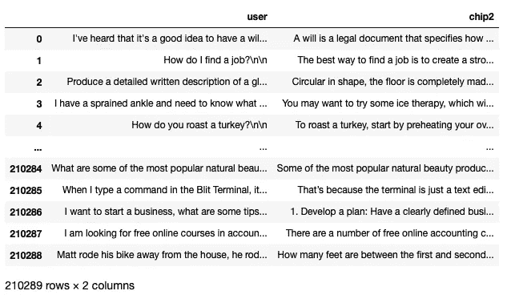
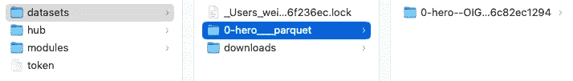

# 使用 Hugging Face 数据集

> 原文：[`towardsdatascience.com/working-with-hugging-face-datasets-bba14dd8da68`](https://towardsdatascience.com/working-with-hugging-face-datasets-bba14dd8da68)

## 了解如何访问 Hugging Face Hub 上的数据集，以及如何使用 DuckDB 和 Datasets 库远程加载它们

[](https://weimenglee.medium.com/?source=post_page-----bba14dd8da68--------------------------------)[](https://towardsdatascience.com/?source=post_page-----bba14dd8da68--------------------------------) [Wei-Meng Lee](https://weimenglee.medium.com/?source=post_page-----bba14dd8da68--------------------------------)

·发表于 [Towards Data Science](https://towardsdatascience.com/?source=post_page-----bba14dd8da68--------------------------------) ·阅读时间 13 分钟·2023 年 6 月 29 日

--


照片由 [Lars Kienle](https://unsplash.com/@larskienle?utm_source=medium&utm_medium=referral) 提供，来源于 [Unsplash](https://unsplash.com/?utm_source=medium&utm_medium=referral)

作为一个 AI 平台，Hugging Face 构建、训练并部署最先进的开源机器学习模型。除了托管所有这些训练好的模型外，Hugging Face 还托管数据集（[`huggingface.co/datasets`](https://huggingface.co/datasets)），你可以将它们用于自己的项目。

在这篇文章中，我将展示如何访问 Hugging Face 中的数据集，并如何通过编程将它们下载到本地计算机上。具体来说，我将展示如何：

+   使用 DuckDB 对 **httpfs** 的支持远程加载数据集

+   使用 Hugging Face 的 **Datasets** 库流式传输数据集

# Hugging Face 数据集服务器

**Hugging Face 数据集服务器**是一个轻量级的 Web API，用于可视化存储在 Hugging Face Hub 上的各种数据集。你可以使用提供的 REST API 查询存储在 Hugging Face Hub 上的数据集。接下来的部分提供了关于如何使用 API 的简短教程，访问地址为 `[`datasets-server.huggingface.co/`](https://datasets-server.huggingface.co/)`。

## 获取 Hub 上托管的数据集列表

要获取可以从 Hugging Face 检索的数据集列表，请使用以下语句和`valid`端点：

```py
$ curl -X GET "https://datasets-server.huggingface.co/valid"
```

你将看到如下的 JSON 结果：



可以正常工作的数据集列在结果中`valid`键的值中。上面的有效数据集示例是`0-hero/OIG-small-chip2`。

## 验证数据集

要验证数据集，请使用以下语句，结合`is-valid`端点和`dataset`参数：

```py
$ curl -X GET "https://datasets-server.huggingface.co/is-valid?dataset=0-hero/OIG-small-chip2"
```

如果数据集有效，你将看到以下结果：

```py
{"valid":true}
```

## 获取数据集的配置和分割列表

一个数据集通常有*splits*（训练集、验证集和测试集）。它们也可能有配置——在更大数据集中的子数据集。

> 配置对于多语言语音数据集是常见的。有关分割的更多细节，请访问：[`huggingface.co/docs/datasets-server/splits`](https://huggingface.co/docs/datasets-server/splits)。

要获取数据集的分割，请使用以下语句，结合`splits`端点和`dataset`参数：

```py
$ curl -X GET "https://datasets-server.huggingface.co/splits?dataset=0-hero/OIG-small-chip2"
```

以下结果将被返回：

```py
{
  "splits": [
    {
      "dataset":"0-hero/OIG-small-chip2",
      "config":"0-hero--OIG-small-chip2",
      "split":"train"
    }
  ],
  "pending":[],
  "failed":[]
}
```

对于该数据集，只有一个`train`分割。

这是一个数据集（“**duorc**”）的示例，具有多个分割和配置：

```py
{
  "splits": [
    {
      "dataset": "duorc",
      "config": "SelfRC",
      "split": "train",
      "num_bytes": 239852925,
      "num_examples": 60721
    },
    {
      "dataset": "duorc",
      "config": "SelfRC",
      "split": "validation",
      "num_bytes": 51662575,
      "num_examples": 12961
    },
    {
      "dataset": "duorc",
      "config": "SelfRC",
      "split": "test",
      "num_bytes": 49142766,
      "num_examples": 12559
    },
    {
      "dataset": "duorc",
      "config": "ParaphraseRC",
      "split": "train",
      "num_bytes": 496683105,
      "num_examples": 69524
    },
    {
      "dataset": "duorc",
      "config": "ParaphraseRC",
      "split": "validation",
      "num_bytes": 106510545,
      "num_examples": 15591
    },
    {
      "dataset": "duorc",
      "config": "ParaphraseRC",
      "split": "test",
      "num_bytes": 115215816,
      "num_examples": 15857
    }
  ]
}
```

## 获取前 100 行

通常，你可能希望检索数据集的子集进行检查，而不是下载所有数据。以下语句使用`first-rows`端点，结合`dataset`、`config`和`split`参数，从指定数据集中提取前 100 行：

```py
$ curl -X GET "https://datasets-server.huggingface.co/first-rows?dataset=0-hero/OIG-small-chip2&config=0-hero--OIG-small-chip2&split=train"
```

JSON 结果将返回指定数据集的前 100 行：

```py
{
 "dataset": "0-hero/OIG-small-chip2",
 "config": "0-hero--OIG-small-chip2",
 "split": "train",
 "features": [{
  "feature_idx": 0,
  "name": "user",
  "type": {
   "dtype": "string",
   "_type": "Value"
  }
 }, {
  "feature_idx": 1,
  "name": "chip2",
  "type": {
   "dtype": "string",
   "_type": "Value"
  }
 }],
 "rows": [{
  "row_idx": 0,
  "row": {
   "user": "I've heard that it's a good idea to have a will. What is a will?\n\n",
   "chip2": "A will is a legal document that specifies how your property should be distributed after you die. It can also specify who should care for any children or other dependents you may have. It's important to make sure that your will is valid and up-to-date, since the laws governing wills vary from state to state."
  },
  "truncated_cells": []
 }, {
  "row_idx": 1,
  "row": {
   "user": "How do I find a job?\n\n",
   "chip2": "The best way to find a job is to create a strong resume and cover letter that highlights your skills, experience, and qualifications. You can also search online for job openings in your area of expertise or contact local employers directly to inquire about available positions. Networking with people in the same field or industry can also be helpful in finding employment opportunities."
  },
  "truncated_cells": []
 }, {
  "row_idx": 2,
  "row": {
   "user": "Produce a detailed written description of a gloomy scene inside of a mansion with a domed ceiling, pillars, and a door.\n\n",
   "chip2": "Circular in shape, the floor is completely made from square-cut sections of black marble. Large, blackened marble pillars line the walls, ending with a domed glass ceiling high overhead. A narrow gap on the far side of the room leads to a sweeping stairwell with a mithglin-plated door beneath it."
  },
  "truncated_cells": []
 }, {

 ...

 }, {
  "row_idx": 98,
  "row": {
   "user": "I need to learn how to budget my money better. What advice can you give me?\n\n",
   "chip2": "One of the best ways to budget your money better is to make a budget and track your spending. Start by writing down all your sources of income and all your expenses. Go over each item closely to determine what you can cut back on. Prioritize the things that need to be paid first, such as rent and utilities, and try to make sure you’re setting aside some money for savings. Additionally, setting spending limits for yourself can help you stay on track. Finally, regularly review your budget to make sure you are staying within your budgeting goals."
  },
  "truncated_cells": []
 }, {
  "row_idx": 99,
  "row": {
   "user": "Produce a detailed written description of a serene scene outside a mountain road with monir trees and a boulder.\n\n",
   "chip2": "A large granite boulder, apparently fallen from the mountain's craggy cliffs in some distant age, lies beside the cobblestoned road. Surrounded by a thick stand of monir trees, the boulder provides a convenient resting place for travellers, and a brief respite from the rigors of the journey."
  },
  "truncated_cells": []
 }]
}
```

## 获取数据集的切片

你还可以获取数据集的切片。以下语句使用`rows`端点，结合`dataset`、`config`、`split`、`offset`和`length`参数，从指定数据集的第三行开始提取三行：

```py
$ curl -X GET "https://datasets-server.huggingface.co/rows?dataset=0-hero/OIG-small-chip2&config=0-hero--OIG-small-chip2&split=train&offset=2&length=3"
```

结果将如下所示：

```py
{
 "features": [{
  "feature_idx": 0,
  "name": "user",
  "type": {
   "dtype": "string",
   "_type": "Value"
  }
 }, {
  "feature_idx": 1,
  "name": "chip2",
  "type": {
   "dtype": "string",
   "_type": "Value"
  }
 }],
 "rows": [{
  "row_idx": 2,
  "row": {
   "user": "Produce a detailed written description of a gloomy scene inside of a mansion with a domed ceiling, pillars, and a door.\n\n",
   "chip2": "Circular in shape, the floor is completely made from square-cut sections of black marble. Large, blackened marble pillars line the walls, ending with a domed glass ceiling high overhead. A narrow gap on the far side of the room leads to a sweeping stairwell with a mithglin-plated door beneath it."
  },
  "truncated_cells": []
 }, {
  "row_idx": 3,
  "row": {
   "user": "I have a sprained ankle and need to know what I can do to help it heal faster.\n\n",
   "chip2": "You may want to try some ice therapy, which will help reduce swelling and inflammation. Additionally, you could use an elastic bandage or compression wrap to provide additional support for your ankle. It's also important to stay off of it as much as possible, so that it can heal properly."
  },
  "truncated_cells": []
 }, {
  "row_idx": 4,
  "row": {
   "user": "How do you roast a turkey?\n\n",
   "chip2": "To roast a turkey, start by preheating your oven to 350 degrees F. Place the turkey in a roasting pan, and rub it with butter or olive oil. Sprinkle with salt and pepper, and any other herbs or seasonings you like. Place the turkey in the oven and cook for approximately 20 minutes per pound, or until the internal temperature registers 165 degrees. Once the turkey is cooked, remove it from the oven and let it sit for 10-15 minutes before carving."
  },
  "truncated_cells": []
 }]
}
```

## 获取数据集的 Parquet 文件

虽然 Hugging Face Hub 上的数据集可以以多种格式（CSV、JSONL 等）发布，但**Datasets server**会自动将所有公共数据集转换为*Parquet*格式。Parquet 格式提供了显著的性能提升，特别是对于大型数据集。稍后的章节将对此进行演示。

> Apache Parquet 是一种文件格式，旨在支持复杂数据的快速处理。有关 Parquet 的更多信息，请阅读我之前的文章：

[](/still-saving-your-data-in-csv-try-these-other-options-9abe8b83db3a?source=post_page-----bba14dd8da68--------------------------------) ## 仍在以 CSV 格式保存数据？试试这些其他选项

### 了解如何以不同格式（CSV、压缩、Pickle 和 Parquet）保存数据，以节省存储空间并减少……

towardsdatascience.com

要以 Parquet 格式加载数据集，请使用以下语句，结合`parquet`端点和`dataset`参数：

```py
$ curl -X GET "https://datasets-server.huggingface.co/parquet?dataset=0-hero/OIG-small-chip2" 
```

上述语句返回以下 JSON 结果：

```py
{
 "parquet_files": [{
  "dataset": "0-hero/OIG-small-chip2",
  "config": "0-hero--OIG-small-chip2",
  "split": "train",
  "url": "https://huggingface.co/datasets/0-hero/OIG-small-chip2/resolve/refs%2Fconvert%2Fparquet/0-hero--OIG-small-chip2/parquet-train.parquet",
  "filename": "parquet-train.parquet",
  "size": 51736759
 }],
 "pending": [],
 "failed": []
}
```

特别是，`url` 键的值指定了你可以下载 Parquet 格式数据集的位置，在这个例子中是 `[`huggingface.co/datasets/0-hero/OIG-small-chip2/resolve/refs%2Fconvert%2Fparquet/0-hero--OIG-small-chip2/parquet-train.parquet`](https://huggingface.co/datasets/0-hero/OIG-small-chip2/resolve/refs%2Fconvert%2Fparquet/0-hero--OIG-small-chip2/parquet-train.parquet)`。

# 程序化下载数据集

现在你已经了解了如何使用 **Datasets server REST API**，让我们看看如何程序化地下载数据集。

在 Python 中，最简单的方法是使用 `requests` 库：

```py
import requests

r = requests.get("https://datasets-server.huggingface.co/parquet?dataset=0-hero/OIG-small-chip2")
j = r.json()

print(j)
```

`json()` 函数的结果是一个 Python 字典：

```py
{
  'parquet_files': [
    {
      'dataset': '0-hero/OIG-small-chip2',
      'config': '0-hero--OIG-small-chip2', 
      'split': 'train', 
      'url': 'https://huggingface.co/datasets/0-hero/OIG-small-chip2/resolve/refs%2Fconvert%2Fparquet/0-hero--OIG-small-chip2/parquet-train.parquet', 
      'filename': 'parquet-train.parquet', 
      'size': 51736759
    }
  ], 
  'pending': [], 
  'failed': []
}
```

利用这个字典结果，你可以使用列表推导式来查找 Parquet 格式的数据集的 URL：

```py
urls = [f['url'] for f in j['parquet_files'] if f['split'] == 'train']
urls
```

`urls` 变量是一个包含训练集下的数据集 URL 列表的列表：

```py
['https://huggingface.co/datasets/0-hero/OIG-small-chip2/resolve/refs%2Fconvert%2Fparquet/0-hero--OIG-small-chip2/parquet-train.parquet']
```

## 使用 DuckDB 下载 Parquet 文件

如果你使用 DuckDB，你实际上可以使用 DuckDB 远程加载数据集。

> 如果你对 DuckDB 不太熟悉，你可以从这篇文章中了解基础知识：

[](https://levelup.gitconnected.com/using-duckdb-for-data-analytics-bab3e3ff032c?source=post_page-----bba14dd8da68--------------------------------) [## 使用 DuckDB 进行数据分析

### 了解如何使用 SQL 进行数据分析

levelup.gitconnected.com](https://levelup.gitconnected.com/using-duckdb-for-data-analytics-bab3e3ff032c?source=post_page-----bba14dd8da68--------------------------------)

首先，确保你已安装 DuckDB（如果尚未安装）：

```py
!pip install duckdb 
```

然后，创建一个 DuckDB 实例并安装 **httpfs**：

```py
import duckdb

con = duckdb.connect()
con.execute("INSTALL httpfs;")
con.execute("LOAD httpfs;")
```

> **httpfs** 扩展是一个可加载的扩展，实现了一个文件系统，允许读取远程/写入远程文件。

一旦 **httpfs** 安装并加载完成，你可以通过使用 SQL 查询从 Hugging Face Hub 加载 Parquet 数据集：

```py
con.sql(f'''
    SELECT * from '{urls[0]}'
''').df()
```

上述 `df()` 函数将查询结果转换为 Pandas DataFrame：



图片由作者提供

Parquet 的一个很棒的特性是 Parquet 以列式格式存储文件。因此，如果你的查询仅请求单一列，只有该请求的列会被下载到你的计算机上：

```py
con.sql(f'''
    SELECT "user" from '{urls[0]}'
''').df()
```

在上述查询中，只有“`user`”列被下载：


图片由作者提供

> Parquet 特性对于大型数据集特别有用——想象一下，通过只下载你需要的列，你可以节省多少时间和空间。

在某些情况下，你甚至不需要下载数据。考虑以下查询：

```py
con.sql(f'''
    SELECT count(*) from '{urls[0]}'
''').df()
```



图片由作者提供

不需要下载任何数据，因为这个请求可以通过读取数据集的元数据来满足。

这是另一个使用 DuckDB 下载另一个数据集（**“mstz/heart_failure**”）的示例：

```py
import requests

r = requests.get("https://datasets-server.huggingface.co/parquet?dataset=mstz/heart_failure")
j = r.json()
urls = [f['url'] for f in j['parquet_files'] if f['split'] == 'train']

con.sql(f'''
    SELECT "user" from '{urls[0]}'
''').df()
```

这个数据集有 299 行和 13 列：



图片由作者提供

我们可以对**age**列进行一些聚合操作：

```py
con.sql(f"""
    SELECT 
        SUM(IF(age<40,1,0)) AS 'Under 40',
        SUM(IF(age BETWEEN 40 and 49,1,0)) AS '40-49',
        SUM(IF(age BETWEEN 50 and 59,1,0)) AS '50-59',
        SUM(IF(age BETWEEN 60 and 69,1,0)) AS '60-69',
        SUM(IF(age BETWEEN 70 and 79,1,0)) AS '70-79',      
        SUM(IF(age BETWEEN 80 and 89,1,0)) AS '80-89',      
        SUM(IF(age>89,1,0)) AS 'Over 89',
    FROM '{urls[0]}'
"""
).df()
```

这是结果：


图片来源于作者

使用结果，我们还可以绘制柱状图：

```py
con.sql(f"""
    SELECT 
        SUM(IF(age<40,1,0)) AS 'Under 40',
        SUM(IF(age BETWEEN 40 and 49,1,0)) AS '40-49',
        SUM(IF(age BETWEEN 50 and 59,1,0)) AS '50-59',
        SUM(IF(age BETWEEN 60 and 69,1,0)) AS '60-69',
        SUM(IF(age BETWEEN 70 and 79,1,0)) AS '70-79',      
        SUM(IF(age BETWEEN 80 and 89,1,0)) AS '80-89',      
        SUM(IF(age>89,1,0)) AS 'Over 89',
    FROM '{urls[0]}'
"""
).df().T.plot.bar(legend=False)
```



图片来源于作者

## 使用 Datasets 库

为了使与 Hugging Face 的数据工作变得简单而高效，Hugging Face 有自己的`Datasets`库（[`github.com/huggingface/datasets`](https://github.com/huggingface/datasets)）。

要安装`datasets`库，使用`pip`命令：

```py
!pip install datasets
```

`load_dataset()`函数加载指定的数据集：

```py
from datasets import load_dataset

dataset = load_dataset('0-hero/OIG-small-chip2',
                       split='train')
```

当你第一次加载数据集时，整个数据集（以 Parquet 格式）会下载到你的计算机上：



图片来源于作者

返回的`dataset`的数据类型是`datasets.arrow_dataset.Dataset`。那你可以用它做什么呢？首先，你可以将其转换为 Pandas DataFrame：

```py
dataset.to_pandas()
```



图片来源于作者

你也可以通过使用索引来获取数据集的第一行：

```py
dataset[0]
```

这将返回数据的第一行：

```py
{
  'user': "I've heard that it's a good idea to have a will. What is a will?\n\n",
  'chip2': "A will is a legal document that specifies how your property should be distributed after you die. It can also specify who should care for any children or other dependents you may have. It's important to make sure that your will is valid and up-to-date, since the laws governing wills vary from state to state."
}
```

对这个`datasets.arrow_dataset.Dataset`对象，你还可以做很多其他事情。我将留给你进一步探索。

## 流式传输数据集

同样，在处理大型数据集时，不可能在进行任何操作之前将整个数据集下载到计算机上。在前面的部分中，调用`load_dataset()`函数会将整个数据集下载到我的计算机上：



图片来源于作者

这个特定的数据集占用了 82.2MB 的磁盘空间。你可以想象更大的数据集所需的时间和磁盘空间。

幸运的是，**Datasets**库支持***流式传输***。数据集流式传输让你在不下载数据集的情况下进行操作——数据在你遍历数据集时被流式传输。要使用流式传输，在`load_dataset()`函数中将`streaming`参数设置为`True`：

```py
from datasets import load_dataset

dataset = load_dataset('0-hero/OIG-small-chip2',
                       split='train', 
                       streaming=True)
```

`dataset`的类型现在是`datasets.iterable_dataset.IterableDataset`，而不是`datasets.arrow_dataset.Dataset`。那么你该如何使用它呢？你可以对它使用`iter()`函数，这将返回一个`iterator`对象：

```py
i = iter(dataset)
```

要获取一行，调用`next()`函数，它将返回迭代器中的下一个项目：

```py
next(i)
```

你现在将看到第一行作为字典：

```py
{
  'user': "I've heard that it's a good idea to have a will. What is a will?\n\n",
  'chip2': "A will is a legal document that specifies how your property should be distributed after you die. It can also specify who should care for any children or other dependents you may have. It's important to make sure that your will is valid and up-to-date, since the laws governing wills vary from state to state."
}
```

对`i`调用`next()`函数将返回下一行：

```py
{
  'user': 'How do I find a job?\n\n',
  'chip2': 'The best way to find a job is to create a strong resume and cover letter that highlights your skills, experience, and qualifications. You can also search online for job openings in your area of expertise or contact local employers directly to inquire about available positions. Networking with people in the same field or industry can also be helpful in finding employment opportunities.'
}
```

依此类推。

## 打乱数据集

你还可以通过对`dataset`变量使用`shuffle()`函数来打乱数据集，如下所示：

```py
shuffled_dataset = dataset.shuffle(seed = 42, 
                                   buffer_size = 500)
```

在上述示例中，假设你的数据集有 10,000 行。`shuffle()`函数将从缓冲区的前 500 行中随机选择示例。

> 默认情况下，缓冲区大小为 1,000。

## 其他任务

你可以使用流式传输执行更多任务，例如：

+   划分数据集

+   交错数据集——通过在每个数据集之间交替行来组合两个数据集

+   修改数据集的列

+   过滤数据集

> 查看更多细节请访问 [`huggingface.co/docs/datasets/stream`](https://huggingface.co/docs/datasets/stream)。

**如果你喜欢阅读我的文章，并且觉得它对你的职业/学习有帮助，请考虑注册成为 Medium 会员。每月 $5，即可无限访问 Medium 上的所有文章（包括我的）。如果你通过以下链接注册，我将获得少量佣金（对你没有额外费用）。你的支持意味着我可以投入更多时间撰写像这样的文章。**

[](https://weimenglee.medium.com/membership?source=post_page-----bba14dd8da68--------------------------------) [## 通过我的推荐链接加入 Medium - 韦梦·李

### 作为 Medium 会员，您的会员费的一部分将用于支持您阅读的作者，并且您可以完全访问每一个故事……

[`weimenglee.medium.com/membership?source=post_page-----bba14dd8da68--------------------------------`](https://weimenglee.medium.com/membership?source=post_page-----bba14dd8da68--------------------------------)

# 摘要

在这篇文章中，我展示了如何访问存储在 Hugging Face Hub 上的数据集。由于数据集以 Parquet 格式存储，因此您可以远程访问这些数据集，而无需下载整个数据集。您可以使用 DuckDB 或 Hugging Face 提供的数据集库来访问这些数据集。
