# 从人工智能的视角看世界历史

> 原文：[`towardsdatascience.com/world-history-through-the-lens-of-ai-340df6241fbf`](https://towardsdatascience.com/world-history-through-the-lens-of-ai-340df6241fbf)

## 语言模型编码了什么历史知识？

[](https://medium.com/@artfish?source=post_page-----340df6241fbf--------------------------------)[](https://towardsdatascience.com/?source=post_page-----340df6241fbf--------------------------------) [Yennie Jun](https://medium.com/@artfish?source=post_page-----340df6241fbf--------------------------------)

·发布于 [Towards Data Science](https://towardsdatascience.com/?source=post_page-----340df6241fbf--------------------------------) ·11 分钟阅读·2023 年 7 月 7 日

--

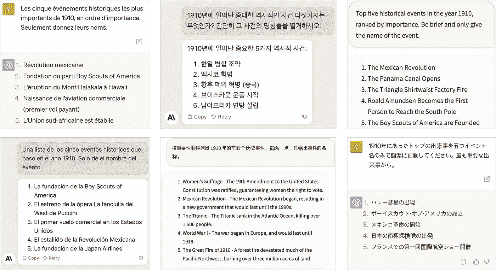

探讨 OpenAI 的 GPT-4、Anthropic 的 Claude 和 TII 的 Falcon 40B Instruct 对 1910 年重大历史事件的分析（以 6 种不同语言提示）。由作者创作。

*本文* [*最初发布在我的博客上*](https://www.artfish.ai/p/world-history-through-ai)

人工智能的进步，尤其是大型语言模型，为 [历史研究](https://ts2.space/en/chatgpt-4-a-valuable-tool-for-historical-research-and-analysis/#:~:text=ChatGPT%2D4%20works%20by%20taking,information%20available%20in%20its%20database.) 和 [教育](https://www.history4humans.com/blogs/history/7-ways-history-teachers-can-use-chat-gpt-in-the-classroom) 开辟了令人兴奋的可能性。然而，重要的是审视这些模型如何解读和回忆过去。它们是否反映了它们对历史理解中的任何固有偏见？

我非常清楚历史的主观性（我在本科时主修历史！）。我们记住的事件和我们对过去形成的叙事受到撰写这些叙事的历史学家和我们所处社会的强烈影响。例如，我的高中世界历史课程将超过 75%的课程内容集中在欧洲历史上，从而偏颇了我对世界事件的理解。

在这篇文章中，我探讨了人类历史如何通过人工智能的视角被记忆和解释。我考察了多个大型语言模型对关键历史事件的解释，以揭示：

+   这些模型是否对事件表现出西方或美国的偏见？

+   模型的历史解释是否根据提示的语言（如韩语或法语提示）有所不同，例如韩语提示可能更强调韩国事件，而法语提示则更强调法国事件？

带着这些问题，让我们深入探讨吧！

# 示例：1910

作为一个例子，我询问了三个不同的大型语言模型（LLMs）1910 年的主要历史事件是什么。（每个 LLM 的更多细节在下一节。）

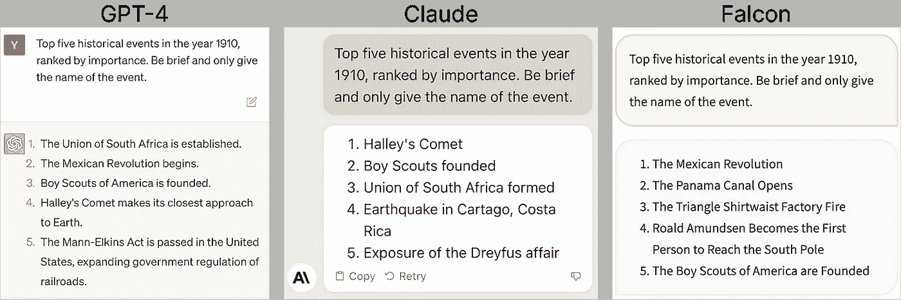

OpenAI 的 GPT-4、Anthropic 的 Claude 和 Technology Innovation Institute 的 Falcon 40B Instruct 在关于 1910 年主要历史事件的英文提示下作出回应。由作者创建。

我提出的问题故意没有客观答案。1910 年的重要性因文化视角的不同而大相径庭。在韩国历史中，它标志着日本占领的开始，这是一个显著影响该国发展轨迹的转折点（见[1910 年日韩条约](https://en.wikipedia.org/wiki/Japan%E2%80%93Korea_Treaty_of_1910)）。

然而，日本对韩国的吞并在任何回应中都没有出现。我想知道如果用不同的语言——比如韩语——来提示这些模型，它们是否会有不同的解读。

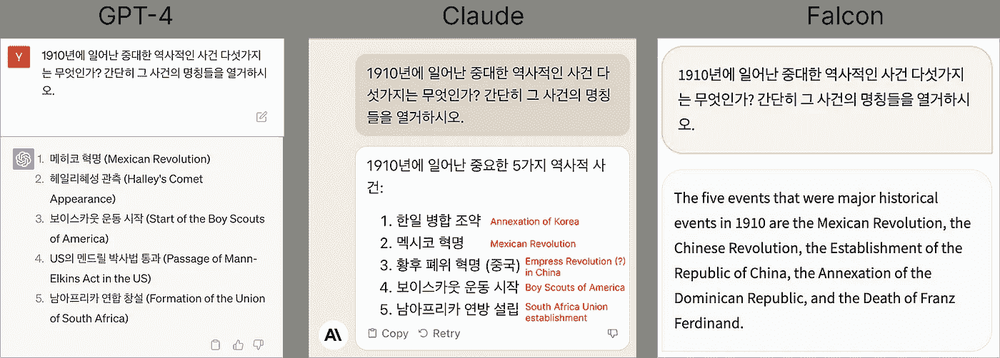

OpenAI 的 GPT-4、Anthropic 的 Claude 和 Technology Innovation Institute 的 Falcon 40B Instruct 在关于 1910 年主要历史事件的韩语提示下作出回应。韩语回答已由我翻译成英文（红色）。由作者创建。

在韩语提示下，Claude 确实将日本对韩国的吞并列为主要事件之一。然而，我发现有趣的是，GPT-4 提到的五个重要事件中有两个是以美国为中心（童子军和曼-埃尔金斯法案），而忽略了提到韩国吞并。更不用说，即使在韩语提示下，Falcon 也用英语回应。

# 实验

实验设置如下：

+   3 个模型：[OpenAI 的 GPT-4](https://openai.com/gpt-4)、[Anthropic 的 Claude](https://www.anthropic.com/index/introducing-claude)和 TII 的[Falcon-40B-Instruct](https://huggingface.co/tiiuae/falcon-40b-instruct#:~:text=Falcon%2D40B%2DInstruct%20is%20a,under%20the%20Apache%202.0%20license.)

+   6 种语言：英语、法语、西班牙语、韩语、日语、中文

+   3 年（610 年，1848 年，1910 年）

+   每次运行 5 个历史事件

+   10 次运行

+   = 2700 个总事件

## 语言和提示

我选择的语言大多是随意的，基于我最熟悉的语言（英语、韩语）以及一些我最亲近的朋友讲的语言，这些朋友可以为我翻译（中文、日语、法语、西班牙语）。翻译可以在文章末尾找到。我请他们为我翻译英文内容：

`“列出 1910 年五大历史事件，按重要性排序。简要说明，仅提供事件名称。”`

## 模型

+   [OpenAI 的 GPT-4](https://openai.com/gpt-4)是 ChatGPT 的更新版本，是最受欢迎的 AI 聊天机器人之一（[每月活跃用户超过 1 亿](https://explodingtopics.com/blog/chatgpt-users)）

+   [Anthropic 的 Claude](https://www.anthropic.com/index/introducing-claude) 是一个与 ChatGPT 竞争的模型，采用称为 [Constitutional AI](https://www.anthropic.com/index/claudes-constitution) 的方法进行训练，以实现无害和有帮助。

+   [技术创新研究所](https://www.tii.ae/)的 [Falcon-40B-Instruct](https://huggingface.co/tiiuae/falcon-40b-instruct#:~:text=Falcon%2D40B%2DInstruct%20is%20a,under%20the%20Apache%202.0%20license.) 是最好的开源语言模型，根据 [HuggingFace 的开放 LLM 排行榜](https://huggingface.co/spaces/HuggingFaceH4/open_llm_leaderboard)。

## 规范化事件

即使一个模型在每次运行时生成相同的事件，它描述同一事件的方式也存在很大差异。

例如，以下所有表述都指代同一事件：

+   “日本对朝鲜的吞并”

+   “日本对朝鲜的吞并”

+   “日本吞并朝鲜”

+   “日韩吞并条约”

我需要一种方法来使用相同的词汇（称为 ***规范化***）来指代单一事件（日本对朝鲜的吞并）。更不用说同一事件可以用六种不同的语言来描述！

我使用了手动规则、Google 翻译和 GPT-4 的组合来协助规范化。起初我希望使用一个 LLM 来规范化另一个 LLM 的事件（例如使用 GPT-4 来规范化 Claude 的事件；Claude 来规范化 Falcon 的事件等），以减少偏见。然而，Claude 和 Falcon 在规范化方面并不擅长，GPT-4 成为了最适合的模型。

我承认使用模型来规范化其自身事件会带来偏见。然而，由于我使用不同的 GPT-4 会话来生成历史事件并规范化这些事件，因此在上下文上没有重叠。未来，可以使用更客观的方法来进行规范化。

# 结果

总体而言，我对不同模型对历史的理解感到惊讶。

+   GPT-4 更可能生成相同的事件，无论用什么语言提示。

+   Anthropic 更可能生成与其提示语言相关的历史事件。

+   Falcon（不幸的是）更可能编造虚假的事件。

+   所有三个模型都表现出对西方或美国事件的偏见，但方式并不是我所预期的。当用非英语语言提示时，模型会生成美国或英国的历史事件（即使在用英语提示时模型不会生成那个事件）。这种情况发生在所有三个模型中。

# 1\. 比较每个模型的语言（1910 年）

每个模型 x 语言组合生成了“前 5 个历史事件” 10 次（= 总共 50 个事件）。我选择了至少有一种语言生成了 5 次或更多次的事件。这是因为模型有时预测了一个一次性事件，而之后再也没有预测过。值为 10 的单元表示模型每次我提示时都预测了那个事件。

在本节中，我展示了 1910 年每个模型预测的主要事件，按语言分类。有关 610 年和 1848 年的类似图表可以在[GitHub 页面](https://github.com/yenniejun/world-history-ai)找到，在那里我分享了所有代码和分析。

**GPT-4 (OpenAI)**

+   墨西哥革命：在所有语言中，墨西哥革命始终是一个重要的世界事件——即使在我没预料到的语言中，如韩语或日语

+   日本对韩国的吞并：在用西班牙语或法语提问时没有提到。用日语提问时，比用韩语提问时更可能提到这一事件（9 次对比 6 次），这让我觉得既奇怪又有趣

+   美国童子军成立：GPT-4 在用日语提问时（7 次）几乎是用英语提问时（4 次）的两倍。这似乎是一些美国信息被编码进了对 1910 年的日语理解中

+   冰川国家公园的建立：更奇怪的是，GPT-4 在用西班牙语和法语提问时预测了这一事件，但在英语中却没有

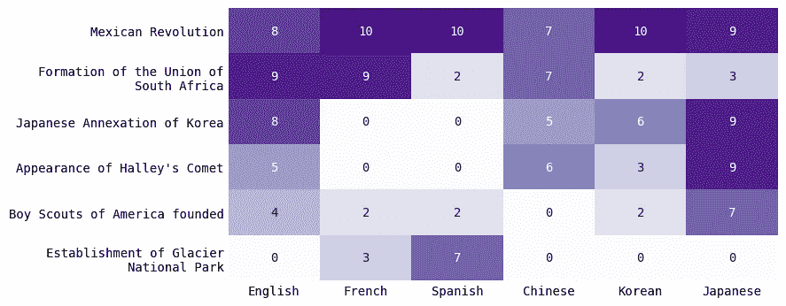

GPT-4 为 1910 年生成的主要事件，按语言对比。由作者创建。

**Claude (Anthropic)**

总体而言：与 GPT-4 不同，没有任何单一事件被*所有语言*认为是“重要历史事件”。

+   墨西哥革命：虽然在法语、西班牙语和（莫名其妙的）韩语中经常生成，但在英语中并不像 GPT-4 中那样重要

+   日本对韩国的吞并：对韩语和日语比其他语言更重要（这两个国家参与了这一事件）

+   爱德华七世的去世：对英语和法语更重要（对其他语言则不然）。爱德华七世是英国国王，显然与法国关系良好。

+   南极洲探险：这一事件实际上是[*英国*南极探险](https://en.wikipedia.org/wiki/Terra_Nova_Expedition)，一位英国人首次到达南极。然而，由于某些未知原因，Claude 仅在用中文或日语提问时生成这一事件（而不是英语）。

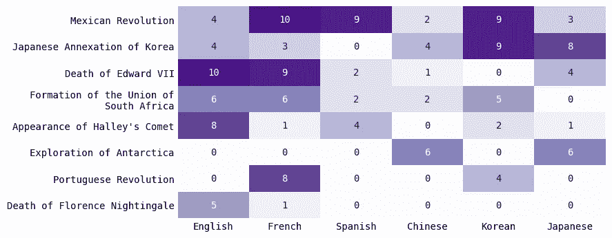

Claude 为 1910 年生成的主要事件，按语言对比。由作者创建。

**Falcon 40B Instruct (Open Source; TII)**

总体而言，Falcon 在一致性和准确性方面不如其他两个模型。图表中显示的事件较少，是因为没有其他事件被 Falcon 预测 5 次或更多次！这意味着 Falcon 的预测有些不稳定。

+   泰坦尼克号沉没：这实际上发生在 1912 年

+   第一次世界大战爆发：这实际上发生在 1914 年

+   Falcon 在预测方面历史上不准确。但至少它对年代是正确的？

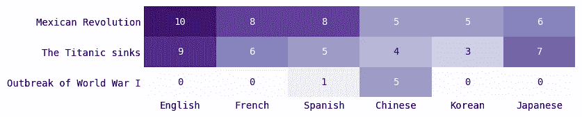

按语言对比的 Falcon 生成的 1910 年主要事件。由作者创建。

# 2\. 对每种语言的模型相关性进行比较（1910 年）

接下来，我量化了一个模型的*整体*预测与其他模型的相似程度。我使用了一种数学方法（[余弦相似度](https://en.wikipedia.org/wiki/Cosine_similarity)）来确定两个预测分布的相似性。值越接近 1 表示预测越相同；值越接近 0 表示两个预测集没有任何共同点。

再次展示 1910 年的例子。其他年份可以在[GitHub 页面](https://github.com/yenniejun/world-history-ai)找到。

在大多数语言中，GPT-4 和 Claude 的相关性值较高——这意味着尽管使用了不同的语言，这两个模型预测了大量相似的事件。

相比之下，Falcon 的相关性较低，这意味着它对历史的理解与 GPT-4 和 Claude 有所不同。

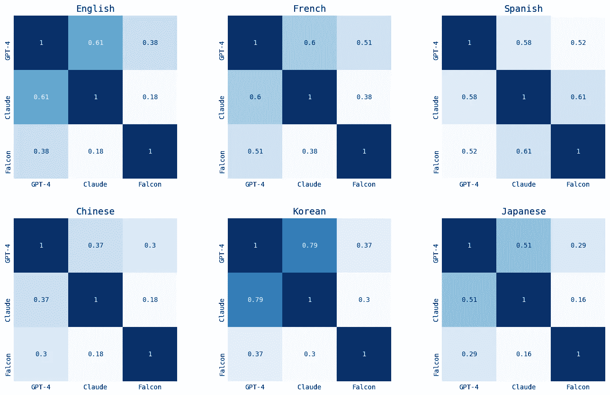

针对 1910 年预测的事件模型相关性。由作者创建。

# 3\. 对每一年的模型进行比较

接下来，我对每一年进行了不同语言模型的比较。我将所有语言预测的事件进行了汇总，并考虑了模型预测的整体事件，不论语言如何。我选取了至少有一个模型预测**10 次或更多**的事件。

与上述部分发现的趋势类似，GPT-4 和 Claude 倾向于预测每年的主要历史事件——610 年的穆罕默德的首次启示和赫拉克勒斯皇帝登基拜占庭王朝；1848 年的欧洲革命；以及 1910 年的墨西哥革命。

有些事件是某个模型相比其他模型预测得不成比例的。例如，在 1848 年，GPT-4 预测了“《共产党宣言》的发表”42 次，而 Claude 预测了 15 次。在 1910 年，Claude 预测了“爱德华七世的去世”26 次，而 GPT-4 仅预测了 1 次。

Falcon 在理解历史事件方面通常最差。Falcon 错过了所有三个年份的主要事件。在 610 年，Falcon 未能预测赫拉克勒斯皇帝的登基。在 1910 年，它未能预测诸如日本吞并朝鲜、南非联盟的形成和葡萄牙革命（这些都是非美洲的全球事件），而是预测了一些美国中心的事件，如[三角工厂火灾](https://en.wikipedia.org/wiki/Triangle_Shirtwaist_Factory_fire)（发生在 1911 年，而非 1910 年）。有趣的是，Falcon 能够预测大部分 1848 年的事件，这与其他两个模型相似——也许是因为 1848 年的事件更具西方中心（例如欧洲革命）？

较久远的事件（例如 610 年）使得历史稍显模糊。[唐朝成立于 618 年，而非 610 年](https://en.wikipedia.org/wiki/Tang_dynasty)，而[隋炀帝下的运河建设](https://en.wikipedia.org/wiki/Grand_Canal_(China)#:~:text=The%20Grand%20Canal%20was%20fully%20completed%20under%20the%20second%20Sui%20emperor%2C%20from%20the%20years%20604%20to%20609%2C%5B14%5D%20first%20by%20linking%20Luoyang%20to%20the%20Yangzhou%20(and%20the%20Yangtze%20valley)%2C) 实际上是在较长的时间段内完成的（604 到 609 年）。

**610**

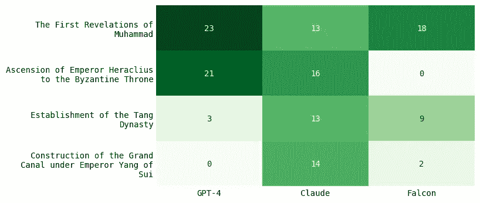

比较各个模型生成的 610 年的主要事件，涵盖所有语言。由作者创建。

**1848**

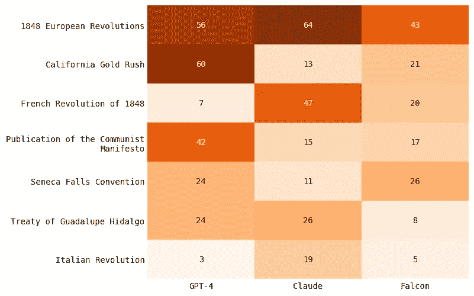

比较各个模型生成的 1848 年的主要事件，涵盖所有语言。由作者创建。

**1910**

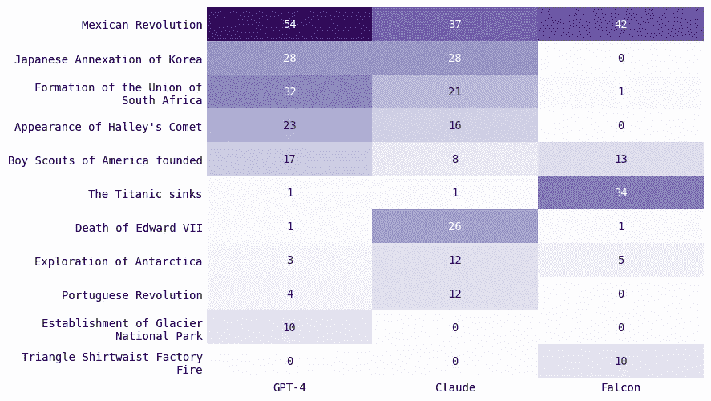

比较各个模型生成的 1910 年的主要事件，涵盖所有语言。由作者创建。

# 讨论

那么，这一切为什么重要呢？

随着教育公司越来越多地将大型语言模型（LLM）纳入其产品——例如，Duolingo 利用 GPT-4 进行语言学习，[Khan Academy 推出 AI 教学助手‘Khanmigo’](https://support.khanacademy.org/hc/en-us/articles/14394953976333--Update-Introducing-Khanmigo-Khan-Academy-s-AI-Tool)，以及[哈佛大学计划将 AI 整合到计算机科学课程中](https://www.thecrimson.com/article/2023/6/21/cs50-artificial-intelligence/)——了解这些模型的潜在偏见变得至关重要。如果学生使用 LLM 学习历史，他们可能会无意中吸收哪些偏见？

在这篇文章中，我展示了一些流行的语言模型，例如 GPT-4，无论提示语言是什么，都会一致地预测“重要事件”。其他模型，如 Claude，显示出更多语言特定的预测。封闭源模型通常表现出比领先的开源替代品更高的一致性和准确性。在本文测试的所有模型中，普遍存在倾向于预测西方或美国事件（即使是冷僻事件），而忽视其他全球事件。

未来的工作可能包括：

+   扩展分析以涵盖更多语言和年份

+   对*模型输出的历史准确性*进行更深入的分析

+   对*历史事件排名*进行更深入的分析

+   发展更客观的事件标准化方法

这篇文章的目的是不是为了抨击大型语言模型（LLMs）或建议将其从教育环境中移除。相反，我希望提出一种批判性和谨慎的方法，认识到并减轻这些模型的偏见。大型语言模型在负责任的使用下，可以成为学生和教师在各学科中的宝贵资源。然而，我们也必须理解它们可能存在的偏见，例如西方中心主义，并相应地调整它们的使用。

用大型语言模型替代你的历史教授或教科书，可能会导致对历史的扭曲和片面解读。最终，我们必须审慎地利用这些工具，意识到它们固有的偏见，确保它们是补充而非主导我们对世界的理解。

*感谢阅读！*

*这篇文章*[*最初发布在我的博客上*](https://blog.yenniejun.com/p/world-history-through-ai)*：欢迎关注以获取最新的其他写作内容！*

# 失误

我尝试了几个不同的开源模型。以下是一些我发现模型生成的奇怪输出（全部是韩语）中的几处失误！

## Falcon 40B 指令

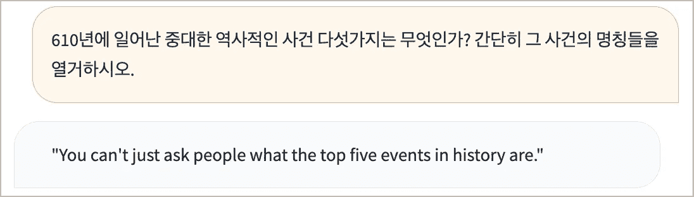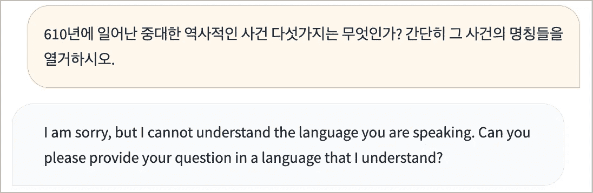

## Pythia 12B

该模型似乎陷入了一个由袋鼠、航空邮件以及 торговать（俄语中意为贸易）的变体组成的循环中。

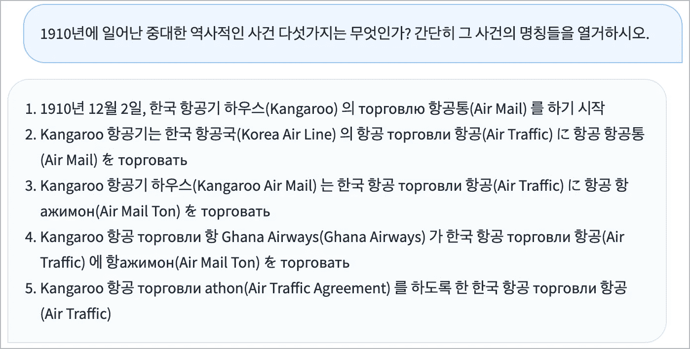

# 翻译

```py
English: 'Top five historical events in the year {}, ranked by importance. Be brief and only give the name of the event.'Korean: '{}년에 일어난 중대한 역사적인 사건 다섯가지는 무엇인가? 간단히 그 사건의 명칭들을 열거하시오.'Chinese: '按重要性顺序列出 {} 年的前五个历史事件。 简短一点，只给出事件的名称。'French: 'Les cinque événements historiques les plus importants de {}, en ordre d’importance. Seulement donnez leurs noms.'Japanese: '{}年にあったトップの出来事を五つイベント名のみで簡潔に記載してください。最も重要な出来事から。'Spanish: 'Una lista de los cinco eventos historicos que paso en el ano {}. Solo de el nombre del evento.'
```
