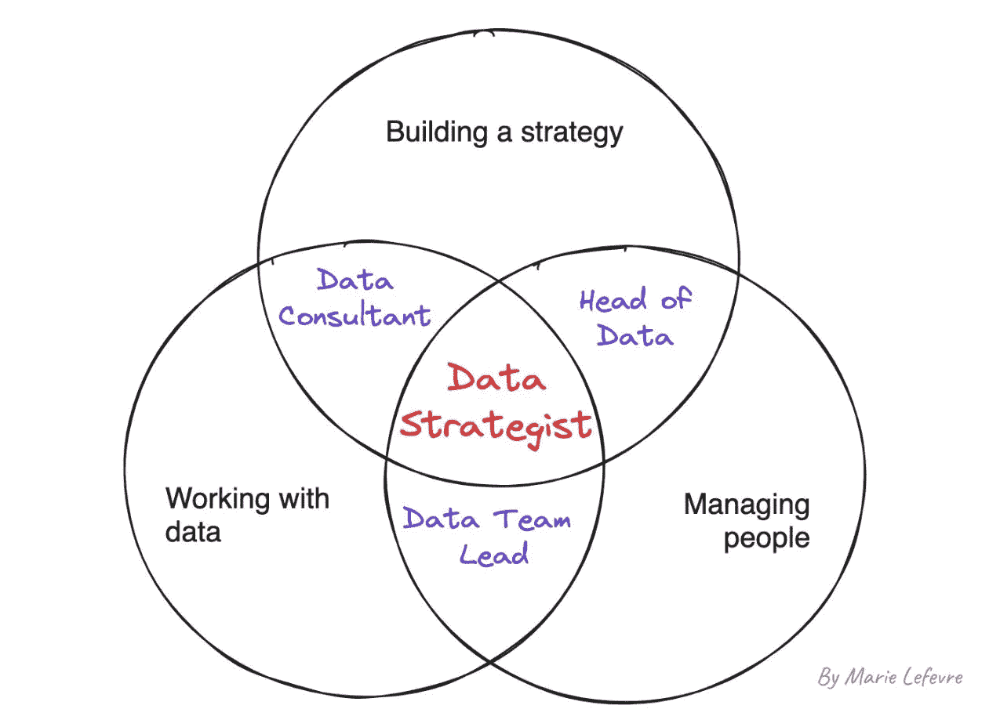
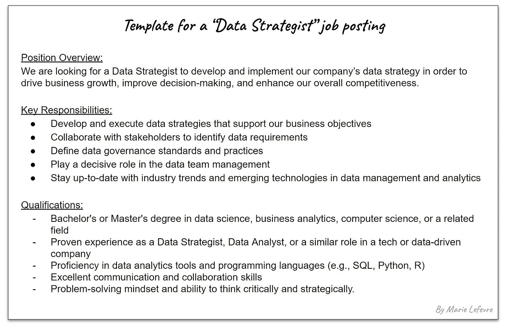

# 你会成为数据策略师吗？

> 原文：[`towardsdatascience.com/would-you-become-a-data-strategist-59c0a179df44`](https://towardsdatascience.com/would-you-become-a-data-strategist-59c0a179df44)

## 了解数据行业中的另一个职位名称

 [Marie Lefevre](https://marielefevre.medium.com/?source=post_page-----59c0a179df44--------------------------------)

·发表于 [Towards Data Science](https://towardsdatascience.com/?source=post_page-----59c0a179df44--------------------------------) ·6 分钟阅读·2023 年 11 月 1 日

--

你会成为数据策略师吗？（照片由 [Dan Burton](https://unsplash.com/@dan__burton?utm_content=creditCopyText&utm_medium=referral&utm_source=unsplash) 提供，来源于 [Unsplash](https://unsplash.com/photos/man-in-white-long-sleeve-shirt-WW4sZOuolc0?utm_content=creditCopyText&utm_medium=referral&utm_source=unsplash)）

数据分析师、数据工程师、数据科学家……如果你对各种数据角色有所了解，可能已经听说过这些角色。几年前，随着像 dbt 这样的转型工具的兴起，出现了一种新角色：[分析工程师](https://www.getdbt.com/blog/we-the-purple-people)。2021 年 1 月，[Atlan](https://humansofdata.atlan.com/2021/01/the-top-5-data-trends-for-cdos-to-watch-out-for-in-2021/) 还预测了数据平台领导者的出现。无论这些预测是时尚还是趋势，我的感觉是**数据角色的范围将继续扩展。**

我在数据领域工作了超过三年，因此我认为数据行业中出现了一种新角色：数据策略师。从 2022 年 10 月起我便担任这个职位。我猜测这种职位在组织内部会变得越来越重要。原因很简单：**数据策略师处于数据个人贡献者、战略顾问和团队经理的交汇点。**

根据[TechCrunch](https://techcrunch.com/2023/10/24/tech-layoffs-2023-list/)列出的信息，自 2023 年初以来，科技行业的裁员情况有所增加。随着分配给数据团队的预算减少，数据团队的规模趋于缩小。然而，他们仍然被期望交付相似数量的工作。领导者必须在数据分析、数据工程、数据科学和团队管理角色之间进行投资权衡。因此，在这种新背景下，能够**掌握数据角色多个方面**的人将具有战略优势。

如果你已经阅读到这篇文章，你可能已经有了上述提到的工作。你是否知道你下一步的职业发展方向是什么？**你是否可能在未曾意识到的情况下就是数据战略师？**你想成为一名吗？在这篇文章中，我希望解释什么是数据战略师，并帮助你更好地理解这个职位是否对你感兴趣。

# 成为数据战略师意味着什么？

根据我自己的经验以及在招聘网站上的一些研究，**数据战略师履行三种角色：数据顾问、数据主管和数据团队负责人。** 根据上下文，某一角色可能会比其他角色花费更多时间。同样，组织结构和数据战略师的背景也会影响他们的实际职位描述。

数据战略师的定位（作者提供的图片）

首先，**与数据工作**是你想称自己为数据战略师的必要要求。无论是在分析还是工程角色中，了解数据基础设施、数据管道、使用 SQL 或 Python 的临时分析以及数据可视化技术都是在数据角色中可信工作的基础。

第二，能够**定义、验证和实施战略**是这个职位的核心——毕竟我们在谈论的是数据*战略师*。这意味着对组织在数据相关事务上的长期愿景。接着，必须能够从长期目标中导出具体行动并建立一致的路线图。在我看来，短期执行与长期愿景的切换正是数据战略师角色如此令人兴奋的原因。

第三，涉及**团队管理**部分。与外部顾问不同，数据战略师是组织的一部分。因此，他们在引导数据团队成员朝着既定战略方向前进方面发挥作用。实际上，具体在组织图中的位置将根据组织的管理结构而有所不同。

# 成为数据战略师需要具备什么条件？

如果我参考我自己的经验，促使我成为数据战略家的原因是我**之前作为战略顾问和后来的数据分析师的工作经历**。通过这些经历，我能够发展出一系列技能，从掌握高级 SQL 函数到能够向执行委员会展示关键财务数据。

更普遍地说，数据战略家的角色包括**以下任务**：

+   为组织的数据战略定义长期愿景

+   制定和实施路线图

+   支持每个公司部门的数据使用

+   管理数据团队

请注意，这个列表并不详尽，主要反映了我作为数据战略家的个人经验和研究。例如，Boyan Angelov 在[这篇文章](https://datatalks.club/podcast/s14e03-data-strategy-key-principles-and-best-practices.html)中描述了他作为数据战略家的日常工作。尽管我们背景不同、工作环境不同，但我发现我们两个职位之间有许多相似之处。

为了完成这些任务，**需要硬技能和软技能的混合**。特别是软技能对于成功地向各方传达你的愿景和制定的路线图至关重要。良好的沟通技巧和总结能力有助于他人遵循制定的策略。至于硬技能，拥有作为数据团队个人贡献者的先前工作经验可以使所采取的行动更加贴近数据工作的现实。

一份典型的“数据战略家”职位发布（作者提供的图片）

# 数据战略家的职位是否在上升？

从我的角度来看，数据战略家的职位**仍然是一个相对不常用的术语**。当我去年获得这个头衔时，我很难找到带有这个职位名称的工作机会。与我的雇主和我所称的“数据战略家”类似的职位可能是“数据团队主管”或在其他组织中某种程度上的“数据负责人”。但正如前面提到的，我的日常工作包含更广泛的任务，包括一些需要更多咨询方法而非企业执行的方法。对我来说，我们只是发明了一个新的职位名称来描述我为公司做的工作：**以战略方式处理数据**。

然而，经过进一步研究，我发现“数据战略家”这个术语已经存在了一段时间。例如，一篇名为“数据战略家的崛起”的文章早在 2019 年就提到了这个职位的出现。在查看 Google Trends 时，确实没有明显的搜索趋势上升。

虽然这不是我发明的新职位名称，**但我认为数据战略师的职位空缺在未来几年将会增加**。正如我之前提到的，寻找能够同时掌握数据硬技能和战略软技能的人将变得更加普遍，因为对数据团队的预算将被越来越严格地监控。

结合战略、管理和数据相关技能对任何希望**在技术领域和/或数据相关职位上发展其职业**的人都是有帮助的。从数据战略师的职位开始，可以向公司数据主管或咨询公司数据顾问等角色发展，或者成为组织中的战略团队的一员。

# 结论

总之，数据战略师的角色是一个多面向的角色，要求具备数据能力、战略眼光和团队领导力。这使得它从我个人的角度来看非常有趣——也解释了它为何可能在未来变得更加流行。

**你怎么看？** 数据战略师的工作是否会在未来几年变得越来越受欢迎？你是否曾与数据战略师合作？你自己是否是数据战略师？
