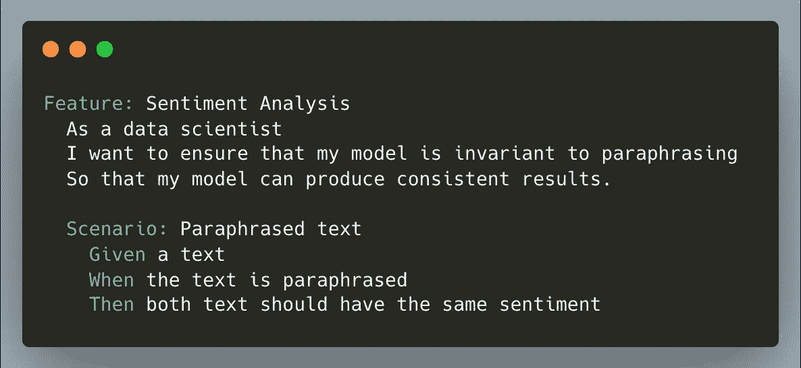
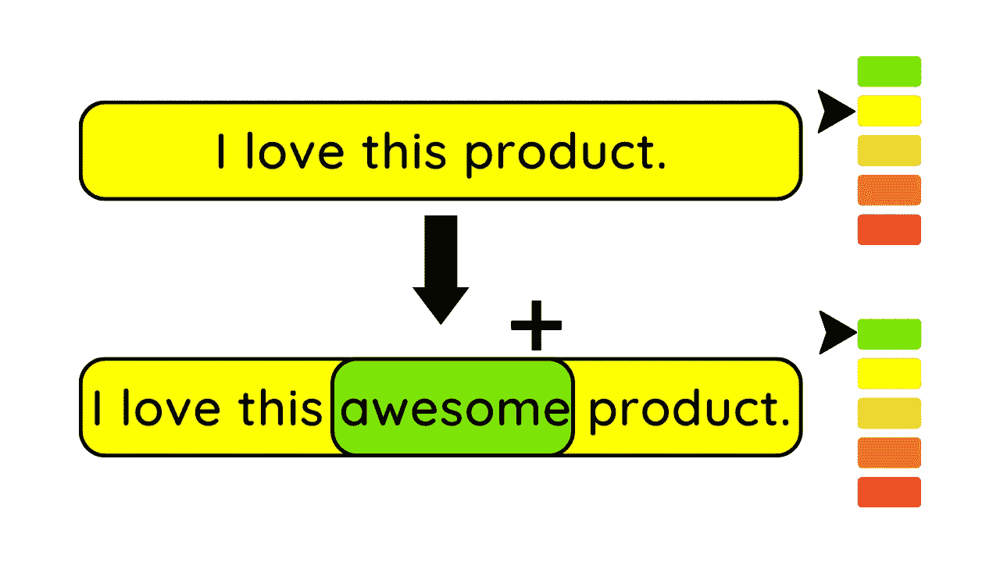
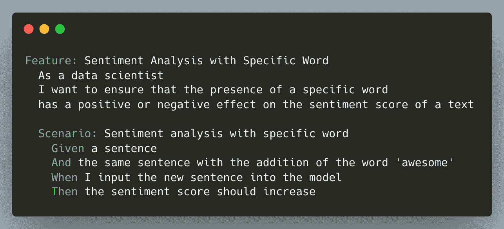
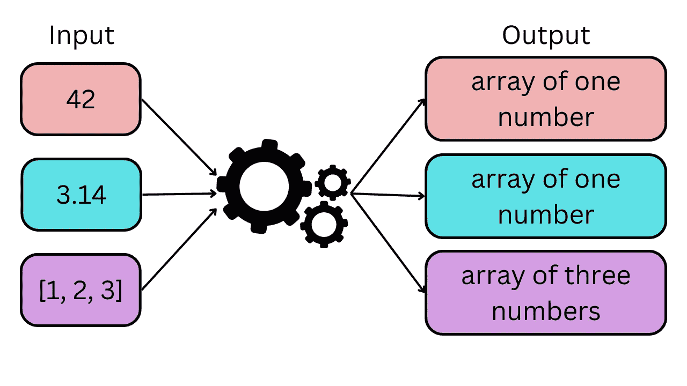
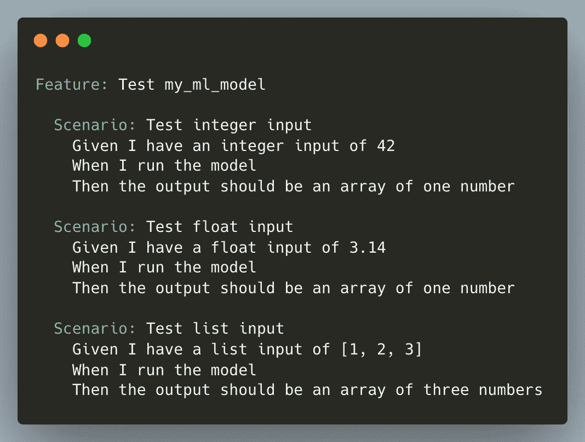
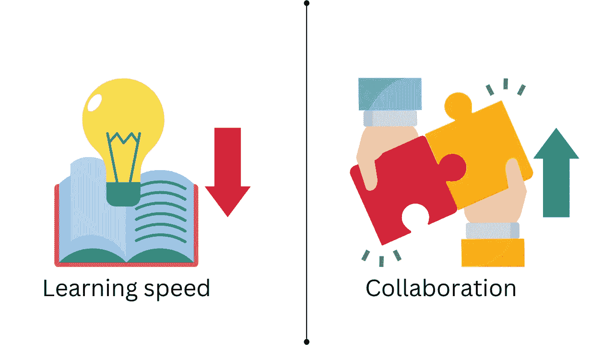
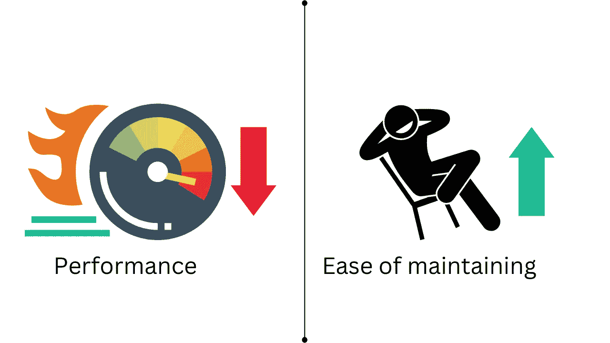
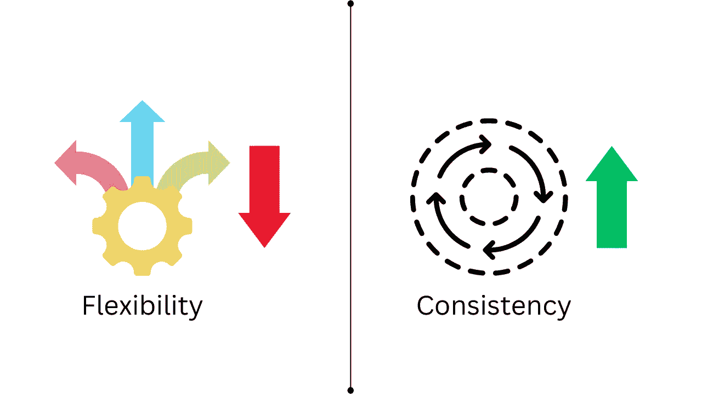

# 使用 Behave 编写可读的机器学习模型测试

> 原文：[`towardsdatascience.com/write-readable-tests-for-your-machine-learning-models-with-behave-ec4a27b91490`](https://towardsdatascience.com/write-readable-tests-for-your-machine-learning-models-with-behave-ec4a27b91490)

## 使用自然语言测试你的机器学习模型的行为

[](https://khuyentran1476.medium.com/?source=post_page-----ec4a27b91490--------------------------------)[](https://towardsdatascience.com/?source=post_page-----ec4a27b91490--------------------------------) [Khuyen Tran](https://khuyentran1476.medium.com/?source=post_page-----ec4a27b91490--------------------------------)

·发表于[数据科学的未来](https://towardsdatascience.com/?source=post_page-----ec4a27b91490--------------------------------) ·阅读时间 9 分钟·2023 年 3 月 11 日

--

# 动机

想象一下，你创建了一个机器学习模型来预测基于评论的客户情感。在部署后，你意识到模型错误地将某些积极评论标记为负面，当这些评论使用负面词汇重新表述时。


作者提供的图片

这只是一个极其准确的机器学习模型在没有适当测试时可能失败的例子。因此，在部署前测试模型的准确性和可靠性至关重要。

但你如何测试你的机器学习模型呢？一种简单的方法是使用单元测试：

```py
from textblob import TextBlob

def test_sentiment_the_same_after_paraphrasing():
    sent = "The hotel room was great! It was spacious, clean and had a nice view of the city."
    sent_paraphrased = "The hotel room wasn't bad. It wasn't cramped, dirty, and had a decent view of the city."

    sentiment_original = TextBlob(sent).sentiment.polarity
    sentiment_paraphrased = TextBlob(sent_paraphrased).sentiment.polarity

    both_positive = (sentiment_original > 0) and (sentiment_paraphrased > 0)
    both_negative = (sentiment_original < 0) and (sentiment_paraphrased < 0)
    assert both_positive or both_negative
```

这种方法有效，但可能对非技术或业务参与者来说较为挑战。如果你可以将**项目目标和愿景**融入到测试中，并用**自然语言**表达出来，那将会非常好。



作者提供的图片

这时，behave 就派上用场了。

随意在此处玩耍并分叉本文的源代码：

[## Data-science/data_science_tools/behave_examples at master · khuyentran1401/Data-science

### 你现在无法执行该操作。你已经在另一个标签页或窗口中登录。你在另一个标签页或窗口中注销了...

[github.com](https://github.com/khuyentran1401/Data-science/tree/master/data_science_tools/behave_examples?source=post_page-----ec4a27b91490--------------------------------)

# 什么是 behave？

[behave](https://github.com/behave/behave)是一个用于行为驱动开发（BDD）的 Python 框架。BDD 是一种软件开发方法论：

+   强调利益相关者之间的协作（如业务分析师、开发人员和测试人员）

+   使用户能够定义软件应用的需求和规格

由于 behave 提供了用于表达需求和规范的通用语言和格式，它可以理想地用于定义和验证机器学习模型的行为。

要安装 behave，请输入：

```py
pip install behave
```

让我们使用 behave 对机器学习模型进行各种测试。

# 不变性测试

不变性测试测试的是机器学习模型在不同条件下是否产生一致的结果。

不变性测试的一个示例是验证模型是否对意译不变。如果模型对意译有变化，它可能会将正面评论误分类为负面评论，当评论使用负面词语重新表述时。


作者提供的图片

## 功能文件

要使用 behave 进行不变性测试，请创建一个名为`features`的目录。在该目录下，创建一个名为`invariant_test_sentiment.feature`的文件。

```py
└──  features/ 
  └───  invariant_test_sentiment.feature 
```

在`invariant_test_sentiment.feature`文件中，我们将指定项目需求：


作者提供的图片

本文件的“Given”、“When”和“Then”部分展示了在测试过程中 behave 将执行的实际步骤。

## Python 步骤实现

要使用 Python 实现场景中的步骤，请首先创建`features/steps`目录，并在其中创建一个名为`invariant_test_sentiment.py`的文件：

```py
└──  features/ 
    ├────  invariant_test_sentiment.feature  
    └────  steps/ 
       └────  invariant_test_sentiment.py 
```

`invariant_test_sentiment.py`文件包含以下代码，用于测试由[TextBlob](https://textblob.readthedocs.io/en/dev/)模型生成的情感在原始文本和其意译版本之间是否一致。

```py
from behave import given, then, when
from textblob import TextBlob

@given("a text")
def step_given_positive_sentiment(context):
    context.sent = "The hotel room was great! It was spacious, clean and had a nice view of the city."

@when("the text is paraphrased")
def step_when_paraphrased(context):
    context.sent_paraphrased = "The hotel room wasn't bad. It wasn't cramped, dirty, and had a decent view of the city."

@then("both text should have the same sentiment")
def step_then_sentiment_analysis(context):
    # Get sentiment of each sentence
    sentiment_original = TextBlob(context.sent).sentiment.polarity
    sentiment_paraphrased = TextBlob(context.sent_paraphrased).sentiment.polarity

    # Print sentiment
    print(f"Sentiment of the original text: {sentiment_original:.2f}")
    print(f"Sentiment of the paraphrased sentence: {sentiment_paraphrased:.2f}")

    # Assert that both sentences have the same sentiment
    both_positive = (sentiment_original > 0) and (sentiment_paraphrased > 0)
    both_negative = (sentiment_original < 0) and (sentiment_paraphrased < 0)
    assert both_positive or both_negative
```

上述代码的解释：

+   使用装饰器识别步骤，这些装饰器匹配功能的谓词：`given`、`when`和`then`。

+   装饰器接受一个字符串，其中包含匹配场景步骤的其余短语。

+   `context`变量允许在步骤之间共享值。

## 运行测试

要运行`invariant_test_sentiment.feature`测试，请输入以下命令：

```py
behave features/invariant_test_sentiment.feature
```

输出：

```py
Feature: Sentiment Analysis # features/invariant_test_sentiment.feature:1
  As a data scientist
  I want to ensure that my model is invariant to paraphrasing
  So that my model can produce consistent results in real-world scenarios.
  Scenario: Paraphrased text                                                       
    Given a text                                                                   
    When the text is paraphrased                                                   
    Then both text should have the same sentiment
      Traceback (most recent call last):
          assert both_positive or both_negative
      AssertionError

      Captured stdout:
      Sentiment of the original text: 0.66
      Sentiment of the paraphrased sentence: -0.38

Failing scenarios:
  features/invariant_test_sentiment.feature:6  Paraphrased text

0 features passed, 1 failed, 0 skipped
0 scenarios passed, 1 failed, 0 skipped
2 steps passed, 1 failed, 0 skipped, 0 undefined
```

输出显示前两个步骤通过了，最后一步失败了，这表明模型受到了意译的影响。

# 方向性测试

方向性测试是一种统计方法，用于评估自变量对因变量的影响是否朝着特定方向，即正面或负面。

方向性测试的一个示例是检查特定单词的存在是否对给定文本的情感评分有正面或负面的影响。



作者提供的图片

要使用 behave 进行方向性测试，我们将创建两个文件`directional_test_sentiment.feature`和`directional_test_sentiment.py`。

```py
└──  features/ 
    ├────  directional_test_sentiment.feature  
    └────  steps/ 
       └────  directional_test_sentiment.py
```

## 功能文件

`directional_test_sentiment.feature`文件中的代码指定了项目的要求如下：



作者提供的图片

请注意，“And”被添加到文本中。由于前一步以“Given”开头，behave 将把“And”重命名为“Given”。

## Python 步骤实现

`directional_test_sentiment.py` 文件中的代码实现了一个测试场景，该场景检查“awesome”一词的出现是否对 TextBlob 模型生成的情感分数产生积极影响。

```py
from behave import given, then, when
from textblob import TextBlob

@given("a sentence")
def step_given_positive_word(context):
    context.sent = "I love this product" 

@given("the same sentence with the addition of the word '{word}'")
def step_given_a_positive_word(context, word):
    context.new_sent = f"I love this {word} product"

@when("I input the new sentence into the model")
def step_when_use_model(context):
    context.sentiment_score = TextBlob(context.sent).sentiment.polarity
    context.adjusted_score = TextBlob(context.new_sent).sentiment.polarity

@then("the sentiment score should increase")
def step_then_positive(context):
    assert context.adjusted_score > context.sentiment_score
```

第二步使用参数语法 `{word}`。当运行 `.feature` 文件时，场景中为 `{word}` 指定的值会自动传递给相应的步骤函数。

这意味着如果场景中指出相同的句子应包含“awesome”一词，behave 将自动用“awesome”替换 `{word}`。

> 这种转换在你想使用不同的 `{word}` 参数值而不需要更改 `.feature` 文件和 `.py` 文件时非常有用。

## 运行测试

```py
behave features/directional_test_sentiment.feature
```

输出：

```py
Feature: Sentiment Analysis with Specific Word 
  As a data scientist
  I want to ensure that the presence of a specific word has a positive or negative effect on the sentiment score of a text
  Scenario: Sentiment analysis with specific word                 
    Given a sentence                                              
    And the same sentence with the addition of the word 'awesome' 
    When I input the new sentence into the model                  
    Then the sentiment score should increase                      

1 feature passed, 0 failed, 0 skipped
1 scenario passed, 0 failed, 0 skipped
4 steps passed, 0 failed, 0 skipped, 0 undefined
```

由于所有步骤都通过了，我们可以推断情感分数因新词的出现而增加。

# 最小功能测试

最小功能测试是一种验证系统或产品是否符合最低要求并在其预期用途上可用的测试类型。

最小功能测试的一个例子是检查模型是否能处理不同类型的输入，例如数值型、类别型或文本数据。



作者提供的图片

要进行最小功能测试以验证输入，请创建两个文件 `minimum_func_test_input.feature` 和 `minimum_func_test_input.py`。

```py
└──  features/ 
    ├────  minimum_func_test_input.feature  
    └────  steps/ 
       └────  minimum_func_test_input.py
```

## 特性文件

`minimum_func_test_input.feature` 文件中的代码将项目要求指定如下：



作者提供的图片

## Python 步骤实现

`minimum_func_test_input.py` 文件中的代码实现了这些要求，检查 `predict` 对特定输入类型生成的输出是否符合预期。

```py
from behave import given, then, when

import numpy as np
from sklearn.linear_model import LinearRegression
from typing import Union

def predict(input_data: Union[int, float, str, list]):
    """Create a model to predict input data"""

    # Reshape the input data
    if isinstance(input_data, (int, float, list)):
        input_array = np.array(input_data).reshape(-1, 1)
    else:
        raise ValueError("Input type not supported")

    # Create a linear regression model
    model = LinearRegression()

    # Train the model on a sample dataset
    X = np.array([[1], [2], [3], [4], [5]])
    y = np.array([2, 4, 6, 8, 10])
    model.fit(X, y)

    # Predict the output using the input array
    return model.predict(input_array)

@given("I have an integer input of {input_value}")
def step_given_integer_input(context, input_value):
    context.input_value = int(input_value)

@given("I have a float input of {input_value}")
def step_given_float_input(context, input_value):
    context.input_value = float(input_value)

@given("I have a list input of {input_value}")
def step_given_list_input(context, input_value):
    context.input_value = eval(input_value)

@when("I run the model")
def step_when_run_model(context):
    context.output = predict(context.input_value)

@then("the output should be an array of one number")
def step_then_check_output(context):
    assert isinstance(context.output, np.ndarray)
    assert all(isinstance(x, (int, float)) for x in context.output)
    assert len(context.output) == 1

@then("the output should be an array of three numbers")
def step_then_check_output(context):
    assert isinstance(context.output, np.ndarray)
    assert all(isinstance(x, (int, float)) for x in context.output)
    assert len(context.output) == 3
```

## 运行测试

```py
behave features/minimum_func_test_input.feature
```

输出：

```py
Feature: Test my_ml_model 

  Scenario: Test integer input                       
    Given I have an integer input of 42              
    When I run the model                             
    Then the output should be an array of one number 

  Scenario: Test float input                         
    Given I have a float input of 3.14               
    When I run the model                            
    Then the output should be an array of one number 

  Scenario: Test list input                             
    Given I have a list input of [1, 2, 3]              
    When I run the model                                
    Then the output should be an array of three numbers

1 feature passed, 0 failed, 0 skipped
3 scenarios passed, 0 failed, 0 skipped
9 steps passed, 0 failed, 0 skipped, 0 undefined
```

由于所有步骤都通过了，我们可以得出结论，模型输出符合我们的预期。

# behave 的缺点及其使用理由

本节将概述使用 behave 相较于 pytest 的一些缺点，并解释为什么仍然值得考虑该工具。

## 学习曲线

在行为驱动开发（BDD）中使用行为可能导致比 pytest 使用的传统测试方法更陡峭的学习曲线。

> **反驳观点：** BDD 对协作的关注可以导致业务需求与软件开发之间的更好对齐，从而使整体开发过程更高效。



作者提供的图片

## 性能较慢

behave 测试可能比 pytest 测试更慢，因为 behave 需要解析特性文件并将其映射到步骤定义，然后才能运行测试。

> **反驳观点：** behave 对明确步骤的关注可以导致更易理解和修改的测试，从而减少测试维护所需的总体工作量。



作者提供的图片

## **灵活性较差**

behave 的语法更为严格，而 pytest 在定义测试和夹具方面提供了更多灵活性。

> **反驳观点：** behave 的严格结构有助于确保测试的一致性和可读性，使其更易于理解和维护。



作者提供的图片

## 总结

尽管 behave 相比 pytest 存在一些缺点，但其对协作、明确步骤和结构化方法的关注仍能使其成为开发团队的重要工具。

# 结论

恭喜！你刚刚学会了如何使用 behave 测试机器学习模型。我希望这些知识能帮助你创建更易理解的测试。

我喜欢写关于数据科学的概念和玩弄不同的数据科学工具。你可以通过 [LinkedIn](https://www.linkedin.com/in/khuyen-tran-1401/) 和 [Twitter](https://twitter.com/KhuyenTran16) 与我联系。

如果你想查看我写的文章的代码，请给 [这个仓库](https://github.com/khuyentran1401/Data-science) 点个星。关注我在 Medium 上，及时获取我最新的数据科学文章：

[](/pytest-for-data-scientists-2990319e55e6?source=post_page-----ec4a27b91490--------------------------------) ## 数据科学家的 Pytest

### **Pytest** 数据科学项目的综合指南

towardsdatascience.com [](/great-expectations-always-know-what-to-expect-from-your-data-51214866c24?source=post_page-----ec4a27b91490--------------------------------) ## 伟大的期望：总是了解你的数据期望

### 确保你的数据按预期工作，使用 Python

towardsdatascience.com [](/validate-your-pandas-dataframe-with-pandera-2995910e564?source=post_page-----ec4a27b91490--------------------------------) ## 使用 Pandera 验证你的 pandas DataFrame

### 确保你的数据符合预期

towardsdatascience.com [](/detect-defects-in-a-data-pipeline-early-with-validation-and-notifications-83e9b652e65a?source=post_page-----ec4a27b91490--------------------------------) ## 通过验证和通知早期检测数据管道中的缺陷

### 使用 Deepchecks 和 Prefect 在 Python 中构建稳健的数据管道

towardsdatascience.com
