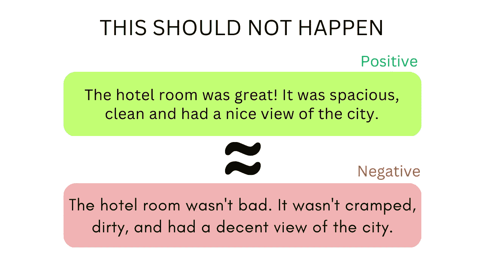

# 使用 Behave 编写可读的机器学习模型测试

> 原文：[`towardsdatascience.com/write-readable-tests-for-your-machine-learning-models-with-behave-ec4a27b91490?source=collection_archive---------2-----------------------#2023-03-11`](https://towardsdatascience.com/write-readable-tests-for-your-machine-learning-models-with-behave-ec4a27b91490?source=collection_archive---------2-----------------------#2023-03-11)

## 使用自然语言测试你的机器学习模型的行为

[](https://khuyentran1476.medium.com/?source=post_page-----ec4a27b91490--------------------------------)[](https://towardsdatascience.com/?source=post_page-----ec4a27b91490--------------------------------) [Khuyen Tran](https://khuyentran1476.medium.com/?source=post_page-----ec4a27b91490--------------------------------)

·

[关注](https://medium.com/m/signin?actionUrl=https%3A%2F%2Fmedium.com%2F_%2Fsubscribe%2Fuser%2F84a02493194a&operation=register&redirect=https%3A%2F%2Ftowardsdatascience.com%2Fwrite-readable-tests-for-your-machine-learning-models-with-behave-ec4a27b91490&user=Khuyen+Tran&userId=84a02493194a&source=post_page-84a02493194a----ec4a27b91490---------------------post_header-----------) 发表在 [Towards Data Science](https://towardsdatascience.com/?source=post_page-----ec4a27b91490--------------------------------) ·9 分钟阅读·2023 年 3 月 11 日[](https://medium.com/m/signin?actionUrl=https%3A%2F%2Fmedium.com%2F_%2Fvote%2Ftowards-data-science%2Fec4a27b91490&operation=register&redirect=https%3A%2F%2Ftowardsdatascience.com%2Fwrite-readable-tests-for-your-machine-learning-models-with-behave-ec4a27b91490&user=Khuyen+Tran&userId=84a02493194a&source=-----ec4a27b91490---------------------clap_footer-----------)

--

[](https://medium.com/m/signin?actionUrl=https%3A%2F%2Fmedium.com%2F_%2Fbookmark%2Fp%2Fec4a27b91490&operation=register&redirect=https%3A%2F%2Ftowardsdatascience.com%2Fwrite-readable-tests-for-your-machine-learning-models-with-behave-ec4a27b91490&source=-----ec4a27b91490---------------------bookmark_footer-----------)

# 动机

想象一下你创建了一个机器学习模型，用于根据评论预测客户情感。部署后，你发现模型在使用负面词汇重新措辞时错误地将某些积极评论标记为负面。



图片来源：作者

这只是一个例子，说明即使是极其准确的机器学习模型在没有适当测试的情况下也可能失败。因此，在部署之前测试模型的准确性和可靠性至关重要。

你如何测试你的机器学习模型？一种直接的方法是使用单元测试：

```py
from textblob import TextBlob

def test_sentiment_the_same_after_paraphrasing():
    sent = "The hotel room was great! It was spacious, clean and had a nice view of the city."
    sent_paraphrased = "The hotel room wasn't bad. It wasn't cramped, dirty, and had a decent view of the city."

    sentiment_original = TextBlob(sent).sentiment.polarity…
```
