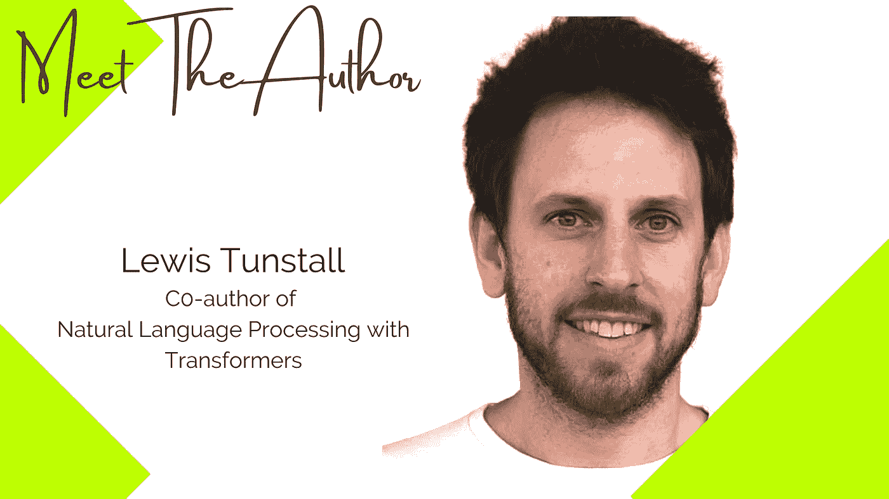

# 编写一本关于 NLP 的书有点像解决一个复杂的数据科学项目

> 原文：[`towardsdatascience.com/writing-a-book-on-nlp-is-a-bit-like-solving-a-complex-data-science-project-c0848f975ca?source=collection_archive---------13-----------------------#2023-02-06`](https://towardsdatascience.com/writing-a-book-on-nlp-is-a-bit-like-solving-a-complex-data-science-project-c0848f975ca?source=collection_archive---------13-----------------------#2023-02-06)

## 对话录：与**刘易斯·坦斯托尔**的访谈，合著者 [**《自然语言处理与变压器》**](https://learning.oreilly.com/library/view/natural-language-processing/9781098136789/)

 [Parul Pandey](https://pandeyparul.medium.com/?source=post_page-----c0848f975ca--------------------------------)

·

[关注](https://medium.com/m/signin?actionUrl=https%3A%2F%2Fmedium.com%2F_%2Fsubscribe%2Fuser%2F7053de462a28&operation=register&redirect=https%3A%2F%2Ftowardsdatascience.com%2Fwriting-a-book-on-nlp-is-a-bit-like-solving-a-complex-data-science-project-c0848f975ca&user=Parul+Pandey&userId=7053de462a28&source=post_page-7053de462a28----c0848f975ca---------------------post_header-----------) 发表在 [Towards Data Science](https://towardsdatascience.com/?source=post_page-----c0848f975ca--------------------------------) ·7 分钟阅读·2023 年 2 月 6 日

--

*一系列访谈，突出展示数据科学领域作家的非凡工作及其写作路径。*

图片由刘易斯·坦斯托尔提供

> “在小说中，语言和它唤起的感官体验很重要，而在技术写作中，内容和传达的信息才是关键。”
> 
> ― **Krista Van Laan**，[**《技术写作内幕指南》](https://www.goodreads.com/work/quotes/20300600) 

*最后编辑于 2023 年 2 月 6 日* 

作为一名作家，我对揭示我们阅读书籍背后的故事有浓厚的兴趣，尤其是在机器学习领域。这些作者将人工智能的复杂性转化为既有信息性又有趣的文字的能力，实在令人赞叹。我的目标是通过一系列访谈，将他们的故事展现出来，并揭示一些在人工智能领域知名作者的故事。

# 认识作者：刘易斯·坦斯特尔 
