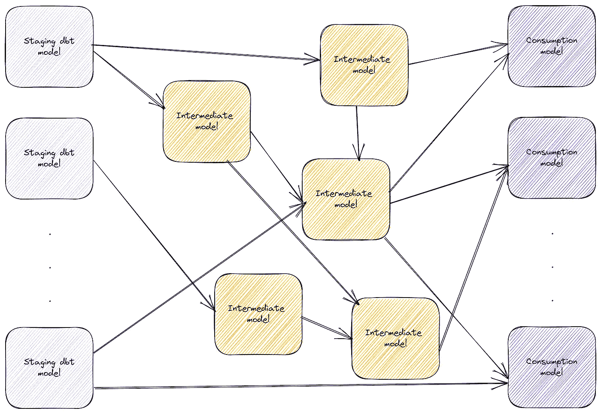
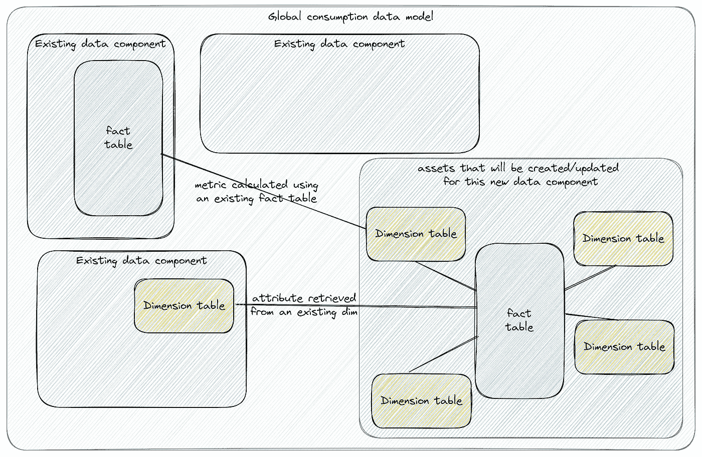
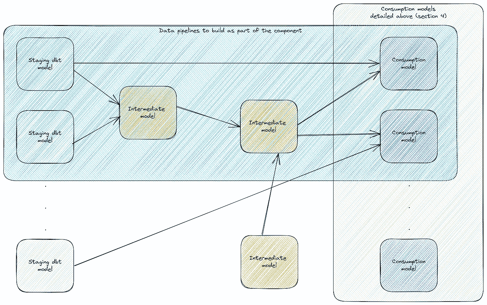

# 为数据管道编写设计文档

> 原文：[`towardsdatascience.com/writing-design-docs-for-data-pipelines-d49550f95580?source=collection_archive---------0-----------------------#2023-05-22`](https://towardsdatascience.com/writing-design-docs-for-data-pipelines-d49550f95580?source=collection_archive---------0-----------------------#2023-05-22)

## 探索数据组件设计文档的内容、意义和方法——以及它们为何重要。

 [Mahdi Karabiben](https://mahdiqb.medium.com/?source=post_page-----d49550f95580--------------------------------)

·

[关注](https://medium.com/m/signin?actionUrl=https%3A%2F%2Fmedium.com%2F_%2Fsubscribe%2Fuser%2F7cda12823b7a&operation=register&redirect=https%3A%2F%2Ftowardsdatascience.com%2Fwriting-design-docs-for-data-pipelines-d49550f95580&user=Mahdi+Karabiben&userId=7cda12823b7a&source=post_page-7cda12823b7a----d49550f95580---------------------post_header-----------) 发表在 [Towards Data Science](https://towardsdatascience.com/?source=post_page-----d49550f95580--------------------------------) ·8 分钟阅读·2023 年 5 月 22 日

--

图片来源：[Mike Kononov](https://unsplash.com/es/@mikofilm?utm_source=medium&utm_medium=referral) 在 [Unsplash](https://unsplash.com/?utm_source=medium&utm_medium=referral)

近年来，采纳软件工程最佳实践已成为数据工程领域的一个共同主题。从 dbt 的软件工程灵感功能到数据可观察性的兴起，数据工程师们正越来越习惯于软件工程师的工具集和原则。

这种转变对我们设计和构建数据管道的方式产生了重大影响。它使数据管道更加健壮（因为我们从硬编码的业务逻辑和复杂的 SQL 查询转向了模块化的 dbt 模型和宏），并大幅减少了“*嘿，你能检查一下这个表吗？*”这种 Slack 消息（通过自动化的数据质量监控和警报）。

这些变化帮助我们将行业导向正确的方向——但我们仍然有很多领域需要向软件工程同行学习。

根据[dbt Labs 最近发布的数据](https://www.getdbt.com/blog/analytics-engineering-next-step-forwards/#:~:text=Complexity%20in%20the%20dbt%20ecosystem)，大约 20%的 dbt 项目有超过 1,000 个模型（5%有超过 5,000 个）。这些数据突出了我们数据管道中的一个根本问题：**我们在设计它们时不够有意图**。我们在临时模型和特定用例的转换层层叠加，最终得到十个表示相同逻辑实体的模型，“*仅有细微差别*”。

在本文中，我们将讨论一个可以帮助我们为数据平台设计（和构建）稳健基础的文档：设计文档。

# 什么是设计文档？

在软件工程领域，通常会在软件组件的设计阶段创建两个主要文档，以帮助工程师进行协作和记录决策：

+   **设计文档或请求评论（RFC）**应包含与当前状态相关的所有信息，包括为什么需要做某事以及可能的设计/解决方案。内容随后会根据来自不同人员/团队的反馈和输入不断演变，直到达成共识。

+   **架构决策记录（ADR）**记录了一个具体的决策。这个文档更多的是一个书面快照，包含了形成技术决策的核心因素以及决策/设计本身的不同方面。

公司通常有一个内部模板用于这类文档（或其变体），以便不同团队可以利用它来标准化技术决策的制定方式。Gergely Orosz 写了[一篇很好的文章](https://blog.pragmaticengineer.com/rfcs-and-design-docs/)提供了多个示例，我也推荐查看[谷歌设计文档流程的公开概述](https://www.industrialempathy.com/posts/design-docs-at-google/)。

# 为什么我们需要数据管道的设计文档？

基于 dbt 的方法构建数据管道的一个意外后果是，它使得向图中添加更多节点/模型变得*过于容易*。这让数据工程团队沉溺于构建***临时数据管道***的循环：数据管道没有经过适当的设计阶段或统一的整体规划，而是直接构建，导致了这种非常常见的 dbt 谱系图：

一个带有临时方法的示例 dbt 图：复杂性的增加以及缺乏治理的基础层（图片由作者提供）

这种方法的主要问题是节点不断被添加到图中，而没有太多的监督。这导致了复杂性的无尽螺旋，造成不必要的成本，并使找到正确的消费表变成了不可能的任务。

为了应对这种反模式，我的建议是始终以软件工程团队对复杂软件组件的严格要求来对待数据流水线。这意味着在编写 dbt 模型之前，我们应定义（并达成一致）一些基础块：

+   流水线/数据资产的范围

+   对全球消费层的变化

+   将要交付的资产特征

+   流水线本身的设计

如你所见，我的建议是将这些信息（及更多）汇总到**设计文档**中，并确保所有相关利益相关者在开始实施之前达成一致。

# 流水线与组件

在开始讨论设计文档的细节之前，需要注意的是，范围的概念、数据平台的整体设计以及数据工程团队的组织方式会因公司而异（基于众多因素）。这意味着本文介绍的概念应根据你自己的数据平台进行调整。例如，在 Zendesk，我们将数据资产划分为***数据域***，因此设计文档的范围将是一个特定的数据域（从其数据源到基础且高度治理的消费层）。

这同样适用于“*数据流水线*”的定义；本文中使用了这个术语，因为它是数据工程领域中的一个常见逻辑组件，但更准确的统称应为“***数据组件***”（这可以是一组数据产品：流水线、表格或其他工件）。

# 我的设计文档应该是什么样的？

既然我们了解了设计文档的重要性，接下来的问题是如何将这一概念应用于数据流水线（或者更准确地说：数据组件）——那么你的数据组件的设计文档应包含哪些主要部分？

## 1\. 设计元数据

设计文档是捕捉特定组件所有相关元数据的黄金机会。这些元数据可能包括以下内容：

+   **所有权**：组件应有不同的所有者（技术、业务等），他们对设计和实施负责。

+   **高层次描述**：重要的是要有一个非常简洁的组件描述，说明我们为什么想要（或更好，必须）构建它，以及它解决了哪些业务问题或用例。这使得来自不同团队的潜在贡献者在进一步阅读之前能够获得必要的背景信息。

+   **技术元数据**：这将根据你的平台而有所不同，但必须包括开始日期（数据何时开始可用？）和建议的历史回填（最早可用的日期是什么？）

+   **审阅者及审阅状态（可选）**：这些信息可以在设计文档之外进行管理（例如通过单独的 ADR 文档），但为了简化流程并使其更为顺畅，本节还可以包括审阅者的信息（最好是中央团队的一部分，能够评估组件如何适应整体设计）以及设计的当前状态（无论是已批准还是处于中间状态）。

这个部分不能有“过多”的元数据。如果有值得记录的信息，那么它肯定有其存在的必要。

## 2\. 现有资源

本节旨在捕捉与此组件相关的所有相关资源。这些资源可以包括现有设计的文档，或与此组件将解决的业务用例或问题的链接。

这里的想法是，任何阅读设计文档的人都应该掌握与此组件相关的完整背景和相关资源。

## 3\. 核心下游指标和用例

关键问题在于临时数据管道是没有明确目标的。相反，表格是为了回答模糊且定义不清的用例而添加的，然后被遗忘。

因此，我建议在开始考虑实际管道之前，专注于指标和下游用例。本节应提供以下项目的详细背景：

+   主要依赖于此数据组件的用例是什么？

+   使用此组件中表格计算的主要***核心***指标是什么？

## 4\. 消费数据模型（或它将如何变化）

既然我们已经讨论了我们为之设计这个组件的核心指标和用例，让我们决定消费层应如何设计。

既然已经列出了下游指标，数据建模阶段变得不那么棘手，因为它将包括定义可以服务于所有下游使用场景的基础数据模型。在这里，具体设计将取决于设计文档本身之外的因素——你可以利用维度数据建模或其他技术，只要保持各组件之间的一致性，并避免创建孤立或重复的实体。

新的数据组件将如何更新全球消费数据模型（图由作者提供）

直到目前为止，我们还没有讨论数据管道或 dbt 模型。相反，重点在于定义我们希望如何呈现能够满足所有预期下游用例和指标的数据资产。

## 5\. 表级（和列级）的元数据

在定义逻辑数据模型之后，理想情况下，我们还应在不同层次上提供关于将要构建的消费资产的背景：

+   每个表将包含什么信息？（表级描述）

+   对于每个表，我们计划提供哪些列？每列将包含哪些信息？我们是否做出任何数据质量承诺？

+   对于每个表，数据更新的频率是多少？我们是否承诺任何服务水平协议（SLA）？

+   对于每个表，初始回填和每次执行的成本估算是多少？

我们的目标是确保所有利益相关者对将要构建的资产（表）以及不同的承诺达成一致。根据你的数据开发标准，这一部分还可能包括其他信息，例如每个表的业务重要性或其认证情况。

## 6\. 管道设计

最后一部分是我建议最终关注数据管道的地方。经过识别所有核心下游使用案例和预期承诺后，我们现在可以更清晰地设计如何实现目标。

本节将包含我们希望作为数据组件的一部分使用的所有源/原始表的列表（以及这些表是否已是平台的一部分，或者我们是否需要通过提取-加载过程引入数据），以及我们希望构建的 dbt 模型（或数据管道）以达到消费层的期望状态。

数据管道（或 dbt 模型）的示例设计，作为数据组件的一部分（图片作者提供）

# 但它能扩展吗？

对这种方法的初步反应可能是认为它难以扩展——但只有在我们对扩展性的定义偏颇时才会这样。

扩展性不应包括用一千个 dbt 模型来回答一千个使用案例（因为这种方法最终不会可扩展）。相反，我们寻求的扩展性是高效地回答一万种使用案例而不陷入无尽的复杂性循环。在这方面，这种方法（专注于构建为核心下游使用案例精细调整的稳健基础，并且有所有相关利益相关者的输入）绝对是可扩展的。

在这个基础的高度治理层的下游，你可以采用不同的方法来处理特定的使用案例或定制场景：可以通过使用[“自动化”语义层](https://docs.getdbt.com/docs/use-dbt-semantic-layer/dbt-semantic-layer)或者打开由基础层构建的去规范化度量导向表的大门。

# 结论

在本文中，我们涵盖了设计文档的概念，以及它们如何成为有价值的文档，让我们能够设计和构建更稳健的数据平台和可扩展的数据组件。

本文介绍的部分并不一定需要出现在你自己版本的设计文档中。相反，最重要的是记住在构建数据管道和组件时要***有意识***。

*如果你想获取更多数据工程内容，可以订阅我的新闻简报《数据浓缩》，我在其中讨论了与数据工程和技术相关的各种主题：*

 [## 数据浓缩 | Mahdi Karabiben | Substack

### 数据工程更新和评论，伴随你的下午浓缩咖啡。点击阅读 Mahdi 的《数据浓缩》……

dataespresso.substack.com](https://dataespresso.substack.com/?source=post_page-----d49550f95580--------------------------------)
