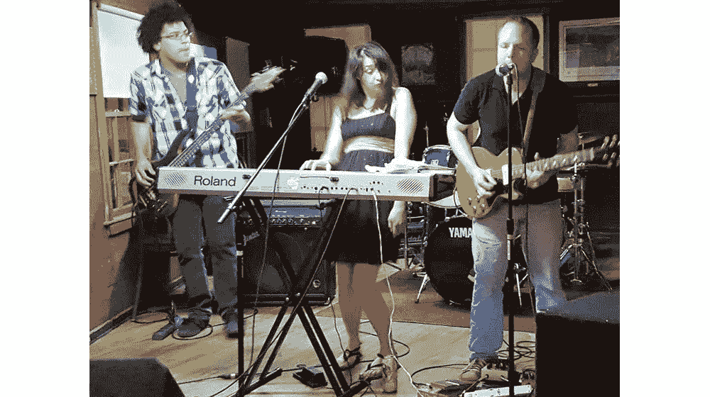

# 使用 GPT-4 写歌曲：第一部分，歌词

> 原文：[`towardsdatascience.com/writing-songs-with-gpt-4-part-1-lyrics-3728da678482`](https://towardsdatascience.com/writing-songs-with-gpt-4-part-1-lyrics-3728da678482)

## 如何使用 OpenAI 最新的语言模型来帮助创作原创歌曲的歌词

 [罗伯特·A·冈萨尔维斯](https://robgon.medium.com/?source=post_page-----3728da678482--------------------------------)

·发布于 [数据科学](https://towardsdatascience.com/?source=post_page-----3728da678482--------------------------------) ·阅读时长 16 分钟·2023 年 4 月 18 日

--

**“年轻的说唱歌手在工作室里对着麦克风唱歌，耳机佩戴着，背景有电脑屏幕，”** *图像由 AI 图像创作程序* Midjourney *创建，并由作者编辑*

过去三年，我一直在撰写关于 OpenAI 大型语言模型的各种迭代，包括使用 GPT-3 [1] 创作[音乐](https://medium.com/towards-data-science/ai-tunes-creating-new-songs-with-artificial-intelligence-4fb383218146) 和 ChatGPT [2]，也就是 GPT-3.5，来[写诗](https://medium.com/towards-data-science/using-chatgpt-as-a-creative-writing-partner-part-1-prose-dc9a9994d41f)。在对最新语言模型 GPT-4 [3] 进行实验后，我发现它能够创作讲述连贯故事并押韵的歌词。

在这篇文章中，作为三部分系列中的第一部分，我将讨论 GPT-4 的背景，并将其写歌词和音乐的能力与 GPT-3 进行比较。接下来，我将展示 GPT-4 如何从当前乐队的歌词中阅读并创作他们风格的歌曲。最后，我将进行关于使用 AI 写音乐的一般讨论，并提出一些后续实验步骤。

在[第二部分](https://medium.com/towards-data-science/writing-songs-with-gpt-4-part-2-chords-173cfda0e5a1)中，我将探讨 GPT-4 如何为歌曲创作和弦，在第三部分中，我将使用该系统创作伴随歌词的新旋律。

# 介绍 GPT-4

3 月 14 日，我收到了一封来自 OpenAI 的电子邮件，通知我可以使用他们的新语言模型 GPT-4。以下是他们在技术报告中对模型的描述。

> 我们报告了 GPT-4 的发展情况，这是一个大规模的多模态模型，能够接受图像和文本输入并生成文本输出。虽然在许多现实世界的场景中不如人类，但 GPT-4 在各种专业和学术基准上表现出人类级别的性能，包括在模拟律师考试中得分接近前 10% 的考生。GPT-4 是一个基于 Transformer 的模型，经过预训练以预测文档中的下一个标记。后期训练对齐过程导致在事实性和遵循期望行为的衡量标准上表现有所提高。OpenAI，GPT-4 技术报告 [3]

报告还讨论了 OpenAI 在改进 GPT-4 模型的安全性和对齐性方面所采取的步骤，以使系统“遵循人类价值观和人类意图。”他们强调了使用超过 50 名领域专家进行对抗性测试，如何建立了一个模型辅助的安全管道，以及如何在之前的模型上改进了安全指标 [3]。

新模型不是免费的。OpenAI 收取每月 20 美元的 ChatGPT Plus 费用，这样可以使用新的 GPT-4 聊天机器人。当我注册并登录后，我可以看到三个聊天模型的选项。

**ChatGPT 三种模型选项的描述**，来自 OpenAI 的截图

你可以看到 OpenAI 如何提升了 GPT-4 的“推理”和“简洁”水平。

请注意，默认情况下，OpenAI 将保留用户的输入和生成的响应“以改进模型性能”，正如他们在[数据政策文档](https://help.openai.com/en/articles/5722486-how-your-data-is-used-to-improve-model-performance)中所述。这意味着他们可以使用这些数据来训练他们的模型。我选择通过使用[此处](https://docs.google.com/forms/d/e/1FAIpQLScrnC-_A7JFs4LbIuzevQ_78hVERlNqqCPCt3d8XqnKOfdRdQ/viewform)的表单来选择不参与他们的数据收集。

# 比较编写歌词的模型

在使用新的 GPT-4 系统进行实验后，我发现与原始的 GPT-3 模型相比，响应质量有了显著提高，尤其是在押韵词方面。

## 使用 OG 模型 GPT-3 编写歌词

这是我使用原始 GPT-3 模型编写歌曲的尝试。我使用了“副歌”这个词，指的是两行押韵的歌词。

> *RobG: 为一首关于狗和猫的摇滚歌曲的第一节写歌词，每对副歌的结尾要押韵。*
> 
> *GPT-3:*
> 
> 狗和猫一起生活
> 
> 完美和谐地交融
> 
> 奔跑和玩耍
> 
> 直到上床睡觉的时候
> 
> 侧身蜷缩在一起
> 
> 在一个毛茸茸的小球中
> 
> 我们最爱的宠物
> 
> 使我们的家变得温馨

好吧，这些歌词描绘了一个可爱的小故事。然而，没有任何副歌押韵，而且歌词的节奏也不太匹配。

## 使用新模型编写歌词

以下是新的 GPT-4 模型如何回应相同提示的结果。

> *RobG: 为一首关于狗和猫的摇滚歌曲的第一段写歌词，每对押韵的句子结尾处押韵。*
> 
> *GPT-4:*
> 
> 狗和猫，它们在街上游荡
> 
> 毛茸茸的朋友，心跳不已
> 
> 爪子和爪垫，他们主宰这片土地
> 
> 摇摆的尾巴，他们心领神会
> 
> 彼此并肩，追逐风的脚步
> 
> 紧密相连，最好的朋友
> 
> 他们在月光下摇滚
> 
> 狗和猫，它们超出了视线

啊，好多了！大部分押韵不错。将“wind”与“friends”押韵有点勉强。但措辞很稳，每行的节拍也很一致。

# 以你的乐队风格创作音乐

为了看看 GPT-4 是否能以特定风格创作音乐，我联系了几支本地乐队，询问是否可以用他们的歌词作为参考来创作歌曲。他们都同意了。

我开始让 GPT-4 创作风格类似于[Rhode Iceland](https://www.facebook.com/RhodeIceland/)的歌词，这是一支来自麻省洛厄尔的另类摇滚乐队，[Hi Fi Monk](https://www.facebook.com/HiFiMonk/)，一家位于波士顿的嘻哈/放克/雷鬼乐队，以及[The Agents](https://www.facebook.com/theagentsri/)，一家位于普罗维登斯的 ska 乐队。

## 分析歌词

为了使 GPT-4 能够分析这三支乐队的歌曲，我编写了一些代码，利用两个开源项目从音频文件中获取歌词的转录。我使用了[Whisper](https://github.com/openai/whisper)，这是 OpenAI 的语音转文本 AI 模型[4]，来转录歌词。然后，我将转录后的歌词输入 GPT-4，以标示歌曲的部分，即，段落、副歌等。你可以在我的 Google Colab 上运行我的代码，[这里](https://colab.research.google.com/github/robgon-art/ml-tabify/blob/main/Song_Transcriber.ipynb)。

**Rhode Iceland**，图片使用已获许可

## 欢迎来到 Rhode Iceland

首先，我让 GPT-4 分析了 Rhode Iceland 的歌曲《Bloody Brain》，通过输入歌词进行分析。请注意，新模型能够处理比以前更多的文本。GPT-3.5 只能处理 4,000 个标记，相当于 3,125 个词。但 GPT-4 有两个版本，一个处理 8,000 个标记，另一个处理 32,000 个标记，相当于惊人的 25,000 个词。这是我的提示。

> *RobG: 分析 Rhode Iceland 乐队的歌曲《Bloody Brain》的歌词。*
> 
> *[第一段]*
> 
> 沿着隐秘的上游行走
> 
> 朝着血腥消失的大脑
> 
> 我想要的什么都不属于我
> 
> 我想要一切
> 
> 让它燃烧
> 
> 我想要一切
> 
> 让它成为我的
> 
> 希望能忘掉我的美好时光
> 
> 但已经太晚了*
> 
> *[副歌]*
> 
> 继续前行
> 
> 继续前行和离开
> 
> 让我离开你的脑海
> 
> 让我离开你的心
> 
> 走出我的脑海
> 
> 走出我的心*
> 
> *[副歌]*
> 
> 继续前行和离开
> 
> 让我离开你的脑海
> 
> 继续前行和离开
> 
> 让我离开你的心
> 
> 继续前行
> 
> 继续前行*
> 
> *[结束曲]*
> 
> 让我离开你的脑海
> 
> 走出我的心
> 
> 走出我的脑海
> 
> 让我离开你的心*
> 
> *GPT-4:* Rhode Iceland 的“Bloody Brain”似乎是一首充满内省和情感的歌曲，涉及脱离、控制和放下过去关系的挣扎等主题。
> 
> 第一段的歌词传达了一种矛盾感，讲述者既渴望掌控某些生活的方面，又希望放手控制。重复的副歌强调了继续前行和脱离造成困扰的情感联系的必要性。歌词中的“把我从你的脑海中移出来”和“把我从你的心中移出来”表现出对讲述者和对象释放过去关系的持续束缚的恳求，展示了想要坚持和需要自由之间的内心挣扎。歌曲的结尾重申了副歌，突出了放手和前进的重要性。
> 
> 总的来说，“Bloody Brain”展现了情感的复杂性和在关系中放弃控制的困难，为艺术家和听众提供了情感的释放。

这个分析非常准确。如果你听听 [Bloody Brain](https://soundcloud.com/rhodeiceland/bloody-brain-single)，确实会觉得它充满了内省和情感。然而，它没有注意到第一段副歌中的视角转换，所以我问了一下。

> *RobG: 你怎么看第一段副歌中的这些歌词。*
> 
> 把我从你的脑海中移出来
> 
> 把我从你的心中移出来
> 
> 走出我的脑海
> 
> 走出我的心*
> 
> *ChatGPT:* 在“Bloody Brain”的第一段副歌中，歌词似乎传达了情感纠葛和渴望摆脱的感觉。歌词中的“把我从你的脑海中移出来”和“把我从你的心中移出来”表明歌者希望从他人的思想和情感中抽离。这可能是因为他们的存在给对方带来了痛苦或使对方的生活变得复杂。
> 
> 另一方面，歌词“走出我的脑海”和“走出我的心”表明歌者也在与与对方相关的思想和情感作斗争。他们希望从这种心理和情感的依附中解放出来，以获得清晰、疗愈并继续前行。

这看起来已经很清楚了。改变代词确实对短语的意义产生了很大影响。在 GPT-4 提供歌词分析后，我让它创作了一首相似风格的歌曲。

> *RobG: 按照相同风格写一首接续“Bloody Brain”的歌曲。*
> 
> *GPT-4:*
> 
> 标题：“渐逝的回声”
> 
> [第一段]
> 
> 漂浮在阴影中，未被看见
> 
> 追逐像破碎梦一样的回忆
> 
> 在空白处寻求安慰
> 
> 留在迷茫中
> 
> 我想打破束缚我的链条
> 
> 不再被束缚
> 
> 我尝试过疗愈，但依然盲目
> 
> 迷失在迷宫中
> 
> [副歌]
> 
> 继续前行
> 
> 继续前行
> 
> 从你的掌握中解放我
> 
> 从你的灵魂中解放我
> 
> 从我的掌握中解放出来
> 
> 从我的灵魂中解放出来
> 
> [副歌] …
> 
> [桥段]
> 
> 随着回声慢慢消逝
> 
> 我们展开翅膀飞翔
> 
> 拥抱未知
> 
> 一段我们独自面对的旅程
> 
> [第二段]
> 
> 迈入全新的一天
> 
> 我们的幽灵开始崩溃
> 
> 我想呼吸如此清新的空气
> 
> 让它愈合
> 
> 我想画一个如此明亮的世界
> 
> 爱与痛苦可以重聚
> 
> 我已找到赢得这场战斗的力量
> 
> 我正在学习去感受
> 
> [副歌 x 2] …

歌词看起来不错。稍显平淡，还有不少陈词滥调。但我确实喜欢那些作为抽象小插曲呈现的视觉效果。GPT-4 列出了所有副歌，但我省略了重复部分。我注意到系统在新歌中大多数情况下押韵了每对对句。押韵很扎实，但风格与“Bloody Brain”有所不同，后者几乎没有押韵。不过，我确实喜欢段落中的复杂 AAAB-CCCB 押韵结构。

**Hi Fi Monk**，图片使用许可

## 向 Hi Fi Monk 打个招呼

Hi Fi Monk 有一个 [很棒的视频](https://www.facebook.com/watch/?v=1847083578703049) 展示了他们的曲目《Break》的录制过程，带有深刻的放克节奏。

首先，我从 Whisper 那里获得了转录。这里是左侧的原歌词和右侧的自动转录的比较。转录错误用黄色标记。

(左) **《Break》歌词由 Hi Fi Monk 提供**，(右) **歌词由 Whisper 转录**，图片由作者提供

考虑到音乐在声乐下播放，转录的质量还不错。但确实漏掉了一些关键短语，比如“棕色皮肤的血”。

我请 GPT-4 分析了这首歌。我这里只展示了歌词的摘录版本，但我将所有 1,000 个字输入系统进行分析。

> *RobG: 分析 Hi Fi Monk 的歌曲《Break》的歌词和押韵风格。*
> 
> *[前奏]*
> 
> 圣约翰，无畏者，来打破所有这些枷锁。
> 
> 但你必须说实话，孩子。
> 
> 你必须说实话。*
> 
> *[副歌]* 这才是真实的。这才是交易。
> 
> 不再有棕色皮肤的血可以流淌
> 
> 不再有红色土地可以盗窃
> 
> 不知怎么地找到疗愈的方法
> 
> 破除链条。突破重围。
> 
> 在他们打破你之前，先挣脱束缚。
> 
> 事情是真的。保持真实。自由呼喊。第二次尝试。
> 
> *GPT-4:* Hi Fi Monk 的《Break》歌词围绕边缘化社区，特别是非裔美国人所面临的斗争、压迫和韧性主题展开。歌词触及了种族主义、文化挪用、警察暴行、大规模监禁，以及突破社会约束的渴望。
> 
> 歌词中的押韵风格可以被描述为结尾押韵和内部押韵的混合，使用这两种方式来创造节奏感和流畅感。结尾押韵是指句子的最后音节押韵，而内部押韵是指在句子内部发生的押韵。歌曲的押韵模式不一致，这增加了其原始和自然的感觉。

这是对歌曲的良好分析。它捕捉到了歌词中围绕社会不公影响的关键主题。它迅速分解了歌曲中的押韵风格，并在过程中定义了一些术语。

这次，当我要求 GPT-4 写一首新歌时，我明确告诉它要匹配押韵风格。

> *RobG: 按照相同风格，写一首《Break》的续集，包括押韵模式。标记歌曲部分。*
> 
> *GPT-4* “战场声音”
> 
> [第 1 段]
> 
> 破裂的人行道，孩子们玩耍，
> 
> 在阳光下，又是一天，
> 
> 街道的心跳，梦想无拘，
> 
> 在混乱中，声音获得。
> 
> 破碎的瓶子，未说出的故事，
> 
> 勇敢和大胆的故事，
> 
> 角落的预言者，讲述真相，
> 
> 背景是我们的青春。
> 
> [合唱]
> 
> 崛起，昂首
> 
> 不再有锁链，我们将打破它们
> 
> 撕碎墙壁，拆掉它们
> 
> 我们的声音将震撼这片战场
> 
> 崛起，昂首
> 
> 不再有锁链，我们将打破它们
> 
> 撕碎墙壁，拆掉它们
> 
> 我们的声音将震撼这片战场
> 
> [第 2 段]
> 
> 崩溃的墙壁，涂鸦斑驳，
> 
> 嵌入的希望信息，
> 
> 消防通道，临时舞台，
> 
> 为已打响和脱离的战斗。
> 
> 警报的闪光，母亲的哭泣，
> 
> 从疲惫的眼中落下的泪水，
> 
> 在黑暗中，一道火花点燃，
> 
> 星光黯淡的夜晚中的希望闪烁。
> 
> [合唱] …
> 
> [桥段]
> 
> 在阴影中，我们找到力量
> 
> 通过裂缝，我们将铺就道路
> 
> 手牵手，我们将超越
> 
> 我们团结一心，爱的力量
> 
> [第 3 段]
> 
> 街灯闪烁，随着黄昏，
> 
> 夜幕降临，静默，
> 
> 生命的节拍，城市的歌，
> 
> 在节奏中，我们归属。
> 
> 共享的欢笑，打破面包，
> 
> 爱与善良，心灵得到滋养，
> 
> 我们团结一致，面对战斗，
> 
> 张开双臂，拥抱光明。
> 
> [合唱] …
> 
> [结尾]
> 
> 在寂静中，回响，
> 
> 我们带来的希望故事，
> 
> 并肩作战，我们将塑造我们的命运，
> 
> 一起，我们将照亮。

这也似乎合理。歌曲的基调类似于“Break”，有着充满力量和振奋的合唱。我喜欢歌词中描绘城市生活的文字和桥段中“在阴影中，我们找到力量。通过裂缝，我们将铺就道路。”的巧妙词句。

大多数对句都有结尾押韵，还有一些内部押韵，比如“黑暗”和“火花”在“在黑暗中，一道火花点燃。星光黯淡的夜晚中的希望闪烁。”中。

总体来看，这些歌词似乎经过深思熟虑并精心制作，但有点基础，没有“Break”中的那种细腻。

**特工**，图片使用经许可

## 特工：发号施令

我的第三个也是最后一个项目是写一首风格类似于特工乐队的 ska 风格的歌。我开始让系统分析特工的歌曲“[Grow](https://www.youtube.com/watch?v=aL3N7j_wXPk)。”

> *RobG: 分析特工乐队的歌曲《Grow》的歌词和和弦。*
> 
> *[第 1 段]
> 
> 在 D 调的起点，我第一次遇见你
> 
> 我第一次握住你的手
> 
> 我第一次看进你的眼睛
> 
> 我告诉过你我爱你*
> 
> *[第 2 段]
> 
> 从那一天起，直到永远
> 
> 那些困扰的时光，悲伤与笑声
> 
> 手牵手，现在我们一起走
> 
> 现在无法想象更好的事情*
> 
> *[合唱]
> 
> 成长，让你的爱成长，成长
> 
> 让你的爱来，崛起，崛起
> 
> 播下种子，让你的爱成长
> 
> 更高更高*
> 
> *GPT-4*
> 
> “Grow”由 ska 乐队 The Agents 演唱，是一首反映浪漫关系各个阶段和时刻的情歌。歌词描绘了爱的初期感受、关系的成长以及两人之间的深厚纽带。歌曲的整体信息是培育爱情，让其充分成长。
> 
> 歌词强调了爱情和伴侣关系的重要性，如“第一次见到你女孩”，“手牵手，我们现在一起走”，“现在无法想象更好的事物。”重复的“成长，让你的爱成长，成长”突显了歌曲关于爱情成长和发展的中心主题。

系统提供了对这首歌的出色和简洁的分析。它捕捉到了歌曲的核心主题，即关系的成长，并提炼了歌词中的几句关键台词以强调这一点。

与上述前两个实验不同，这次我给 GPT-4 一个新的主题，并让它写出五个可能的歌曲标题及描述。

> *RobG: 为五首关于克服恐惧的歌曲创建标题。每首歌附带一句描述其含义的句子。*
> 
> *GPT-4:*
> 
> “突破阴影”
> 
> 这首歌讲述了找到内在力量和勇气，走出舒适区，面对未知。
> 
> “无畏心跳”
> 
> 一首强有力的颂歌，庆祝人类精神的韧性，鼓励听众拥抱恐惧，将其转化为个人成长的驱动力。
> 
> “超越风暴”
> 
> 这首歌讲述了克服逆境和挑战的故事，阐明了面对恐惧如何带来新的力量和自我发现。
> 
> “解放勇气”
> 
> 一首激励歌曲，强调摆脱恐惧和自我怀疑的束缚，敦促个人以不懈的决心追求梦想。
> 
> “与恐惧共舞”
> 
> 一首鼓舞人心的曲目，鼓励听众接受并承认他们的恐惧，将其作为个人成长和转变的催化剂。

这些都不错，尽管读起来像是励志海报。但总体来说，我认为“与恐惧共舞”是这批中最好的。而且我知道 ska 风格的音乐非常适合跳舞。

正如我在上面的例子中所做的，我让 GPT-4 为这首新歌写了歌词。

> *RobG: 写出“与恐惧共舞”的歌词。*
> 
> *GPT-4:*
> 
> [第一部分]
> 
> 醒来迎接崭新的一天，
> 
> 感受到恐惧却不转身，
> 
> 面对未知，这就是我们开始的地方，
> 
> 以开放的心态和无畏的心。
> 
> [前副歌]
> 
> 不再隐藏，不再怀疑，
> 
> 是时候让我们的勇气释放出来了。
> 
> [副歌]
> 
> 与恐惧共舞，不要逃避，
> 
> 拥抱挑战，无论发生什么。
> 
> 找到你的节奏，面对未知，
> 
> 随着每一步，你的力量在增长。
> 
> [第二部分]
> 
> 在黑暗中，我们将找到光明，
> 
> 在梦想的引导下腾飞。
> 
> 不再颤抖，不再害怕，
> 
> 我们将一起飞向新的高度。
> 
> [前副歌] …
> 
> [副歌] …
> 
> [桥段]
> 
> 当恐惧敲你的门时，
> 
> 高高站立，再次面对它。
> 
> 旅程漫长，但你将发现，
> 
> 你比你意识到的更强大。
> 
> [副歌] …
> 
> [尾声]
> 
> 所以与恐惧共舞，让勇气引领，
> 
> 我们一起征服，一起成功。
> 
> 跨出这一步，你将看到，
> 
> 你会找到你的力量，你会自由。

哇，这非常好！虽然有点老套，因为充满了激励性声明。而且，它再次让所有的对句押韵，这对歌曲来说是好的。我注意到桥段中的最后一对句子并没有完全押韵。

> 旅程漫长，但你将**发现**，
> 
> 你比你**意识到**的更强大。

所以我问 GPT-4 看看它是否能修复它。

> *RobG: 重新编写桥段的最后两行，使词语押韵。*
> 
> *GPT-4:*
> 
> 旅程漫长，但要记住**这一点**，
> 
> 你比你将要**发现**的恐惧更强大。

这是一个很好的、富有创意的修复。如果你不喜欢它写的东西，给它一些建设性的反馈；它通常能很好地做出积极的改变。这与我将 AI 系统视为写作伙伴的观点一致。

# 总结

我展示了 GPT-4 如何写新的歌词，结合了不同的押韵方案。我展示了如何让系统参与讨论现有歌词的风格和意义，然后再让它写新歌词，作为一种预处理方式。

# 下一步

下一步可能包括对系统在平衡良好的散文写作和遵循定义好的押韵结构方面的优缺点进行更严格的探索。下一步还可能包括通过图表分析歌词中的音节和重音模式来检查韵律。请查看本系列的第二部分和第三部分，了解如何使用 GPT-4 为歌曲编写和旋律。

# 讨论

虽然 GPT-4 在写歌词方面比早期的语言模型更好，但它远非完美。充其量，它只是一个还算可以的词曲创作者和有帮助的写作伙伴。然而，AI/ML 在自然语言处理中的进展趋势目前正呈指数级提升。这对词曲创作者和音乐爱好者意味着什么呢？

从我所见，词曲创作者和音乐家对新技术的使用有着不同的看法；有些人接受它，有些人否定它，但大多数人最终会使用它，如果它有帮助的话。我认为这对使用 AI 模型也适用。这就像使用在线押韵词典来完成一段歌词。它可能有帮助，也可能没有，但词曲创作者会尝试一下，并做出决定。

大部分情况下，我认为观众并不太在意歌曲创作者和音乐家使用了什么工具来创作他们的歌曲。例如，我们知道 Auto-Tune 在幕后经常被用来修正歌唱表现。当用于正常设置时，大多数人无法察觉，也可能不在意。直到[谢尔](https://ew.com/music/2018/10/22/cher-believe-20th-anniversary-autotune/)在《Believe》中将其调到硬调模式，以及[T-Pain](https://www.berklee.edu/news/berklee-now/t-pain-effect-about-much-more-auto-tune)将其作为音乐的明显效果时，这才引起公众注意。我认为语言模型也会经历相同的周期。随着模型的改进，大多数粉丝不会察觉它们的使用，也可能不在意。如果歌曲好，他们会喜欢它们。

# 源代码

本项目的源代码可以在 [GitHub](https://github.com/robgon-art/ml-tabify) 上找到。

**知识共享 署名-相同方式共享**

# 致谢

我想感谢来自罗德岛的 Jon Gryckiewicz，来自 Hi Fi Monk 的 Fez Aswat，以及来自 The Agents 的 Pete Fayan 对本项目的参与。我还想感谢 Jennifer Lim 审阅本文并提供反馈。

# 更多关于使用 GPT-4 创作歌曲的信息

这是本系列的第二篇和第三篇文章。

## 使用 GPT-4 创作歌曲：第二部分，和弦

### 如何使用 OpenAI 最新的大型语言模型来帮助创作原创歌曲的和弦

## 使用 GPT-4 创作歌曲：第二部分，和弦 ## 使用 GPT-4 创作歌曲：第三部分，旋律

### 如何使用 OpenAI 最新的语言模型来帮助创作新歌曲的旋律

## 使用 GPT-4 创作歌曲：第三部分，旋律

# 参考文献

[1] T. Brown 等，[语言模型是少样本学习者](https://arxiv.org/pdf/2005.14165.pdf) (2020) NeurIPS 2020

[2] J. Schulman 等，[介绍 ChatGPT](https://openai.com/blog/chatgpt) (2022)

[3] OpenAI, [GPT-4 技术报告](https://arxiv.org/pdf/2303.08774.pdf) (2023)

[4] A, [Radford 等，大规模弱监督下的鲁棒语音识别](https://cdn.openai.com/papers/whisper.pdf) (2022)
