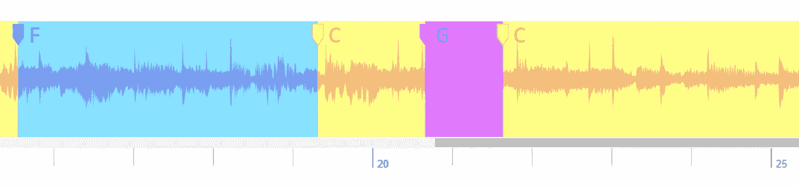
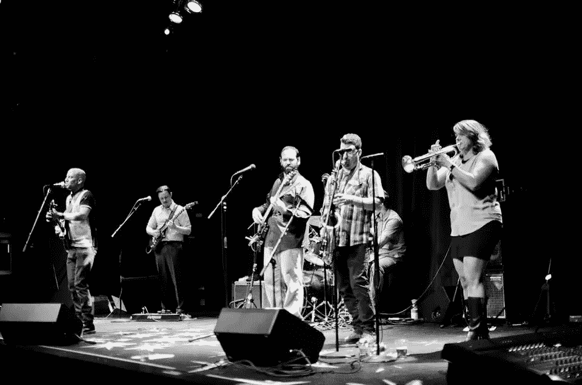
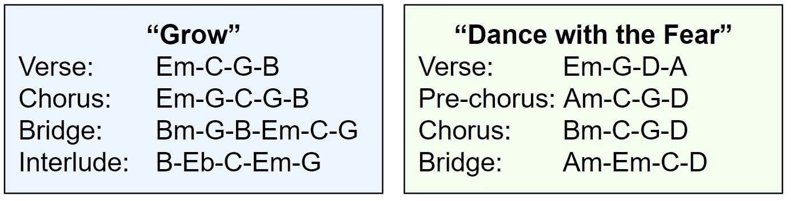

# 使用 GPT-4 创作歌曲：第二部分，和弦

> 原文：[`towardsdatascience.com/writing-songs-with-gpt-4-part-2-chords-173cfda0e5a1`](https://towardsdatascience.com/writing-songs-with-gpt-4-part-2-chords-173cfda0e5a1)

## 如何使用 OpenAI 最新的大型语言模型帮助创作原创歌曲的和弦

 [Robert A. Gonsalves](https://robgon.medium.com/?source=post_page-----173cfda0e5a1--------------------------------)

·发表于[Towards Data Science](https://towardsdatascience.com/?source=post_page-----173cfda0e5a1--------------------------------) ·15 分钟阅读·2023 年 5 月 10 日

--

**“一位音乐家在专业录音室里弹奏原声吉他，戴着耳机，旁边有电脑屏幕，”** 我*使用 AI 图像生成程序* Midjourney 创建的图像，并由作者编辑。

这是关于使用 OpenAI 新款 GPT-4 语言模型[1]作曲的三部分系列文章中的第二篇。在[第一篇文章](https://medium.com/towards-data-science/writing-songs-with-gpt-4-part-1-lyrics-3728da678482)中，我探讨了使用该模型为歌曲创作歌词。这一篇中，我使用系统为歌曲编写和弦。我将在第三篇文章中探讨如何创作旋律。

# GPT-4 背景

GPT-4 是 OpenAI 最新的大型语言模型。可以通过他们的[ChatGPT](https://chat.openai.com/)用户界面使用，并通过他们的[API](https://openai.com/blog/openai-api)访问。新模型作为付费 ChatGPT Plus 订阅的一部分提供，每月费用为 20 美元。正如我在上一篇文章中提到的，OpenAI 会捕捉你的输入和回应，这些数据可能会用于训练未来版本的模型。这是默认启用的，但你可以通过他们的表单[在这里](https://docs.google.com/forms/d/e/1FAIpQLScrnC-_A7JFs4LbIuzevQ_78hVERlNqqCPCt3d8XqnKOfdRdQ/viewform)选择退出数据收集。

GPT-4 的响应显著优于之前的 GPT-3.5 模型。根据 OpenAI 的[技术报告](https://arxiv.org/pdf/2303.08774.pdf)，新模型在 SAT 考试中获得了 1600 分中的 1400 分（语言 710 分，数学 690 分），而早期模型获得了 1260 分（语言 670 分，数学 590 分）。

尽管测试分数优秀，OpenAI 报告称系统输出并不总是可靠的，并且可能展示从训练数据中学到的偏见。

> 尽管 GPT-4 具有一定的能力，但它与早期的 GPT 模型有类似的局限性：它并不完全可靠（例如可能出现“幻觉”），有一个有限的上下文窗口，并且不会学习。在使用 GPT-4 的输出时应小心，特别是在可靠性很重要的上下文中。……GPT-4 可能生成潜在有害的内容……它可能表现出各种社会偏见和世界观，这些可能不代表用户的意图或广泛共享的价值观。—— OpenAI [1]

这听起来令人害怕且不祥。但是对于我在这个项目中做的事情，即为歌曲生成和弦，风险要小得多。

# 使用 GPT-4 为歌曲创建和弦

在我之前的文章中，我让 GPT-4 为一首关于猫和狗的摇滚歌曲创作歌词。这是我第一次尝试让模型为这首歌创建和弦。

> *RobG: 为这首摇滚歌曲的第一段写和弦。*
> 
> *狗和猫，它们漫游在街头
> 
> 有心跳的毛茸茸的朋友
> 
> 爪子和脚掌，它们统治着这片土地
> 
> 尾巴摇摆，它们懂得*
> 
> *并肩追逐着风
> 
> 牢牢相依，最好的朋友
> 
> 它们在月光下摇滚
> 
> 狗和猫，它们不见了*
> 
> *GPT-4:* 这是这首歌第一段的和弦：
> 
> G C
> 
> 狗和猫，它们漫游在街头
> 
> Em D
> 
> 有心跳的毛茸茸的朋友
> 
> G C
> 
> 爪子和脚掌，它们统治着这片土地
> 
> Em D
> 
> 尾巴摇摆，它们懂得
> 
> Am C
> 
> 并肩追逐着风
> 
> G D
> 
> 牢牢相依，最好的朋友
> 
> G C
> 
> 它们在月光下摇滚
> 
> Em D
> 
> 狗和猫，它们不见了

和弦看起来相当不错，尽管有些基础。像大多数大型语言模型一样，GPT-4 在大量书籍和互联网文本上进行训练，它似乎从讨论和弦中学到了足够的内容来生成不错的和弦序列。我喜欢进程的 AABA 结构：G — C — Em — D，G — C — Em — D，**Am** — **C** — **G** — **D,** G — C — Em — D。

然而，文本格式存在问题。和弦与歌词的配合不一致，即，“D”和弦应该与最后一行的“they’re”或“out”对齐。我找到了一种效果不错的替代方法：将和弦与歌词对齐。我只是想问问。

> *RobG: 以方括号中带有空格的形式显示和弦与歌词对齐。*
> 
> *GPT-4:*
> 
> [G] 狗和猫，它们 [C] 漫游在街头
> 
> [Em] 有心跳的毛茸茸的朋友 [D]
> 
> [G] 爪子和脚掌，它们 [C] 统治着这片土地
> 
> [Em] 尾巴摇摆，[D] 它们懂得
> 
> [Am] 并肩追逐着风 [C]
> 
> [G] 牢牢相依，[D] 最好的朋友
> 
> [G] 它们在月光下摇滚 [C]
> 
> [Em] 狗和猫，它们 [D] 不见了

啊，好得多了。因为“they’re”用作下一个和弦开始之前的起始音符，所以在最后一行的“out”之前开始 D 和弦是有意义的。

除了生成和弦进行，GPT-4 还解释了与音乐理论相关的内容。因此，我偶尔会向它询问我正在处理的歌曲的问题，比如这样的问题。

> *RobG: 这是什么调的？*
> 
> *GPT-4:* 为这首摇滚歌曲提供的和弦是在 G 大调中。G 大调包括以下和弦：G（I）、Am（ii）、Bm（iii）、C（IV）、D（V）、Em（vi）和 F#dim（vii°）。

这看起来是正确的。我很感激对 G 大调中使用的和弦进行了详细解释。注意，它既使用了和弦的字母名称，又使用了罗马数字符号，其中大调和弦用大写字母表示，例如（I），而小调和弦用小写字母表示，例如（ii）。我喜欢它使用‘°’字符来表示减和弦的方式。

我使用了来自[PG Music](https://www.pgmusic.com/)的商业应用 Band-in-a-Box（BiaB），以听和弦的声音。我输入和弦名称，粘贴了相应的歌词，选择了“摇滚”风格，然后它渲染了歌曲。请注意，这里没有旋律，因此可以随意跟着你的旋律唱。

**猫与狗**，歌词和和弦由 GPT-4 提供，制作人：作者

听起来不错。和弦序列很好，BiaB 在吉他、贝斯和鼓部分做得很出色。没有声乐旋律，旋律最好的部分是每个短语结尾的吉他填充。

接下来，我将展示如何使用 AI 从歌曲录音中提取歌词和和弦。

# 使用 AI 从歌曲中提取歌词和和弦

在上一篇文章中，我展示了如何使用 OpenAI 的 Whisper 模型[2]从音频文件中转录歌词。对于这个项目，我编写了一些代码，使用另一个神经网络 Autochord 提取和弦并将它们拼接在一起。

Autochord 模型由软件工程师和机器学习爱好者 C. J. Bayron 创建和训练。它运行良好。你将一个音频文件输入其中，几秒钟后，你会得到一个开始时间、结束时间和和弦的列表。这里是他[在线应用](https://cjbayron.github.io/autochord/)中模型结果的一个可视化示例。你可以按照[这里](https://github.com/cjbayron/autochord)的说明生成一个标签文件。

**自动和弦可视化**，图片由作者提供

它只找到大调和小调和弦，但这对我的目的来说已经足够了。然后，我用 Whisper 的输出和单词时间，编写了一些 Python 代码，将和弦与歌词整合在一起。例如，下面是一个非常著名的歌曲的渲染效果。

**生日快乐**，由 Patty Hill 和 Mildred J. Hill 创作，录音由作者提供

这里是使用 Whisper 和 Autochord 分别转录的歌词和和弦。

> [C] 祝你生日快乐，[G] 祝你生日快乐，[C] 祝你生日快乐，[G] 祝你生日快乐！
> 
> [C] 祝你生日快乐，[F] 亲爱的读者，[C] 祝你生日快乐，[G] 祝你生日快乐！

这看起来相当不错。所有的和弦都预测得很准确。它甚至捕捉到了最后三个词的快速转换。F 大调和弦的变化应该在“亲爱的”一词之后，但这只是唯一的错误。

不过，请注意短语没有被正确拆分。这是基于 Whisper 模型计算的短语分割。为了解决这个问题，我将转录文本输入到 GPT-4 中，使用了以下提示。

> *RobG: 这里是歌曲的和弦和歌词。*
> 
> *[C] 生日快乐 [G] 你，生日快乐 [C] 你，
> 
> [C] 生日快乐 [F] 亲爱的读者，生日 [C] 快乐 [G] 祝 [C] 你！
> 
> *在逗号处将歌曲拆分成较短的行，并在行首显示当前和弦。*
> 
> *GPT-4:*
> 
> [C] 生日快乐 [G] 你
> 
> [G] 生日快乐 [C] 你
> 
> [C] 生日快乐 [F] 亲爱的读者
> 
> [F] 生日 [C] 快乐 [G] 祝 [C] 你！

好的，这样更容易阅读。系统将能够以这种格式分析和生成歌词及和弦，如你将在下一部分看到的那样。

# 为新歌曲编写和弦

在我编写代码提取歌曲歌词和和弦后，我的下一步是请求 GPT-4 分析现有曲调中的和弦。我选择了由来自罗德岛普罗维登斯的 ska 乐队 The Agents 创作和演唱的歌曲“[Grow](https://www.youtube.com/watch?v=aL3N7j_wXPk)”。他们同意让我使用 AI 分析他们的歌曲，并利用分析结果创作一首类似风格的新歌。

**The Agents**，照片经许可使用

我运行了 Python 代码从录音中获取歌词和和弦，并使用 GPT-4 按照我上面描述的技术格式化文本。这里是我用来获取和弦分析的提示。我只展示了一个片段，但我将完整的歌词输入了 GPT-4。

> *RobG: 分析这首歌“Grow”中的和弦。*
> 
> *[第一部分]*
> 
> [Em] 是的！在那一天，我第一次 [C] 遇见
> 
> [C] 你女孩，我第一次 [G] 握住
> 
> [G] 你的手，我第一次 [B] 看向
> 
> [B] 你的眼睛，我告诉你我爱你
> 
> [Em] 从那天起直到永远
> 
> [C] 困扰的时光，悲伤，
> 
> [C] 笑声
> 
> [G] 手牵手，我们现在一起走
> 
> [B] 现在无法想象更好的东西了*
> 
> *[副歌]*
> 
> [Em] 成长，让你的爱
> 
> [G] 成长，[C] 成长
> 
> [C] 让你的爱来临
> 
> [G] 振作起来，振作起来
> 
> [G] 播下种子，让 [B] 你的
> 
> [B] 爱情成长，越来越高* . . .
> 
> *GPT-4:* 在 The Agents 的歌曲“Grow”中，有几个不同的和弦进程出现在歌曲的不同部分。这些进程赋予了歌曲结构和情感内容。以下是对每个部分和弦进程的分析：
> 
> 主歌：主歌的和弦进行是 Em — C — G — B。这个进行包含了大调和小调和弦，创造了张力与释放的平衡。Em（小调）到 C（大调）的过渡带来了一种渴望感，而从 G（大调）到 B（大调）的转移则增加了振奋感。
> 
> 副歌：副歌的和弦进行是 Em — G — C — G — B。这个进行以与主歌相同的 Em — G — C 开始，但将最后的 B 和弦替换为 G，然后再到 B。这种轻微的变化保持了主歌的振奋感，但在转到 B 之前增加了额外的张力和释放。
> 
> 桥段：桥段有不同的和弦进行：Bm — G — B — Em — C — G。它以 Bm（小调）和弦开始，增加了一种更阴暗、更内省的质量。接着，进行通过 G（大调）、B（大调）和 Em（小调）和弦，创造出一种积累和期待感，然后返回到主歌和副歌中熟悉的 C — G 和弦。
> 
> 间奏：间奏的和弦进行较为简单：C — B — Eb — C — Em — G。这个进行为主歌和副歌中的主要和弦进程提供了一个休息，增加了变化，并保持了听众的参与感。
> 
> 总结来说，《Grow》由 The Agents 创作，使用了大调和小调和弦的组合，在整首歌中创造了张力与释放的平衡。副歌和主歌共享类似的和弦进行，而桥段和间奏则提供了对比和变化，以保持听众的兴趣。

哇，那是对和弦进行的全面分析。看来 GPT-4 对音乐理论了解得很好，并且总结了听众如何反应歌曲的不同部分。

在同一个聊天会话中，我让模型使用类似风格为歌曲创建和弦。我使用 GPT-4 在这一系列的[第一部分](https://medium.com/towards-data-science/writing-songs-with-gpt-4-part-1-lyrics-3728da678482)中创作了这些歌词。

> *RobG: 为这首歌创建类似风格的和弦。*
> 
> 标题：“与恐惧共舞”*
> 
> *[第一段]*
> 
> 醒来迎接全新的一天，
> 
> 感受恐惧但不退缩，
> 
> 面对未知，这就是我们的起点，
> 
> 带着开放的心态和无畏的心。*
> 
> *[前副歌]*
> 
> 不再隐藏，不再怀疑，
> 
> 是时候释放我们的勇气了。*
> 
> *[副歌]*
> 
> 与恐惧共舞，不要逃跑，
> 
> 拥抱挑战，无论发生什么。
> 
> 找到你的节奏，面对未知，
> 
> 每一步，你的力量在增长。*
> 
> *[第二段]*
> 
> 在黑暗中，我们会找到光明，
> 
> 在梦想的引领下起飞。
> 
> 不再颤抖，不再恐惧，
> 
> 一起飞向新的高度。*
> 
> *[前副歌] …
> 
> [副歌] …*
> 
> *[桥段]*
> 
> 当恐惧敲你的门时，
> 
> 站直，面对它。
> 
> 旅途漫长，但你会发现，
> 
> 你比你意识到的更强大。*
> 
> *[副歌] …*
> 
> *[尾声]*
> 
> 与恐惧共舞
> 
> 与恐惧共舞
> 
> 与恐惧共舞
> 
> 与恐惧共舞*
> 
> GPT-4:
> 
> 标题：“与恐惧共舞”
> 
> [主歌]
> 
> [Em] 醒来迎接一个[G]崭新的一天，
> 
> [D] 感受到恐惧却[A]不退缩，
> 
> [Em] 面对未知，[G] 就是我们的起点，
> 
> [D] 心怀开放和[A]无畏的心。
> 
> [Pre-Chorus]
> 
> [Am] 不再隐藏，[C] 不再怀疑，
> 
> [G] 是时候释放我们的[D]勇气了。
> 
> [Chorus]
> 
> [Bm] 与恐惧共舞，[C] 不要逃跑，
> 
> [G] 拥抱挑战，[D] 无论发生什么。
> 
> [Bm] 找到你的节奏，[C] 面对未知，
> 
> [G] 每一步，你的[D]力量都在增长。
> 
> [Verse 2]
> 
> [Em] 在黑暗中，[G] 我们将找到光明，
> 
> [D] 被梦引导，[A]展翅高飞。
> 
> [Em] 不再颤抖，[G] 不再害怕，
> 
> [D] 一起飞向[A]新的高度。
> 
> [Pre-Chorus] …
> 
> [Chorus] …
> 
> [Bridge]
> 
> [Am] 当恐惧在你门前敲击[Em]，
> 
> [C] 高昂地站立，再次面对[D]。
> 
> [Am] 旅程漫长，但[Em]你会发现，
> 
> [C] 你比你[D]意识到的更强大。
> 
> [Chorus] …
> 
> [Outro]
> 
> [Em] [G] 与恐惧共舞
> 
> [D] [A] 与恐惧共舞
> 
> [Em] [G] 与恐惧共舞
> 
> [D] [A] 与恐惧共舞

我首先注意到它将生成的和弦放在方括号中，与歌词对齐，这很不错。它从我之前的互动中采纳了这种标记风格。其次我注意到它也在 G 大调，就像分析的歌曲“Grow”一样。

这里是和弦进行的对比。

**和弦进行比较**，图片由作者提供

你可以看到，虽然和弦进行有一些相似之处，但也有一些明显的不同。例如，“Grow”有一些使用 4、5 和 6 和弦的段落，而“与恐惧共舞”始终使用四个和弦进行。

两首歌都大量使用了 Em、G 和 C 和弦。“Grow”混合了 B 和 Bm，而“与恐惧共舞”则混合了 A、Am 和 D。参考一下 GPT-4 之前关于 G 大调的说法。

> G 大调由以下和弦组成：G (I)、Am (ii)、Bm (iii)、C (IV)、D (V)、Em (vi) 和 F#dim (vii°)。

“Grow”偶尔使用调外的 B 和弦，而“与恐惧共舞”使用了调外的 A 和弦。我特别喜欢从副歌到前副歌的 A 到 Am 过渡。为了了解更多关于这个过渡的内容，我问了 GPT-4。

> *RobG：如果一首歌的和弦从 A 变为 Am，而这首歌是 G 大调的，那这叫什么？*
> 
> GPT-4：在音乐理论中，使用一个与调性不一致的和弦称为“色彩和弦”或“色彩化”。在 G 大调中从 A 大调到 A 小调，A 大调和弦不是调性和弦，因此产生了张力或不和谐的感觉。当和弦变为 A 小调时，音乐回到调性和弦，产生了解决或放松的感觉。

好了，就是这样。我想我喜欢这种和弦变化，因为它回到了大调和弦。这里是带有歌词和和弦的歌曲，你可以自己听听。再次说明，伴奏轨道由 Band-in-a-Box 提供。

**与恐惧共舞**，歌词和和弦由 GPT-4 提供，制作人：作者

Band-in-a-Box 应用没有为 ska 音乐设置选项，所以我选择了雷鬼风格，并将节奏从每分钟 85 拓展到 150。我还将第二段中的贝斯和鼓去掉，雷鬼音乐中称为“节奏”，并在桥段中去掉了铜管乐器，以增加歌曲的趣味性。总体而言，我认为这首歌相当不错，和弦进行也很奏效。当然，缺少的部分是人声旋律，但我将在这一系列的第三篇也是最后一篇文章中解决这个问题。

查看附录中的另外两首风格为另类摇滚和嘻哈的曲子。

# 总结与下一步

在这篇文章中，我提供了一些关于 OpenAI 的新 GPT-4 模型的背景信息。我展示了如何使用 Whisper 和 Autochord AI 模型从歌曲中提取歌词和和弦，并使用我在 [Google Colab](https://colab.research.google.com/github/robgon-art/ml-tabify/blob/main/ml_tabify_Lyrics_and_Chords_from_Songs.ipynb) 上的 Python 代码将二者合并。我接着展示了 GPT-4 如何分析现有作品的和弦进行，并为各种风格的新歌曲建议和弦。

我的下一步是使用 GPT-4 为歌曲创作旋律，根据歌词和和弦。我将在系列的最终文章中对此进行详细介绍。

# 讨论

在没有特定引导的情况下，GPT-4 在创作歌曲时似乎是按照一定的公式进行的。例如，它倾向于使用*(A) 诗句, (B) 副歌, (A) 诗句, (B) 副歌, (C) 桥段, (B) 副歌, 和 (A) 尾声*的形式来创作歌曲。而且它总是使用四和弦模式来构建歌曲部分。

默认情况下，它会使用调式中的常见和弦，但正如你上面所见，你可以引导它使用半音和弦。一般来说，它生成的和弦模式听起来不错。我完全没有使用“再生成”命令。而且这些模式似乎是独特的，偶尔会有创新的火花。

在我上一篇文章的讨论中，我假设大多数音乐爱好者不会太在意他们发现词曲作者使用 AI 系统来帮助创作歌曲歌词。这对于和弦创作也很可能是如此。如果最终歌曲质量很好，那么粉丝们会喜欢这些歌曲，无论使用了什么工具。

# 源代码

该项目的源代码可以在 [GitHub](https://github.com/robgon-art/ml-tabify) 上找到。

知识共享署名-相同方式共享 4.0 国际许可协议

# 致谢

我想感谢 Agents 的 Pete Fayan 对这个项目的投入。我还感谢来自 Rhode Iceland 的 Jon Gryckiewicz 和 Hi Fi Monk 的 Fez Aswat 给予的贡献。我感谢 Jennifer Lim、Néstor Nápoles 和 Oliver Strimpel 评审文章并提供反馈。

# 关于使用 GPT-4 写歌曲的更多信息

这是本系列的第一篇和第三篇文章。

 ## 使用 GPT-4 创作歌曲：第一部分，歌词

### 如何使用 OpenAI 的最新语言模型来帮助创作原创歌曲的歌词

towardsdatascience.com  ## 使用 GPT-4 创作歌曲：第三部分，旋律

### 如何使用 OpenAI 的最新语言模型来帮助创作新歌曲的旋律

towardsdatascience.com

# 参考文献

[1] OpenAI，[GPT-4 技术报告](https://arxiv.org/pdf/2303.08774.pdf)（2023）

[2] A, Radford 等，[通过大规模弱监督进行鲁棒语音识别](https://cdn.openai.com/papers/whisper.pdf)（2022）

[4] C. J. Bayron，[Autochord - 自动和弦识别库和和弦可视化应用](https://archives.ismir.net/ismir2021/latebreaking/000008.pdf)（2021），*第 22 届国际音乐信息检索会议*

# 附录

这里有两首我在 GPT-4 的帮助下创作的不同风格的歌曲。你可以在[第一篇文章](https://medium.com/towards-data-science/writing-songs-with-gpt-4-part-1-lyrics-3728da678482)中阅读有关歌词创作的过程。乐队同意让我使用 AI 分析他们的歌曲，并利用这些分析创作出具有类似风格的新歌曲。

## 消逝的回声

第一首歌基于[Rhode Iceland](https://www.facebook.com/RhodeIceland/)，一支来自马萨诸塞州洛威尔的另类摇滚乐队的《Bloody Brain》。

**消逝的回声**，歌词和和弦由 GPT-4 提供，作者制作

## 战场之声

第二首歌基于[Hi Fi Monk](https://www.facebook.com/HiFiMonk/)，一支位于马萨诸塞州波士顿的嘻哈/放克/雷鬼乐队的《Break》。

**战场之声**，歌词和和弦由 GPT-4 提供，作者制作
